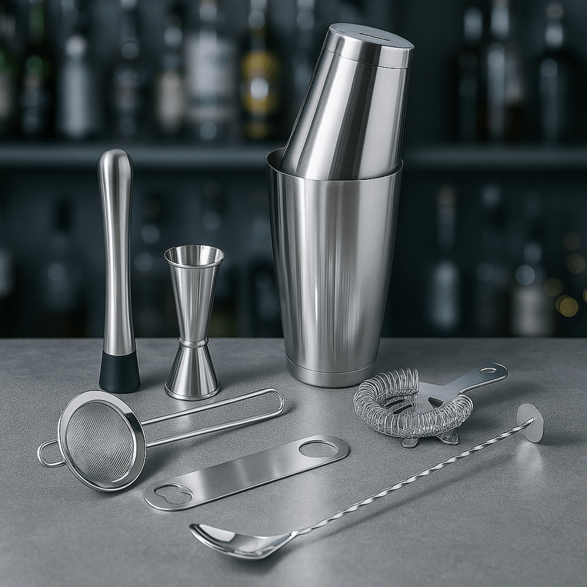

# Equipment

*You need six pieces of kit, all small, all under £15 each. Past that, every "essential" bartender purchase is a luxury. Decent quality on these six gets you a long way; cheap tat will frustrate you within a month.*

## Overview

The bartender's tool kit is small because most of cocktail-making is precision pouring, temperature control, and dilution. You need to measure (a jigger), cool (a shaker or mixing glass with ice), strain (out the ice and any solids), and stir (a bar spoon for stirred drinks). That's it.

This page lists what to buy and what to spend on. Skip anything labelled "decorative" or "novelty"; spend the saved money on better spirits.

## The six essentials

### 1. A Boston shaker (or a 3-piece cobbler)

The shaker is for the shaken drinks: sours, daiquiris, anything with citrus or egg white. Two styles:

- **Boston shaker** (two pieces - a 28oz metal tin + a 16oz mixing-glass insert). The bartender's choice. Faster, more capacity, harder to bind shut by accident.
- **3-piece cobbler shaker** (a tin + lid + built-in strainer). Easier for beginners; the built-in strainer means you don't need a separate Hawthorne strainer for shaken drinks.

Start with a cobbler if you're new; switch to a Boston when you want speed.

### 2. A mixing glass

For stirred drinks (Manhattan, Negroni, Martini, Old Fashioned). A 500ml weighted mixing glass with a pour spout costs £15-20. The shape matters: wider top for the long bar spoon, weighted base so it doesn't tip when half-full of ice.

### 3. A double jigger

The most-used tool. Measures spirit volumes precisely. Buy a stepped Japanese jigger (one side 30ml/15ml stepped; other side 45ml/22.5ml stepped) - about £8. The cheap rounded American jigger only does 30/15 or 45/22.5 and is harder to read.

### 4. A Hawthorne strainer

The flat metal strainer with a spring coil that fits the top of the Boston shaker's tin. £6-8. Catches ice from a shaken drink as you pour. The 3-piece cobbler has its own built-in strainer so you can skip this if you went cobbler-only.

### 5. A bar spoon

Long-handled spoon (~30cm) with a twisted shaft. The twist is for stirring efficiently - you let the spoon spin between your fingers, the ice circles the glass, the drink chills without aerating. £4-6.

### 6. Glassware

Four glass types cover 95% of cocktails:

- **Rocks glass** (300ml) - Old Fashioned, Negroni, whisky on the rocks.
- **Coupe** (180-220ml) - sour, Daiquiri, French 75, anything served "up" (no ice).
- **Martini glass** (180ml) - Martini, Manhattan, classic up drinks.
- **Highball / Collins** (350-400ml) - long drinks: Tom Collins, gin and tonic, Mojito.

Buy 4 of each. Coupe + martini are nearly interchangeable; if you can only buy three, get rocks + coupe + highball.

## The optional kit (when you're ready)

- **Lewis bag + mallet** - for crushed ice (Mint Julep, Mai Tai).
- **Citrus juicer** - a Mexican squeeze press (yellow for lemon, green for lime). £10. Hand-juicing 6 limes for a round of drinks is much less fun than it sounds.
- **Channel knife / vegetable peeler** - for citrus twists. A regular Y-peeler works fine until you go full bartender.
- **Strainer (fine mesh)** - a small tea strainer. Catches the small bits of crushed citrus pulp when "double-straining" a shaken drink for a clean look.
- **Atomiser** - for spraying vermouth (a "dirty martini" requires only a fine vermouth mist over a chilled gin). A repurposed essential-oil atomiser works.

## What to skip

- **The bottom-shelf bar set** sold on Amazon with everything in matching gold. Cheap metal, poor balance, bent jiggers. Buy individual quality pieces.
- **Decorative ice moulds shaped like skulls / spheres / planets.** Ice melts; one shape's dilution effect is broadly the same as any other. The exception is large clear cube/sphere moulds for Old Fashioneds, where one big ice cube melts slower than several small ones.
- **Premium cocktail picks.** Bamboo skewers from the supermarket are fine.

## Setup

Keep all six items together on a tray or in a drawer. The friction of having to fetch the jigger from another room is the leading cause of "I'll just pour by eye" - which leads to bad cocktails. Keep it together; reach in once.
