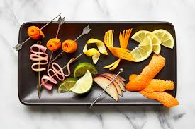

# Garnish

*A good garnish is more than decoration: a citrus twist adds aromatic oils that change the cocktail at the nose; an olive in a martini changes the salinity; a mint sprig in a julep adds a herbal layer to every sip. A bad garnish is a wedge of dried-out lime stuck on the rim of a glass.*

## Overview

The garnish does three jobs: aroma (an expressed citrus oil is the first thing the drinker smells), flavour (an olive or salt rim contributes saltiness; mint contributes herbaceous notes), and visual signal (a coupe with a cherry says "Manhattan-family" before the drinker has sipped). The garnish should match the cocktail.

This page covers the canonical garnish techniques: citrus twists (the expressed kind, not the sliced kind), olives and onions, picks, salt and sugar rims, and how to choose.

## The expressed citrus twist

The most useful single garnish technique. Here's how:

1. Cut a wide strip of citrus peel (5-7 cm long, 2 cm wide), avoiding the white pith underneath. A vegetable peeler works; a sharp paring knife is better.
2. Hold the strip skin-side-DOWN over the glass with one hand.
3. Pinch the strip into a curve, oil-side-down toward the glass. The oils from the peel spray onto the surface of the drink.
4. Wipe the strip around the rim of the glass (this passes oil to the rim, so the drinker smells it on first sip).
5. Drop the strip into the drink, or twist it and drop in (a curl-of-orange-peel look).

The "expression" - the squeezing that releases the oils - is the canonical bartender move. Without it, the twist is just decorative; with it, the twist changes the drink.

Common citrus matches:
- **Old Fashioned, Manhattan** → orange twist.
- **Daiquiri, Margarita, Mojito** → lime wheel or twist.
- **Martini** → lemon twist (or olive).
- **Aperol Spritz, French 75** → orange twist.
- **Gin and Tonic** → cucumber slice + juniper berries (modern); or lime wedge (classic).

## Olives and onions

- **Martini olives:** stuffed with pimento, sometimes blue cheese, sometimes anchovy. Use 1-3 olives on a cocktail pick. Some bartenders add a teaspoon of olive brine to the cocktail itself ("dirty martini") - that goes in the mixing glass before stirring.
- **Cocktail onions** (the small pearl onions in vinegar): a Gibson martini uses these instead of olives. The vinegar gives a sour note that contrasts nicely with the dry vermouth.

## Cocktail cherries

- **Maraschino cherries** (the bright red supermarket kind, in heavy syrup with food colouring): canonical for Manhattans and Old Fashioneds - drop the cherry in, let it bleed a little into the drink.
- **Luxardo cherries** (Italian, in dark cherry syrup): the premium version. Darker, less sweet, more flavour. Worth the upgrade.
- **Brandied cherries:** make your own - soak fresh cherries in brandy + sugar + spices for 2 weeks. A serious cocktail bar's signature touch.

## Rims

A salt or sugar rim adds a textural and flavour contrast at the drinker's first contact with the drink.

**Salt rim** (Margarita): wet the outer rim of the glass with a lime wedge; dip in coarse salt on a plate. Don't get salt on the inner rim (that just dissolves into the drink).

**Sugar rim** (Sidecar): same technique with caster sugar.

**Other rims:**
- **Tajin chilli-lime salt** for Mexican-leaning cocktails.
- **Smoked salt** for a tequila or mezcal drink.
- **Cinnamon-sugar** for an autumnal drink.

## Picks

Wooden cocktail picks (bamboo skewers from any supermarket) are fine for routine garnish. Premium versions: silver, designed, branded - pure aesthetics.

Use a pick when the garnish is something you want the drinker to retrieve and eat: an olive, an onion, a cherry, a wedge of pineapple. Don't pick a citrus twist; it sits in the drink as a floater.

## Less-is-more garnish

A few cocktails are deliberately under-garnished:

- A classic Manhattan with just a cherry, nothing else.
- A martini with just a single olive on a pick.
- A clean Daiquiri with no garnish at all (the drink is the garnish).

Over-garnishing is a common amateur mistake. A drink with a citrus twist + cherry + sugar rim + pick + mint sprig becomes a "tropical-themed cocktail" rather than what it actually is. Match the garnish to the cocktail's identity.

## The garnish station

When you're making a round of cocktails, prep the garnishes first:

- Cut all the citrus twists in advance (they keep 2-3 hours wrapped in a damp paper towel).
- Have olives + cherries + picks ready.
- Have rims salted/sugared in advance if needed.

If you're making 4 drinks in 10 minutes, you don't have time to cut a citrus twist between each. Prep is everything.

## Specific cocktail garnishes

| Cocktail | Garnish |
|---|---|
| Old Fashioned | Orange twist (expressed); cherry optional |
| Manhattan | Cherry; orange twist optional |
| Daiquiri | Lime wheel (or none) |
| Martini | Lemon twist or 1-3 olives |
| Gibson | Cocktail onion |
| Margarita | Salt rim + lime wheel |
| Negroni | Orange twist |
| Mojito | Mint sprig (slapped - see below) + lime wheel |
| Mint Julep | Generous mint sprig + powdered sugar dust |
| Tom Collins | Lemon wheel + cherry |
| Gin and Tonic | Lime wedge or lemon twist (classic); cucumber + juniper berries (modern) |
| French 75 | Lemon twist |
| Whisky Sour | Cherry + half-orange wheel (or just bitters dashed on the foam) |
| Pisco Sour | 3 dashes Angostura on the foam, dragged with a pick to make a pattern |

## The "slap" technique

Mint sprigs need to be slapped before garnishing - clap the mint between your palms once or twice. This bruises the leaves and releases the essential oils into the air. A mint sprig that hasn't been slapped is just decorative; a slapped one perfumes the drink at every sip.

Same principle for fresh herbs (basil, rosemary, thyme, sage): a gentle clap to release aromatics.

## When the garnish is the cocktail

A few cocktails are essentially defined by their garnish:

- **Bloody Mary** - celery stick + lemon wedge + Tabasco rim + bacon + olive + cocktail onion + the kitchen sink. The garnish IS the drink in many bars.
- **Mai Tai** - mint sprig + lime shell + cocktail umbrella + cherry. A tiki bar's calling card.
- **Pimm's Cup** - cucumber + strawberry + apple + orange + mint + everything from the garden.

In these cases, lean into the maximalism; understated garnish would look wrong.
