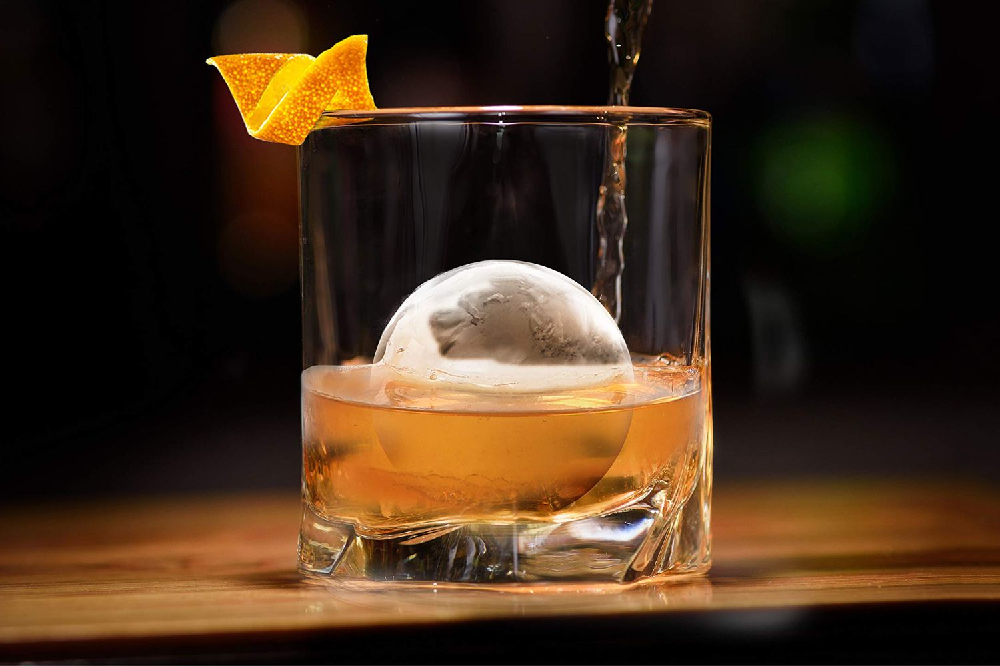

# Ice and Dilution

*Half the volume of a finished cocktail is water from melted ice. The drinker can't see this water, but they can taste when it's wrong. Too little dilution and the cocktail is sharp and spirit-hot; too much and it's flabby and forgettable. Ice quality, ice quantity, and method (shake vs stir) all control the dilution.*

## Overview

Cocktail dilution is the invisible third ingredient. A Daiquiri starts as 90ml of spirit-and-citrus and ends as about 140ml, the extra 50ml is melted ice. A Manhattan starts at 80ml and ends at about 110-115ml. Get this wrong and the cocktail is either too hot (under-diluted) or watery (over-diluted).

This page covers the three things you control: ice quality, ice size/shape, and how long you shake or stir.

## What good ice looks like

The ice in a domestic freezer is usually fine but worth thinking about:

- **Cloudy ice cubes** (the standard ice-tray kind) freeze fast, trapping air. They look cloudy because of the air bubbles. They're slightly more fragile and melt slightly faster than clear ice.
- **Clear ice cubes** are made by "directional freezing", you freeze water from one direction so air escapes. They're prettier but for everyday cocktails the difference is small. Worth doing for a presented Old Fashioned with a giant clear cube.
- **Crushed ice** (Lewis bag + mallet, or a powerful blender): for Mint Juleps, Mai Tais, frozen daiquiris.
- **Tap water vs filtered**: if your tap water tastes like chlorine, your ice does too, and that gets into the drink. Use filtered water for ice (a Brita pitcher is enough).

## Ice size

Smaller ice = faster dilution. Larger ice = slower dilution.

- **Small cubes (1-2 cm)** in a shaker for a shaken sour, chills aggressively, dilutes quickly. Good.
- **Standard cubes (3 cm)** in a mixing glass for a stirred drink, chills gently, dilutes properly over 30 seconds. Right.
- **Large 5 cm cubes** in a rocks glass for an Old Fashioned, chills the drink in the glass, dilutes very slowly. The drink lasts for 20 minutes without becoming watery. Right for sipping.
- **Crushed ice** in a julep, chills instantly, dilutes very fast. Right for the julep style (icy, slushy).
- **One huge sphere or cube** in a rocks glass, looks impressive, melts very slowly. Right for a drink you want to sip for 30+ minutes.

## How long to chill

Once you've put cold ice in the shaker/mixing glass with cold ingredients, the temperature drops fast, most of the chilling happens in the first 5-10 seconds. The rest of the time is about getting the dilution right.

**Stirring guide:**
- 25 seconds, a light Manhattan (less dilution, spirit-forward).
- 30-35 seconds, the standard stir.
- 40+ seconds, too much dilution; the drink tastes watery.

**Shaking guide:**
- 8 seconds, a "shorter shake" for cocktails that want minimal dilution (Last Word).
- 12-15 seconds, the standard hard shake.
- 20+ seconds, too long; the drink is watery and the ice is broken into shards.

## The dilution rule of thumb

A finished cocktail is about 25-30% water for stirred drinks, 35-40% water for shaken drinks. So:

- A 75 ml stirred Manhattan (50 rye + 25 vermouth) ends up at about 100-105 ml in the glass.
- A 100 ml shaken Daiquiri (60 rum + 25 lime + 15 syrup) ends up at about 140-150 ml in the glass.

If your finished drink is much smaller than the math above, you didn't chill long enough. If it's much bigger, you chilled too long. Either way, the dilution is off and the drink will read wrong.

## What "wrong" tastes like

- **Under-diluted:** the spirit dominates; the drink burns at the back of the throat; you can smell the alcohol stronger than you can taste the cocktail.
- **Over-diluted:** the drink is thin, watery, lacking edge; the spirit can't carry the modifiers; the cocktail tastes "weak" in a sad way.
- **Properly diluted:** the spirit is present but soft; the modifiers are clear; the drink has a smooth temperature drop; the finish is silky.

The best way to learn the difference is to make the same drink twice, deliberately under- and over-diluting. The contrast is dramatic.

## Diluting flavour, not just temperature

Some cocktails benefit from "additional water" before serving, a few drops of room-temperature water added to a hot whisky (like a Scotch tasting), or a small additional dilution at the end of a hot toddy. This is rare in cocktails; the dilution from ice is usually right. The exception is high-proof spirits (cask-strength whisky, navy gin); these benefit from being slightly more diluted at start to bring them to drinkable strength.

## Ice tools

- **Lewis bag + mallet**: for crushed ice. Wrap cubes in a thick canvas bag (cocktail-supply or canvas tool bag); hammer with a wooden mallet. Cheap kit; takes 30 seconds for a glass of crushed.
- **Ice scoop**: for hygiene. Don't use your hands.
- **Large cube ice trays**: silicone trays that make 5 cm cubes. £5-8. Worth having for Old Fashioneds.
- **Clear ice maker** (insulated cooler, directional freezing): overkill for daily cocktails; nice for presentations.

## Common ice mistakes

- **Using "wet" ice** (just from the freezer; surface frost is melting on contact). Wet ice dilutes faster. Solution: rinse the ice briefly under cold water and drain before using; the small surface melt has already happened.
- **Reusing ice from the shaker** for the strained drink. The ice that survived the shake is heavily fractured and broken. Strain into a glass with fresh ice.
- **Over-melted shaker ice** (ice that's been sitting in a shaker for several minutes before you shake). Dilutes the drink before you've started. Always ice last, just before shaking.
