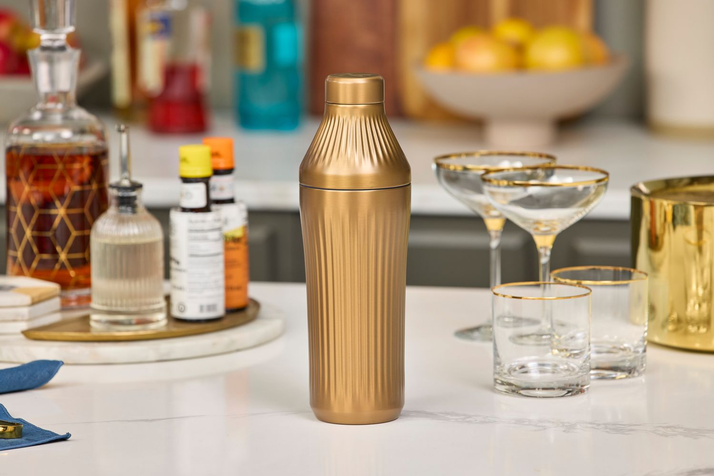

# Shake vs Stir

*The single most common cocktail mistake is shaking what should be stirred. James Bond got it wrong on purpose. You don't have to.*

## Overview

A cocktail is chilled and diluted by ice. The method (shake or stir) controls how fast the ice melts, how the drink is aerated, and how clear or cloudy it ends up. There's one simple rule for choosing.

## The rule

- **Stir** if every ingredient is clear and spirit-based (all-spirit, all-syrup, all-vermouth).
- **Shake** if any ingredient is fruit juice, cream, egg white, or sour mix.

That's it. The Manhattan (rye + sweet vermouth + bitters) is stirred. The Daiquiri (rum + lime + sugar) is shaken. The Negroni (gin + sweet vermouth + Campari) is stirred. The Margarita (tequila + lime + Cointreau) is shaken.

## Why the rule exists

Stirring chills the drink gently. The ice melts slowly, the drink stays clear, and the texture is silky. Spirit-only cocktails want this: clear gloss, no aeration, low dilution.

Shaking does three things at once: it chills aggressively (the ice surface increases as it gets thrown around), it dilutes more (more ice contact in less time), and it aerates (incorporates tiny air bubbles). Citrus-and-spirit drinks want all three. The acid is bright and slightly aggressive; aeration and dilution soften it. The cloudiness from broken-up ice and air bubbles becomes part of the drink's character.

If you shake a Manhattan, you get the same flavour but a hazy, foamy version with too much water. The drinker's first reaction is "this is watery" - and they're right.

If you stir a Daiquiri, you get cold rum-and-lime-water; the drink is thin and the lime tastes harsh because the dilution isn't enough to soften it.

## The technique: stirring

1. Fill the mixing glass with ice (about ¾ full - 12-15 ice cubes for a single drink, more for two).
2. Pour the ingredients over the ice.
3. Insert the bar spoon, twisted side down, against the glass wall.
4. Let the spoon rotate between your fingers as you trace the wall of the glass.
5. Aim for 25-40 seconds of stirring. The drink chills to 0°C and dilutes to about 25-30% water by volume.
6. Strain into the chilled coupe or rocks glass.

The right sound is a quiet circular swirl, not clinking. If you hear clinking, you're stirring too fast or the ice is too small.

## The technique: shaking

1. Fill the Boston shaker tin with ice (about half-full).
2. Pour ingredients into the smaller mixing glass.
3. Tip the contents into the tin (or shake separately).
4. Combine the two pieces with a firm press; lift; check the seal.
5. Shake hard for 12-15 seconds. The drink chills to -1°C and dilutes to about 35-40% water.
6. Strain into the chilled glass.

Hard means hard - over-the-shoulder, both arms, full kinetic. A weak shake gives a watery drink; the goal is rapid temperature drop, not gentle agitation.

The right sound is a sharp percussive rattle that softens as the ice breaks down. Stop when the shaker feels icy-cold against your palm (about 12-15 seconds).

## Edge cases

- **Egg white drinks** (Whisky Sour, Pisco Sour): do a "dry shake" first - shake without ice for 10 seconds to froth the egg, then add ice and shake again for 12-15. The dry shake is what gives you the thick foam head.
- **Champagne / sparkling-wine cocktails** (French 75, Mimosa, Aperol Spritz): never shake the bubbles directly. Shake the spirit + citrus + syrup first; strain into the glass; top with chilled sparkling.
- **Hot cocktails** (Hot Toddy, Irish Coffee): no shaking or stirring - build in the glass with a spoon.
- **Layered cocktails** (Pousse-Café, B-52): pour each layer over the back of a bar spoon held just above the previous one. Different densities; no mixing.

## A test

Make two daiquiris. Shake one, stir the other. Taste them side-by-side in the same glasses. The shaken one is colder, slightly cloudy, more silky-textured, and the lime tastes softer. The stirred one is harsher and thinner.

Make two Manhattans. Same test. The stirred one is silkier and the rye character clearer. The shaken one is foamy on top, hazy, and the rye edges feel blunted.

Once you've done the test, you'll never get the decision wrong again.
