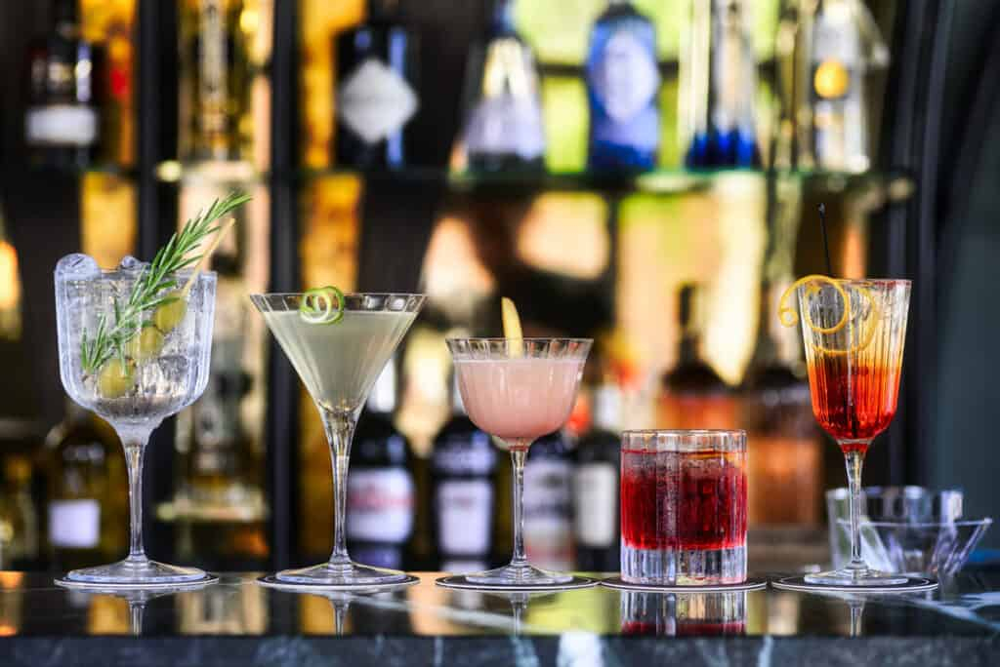

# The Six Families

*Every classic cocktail in the world belongs to one of six families. Once you can name the family, the recipe becomes obvious. Once you can vary the base spirit within a family, you've doubled your repertoire.*

## Overview

The six families are: Old Fashioned, Manhattan, Daiquiri, Martini, Sour, and Highball. Together they explain the recipe of any cocktail you'll meet. The Negroni is a Manhattan variant. The Margarita is a Sour. The Mojito is a Highball. The Aviation is a Sour. The Boulevardier is a Manhattan.

This page walks through each family with its shape and the canonical recipe. The next pages cover ice/dilution and garnish; the final page works through 5 real cocktails using all of this.

## 1. The Old Fashioned

**Shape:** spirit + sugar + bitters + ice.

The oldest family - the original "cock-tail" was an Old Fashioned. The recipe predates the Manhattan by 50 years.

**Canonical:**
- 60 ml rye whisky (or bourbon)
- 1 teaspoon demerara syrup (or 1 sugar cube)
- 3 dashes Angostura bitters
- Stirred over a single large ice cube; orange-peel twist.

**Family members:**
- **Sazerac** - rye + sugar + Peychaud's bitters; absinthe-rinsed glass.
- **Old Cuban** - Cuban rum + sugar + Angostura, no ice.
- **Brandy Old Fashioned** - brandy + sugar + bitters (Wisconsin).
- **Brown derby variant** - bourbon + maple syrup + Angostura.

If you can make one Old Fashioned well, you can make all of these.

## 2. The Manhattan

**Shape:** spirit + sweet vermouth + bitters + ice.

The Manhattan is the Old Fashioned's wine-fortified cousin. Where the Old Fashioned uses sugar, the Manhattan uses sweet vermouth, which adds aromatised wine character (herbs, citrus, dried fruits) on top of the sweetness.

**Canonical:**
- 50 ml rye whisky
- 25 ml sweet vermouth (Carpano Antica, Cocchi Torino, or Punt e Mes)
- 2 dashes Angostura bitters
- Stirred; coupe or rocks glass; cherry or orange-peel twist.

**Family members:**
- **Boulevardier** - bourbon + sweet vermouth + Campari (the Manhattan's Negroni cousin).
- **Rob Roy** - Scotch + sweet vermouth + bitters.
- **Brooklyn** - rye + dry vermouth + maraschino + Amer Picon.
- **Bensonhurst** - rye + dry vermouth + maraschino + Cynar.
- **Brookwood** - bourbon + sweet vermouth + Aperol.

The Manhattan family is the easiest to expand: change the spirit, swap the modifier liqueur, the cocktail evolves.

## 3. The Daiquiri

**Shape:** spirit + citrus + sugar.

The first of the sour-family cocktails. The Daiquiri is the cleanest, most balanced expression of the sour shape.

**Canonical:**
- 60 ml white rum
- 25 ml fresh lime juice
- 15 ml simple syrup (or demerara syrup)
- Shaken; coupe; no garnish (or a lime wheel).

**Family members:**
- **Margarita** - tequila + lime + Cointreau (Cointreau replaces simple syrup as the sweetener).
- **Whisky Sour** - bourbon + lemon + simple syrup + egg white optional.
- **Pisco Sour** - pisco + lime + simple syrup + egg white + Angostura on top.
- **Cosmopolitan** - vodka + lime + Cointreau + cranberry.
- **Sidecar** - cognac + lemon + Cointreau (the Daiquiri's brandy cousin).

## 4. The Martini

**Shape:** spirit + dry vermouth (lots or none) + ice.

The most-quoted, most-debated cocktail. The shape is simple; the proportions are everything.

**Canonical (50/50):**
- 30 ml gin (or vodka)
- 30 ml dry vermouth (Dolin Dry, Noilly Prat)
- Stirred; coupe or martini glass; lemon-peel twist or olive.

**The dry martini** uses 60 ml gin + 7-10 ml vermouth (or even just a vermouth rinse). The wet martini uses equal parts. The "in-and-out" martini uses just a vermouth mist over the glass. James Bond's "shaken not stirred" is wrong; the right answer is stirred at any ratio.

**Family members:**
- **Vesper** (Bond's actual drink) - gin + vodka + Lillet Blanc.
- **Gibson** - martini garnished with cocktail onion.
- **Dirty martini** - martini + a teaspoon of olive brine.
- **Tuxedo** - gin + dry vermouth + maraschino + absinthe + orange bitters.

## 5. The Sour

**Shape:** spirit + citrus + sugar + egg white (the dry-shake / wet-shake).

Technically a sub-family of the Daiquiri, the Sour gets its own line because of the egg-white technique that gives it that famously thick foam head.

**Canonical Whisky Sour:**
- 50 ml bourbon (or rye)
- 25 ml fresh lemon juice
- 15 ml simple syrup
- 15 ml egg white (about ½ a small egg)
- **Dry shake** without ice for 10 seconds (froths the egg).
- **Wet shake** with ice for 12-15 seconds (chills and dilutes).
- Strain into a chilled coupe; 3 dashes Angostura bitters on the foam for decoration.

**Family members:**
- **Pisco Sour** - pisco + lime + sugar + egg white.
- **Amaretto Sour** - amaretto + lemon + simple + egg white.
- **Boston Sour** - Whisky Sour but in a rocks glass over ice with a cherry and orange.
- **Penicillin** - Scotch + lemon + ginger + honey + smoky Islay float on top.

## 6. The Highball

**Shape:** spirit + a large amount of mixer + ice.

The long-drink family. Lower alcohol per volume; designed for slow sipping.

**Canonical Gin and Tonic:**
- 50 ml gin
- 150 ml tonic water (Schweppes, Fever-Tree, or proper craft tonic)
- Generous ice; lemon or lime wheel.

**Family members:**
- **Mojito** - white rum + lime + sugar + mint + soda water (a citrus-and-mint Highball).
- **Tom Collins** - gin + lemon + simple syrup + soda water (a citrus-Sour-as-Highball).
- **Dark and Stormy** - dark rum + ginger beer + lime.
- **Whisky Highball** - Scotch + soda + ice + lemon (the Japanese-style ratio is 1:4 spirit:soda).
- **Aperol Spritz** - Aperol + prosecco + soda (a wine-based Highball).
- **Paloma** - tequila + grapefruit soda + lime + salt rim.

## Memorising the families

The fastest way is to make ONE drink per family in a single week. After that, every recipe you read on a menu becomes immediately parseable:

> "Boulevardier: bourbon, sweet vermouth, Campari, stirred, orange twist."

You see immediately: that's a Manhattan with Campari swapped for the bitters. You know the technique (stirred, coupe, sub-zero), the proportions (roughly 50:25:25 or 50:25:15), and what to garnish. You can make it without looking up the recipe.

Once the six families are memorised, every cocktail bar's menu becomes legible at a glance.
