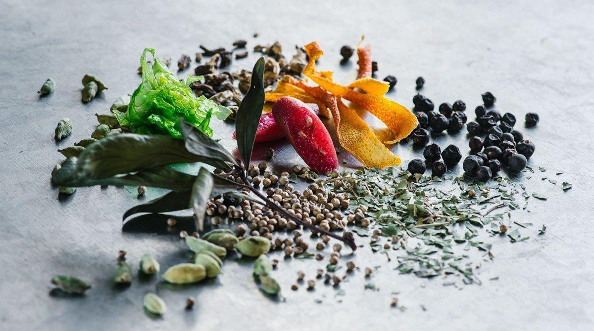

# Botanicals Guide

*The plant-derived ingredients that turn neutral spirit into gin. Juniper is the law; everything else is balance. A working guide to the botanicals you'll find in any traditional London Dry, what each one contributes, and how to source them.*

## Overview
A gin is defined legally (in the EU and UK) by one and only one ingredient: juniper. Specifically, the predominant flavour must be juniper. Beyond that, the distiller (or in your case, the home infuser) chooses from a long catalogue of supporting botanicals. The classic English gin uses 8-12 botanicals; modern craft gins go up to 30+. For your first compound gin, a tight blend of 4-6 well-chosen botanicals produces a balanced, drinkable result and gives you a baseline you can build on.

Botanicals contribute in three categories: the spine (juniper), the structural supporters (coriander, angelica, citrus peel), and the seasoning (cardamom, cassia, orris root, liquorice, etc.). The structure of a good gin is closer to a balanced perfume than a kitchen recipe.

## The essential five

These are the botanicals that appear in nearly every traditional London Dry gin. Start with these; learn what each contributes; then expand.

### Juniper berries (Juniperus communis)
**Weight per litre of spirit: 25-35 g**

The defining ingredient. Whole dried berries are dark purple-blue with a piney, resinous, faintly citrusy aroma. The flavour is exactly what most people think of as "gin" — that resin-pine note. Without juniper, you can't legally call it gin.

Source: most large supermarkets stock dried juniper berries in the spice aisle. Specialist herb shops have better-quality fresher berries. Look for berries that smell strongly piney when you crush one between your fingers; berries with no aroma are old and stale.

### Coriander seed (Coriandrum sativum)
**Weight per litre of spirit: 15-20 g**

The second-most-common botanical in gin. Whole dried coriander seeds (not the fresh leaf, which is a different herb) bring a warm, citrusy, faintly nutty character with hints of orange peel. Coriander complements juniper without competing with it.

Source: any supermarket spice section. Whole seeds, not ground.

### Angelica root (Angelica archangelica)
**Weight per litre of spirit: 3-5 g**

The "binding" botanical. Angelica root has a faint earthy, slightly musky aroma on its own but plays a critical role in gin: it holds the other flavours together and gives the spirit body and texture. Without angelica, a compound gin can taste thin and disconnected.

Source: specialist herb / spice shops or online (Steenbergs, Hopt, brewers' supply). Not usually in supermarkets. Cut into small pieces (the root is usually sold in chunks).

### Sweet orange peel (dried)
**Weight per litre of spirit: 8-12 g**

Citrus peel is critical in compound gin. Sweet orange peel (made from the dried peel of unwaxed oranges) adds brightness, juicy fruit notes and a mid-palate lift that balances the piney juniper.

Source: dried orange peel is sold at any decent grocery or specialty spice shop. Or make your own: peel an unwaxed organic orange in long strips with a vegetable peeler (avoiding the white pith underneath), spread on a tray, air-dry for 3 days in a warm dry place until brittle.

### Lemon peel (dried)
**Weight per litre of spirit: 6-10 g**

The sharper citrus counterpart. Where orange brings sweetness, lemon brings sharp acidity and brightness. The combination of orange + lemon peel creates a balanced citrus profile.

Source: same as orange peel. Make your own or buy.

## Common secondary botanicals

These appear in classic London Dry blends. Pick 1-2 to add to the essential five for your first batch.

### Cardamom pods (green)
**Weight per litre of spirit: 3-5 g**

Lightly crushed before adding. Cardamom brings a warm, floral, slightly camphorous note that lifts the citrus and complements the juniper. One of the most popular modern additions.

### Coriander root or angelica seed
**Weight per litre of spirit: 1-2 g**

Different parts of plants you've already used. Coriander root is sharper and less citrusy than the seed; angelica seed is brighter and less binding than the root.

### Liquorice root (dried)
**Weight per litre of spirit: 2-3 g**

Adds a touch of sweet, slightly anise-like complexity and helps the gin feel rounder on the palate. Use sparingly — too much makes the gin taste medicinal.

### Cassia bark (cinnamon)
**Weight per litre of spirit: 2-3 g**

A 2-3 cm piece of cassia bark adds warm-spice depth. Don't use ground cinnamon — too sharp and the powder is hard to strain out.

### Orris root (Iris germanica root, dried and aged)
**Weight per litre of spirit: 1-2 g**

The "fixative" of perfumery. Orris helps lock in volatile aromas and binds the gin together with a faint violet-like floral undertone. A traditional London Dry signature. Hard to source; specialist suppliers only.

### Cubeb berries (Piper cubeba)
**Weight per litre of spirit: 1-2 g**

A relative of black pepper, slightly hot with a green-pine-citrus edge. Common in Hendricks-style modern gins.

### Grains of paradise (Aframomum melegueta)
**Weight per litre of spirit: 1-2 g**

Cardamom's African cousin. Peppery, complex, with floral hints. Pairs beautifully with citrus.

## Floral and modern botanicals

For the adventurous; less classical but increasingly common in craft gins.

### Lavender (dried, culinary grade)
**Weight per litre of spirit: 1-2 g**

A small amount adds a beautiful floral lift. Too much and the gin tastes like soap. Test cautiously.

### Rose petals (dried, culinary grade)
**Weight per litre of spirit: 2-3 g**

Romantic, beautiful, can be overdone. Best in small quantities alongside citrus.

### Elderflower (dried)
**Weight per litre of spirit: 3-5 g**

Adds a meadow-summer character. Pairs well with cardamom and citrus.

### Hibiscus (dried)
**Weight per litre of spirit: 3-5 g**

Adds colour (the finished gin turns pale pink) and a faint tart-cranberry-floral character.

### Cucumber (fresh)
**Weight per litre of spirit: 30-50 g**

Added at the END of the infusion (last 12 hours only). Brings green, cooling notes — the Hendricks-style signature.

## Choosing your blend

A balanced first compound gin uses 4-6 botanicals total:
- 1 × juniper (mandatory, 30g)
- 1 × coriander seed (mandatory, 15g)
- 1 × angelica root (mandatory, 4g)
- 1 × sweet orange peel + 1 × lemon peel (or just one citrus, 10g each)
- 1 × secondary botanical of your choice (cardamom is the easiest first pick, 4g)

This is the formula in the [Classic Compound Gin](classic-compound-gin.md) recipe.

## Sourcing summary

| Source | Available |
|---|---|
| Supermarket spice aisle | juniper, coriander seed, cardamom, lemon peel, orange peel |
| Whole foods / specialty grocer | liquorice root, lavender, rose petals, hibiscus, elderflower |
| Specialist online (Steenbergs, Old Hamlet, Hopt) | angelica root, orris root, cubeb, grains of paradise, cassia |

For a first batch you only need supermarket-level botanicals plus one online order for angelica root.

## The "less is more" principle

If your first compound gin tastes muddled, it's almost always because you used too many botanicals. Strip back to the essential five and rebuild. A well-made gin with 5 botanicals tastes far better than a clumsy gin with 15.

## Next step

Head to [Classic Compound Gin](classic-compound-gin.md) for the recipe that uses these botanicals.
