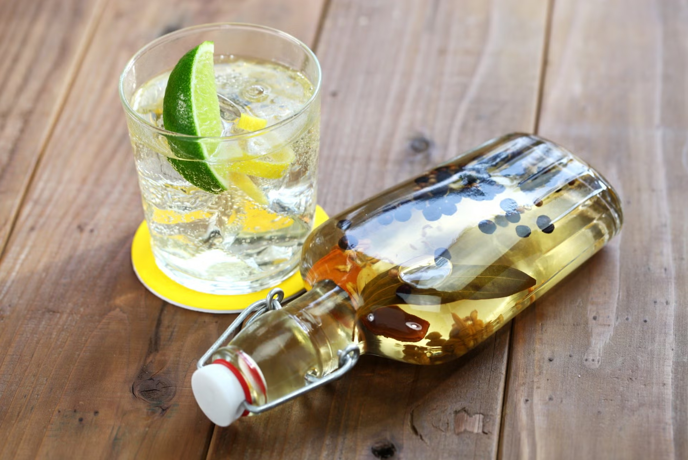

# Classic Compound Gin

*The foundational recipe: 1 litre of neutral grain spirit infused with juniper, coriander seed, angelica root, citrus peel and a touch of cardamom. Steep for 36 hours, strain, bottle. The reference compound gin that every variation builds on. Properly tasty in a gin and tonic from the moment you bottle it.*

**Makes:** 1 litre of finished gin

**Active time:** 15 minutes

**Total time:** 36-48 hours (mostly unattended steep)

## Overview
This recipe is the cornerstone of the course. Once you've made it once and understood how the botanicals balance, every other compound gin variation (citrus-forward, herbal, floral, peppery) is a simple change to the botanical mix. Start here, taste the result, then experiment.

The technique is dead simple: combine spirit and botanicals in a glass jar, seal, let steep, strain, bottle. The skill is in the proportions of botanicals, get these right and you have a balanced gin; get them wrong and you have an unpleasant or muddled spirit. The proportions in this recipe are the well-established middle-of-the-road for a London Dry-style profile.

## Ingredients

### The spirit base
- 1 litre of neutral grain spirit at 40-45% ABV, Russian Standard, Smirnoff Red, Absolut or Stolichnaya vodka are all good choices. Don't use cheap supermarket-own-brand vodka (often has off-flavours) or premium vodka (above £30 a litre, wasted because botanicals dominate). About £18-£22 per litre.

### The botanicals
- 30 g dried juniper berries (whole, not crushed)
- 15 g coriander seeds (whole)
- 4 g dried angelica root (broken into small pieces)
- 10 g dried sweet orange peel
- 8 g dried lemon peel
- 4 g green cardamom pods (lightly crushed to expose the seeds)

See the [Botanicals Guide](botanicals.md) for sourcing details.

## Equipment

- 1 × 1.5-litre glass jar with airtight lid (a Kilner jar or a large pickling jar)
- 1 × fine-mesh sieve
- 1 × coffee filter or muslin cloth (for the final clean strain)
- 1 × clean glass funnel
- 1 × empty 1-litre glass bottle with cork or screw-top for the finished gin
- 1 × marker pen for labelling

## Method

### Stage 1 - Sanitise the jar (5 min)
1. Wash the glass jar and the empty bottle thoroughly in hot soapy water. Rinse well.
1. Sterilise by either:
   - Boiling water: fill with just-boiled water, let stand 2 minutes, drain (let glass acclimate to warm water first to avoid cracking).
   - Oven: place jar and bottle upside-down on a tray in a 130°C oven for 15 minutes.
1. Cool to room temperature before use.

### Stage 2 - Prepare the botanicals
1. **Juniper:** lightly crush with the side of a heavy knife or the back of a wooden spoon. You want to bruise the berries to release oils, not pulverise them.
1. **Coriander seeds:** lightly crush in the same way; just enough to crack them open.
1. **Cardamom:** crush the pods to expose the seeds inside. Don't separate; pods and seeds both go in.
1. **Angelica root:** if your root pieces are larger than 1 cm, chop into smaller pieces with a knife (it's hard).
1. **Citrus peel:** leave whole.

### Stage 3 - Combine
1. Drop all the botanicals into the sterile glass jar.
1. Pour over the litre of spirit.
1. Seal the jar tightly.

### Stage 4 - Steep (24 to 48 hours)
1. Place the sealed jar somewhere away from direct sunlight at normal room temperature (18-22°C).
1. Shake gently once a day.
1. At 24 hours, decant a small sample (about 5 ml) into a clean shot glass. Taste straight, then taste diluted with tonic water at the proportions you'd actually drink it (1 part gin to 3 parts tonic).
1. If the spirit tastes pleasantly piney, citrussy and aromatic, strain immediately (Stage 5).
1. If it tastes thin or under-aromatic, leave for another 12 hours and re-taste.
1. Beyond 48 hours total, the gin can become bitter as more astringent compounds extract. Don't go past 48 hours.

### Stage 5 - First strain (10 min)
1. Set the fine-mesh sieve over a large clean jug.
1. Pour the infused spirit through the sieve, catching the botanicals in the mesh.
1. Press the botanicals gently with the back of a spoon to extract every drop, then discard the spent solids.

### Stage 6 - Fine strain (5 min)
1. Set a coffee filter (or 3 layers of muslin cloth) in a fresh clean funnel above your bottle.
1. Pour the strained gin through the filter into the bottle. This second strain catches the fine sediment that the sieve missed.
1. Be patient, coffee filtering is slow (10-15 minutes for a litre). The finished gin should be perfectly clear with no cloudiness.

### Stage 7 - Bottle and label
1. Cork or seal the bottle.
1. Label with the date and a list of the botanicals used.
1. Drinkable immediately. Some say it improves slightly over the first 2 weeks as the residual flavours integrate; in practice, it's good from day one.

## Notes
- **Don't over-crush the juniper.** Bruised berries release their oils gradually; pulverised berries dump everything at once and over-extract (bitter pine).
- **Whole spices, not ground.** Ground coriander or cardamom are nearly impossible to strain out and produce a cloudy, gritty gin. Always whole.
- **Sanitise the bottle.** Compound gin doesn't ferment so it won't go bad from contamination, but a clean bottle gives a cleaner-tasting result.
- **Taste at 24 hours and 36 hours.** Botanical extraction isn't linear; the right end-point varies with botanical freshness, temperature and the specific vodka used. Trust your palate.

## Variations

### Citrus-forward (lighter, summery)
- Increase orange peel to 15 g, lemon peel to 12 g.
- Reduce juniper to 25 g.
- Add 5 g dried grapefruit peel.

### Floral (London Bramble / Hendricks-style)
- Add 3 g dried rose petals.
- Add 2 g dried lavender.
- Add 50 g fresh sliced cucumber in the last 12 hours of infusion only.

### Peppery (Tanqueray-Ten-style)
- Add 3 g cubeb berries.
- Add 2 g grains of paradise.
- Add 2 g black peppercorns.

### Herbal / Mediterranean
- Add 5 g dried rosemary.
- Add 3 g dried thyme.
- Add 2 g dried bay leaves.

### Spiced (Christmas gin)
- Add 3 cm cassia bark (or 1 cinnamon stick).
- Add 2 g whole cloves.
- Add 2 g star anise.
- Reduce citrus peel slightly.

## How to drink it

- **Gin and tonic:** 50 ml compound gin, 150 ml chilled tonic (Fever Tree, Schweppes), tall glass with plenty of ice, a wedge of lemon or orange.
- **Martini:** 60 ml compound gin, 15 ml dry vermouth (Noilly Prat), stirred over ice for 30 seconds, strained into a chilled coupe, garnished with a thin strip of lemon peel.
- **Negroni:** 30 ml compound gin, 30 ml sweet vermouth (Carpano Antica), 30 ml Campari, built over ice in a rocks glass, stirred briefly, orange peel garnish.
- **Gimlet:** 60 ml compound gin, 15 ml fresh lime juice, 15 ml simple syrup, shaken hard over ice, strained into a coupe.

## Storage

- A sealed bottle of compound gin keeps indefinitely at room temperature. The flavour holds well for 1-2 years.
- Keep out of direct sunlight, UV degrades the aromatic compounds.
- No need to refrigerate.

## Next step

Try the seasonal variant: [Sloe Gin](sloe-gin.md), which uses this compound gin as a base, or buy a commercial gin if you want the head start. Sloe gin is the autumn / winter follow-on to the foundational summer/year-round compound gin.
