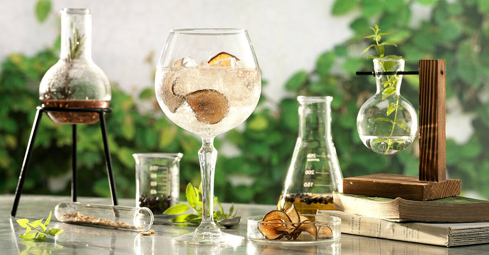

# Compound Gin Course

*Compound gin is how every English gin was made before the 19th century: steep juniper and a small balanced blend of botanicals in neutral grain spirit, strain, bottle. No still required, no licence needed, and the result is genuinely good gin you'd be proud to serve. The kitchen-table version of the country's signature spirit.*

## Overview
There are two ways to make gin. The first is distilled gin (London Dry style): juniper and botanicals are placed in a still alongside neutral grain spirit, and the whole thing is re-distilled so the aromatic compounds rise with the alcohol vapour. The second is compound gin: the same juniper and botanicals are simply steeped in already-distilled neutral grain spirit, the way you make a flavoured spirit or a fruit liqueur. Strain after 24-48 hours, bottle, and you have gin.

Compound gin is what every English distiller made between the 1700s and the early 1900s when column distillation became common. It's legal to make at home in any quantity for personal use (you're not distilling, just infusing pre-made spirit), needs no specialist equipment, and produces a credibly delicious gin if you choose your botanicals carefully. The flavour profile is slightly less "clean" than a distilled gin (some of the bitter compounds in botanicals that a distillation leaves behind do make it into a compound gin), but for many palates this is a feature rather than a flaw.

This course teaches you to make a classic juniper-led compound gin and the iconic UK seasonal variant, sloe gin.

## Course Outline

### 1. Foundations
- [Botanicals Guide](botanicals.md): what juniper, coriander, angelica, citrus peel and the supporting cast each contribute. How to choose your blend, where to source botanicals, what dried weight ratios produce a balanced gin.

### 2. Practical Recipes
- [Classic Compound Gin](classic-compound-gin.md): the foundational recipe, vodka or neutral grain spirit infused with juniper, coriander seed, angelica root, orange peel, lemon peel and cardamom. 24-48 hour steep, strain, bottle. The starting point.
- [Sloe Gin](sloe-gin.md): the seasonal British classic, gin infused for 2-3 months with autumn-picked sloes (blackthorn berries) and sugar. The Christmas drink, drunk neat from a glass after Sunday lunch or stirred into a winter cocktail.

## How long does it take?

| Step | Time |
|---|---|
| Source botanicals | 1 day (most are in any supermarket or specialist online) |
| Make the infusion | 5 minutes active |
| Steep | 24 to 48 hours for compound gin; 2-3 months for sloe gin |
| Strain and bottle | 15 minutes |
| Resting in bottle | Drinkable immediately; improves slightly over a few weeks |

Total: from buying ingredients to drinking your first compound gin in roughly 48 hours.

## What you need to know going in
- **Start with a good neutral spirit.** Your gin can only be as good as the alcohol you start with. Use a decent 40% ABV vodka (Russian Standard, Smirnoff Red, Absolut, Stolichnaya): under £20 a bottle. Don't use cheap supermarket-own-brand vodka or anything that already has flavour notes; you want a clean alcohol base. Above £30 vodka is wasted (the botanicals dominate).
- **Get juniper right.** Juniper is non-negotiable; without it you're making a flavoured spirit, not gin. Use whole dried juniper berries (Juniperus communis specifically), readily available at any specialist herb / spice shop or large supermarket. About 30 g per litre of spirit.
- **Restraint with secondary botanicals.** Beginner compound gins go wrong by adding too many botanicals. A classic London Dry uses 8-12 botanicals; for your first compound gin, use 4-6 max. Add one new botanical per batch until you find a balance you like.
- **Taste as you go.** After 24 hours of steeping, decant a small sample and taste it. Too piney? Strain immediately. Not aromatic enough? Steep another 12-24 hours. The exact end-point varies with the spirit you used, the freshness of the botanicals and the temperature of the room.

## Equipment summary
You need: a clean glass jar (1-litre Kilner jar or similar), a fine-mesh sieve, a coffee filter or muslin cloth for the final clean strain, a clean glass bottle for the finished gin. Total cost if you buy new: about £10. Many home cooks already have all of this.

## Legal note (UK)
Compound gin is the infusion of botanicals into pre-distilled spirit, you're not distilling, so no HMRC licence is required. Production for personal use is completely legal at any quantity. Sale of homemade compound gin is not legal without HMRC permits.

## A short history

Gin began as Dutch genever (a malt-based juniper spirit) in the 1500s, and arrived in England in volume during the late 1600s. By the 1700s London was producing massive quantities of cheap rough gin, much of it adulterated with sugar, glycerine, turpentine and worse. The 1751 Gin Act tightened production rules; the 19th century brought column distillation, which produced cleaner neutral spirit and gave rise to London Dry style. The 1980s and 90s saw mass-market gin become bland and unfashionable; the 2010s craft gin movement revived hundreds of small distilleries across the UK. Compound gin (steeped, not distilled) has always existed as the home cook's version, predating the craft gin revival by 300 years and still the only fully legal way to make gin at home without a licence.
