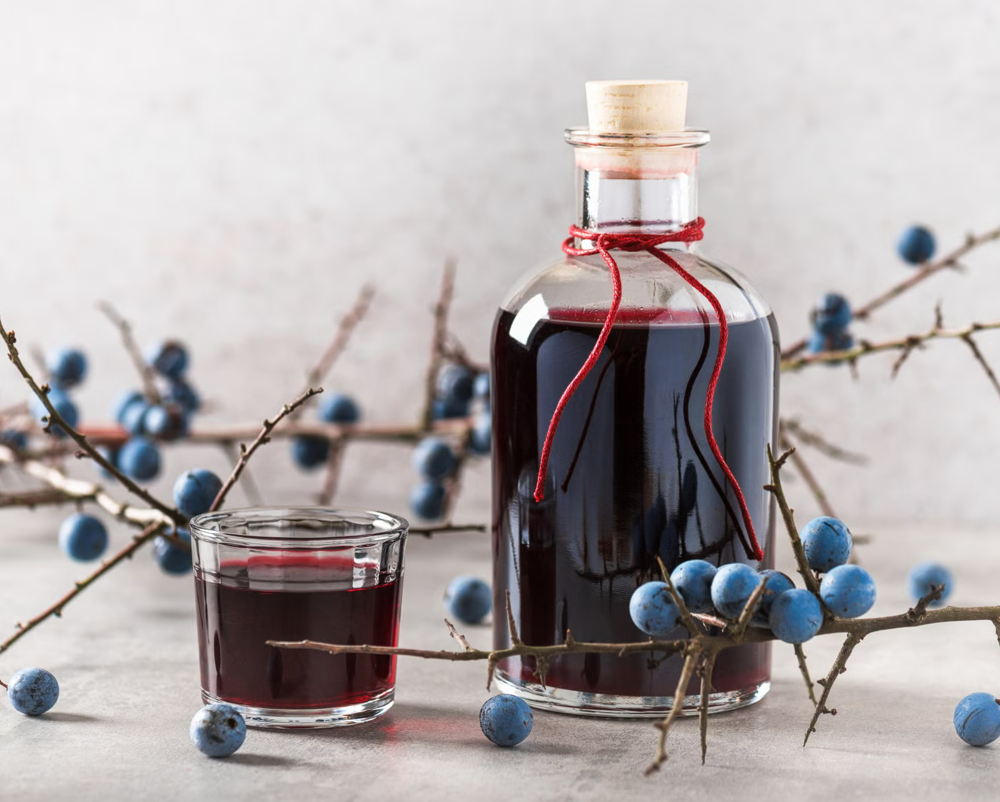

# Sloe Gin

*The British autumn classic: sloes (the small purple-black fruit of the blackthorn) gathered from a hedgerow after the first frost, pricked with a needle, layered with sugar and gin, left to steep for 3 months. The result is a deep ruby-red liqueur with a tart, almond-fruity, distinctly autumnal character - Christmas in a glass.*

**Makes:** 1 litre of sloe gin

**Active time:** 30 minutes (mostly picking the sloes if you forage them)

**Total time:** 3 months minimum, ideally 6 months

## Overview
Sloe gin is one of the great British home traditions. Sloes are the fruit of the blackthorn tree (Prunus spinosa), a hardy hedgerow shrub found across most of the UK. The small (~1 cm) blue-black fruit are too tart and astringent to eat raw, but steeped in gin with sugar for several months, they release their pectin, anthocyanin pigments and tart-fruity flavour into the spirit, producing a deep ruby-red liqueur with a flavour reminiscent of cherries, almonds and autumn fruit.

The classic British tradition is to pick sloes after the first frost (usually mid-October to early November), which breaks the cell walls of the fruit and releases the juices. Modern home cooks usually skip the wait for frost and prick each sloe individually with a needle to achieve the same effect. The infusion takes a minimum of 3 months - most households start a batch in October or November and decant on Christmas Eve, which is exactly the right ageing time.

Sloe gin is drunk neat from a small glass after dinner, stirred into champagne for a pink fizz, mixed into winter cocktails, or used as the base for sloe gin fizz. The colour alone makes it a Christmas gift.

## Ingredients

- 500 g fresh sloes (picked from any hedgerow blackthorn, October-November; or buy frozen sloes from specialist suppliers if you can't forage)
- 300 g caster sugar (start at this; you can add more after the first month if too sharp)
- 1 litre gin - your own [Classic Compound Gin](classic-compound-gin.md) works perfectly; a London Dry like Bombay Sapphire, Beefeater, Tanqueray or a quality supermarket gin all work. Don't use a heavily flavoured gin (like Hendricks with its cucumber profile); a clean juniper-led gin is best for the sloe character to come through.
- 1-2 drops of natural almond extract (optional, traditional - enhances the natural almond-cherry note from the sloe stones)

## Equipment

- 1 × 2-litre glass jar with airtight lid (a 2-litre Kilner is ideal)
- 1 × thin sewing needle (for pricking the sloes) OR a freezer (to freeze them as a substitute)
- 1 × clean tea towel
- 1 × fine-mesh sieve and a clean muslin cloth
- 1 × clean 1-litre glass bottle with a cork for the finished sloe gin

## Method

### Stage 1 - Pick the sloes (foraging)
1. Sloes ripen from mid-September to early November. The proper time to pick is **after the first frost** (typically late October in the UK), which breaks the skin and releases the juices. If you can't wait for frost, see Stage 2.
1. Look for blackthorn hedges - small thorny shrubs with rough black bark and dense thorns, bearing oval-shaped blue-black fruit about 1 cm across. The fruit will have a faint dusty bloom on the skin.
1. Pick only the ripe fruit (deep blue-black, slightly soft to the touch). Greenish or hard sloes aren't ready.
1. Aim for 500 g, which is about 2-3 medium handfuls.

### Stage 2 - Pre-freeze (frost substitute)
1. If you didn't wait for a natural frost, place the picked sloes in a freezer bag and freeze overnight. The cold breaks down the cell walls just as the natural frost would.
1. Either way, give the sloes a quick rinse and let them air-dry on a clean tea towel.

### Stage 3 - Prick the sloes
1. Empty the sloes onto a clean surface.
1. Using a sharp sewing needle, prick each sloe 3-4 times. This breaks the tough skin and lets the gin extract the flesh inside.
1. Tedious but essential. Listen to a podcast while you do it.
1. Discard any sloes that are mouldy, soft-rotten or under-ripe.

### Stage 4 - Combine
1. Place the pricked sloes in the 2-litre jar.
1. Add the caster sugar.
1. Pour over the litre of gin.
1. Add the optional drop of almond extract.
1. Seal the jar tightly.

### Stage 5 - First weeks (Months 1-2)
1. Turn the jar gently every day for the first 2 weeks to dissolve the sugar. After that, weekly turning is enough.
1. The liquid will gradually shift from clear (with sloes settled at the bottom) to a deep ruby-red as the anthocyanins extract from the skins.
1. By week 4, the gin is a clear ruby red.

### Stage 6 - Taste at 8 weeks
1. After 8 weeks, decant a small sample and taste straight.
1. It should be sweet, deeply fruity, with a clear sloe-cherry-almond character and a smooth alcohol backbone.
1. **If too tart**: add 50 g more sugar, stir, leave another 2 weeks.
1. **If perfect**: continue maturing.
1. **If too sweet**: this is unlikely from the start. The sugar level only matters in the first 8 weeks; after that the fruit gives diminishing returns.

### Stage 7 - Decant (12+ weeks)
1. Once you're happy with the taste (typically at 12-16 weeks), strain through a fine-mesh sieve into a large jug, catching the sloes.
1. Strain again through muslin cloth (or a coffee filter) to remove any fine sediment. Be patient; muslin filtering is slow.
1. Pour the clear ruby-red sloe gin into a sterilised 1-litre bottle.
1. Cork or seal.
1. Label with the date.

### Stage 8 - Drink (anytime from week 12 onward)
1. Sloe gin is drinkable from week 12 but improves to about month 6.
1. Serve in small glasses (50 ml), straight, lightly chilled or at room temperature. After Sunday lunch in October-March is the classic moment.

## Notes
- **Don't waste the sloes.** After straining, the gin-soaked sloes can be used to make sloe gin chocolates (chocolate ganache infused with the soaked fruit) or stirred into venison stews and game sauces.
- **Don't add too much sugar at the start.** 300 g per litre is balanced; some recipes call for 500 g, which gives a syrup. Add more after tasting if needed; you can't take it out.
- **Pricking is non-negotiable.** Without pricking (or freezing, which has the same effect), the gin won't extract from the sloes and you'll have lightly-coloured gin with the fruit looking the same as when you started.
- **Use a clean juniper-led gin.** Heavily flavoured craft gins compete with the sloe character. A clean London Dry-style gin (or your own homemade compound gin) is the right base.

## Variations

### Damson gin
Substitute 500 g of fresh damsons (the small wild plum) for sloes. Damsons are slightly larger, less tart, and produce a deeper, more rounded fruit-spirit. Same method exactly.

### Bullace gin
Substitute 500 g of bullaces (a wild plum / cherry-plum hybrid). Same method; slightly sweeter than sloes.

### Blackberry whisky (the cross-over)
The same technique with 500 g of blackberries + 250 g sugar + 1 litre Scotch whisky (an inexpensive blended Scotch - single malt is wasted). 6-month maturation. Stunning autumn drink.

### Cherry brandy
500 g of pitted morello cherries (or 750 g of fresh sour cherries) + 300 g sugar + 1 litre brandy. Same method. 3 months maturation. Christmas / Black Forest gateau in a glass.

### Sloe gin fizz cocktail
30 ml sloe gin, 30 ml fresh lemon juice, 15 ml simple syrup, top with chilled soda water. Lovely.

## Storage

- Properly sealed, sloe gin keeps 5+ years easily. Some say it improves indefinitely; in practice it peaks around 2 years and stays excellent for many more.
- Store in a cool dark place. Light degrades the colour faster than the flavour.
- A gift bottle of homemade sloe gin (with a hand-written label) makes the perfect Christmas present for friends with old-school British tastes.

## Next steps

- Make another batch in 2 weeks with a slightly different proportion of sugar; compare side-by-side after 3 months.
- Try the damson or cherry brandy variants when those fruits come into season (damsons in September, cherries in June-July).
- Use a homemade [Classic Compound Gin](classic-compound-gin.md) as the base instead of a commercial gin - adds another dimension of personal touch to the finished sloe gin.
