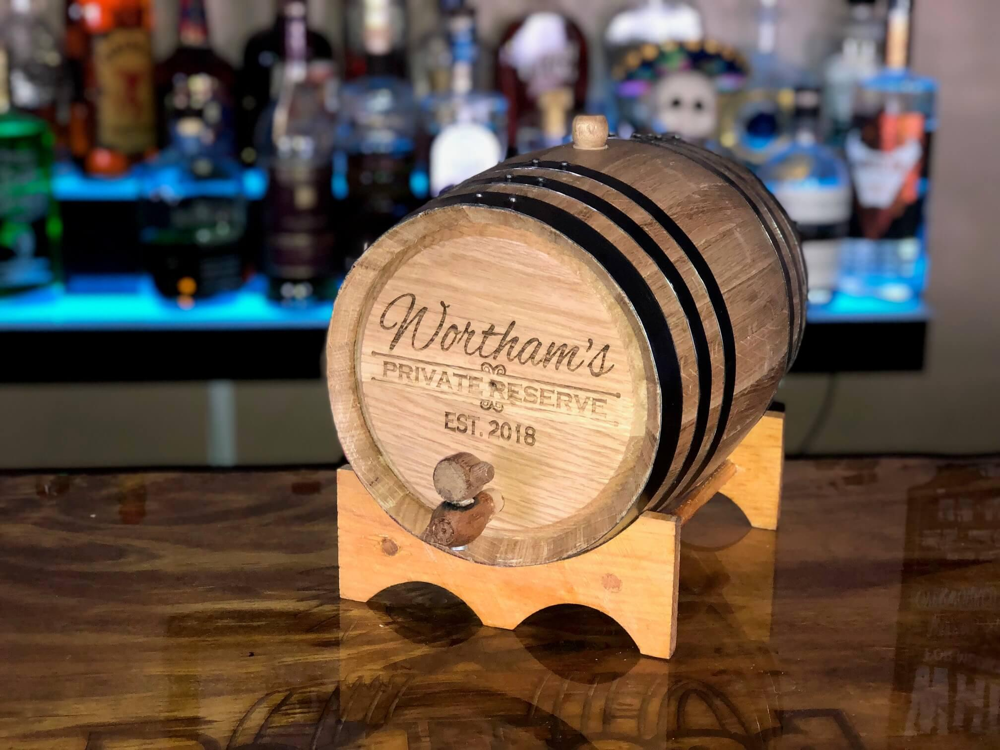

# Aging in Small Barrels

*The 5-gallon barrel trick: surface-area-to-volume math makes a 6-month family-scale aging approximate 4 years in a commercial 53-gallon barrel. Faster, more attentive, more accident-prone. The most-asked-about subject in home whiskey making.*

**Read first:** [Bourbon](bourbon.md), [Whisky (the umbrella)](whisky.md)

## Overview

Commercial bourbon ages in 53-gallon American oak barrels for 2-10 years. A family-scale operation can't reasonably wait that long, and probably doesn't have the warehouse space anyway. The solution: smaller barrels. A 5-gallon barrel has roughly 4x the wood-surface-area-to-spirit-volume ratio of a 53-gallon barrel, which means roughly 4x faster extraction of oak compounds.

That ratio is the entire mechanism. Everything else (proof, char level, temperature, humidity, time) interacts with it.

**Rule of thumb**: 6 months in a 5-gallon barrel ≈ 2 years in a 53-gallon barrel. 12 months ≈ 4 years. But it's NOT a strict linear relationship - small barrels also over-extract certain compounds disproportionately, especially tannins.

## The math, briefly

For a cylindrical barrel of radius r and height h:
- **Volume** = πr²h (3D, scales with r²)
- **Wood surface area** (sides + ends) = 2πr² + 2πrh (2D, scales with r)

Doubling the barrel's linear dimensions multiplies volume by 8 but surface area by only 4. So smaller barrels have proportionally MORE surface area per litre of spirit.

For specific common sizes:
| Barrel | Volume (litres) | Surface area (cm²) | SA/Volume ratio |
|---|---|---|---|
| 53 gallon (commercial) | 200 | about 16,000 | 80 cm²/L |
| 10 gallon (small craft) | 38 | about 6,500 | 170 cm²/L |
| 5 gallon (family-scale) | 19 | about 4,200 | 220 cm²/L |
| 2 gallon (mini) | 7.5 | about 2,300 | 305 cm²/L |
| 1 litre (souvenir) | 1 | about 600 | 600 cm²/L |

The 5-gallon ratio is roughly 2.75x the 53-gallon ratio (220 / 80). Aging proceeds faster but not 4x faster - the relationship is not strictly linear because the wood's extraction rate slows as it gives up its accessible compounds. In practice, 6 months in 5-gallon ≈ 2-3 years in 53-gallon.

## What the barrel does

Four things, in roughly this order:

1. **Adds wood compounds** to the spirit - vanillin (vanilla), lactones (coconut, baking spice), tannins (drying, structure), lignins (smoke, leather)
2. **Caramelises through char interaction** - a char-#3 or #4 barrel has a layer of caramelised wood sugars that the spirit slowly extracts
3. **Oxidises gently** - air enters through the wood; the spirit slowly oxidises, mellowing harsh edges
4. **Evaporates** - water and alcohol pass through the wood; ABV typically drops 0.5-1% per year in a humid climate, rises in a dry one. The "angel's share."

In a 5-gallon barrel, all four happen 2-3x faster than in a 53-gallon barrel. The wood compound extraction is the most dramatic acceleration - by 6 months a small barrel can produce a spirit that tastes overwhelmingly of oak if you're not careful.

## Buying a barrel

A 5-gallon American white oak (Quercus alba) barrel costs $150-250 in 2026 US dollars. Suppliers in or near Tennessee:

- **Country Connection** (Maine, ships everywhere): full range of family-scale oak barrels
- **Deep South Barrels** (Texas): popular among craft distillers
- **Buffalo Trace** (Kentucky): if you can get a used commercial barrel (53-gallon) you can have it cut down to small barrels by a local cooper

**What to look for**:
- **American white oak** - federally required for bourbon, traditionally American
- **New, unused, and charred** - required for bourbon by federal law; char level #3 or #4 (medium to heavy)
- **Tight grain** - the cooper's invoice will say "X" or "QC" if the wood is properly tight-grained; tight-grained oak gives slower, more nuanced extraction
- **Toast level documented** - toast (mild internal heating, before char) brings out caramel and toffee notes; char (rapid surface charring) gives mahogany char layer for the bourbon "alligator" effect

**What to AVOID**:
- **Used barrels** for bourbon (illegal by federal definition)
- **Re-charred barrels** (legal, but the second char is structurally inferior)
- **Barrels coated with paraffin or wax internally** (some cheap souvenir barrels) - they don't extract
- **European oak (Quercus robur)** - fine for Scotch or rum, wrong for American whiskey

## Preparing the barrel

A new barrel arrives dry. The wood is shrinking; if you fill it with spirit immediately, it will leak. Two preparation methods:

### Method 1: Water soak (the traditional approach)
1. Fill the barrel with clean cool water.
2. Place on a stand (away from anything that water leaks would damage).
3. Watch for the first 6-12 hours: water will weep through the staves as the wood is dry. Top up as needed.
4. Within 24-48 hours, the wood swells and the leaks stop.
5. After 48 hours, pour out the water (it will taste mildly of oak - discard).
6. The barrel is now ready for spirit.

### Method 2: Spirit fill direct (the fast method)
1. Fill 95% with the spirit you want to age.
2. Place on a drip tray for the first 12 hours.
3. Some spirit leaks until the wood swells. Loss: 100-300 ml typically.
4. Faster than the water method but you accept a small spirit loss.

Most family-scale distillers use the water method for the first fill - the loss matters more at small volumes.

## Filling the barrel

For bourbon and Tennessee whiskey (federal max 62.5% / 125 proof entering the barrel):
- Cut your fresh hearts with distilled water to exactly 62.5% ABV before filling
- Fill to 95% (leave 5% headspace for air exchange - important for oxidation)
- Bung tightly (a wooden bung with a small piece of waxed cloth around it is traditional)
- Record date, ABV, barrel-fill batch on a paper tag tied to the barrel

For other spirits, the entry strength can be lower (rye whiskey often goes in at 60%; brandy at 55%). Higher ABV extracts more oak compounds; lower extracts gentler.

## Aging environment

A 5-gallon barrel needs:
- **Stable temperature** - fluctuations between 10-25 °C are fine and arguably beneficial (wood swells in summer, contracts in winter, "breathing" the spirit through itself). Avoid extreme cold (under 5 °C the spirit stops extracting) or extreme heat (over 35 °C accelerates evaporation aggressively).
- **Moderate humidity** - 50-70% is ideal. In dry climates the ABV will rise (water evaporates faster than ethanol); in humid climates ABV drops. Both are normal.
- **Out of direct sunlight** - UV damages oak compounds and can give a tannic, off-flavour result.
- **On its side** - the barrel sits on a cradle, bung-up. This keeps the spirit in contact with as much wood as possible.

A garage, cellar, insulated shed or temperature-controlled room all work. A kitchen pantry is too small (the spirit needs air around the barrel for proper temperature regulation).

## Tasting through the aging

The 5-gallon-barrel trick is fast but unforgiving. Taste **early and often**:

| Month | What to expect |
|---|---|
| 1 | Spirit picks up faint yellow colour, tannin shows on the palate, oak is mild. |
| 2 | Caramel and vanilla appearing. ABV may have dropped 0.5-1%. |
| 3 | The spirit smells "barrelled" - you can identify oak by smell now. |
| 4 | Tannin building; the spirit develops a structure. Some sweetness from char caramelisation. |
| 6 | Balanced bourbon territory for many wash recipes. Often the sweet spot. |
| 8 | Some recipes are getting over-oaked here. Tannin becoming aggressive. |
| 10 | More extraction; for high-alcohol entry the oak is dominating. |
| 12 | Beyond optimal for most 5-gallon barrels. Whiskey starts to taste of oak more than grain. |

**The rule**: taste at month 4, then every 2 weeks. Bottle the moment the balance is right - DON'T leave it longer hoping it'll improve. In a 5-gallon barrel, longer often means "more tannic and woody," not "smoother and more complex."

## Multiple-barrel programs (the family-scale trick)

A single 5-gallon barrel gives one batch of one whiskey. Several barrels in parallel let you:
- Try different wash recipes (high-rye bourbon, wheated, traditional) and compare
- Stagger ages so you have whiskey to bottle every few months
- Experiment with finishing (more on that below)

A "barrel program" of 4-6 small barrels is the family-scale equivalent of a craft distillery's rickhouse.

## Finishing in a second barrel

Once a whiskey is aged to where you want it, you can transfer to a second, different barrel for a few weeks or months of "finishing":

- **Port pipe finish**: a barrel that previously held port wine. Adds sweetness, dark fruit notes.
- **Sherry butt finish**: previously held sherry. Adds raisin, nut, dried fig notes.
- **Wine cask finish**: previously held red wine. Adds tannin and fruit.
- **Beer barrel finish**: previously held a stout or porter. Adds chocolate and roasted-malt notes.

Finishing barrels can be reused; the spirit picks up the residual flavours of whatever was previously in the wood. A 4-6 week finish in a 5-gallon used barrel can dramatically change a whiskey's character.

Federal note: a whiskey labelled "straight bourbon" cannot be finished in a non-bourbon barrel (the new-charred-American-oak rule is for the primary aging). A finishing step disqualifies it from the "straight bourbon" label - you can still drink it, just label it "bourbon finished in port casks" or similar.

## What can go wrong

- **Over-oaking**: most common failure. The whiskey tastes of wood and tannin and not enough of grain. Catch by tasting frequently; bottle at the first sign of "too much oak."
- **Leaks**: a barrel that wasn't properly prepared or has a faulty stave. Catch by placing on a drip tray for the first month.
- **Microbial spoilage**: rare in spirits at 60%+ ABV (alcohol kills most things), but possible if the barrel was contaminated or the spirit dropped below 50% ABV. Smell test before tasting; if it smells off, do not drink.
- **Evaporation loss**: 5-10% loss over 6 months is normal. 20%+ in 6 months suggests cracked staves or bad seal - investigate.
- **Tannin overload**: drying, bitter, mouth-puckering. Often from a too-aggressive char or barrel reuse. Blend with a younger, less-extracted spirit to soften.

## After bottling - what to do with the barrel

A 5-gallon American oak barrel can be used 3-4 times for bourbon-style aging before the wood is "spent." After that, options:
- **Aging beer** - fill with a stout or barley wine, age 3-6 months
- **Aging hot sauce** - fill with fermented chilli paste, age 1-3 months
- **Aging vinegar** - fill with cider vinegar, age a year
- **Garden / decorative** - cut in half and use as planters
- **Smoking wood** - the staves can be chopped and used for smoking meat

## See also
- [Bourbon](bourbon.md) - what you're aging
- [Whisky (the umbrella)](whisky.md) - the spirit before the barrel
- [Tennessee whiskey](tennessee-whiskey.md) - also aged in new charred American oak
- [Sour mash](sour-mash.md) - most aged whiskies use sour mash technique
