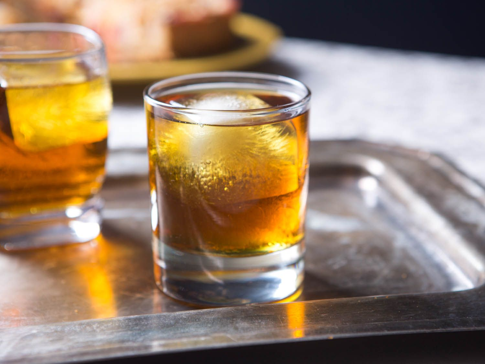

# Bourbon

*The American whiskey defined by federal law: at least 51% corn, distilled to no more than 80% ABV, aged in new charred American oak. The mash bill and the oak are everything.*

**Read first:** [Whisky (the umbrella)](whisky.md), [Safety](safety.md)

## Overview

Bourbon is the most legally precise of American whiskies. The federal definition (27 CFR § 5.143) is short and strict:

1. **At least 51% corn** in the mash bill (the rest is typically rye, wheat or barley)
2. **Distilled to no more than 80% ABV** (160 proof)
3. **Stored at no more than 62.5% ABV** (125 proof) - that is, cut with water down to this level before barrelling
4. **Aged in NEW CHARRED American oak barrels** (one-time use - Scotch whisky often gets the second-hand bourbon barrels)
5. **No additives** - no colour, no flavouring, no sweeteners
6. **Bottled at 40% ABV or higher**

Beyond these federal rules, **"straight bourbon"** must be aged at least 2 years; **"bottled-in-bond"** bourbon must be aged at least 4 years at 50% ABV (100 proof) from a single distillation season. And - contrary to popular belief - **bourbon does NOT have to come from Kentucky**. It can be made anywhere in the United States. The Kentucky association is historical and cultural, not legal.

Tennessee whiskey (e.g. Jack Daniel's) IS bourbon by the federal definition; Tennessee state law adds the Lincoln County Process step (charcoal mellowing) but the whiskey still meets every bourbon requirement. See [Tennessee whiskey](tennessee-whiskey.md).

## The mash bill

The grain ratio is the bourbon distiller's signature. Three common styles:

| Style | Mash bill | Character |
|---|---|---|
| **Traditional** | 70% corn / 15% rye / 15% malted barley | Balanced; soft sweetness with a peppery rye finish |
| **High-rye** | 60% corn / 25% rye / 15% malted barley | Spicier, drier, more assertive |
| **Wheated** | 70% corn / 15% wheat / 15% malted barley | Softer, sweeter, no rye spice (the Pappy Van Winkle / Maker's Mark style) |

For a family operation, start with the traditional 70/15/15 - it gives the most recognisable bourbon character.

## Recipe (5-gallon wash, traditional mash bill)

### Ingredients
- 5 kg cracked corn (dent corn, distiller's grade; coarse not flour)
- 1 kg cracked rye
- 1 kg crushed malted barley
- 18 litres water
- 25 g distiller's yeast (Red Star DADY)

### Method (mash, ferment, distil, age)
This is the same five-stage process as in [Whisky](whisky.md). Repeat the steps; the only difference from a generic whiskey wash is the mash bill ratio you just measured out.

A summary recap:

**Mash:**
1. Heat 12 litres water to 75 °C. Add corn, stir, hold 20 minutes.
2. Cool to 67 °C with 4 litres cool water.
3. Add malted barley and rye.
4. Hold 65 °C for 90 minutes (the conversion step). Iodine test if uncertain.
5. Cool to 26 °C.

**Ferment:**
1. Add yeast. Cover with airlock.
2. Ferment 4-7 days at 25-30 °C until specific gravity stops dropping.
3. Wash ABV: 8-10%.

**Distil:**
1. Strain. Charge the still to 80%.
2. Heat slowly. Discard foreshots (50 ml per gallon).
3. Discard heads (next 250-500 ml).
4. Collect hearts (1.5-2 litres at 70-85% ABV early, 60-65% mid-run).
5. Cut when parrot reads below 50%.

**Cut to barrel strength:**
1. Bourbon must enter the barrel at no more than 62.5% ABV.
2. Your fresh hearts will be about 70-75% ABV. Cut with distilled water to exactly 62.5% (use the proofing hydrometer).
3. For typical 70% spirit: add 0.12 parts water by volume.

**Age:**
1. New charred American oak barrel (#3 or #4 char, 5-gallon family size).
2. Fill the barrel to about 95% (leave headspace for air exchange).
3. Bung tightly.
4. Store at 15-20 °C, away from sunlight.
5. Taste at months 4, 6, 8. The 5-gallon barrel ages roughly 4× faster than a commercial 53-gallon barrel, so 6-12 months is the family-scale equivalent of 2-4 years commercially.

**Bottle:**
1. When the colour is amber-deep-gold and the taste is balanced (sweet up front, oak in the middle, dry-warm finish), bottle.
2. The whiskey will be 60-65% ABV out of the barrel; cut with water to 40% (or higher for stronger bourbon) before bottling.
3. Let the cut spirit rest 1 week before sealing.

## What makes bourbon taste like bourbon

The flavour signature comes from three sources:

1. **The corn:** soft sweetness, that distinctive Southern grain note
2. **The char on the barrel:** vanilla, caramel, baking spice, a faint smoke
3. **The aging chemistry:** the slow oxidation through the porous oak, the seasonal expansion and contraction of the wood

The "alligator char" (#4) is critical. The black, blistered interior of a #4-charred barrel acts as a charcoal filter, removing harsh compounds from the new-make spirit while adding caramelised wood sugars. A bourbon aged in a light-char barrel tastes flat and woody; the alligator char gives the layered sweetness people expect.

## Variations

- **Wheated bourbon:** swap the 1 kg of rye for 1 kg of wheat. Softer, less peppery, more honey-like.
- **High-rye bourbon:** 1.5 kg of rye in place of part of the corn. Spicier and drier.
- **Single-grain bourbon:** 80% corn / 20% malted barley (no rye or wheat). A simpler, sweeter profile.
- **Honey-finished bourbon:** age the finished bourbon for an additional 1-2 months in a barrel that previously held honey or honey-mead. A modern craft-distillery move.
- **Bottled-in-bond:** aged 4 years, bottled at exactly 50% ABV, from a single distillation season, in a federally-bonded warehouse. Legally required if you call your product bottled-in-bond.

## Common mistakes

- **Mash bill below 51% corn.** If your corn is less than 51% of the grain, the whiskey is not bourbon - it's just a "whiskey" generically. Measure carefully.
- **Over-aging in a small barrel.** A 5-gallon barrel can over-extract the oak in 12 months. Taste regularly; bottle when the balance is right, not when an arbitrary calendar date arrives.
- **Cutting too aggressively before barrelling.** The federal max is 62.5% ABV into the barrel; cut all the way to 40% before aging and the spirit doesn't extract enough oak character.
- **Reusing a barrel for bourbon.** A used barrel produces "whiskey" not "bourbon". The new-barrel rule is federal.

## Cocktails

Bourbon is the foundation of half of America's classic cocktails:

- **[Old Fashioned](../../drinks/cocktails/old-fashioned.md):** the bourbon cocktail, dating to the 1880s. Sugar, bitters, bourbon and an orange peel.
- **[Manhattan](../../drinks/cocktails/manhattan.md):** technically a rye drink but bourbon is the standard sub-in. Sweeter and rounder with bourbon.
- **[Whisky Sour](../../drinks/cocktails/whisky-sour.md):** bourbon, lemon juice, sugar syrup, optional egg white. The summer evening drink.
- **[Mint Julep](../../drinks/regional/america/mint-julep.md):** the Kentucky Derby cocktail. Bourbon over crushed ice with sugar and a fistful of mint.
- **[Bourbon Milk Punch](../../drinks/regional/mississippi/bourbon-milk-punch.md):** the brunch classic of the American South.
- **[Mississippi Punch](../../drinks/regional/mississippi/mississippi-punch.md):** a heavier rum-and-bourbon punch.

## See also
- [Whisky (the umbrella)](whisky.md) - the general process this recipe is built on
- [Tennessee whiskey](tennessee-whiskey.md) - bourbon plus the Lincoln County Process
- [Rye](rye.md) - the rye-led counterpart
- [Ole Smoky moonshine](ole-smoky-moonshine.md) - what unaged corn whiskey tastes like before it becomes bourbon
