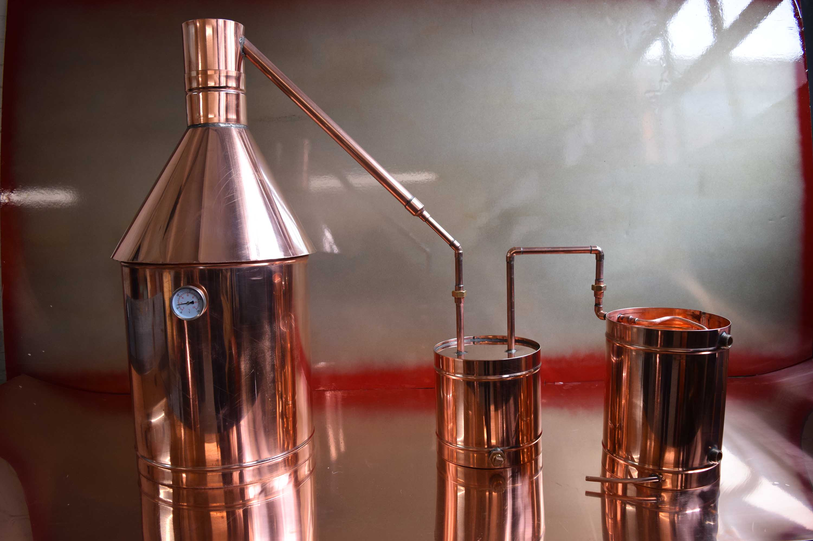

# Building a Pot Still

*A family-scale pot still has six parts: a boiler, a head, a vapour arm, a condenser, a parrot, and a heat source. Copper is the traditional material and still the right one. This page covers both buying a kit and fabricating from scratch.*

**Read first:** [Safety](safety.md)

## Overview

A pot still is the simplest distillation apparatus that works. Its parts in order of vapour travel:

1. **Boiler (pot)** - the vessel holding your fermented wash, sitting on the heat source
2. **Head (onion or column)** - the lid of the pot, where the vapour collects
3. **Vapour arm (lyne arm)** - the angled pipe carrying vapour from the head to the condenser
4. **Condenser** - a coil or jacket cooled by water that turns the vapour back to liquid
5. **Parrot** - a small overflow chamber with a hydrometer where the spirit drips out
6. **Heat source** - propane burner, electric immersion element, or wood fire (rare today)

For a family-scale Tennessee operation, a 5-20 gallon boiler is the right size. Below 5 gallons, the cuts become hard to manage (a 1-gallon wash only produces 50 ml of foreshots, which is hard to measure accurately). Above 20 gallons, you are running a commercial-scale operation that needs commercial equipment and a different kind of permit.

Two paths to a working still: **buy a kit** (fast, reliable, $400-$1500) or **fabricate from scratch** (slower, cheaper, more education in the process). This page covers both.

## Path 1: Buying a kit

For most family operations, this is the right answer. The leading American kit suppliers are Hillbilly Stills (Kentucky), StillDragon, Mile Hi Distilling (Colorado) and Affordable Distillery Equipment. All ship to Tennessee and all sell what the TTB inspectors are familiar with.

**What to look for:**

| Feature | What you want |
|---|---|
| **Boiler material** | Copper or 304 stainless steel. Both work; copper removes sulphur compounds during distillation (a real benefit for grain mashes); stainless is easier to clean. Most modern kits use stainless boilers with copper column packing - the best of both. |
| **Boiler capacity** | 5, 8, 10 or 13 gallon are common. A 10-gallon boiler holds an 8-gallon wash (you fill to 80%) and produces 1-1.5 litres of clean spirit per run. |
| **Heat source compatibility** | "Direct-fire" boilers sit on a propane burner. "Electric" boilers have an internal element (1500-5500W). Electric is more controllable and safer; direct-fire is traditional and slightly faster. |
| **Head type** | A simple onion head (a domed copper lid) is correct for pot-still operation. Column heads with packing are for reflux/neutral spirit (vodka) work; you do not want them for whiskey. |
| **Condenser** | Liebig (straight tube-in-tube) or coil-in-pot. Both work; Liebig is more efficient. Make sure it has water inlet and outlet hose barbs. |
| **Connections** | Tri-clamp fittings (sanitary stainless connectors) are the industry standard. They seal with silicone gaskets, take no tools to assemble and disassemble, and are leak-tight. Older kits use compression fittings; tri-clamp is worth the small extra cost. |

**Typical kit shopping list:**

- 10-gallon stainless boiler with 5500W electric element ($700)
- 2-inch copper onion head with tri-clamp connection ($250)
- Lyne arm (45° elbow) and Liebig condenser ($200)
- Parrot with built-in hydrometer ($60)
- Silicone gaskets and tri-clamps (assorted, $50)
- A 12V cooling-water pump if you don't have a tap nearby ($80)
- A digital thermometer with a 2-inch probe ($30)

Roughly $1400 for a complete kit that will last a generation of running. The kit will arrive in 4-6 weeks; unpack, assemble dry, and inspect every joint before the first water run.

**A water run is mandatory.** Before any wash goes in, fill the boiler with water, run the still for an hour. This tests for leaks, confirms the cooling water flows, and gets the seasoning oils out of the copper. The first water through smells slightly of copper and oil; discard it.

## Path 2: Fabricating from scratch

For the family who wants to build it themselves. Materials and approximate costs (2026 US):

**Boiler:**
- 10-gallon stainless steel keg, food-grade, with the top removed ($120 used; new $300)
- OR a heavy-bottomed copper kettle ($400+, traditional choice for whiskey)

**Head:**
- 2-inch copper pipe and fittings, 90° elbow, end cap ($60 of copper plumbing supplies)
- A 2-inch tri-clamp ferrule welded to the boiler top ($40 if you can weld, otherwise pay a fabricator $80)

**Vapour arm:**
- 2-inch copper elbow (45° or 90°) ($25)

**Condenser:**
- A 1-metre length of 2-inch copper pipe with a 1.5-inch inner copper pipe centred inside (Liebig design)
- Two end caps with hose barbs for cooling water in/out
- Silicone tubing to a cooling water source ($50 in copper + caps; another $20 in fittings)

**Parrot:**
- A 50ml graduated cylinder OR a small copper cup with an overflow tube
- A spirit hydrometer (separate purchase, $20)

**Heat source:**
- 100,000 BTU propane burner with a 2-stage regulator ($120) - outdoor use only
- OR a 5500W electric water heater element with a $50 thermostat controller (indoor-safe)

**Sealants and consumables:**
- PTFE tape, food-grade silicone gaskets, no-rinse sanitiser ($30)

Total: $400-$600 in materials for a from-scratch build, plus 20-40 hours of patient soldering and assembly. The build-it-yourself route is the right choice if you have plumbing/soldering experience or want the satisfaction of running a still you built. Otherwise, buy the kit.

## Assembling the still

Once you have the parts (kit or fabricated), assembly is straightforward:

### Stage 1 - Mount the boiler
1. The boiler sits on the heat source or has its electric element inserted through a side port (sealed with a silicone gasket and lockring).
2. Place on a stable, non-flammable surface. A 1-inch-thick wooden bench is acceptable but a stone or steel surface is better.
3. The boiler must be level. A 1° tilt makes the wash heat unevenly and can scorch the bottom on one side.

### Stage 2 - Attach the head
1. Clean the boiler rim and the head ferrule. Place a silicone gasket between them.
2. Clamp with a tri-clamp. Tighten the wing nut hand-tight, then a quarter turn more. Over-tightening crushes the gasket; under-tightening leaks.

### Stage 3 - Attach the vapour arm and condenser
1. Fit the lyne arm (vapour arm) between the head and the condenser inlet. Use silicone gaskets and tri-clamps.
2. The vapour arm should slope DOWNWARD from the head to the condenser. A 5-10° downward slope helps the condensed spirit drain forward. A flat or upward slope can cause "reflux" (condensate running back into the boiler) - fine for vodka, wrong for whiskey.
3. Connect the cooling water inlet to the BOTTOM of the condenser and the outlet to the TOP. This counter-current flow gives the most efficient cooling.

### Stage 4 - Set up the parrot
1. The parrot is a small chamber where the spirit drips out. A hydrometer floats inside, giving a continuous live ABV reading.
2. Place the parrot directly under the condenser outlet. The spirit drips in; when full, it overflows down a side tube into your collection jar.
3. Place a numbered, lidded jar under the parrot's overflow tube. The first jar is the foreshots discard bottle, marked accordingly.

### Stage 5 - Inspect for leaks
1. Before any heat or wash, do a visual inspection. Every joint should look clean and seated.
2. Run a smoke test: blow puffs of (cool) cigarette or incense smoke into the boiler with the head on; smoke should NOT escape from any joint. A leak means a re-gasket or re-tighten.

## Running the still: the first water test

Before introducing any wash:

1. Fill the boiler with plain water to 80% capacity.
2. Connect cooling water; start the flow (a moderate tap or pump).
3. Apply heat. For a 10-gallon water charge, expect 60-90 minutes to first boil.
4. Watch for water emerging from the parrot. This should be clean, hot water (about 95-99 °C). Capture for 30 minutes.
5. Cut heat. Let everything cool. Drain the boiler. The still has now been "broken in" - copper oils have been driven out, leaks have been identified, you know how long the system takes to come to temperature.

## Running the still: the first wash

Once the water test passes, you can run a real wash. This is covered on the individual spirit pages ([whisky](whisky.md), [bourbon](bourbon.md), [moonshine](ole-smoky-moonshine.md), etc.) but the broad shape is:

1. Pour the fermented wash into the cleaned boiler. Fill to no more than 80% capacity (the wash will foam during heating).
2. Seal the head, attach vapour arm and condenser, start cooling water.
3. Heat slowly. Watch the thermometer; the wash should rise to about 78 °C and stay there as ethanol begins to vaporise.
4. The first drops emerge at the condenser when the boiler is around 78 °C. These first drops are foreshots - discard.
5. Continue running, swapping collection jars as the ABV drops (the parrot hydrometer tells you when).
6. Stop when the ABV at the parrot drops below 25-30% - you are deep in tails.
7. Cut heat. Let cool. Empty the boiler. Clean.

Total run time for a 10-gallon wash: 4-6 hours.

## Cleaning and storage

Between runs:

- **Boil clean water** through the still after each spirit run. This removes residue.
- **Disassemble at the tri-clamps** every few runs. Soak gaskets in mild detergent. Inspect copper for green corrosion (a sign of stuck spirits residue); polish with a copper cleaner if needed.
- **Store dry** in a low-humidity space. Copper oxidises in moist conditions; a clean dry storage spot keeps the still bright.
- **The cooling water lines and condenser** are the most overlooked. Algae can grow in stagnant condenser water; flush and dry annually.

## Notes on heat sources

- **Propane** is fast and powerful but requires outdoor or extremely well-ventilated use. The flame is open - no leaking vapour should ever be nearby. A 100,000 BTU jet burner is overkill for a 10-gallon still; a 50,000 BTU is the sweet spot.
- **Electric immersion** is the modern choice for indoor use. A 5500W element runs on 240V (a standard US dryer outlet). Add a PID controller for precision temperature control. The element sits inside the boiler, so the heat is direct and there is no open flame.
- **Wood fire** is traditional and beautiful but hard to control. Possible for an outdoor build with a dedicated firepit; not recommended for a modern licensed operation.

## What NOT to use

- **Pressure cookers** are unsuitable. They are pressurised vessels by design and not built to be vented properly.
- **Plastic anywhere on the vapour path.** Some online plans show plastic tubing for the condenser. Ethanol vapour at 80 °C dissolves many plastics, contaminating the spirit and weakening the tube. Copper or stainless only.
- **Aluminium boilers.** Aluminium reacts with the slight acidity of fermenting wash and gives a metallic off-flavour. Copper or stainless only.
- **Reflux columns for whiskey.** A packed column with mesh or beads gives a much cleaner, higher-proof distillate - which is what you want for vodka, not for whiskey. Whiskey wants the flavour compounds that a simple pot still carries through.

Once you have a working still and have run water through it cleanly, move on to a first wash. The [whisky](whisky.md) page is the broadest starting point; [Ole Smoky-style moonshine](ole-smoky-moonshine.md) is the simplest single recipe.
