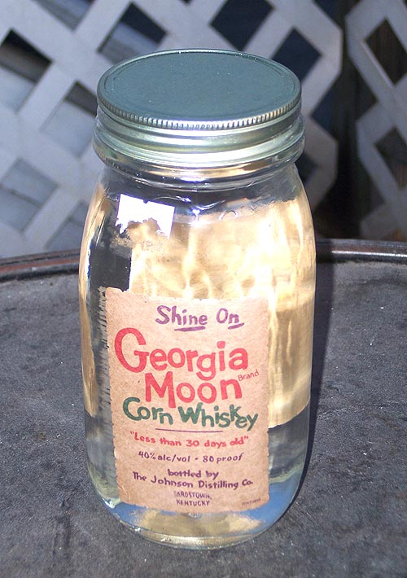

# Corn Whiskey

*The federally-defined category that bridges moonshine and bourbon: ≥80% corn in the mash bill, distilled to ≤80% ABV, aged (or not) in used or uncharred oak. Older than bourbon, simpler, and the legal name for any corn-led whiskey that isn't bourbon.*

**Read first:** [Whisky (the umbrella)](whisky.md), [Bourbon](bourbon.md)

## Overview

"Corn whiskey" is its own federal category, distinct from both bourbon and moonshine. The legal definition (27 CFR § 5.143):

1. **At least 80% corn** in the mash bill (vs bourbon's 51%)
2. **Distilled to no more than 80% ABV** (160 proof): same as bourbon
3. **Stored at no more than 62.5% ABV** if barrelled
4. **Aged in UNCHARRED new oak OR used barrels** (the key difference from bourbon, which requires new charred American oak)
5. **No additives**

The "uncharred or used barrels" rule is the structural distinction. Bourbon must use brand-new charred American oak; corn whiskey is more flexible. This rule exists for a historical reason: corn whiskey predates bourbon by decades, and traditionally was either un-aged (sold as "white whiskey" or moonshine) or aged in used barrels (the barrels that bourbon had finished with, or shipping barrels that previously held something else).

Confusingly, an un-aged corn whiskey IS legally corn whiskey, but it's also what gets marketed as "moonshine" (see [ole-smoky-moonshine](ole-smoky-moonshine.md)). The category overlaps:

| Style | Mash | Aging | Federal name |
|---|---|---|---|
| **Moonshine / White Lightnin'** | ≥80% corn | None | "Corn whiskey" or "Distilled spirits specialty" |
| **Aged corn whiskey** | ≥80% corn | Used or uncharred new oak | "Corn whiskey" |
| **Bourbon** | ≥51% corn | New charred American oak | "Bourbon" or "Straight Bourbon" |

If you ferment a high-corn mash, distil it, and age it in a used bourbon barrel, you have **aged corn whiskey**, not bourbon. The barrel reuse rule is what locks it out of the bourbon name. Some craft distillers make corn whiskey on purpose to use up used barrels economically; others make it because they prefer the lighter, less-tannic profile that uncharred oak gives.

## Recipe (5-gallon wash, 95% corn mash bill)

The mash bill leans HIGH on corn, typically 90-95% corn, the rest malted barley for enzymatic conversion. Some distillers use rye or wheat, but a true high-corn whiskey is mostly corn.

### Ingredients
- 6 kg cracked corn (yellow dent corn; the higher the corn percentage, the more characteristic flavour)
- 500 g crushed malted barley
- 250 g cracked rye (optional; adds a faint spice but stays under the 80% corn threshold easily)
- 18 litres water
- 25 g distiller's yeast

Mash bill: 88% corn / 7% barley / 4% rye, well above the 80% corn threshold.

### Method

**Mash:**
Identical to [bourbon](bourbon.md): heat water to 75 °C, add corn slowly, hold 30 minutes, cool to 67 °C, add barley and rye, hold 65 °C for 90 minutes (the conversion step), cool to 26 °C.

The high-corn mash is similar to a bourbon mash but slower to convert; give it the full 90 minutes and test with iodine if uncertain.

**Ferment:**
Same as bourbon. 4-7 days at 25-30 °C. Wash ABV: 8-10%.

**Distil:**
Single distillation, same cuts. Hearts come off at 70-80% ABV.

**Cut to barrel strength (if aging):**
Corn whiskey can enter the barrel at any strength up to 62.5% ABV. Lower entry (50-55%) gives a gentler oak extraction in a used or uncharred barrel.

**Age (if aging):**

This is where corn whiskey diverges from bourbon. Three options:

1. **Used new American oak barrel**: a barrel that previously held bourbon. Most common craft-distillery choice. The bourbon's char layer is mostly exhausted but still adds gentle caramel and a bit of vanilla. Aged 6-18 months in a 5-gallon used barrel.
2. **Uncharred new American oak barrel**: a fresh oak barrel that hasn't been charred. Adds more raw oak flavour (tannic, woody) with less of the caramelised sweetness that charring produces. Used by Mellow Corn (Heaven Hill) historically. Aged 4-12 months in a 5-gallon barrel.
3. **No aging at all**: bottle as "corn whiskey" or, more commonly, market as "moonshine" (see [ole-smoky-moonshine](ole-smoky-moonshine.md) for that path).

**Bottle:**
Cut to 40-50% ABV. Lower than bourbon (which is typically 40-45%) because corn whiskey is brighter and drier; cutting too low waters out the corn character.

## What aged corn whiskey tastes like

A 6-month aged corn whiskey from a used bourbon barrel:
- **Nose**: sweet corn (more than bourbon, less veiled by oak), faint vanilla, a touch of caramel
- **Palate**: smooth and slightly sweet entry, light grain character, gentle oak structure
- **Finish**: cleaner and shorter than bourbon; less tannin, less spice

A 6-month aged corn whiskey from an uncharred new oak barrel:
- **Nose**: corn plus raw oak, a green, woody note that bourbon doesn't have
- **Palate**: more tannin than the used-barrel version, less sweetness
- **Finish**: drier, more wood-forward

Neither is bourbon. Both are legitimate American spirits.

## Commercial examples

For taste comparison (all available in most US states):
- **Mellow Corn** (Heaven Hill, 100 proof): bonded straight corn whiskey, aged in uncharred new oak, 4 years
- **Buffalo Trace White Dog Mash #1**: un-aged corn whiskey (essentially moonshine, marketed as the bourbon's "white" stage)
- **Balcones True Blue**: corn whiskey from blue corn, aged in new charred oak (technically bourbon, but the high-corn focus and lighter aging put it in corn whiskey territory)

## Variations

- **Blue corn whiskey**: a Hopi / Pueblo tradition; the blue corn gives a slightly different sweetness and a faint nutty note. Balcones in Texas pioneered the modern craft revival.
- **Heirloom corn whiskey**: varietal corns (Bloody Butcher, Tennessee Red Cob, Hopi Blue) give recognisably different finished whiskies. The corn matters, despite what mass-market distillers say.
- **Sour mash corn whiskey**: using [sour mash](sour-mash.md) technique gives a more consistent house style, common in commercial corn whiskey.
- **Apple-finished corn whiskey**: age the finished corn whiskey for 2-3 months in a barrel that previously held apple cider or applejack. A modern craft variation that bridges with [applejack](applejack.md).

## See also
- [Bourbon](bourbon.md): corn whiskey aged in new charred oak; same mash bill principle, different barrel rule
- [Ole Smoky moonshine](ole-smoky-moonshine.md): un-aged corn whiskey, the "white whiskey" version
- [Whisky (the umbrella)](whisky.md)
- [Aging in small barrels](aging-small-barrels.md): used or uncharred barrels for the aging step
- [Sour mash](sour-mash.md): common technique for corn whiskey
