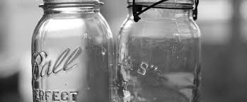

# Cuts by Smell and Taste

*The sensory side of the cuts. The safety guide tells you the volumes; this page tells you what to smell for. The transition from heads to hearts is the difference between a clean whiskey and a harsh one, and the only reliable way to find it is on the nose.*

**Read first:** [Safety](safety.md)

## Overview

[Safety](safety.md) gives the safe approach to cuts: throw away the first 50 ml per gallon of wash as foreshots, discard another 250-500 ml of heads, collect the middle of the run as hearts, stop when the parrot reads below 40% ABV. That technique alone produces drinkable spirit. The difference between drinkable and great is in the cuts you make BETWEEN those volumes, which the parrot's ABV reading alone cannot tell you.

The volumes are the safety floor. The smell is where mastery lives.

This page covers what to smell, taste and look for at each stage of a run, in the order you encounter them. Read once before your next run; reference at the still as you go.

## Setting up for sensory cuts

Equipment:
- **Numbered 250 ml jars** - 8-15 of them, ready to receive spirit in sequence
- **A small tasting glass** (Glencairn or small wine glass) for evaluating samples
- **Distilled water** for diluting samples to about 25% ABV before tasting (a 70% spirit is too hot to evaluate)
- **A notebook**: write down what you smell at each jar number. Builds the palate over time.

Routine: as each jar fills (every 5-10 minutes for a typical run), take a small sample, dilute it with about an equal volume of water in your tasting glass, give it a swirl, and smell, then taste a tiny sip. Write the smell, the ABV from the parrot, and the jar number.

## The full sensory map of a run

### Foreshots (jar 1, first 50 ml per gallon)

**Smell**: Sharp, solvent-edged. Like acetone, nail polish remover, paint thinner, or, for an experienced distiller, like a hospital cleaning supply. There is a small fruity-banana note (ethyl acetate) that some find pleasant in isolation but signals "throw this away" in this context. The smell is unmistakable once you've encountered it.

**Taste**: DO NOT TASTE THE FORESHOTS. This is the only stage where the sample is genuinely dangerous (methanol concentration). Smell only.

**Look**: Often slightly oily, sometimes faintly iridescent on the meniscus. Most foreshots is colourless, like everything else off the still.

**What to do**: Pour into a discard bottle. Cap. Mark "FORESHOTS, DO NOT DRINK". The whole bottle goes in your waste-spirit container for safe disposal (small quantities can be poured down a drain with running water; never tip into a compost heap or dispose of in a way someone could mistake for drinkable spirit).

### Heads (jars 2-3, the next 250-500 ml)

**Smell**: Still aggressive, but the solvent note fades. Now you get sharper notes: hot ethanol, hot grass, raw alcohol burn in the nose. A faint chemical-paint smell may persist. Some heads have a fruit-ester quality, green apple, unripe banana, sometimes a sickly-sweet floral note.

**Taste** (now safe to taste a small diluted sip): Burns at the front of the tongue, hot through the middle, harsh on the back. The fruit-ester sweetness can be deceptive, it can taste "fine" while still being technically heads. The give-away is the WARMTH of the burn: heads burns hot and hostile; hearts warms gently.

**Look**: Colourless. Usually clear; sometimes slightly hazier than later jars.

**What to do**: Discard or save for redistilling. Decisions across multiple jars:
- Jar 2 (immediately after foreshots): almost certainly still heads. Discard or save.
- Jar 3: the transition zone. SMELL CAREFULLY. If solvent / sharp / paint notes are clear, still heads. If those have faded and the smell is mostly clean ethanol with a green-grain background, you're approaching hearts.

### The transition (the most important moment of the run)

There is no sharp line. Heads grade into hearts over 100-300 ml. Your job is to identify the JAR where the balance shifts from "more heads character than hearts" to "more hearts character than heads". This is the cut.

**Signs you have crossed into hearts**:
- The solvent smell is GONE
- The aggressive burn fades to a gentle warmth
- A sweet grain note appears (corn, malt, depending on your wash)
- The spirit takes on a slight body, less harsh, more substantive in the mouth
- The smell becomes appetising rather than off-putting

**Signs you're still in heads**:
- Any solvent or paint note still detectable
- The taste is "hot" rather than "warm"
- Fruity notes that feel artificial (banana / pear-drop) rather than natural
- A back-of-throat irritation

When in doubt, **err on the side of discarding another jar**. The cost of being conservative is a slightly smaller hearts cut. The cost of being too aggressive is a harsh whiskey.

### Hearts (the bulk of the run, jars 4-12 typically)

**Smell**: Clean, sweet, recognisably "whiskey" or "moonshine" depending on your wash. The grain character announces itself. For corn wash: sweet corn, faint vanilla, a soft floral note. For rye: pepper, dried herbs, fresh-cut grass. For barley-heavy: malt sweetness, biscuit, a faint nuttiness.

**Taste**: Warm rather than hot. The grain character continues on the palate. The finish is clean, no harsh aftertaste, no lingering chemical edge. The mouthfeel is silky or slightly oily, depending on the grain.

**Look**: Colourless, clear, slightly viscous in the parrot.

**ABV at the parrot**: Starts around 75-85% in early hearts, gradually drops through the run. Mid-hearts is typically 65-75% ABV.

**What to do**: Collect each jar. Mark with jar number, ABV, and notes. By the end of the run you'll have 6-10 jars of hearts.

### The tails transition (somewhere around 50-60% ABV at the parrot)

The hearts-to-tails transition is much more gradual than heads-to-hearts and easier to identify by ABV alone, but the sensory cues are still useful.

**Signs you're entering tails**:
- The smell becomes "wet", like wet cardboard, oxidised butter, or damp grain
- The taste loses its sweetness; becomes oily, sour, slightly soapy
- The finish gets longer and less pleasant, a sticky aftertaste that lingers
- A faint sulphury or burnt note may appear

**Signs you're still in late hearts**:
- The sweet grain note persists, even if quieter
- The finish is clean
- No off notes

When the tails character is clearly present, stop collecting hearts and switch to a tails jar.

### Tails (the last 10-30% of the run)

**Smell**: Wet, oily, increasingly heavy. The fusel oil character dominates, fingernail-polish-remover only suggested, banana-ester strong, wet-cardboard heavy.

**Taste**: Don't bother tasting more than once or twice per run; tails is consistently unpleasant.

**ABV**: 30-50% early in tails, dropping toward 20% as the run ends.

**What to do**: Collect in a separate jar. Tails can be saved for redistilling (mixed with the next strip run as part of the "low wines"). Or discard.

### Late tails and the end of the run

When the parrot reads below 20-25% ABV, the still is producing mostly water with traces of heavier alcohols. The spirit smells sour-stale and tastes of cooked grain. End the run.

## Building the palate

The first 5-10 runs you do, your sensory accuracy will be guesswork. The cues become learnable through three habits:

1. **Always dilute before evaluating.** Neat 70% spirit is impossible to smell honestly, the alcohol burns your nose closed. Dilute to about 25% with water; this is the proper "nosing" strength.
2. **Write everything down.** Jar number, ABV, smell, taste. After 5 runs you'll see patterns.
3. **Side-by-side comparison.** Keep small samples (10 ml in a sealed vial) from each run. Months later, compare an old foreshots-discard sample to a current heads sample. The contrast trains the nose faster than anything else.

## Blending and proofing

Once the run is done, you have jars 1-N. Not every hearts jar is identical:
- **Early hearts** (high ABV, first jars after the cut) tend to be brighter, fruitier, more delicate
- **Mid hearts** are the traditional whiskey character, sweet, balanced, full
- **Late hearts** (lower ABV, last jars before tails) are heavier, more grain-forward, sometimes slightly oily

For a single bottling, **blend all hearts together**: this gives a balanced whiskey with the full range of character. For a more refined product, **blend only mid hearts**, save the early and late for blending into next year's batch.

After blending, cut to barrel strength (62.5% for bourbon, 50% for un-aged moonshine) with distilled water.

## Common sensory traps

- **The "this jar smells fine" trap.** Heads can have a deceptively sweet fruit-ester note (ethyl acetate, banana). It SMELLS pleasant but tastes harsh. Trust the burn-on-tasting test, not just the nose.
- **Cold-spirit trap.** Cold spirit smells less than warm spirit; if you're sampling jars straight from the parrot at cold-room temperature, the off notes hide. Let samples warm to room temperature before evaluating.
- **Glass shape matters.** A wide-bowl wine glass concentrates aromatics for the nose; a shot glass does not. Use the same shape consistently.
- **Repeat-smell fatigue.** Your nose gets fatigued after 5-6 strong samples. Take breaks. Smell a piece of coffee bean or your own skin to reset.
- **Confirmation bias.** Knowing where you "should" be in the run (early hearts, late hearts) biases what you smell. Try blind tasting: pour samples into unlabeled glasses, evaluate without knowing the order.

## A starting set of vocabulary

Build a tasting vocabulary specific to whiskey:

- **Solvent / paint / nail polish remover**: foreshots character, throw away
- **Acetone / banana**: late foreshots / early heads, throw away
- **Hot / harsh / aggressive**: heads burn, still in transition
- **Grain / corn / malt / rye**: hearts character, keep
- **Sweet / vanilla / floral**: clean hearts, keep
- **Spicy / peppery**: rye-heavy hearts, keep
- **Buttery / nutty / biscuit**: barley-heavy hearts, keep
- **Wet / cardboard / heavy / oily**: tails, stop
- **Sulphury / sour / damp**: late tails, end of run

## See also
- [Safety](safety.md): the volumes-based safety floor; pair with this page
- [Whisky (the umbrella)](whisky.md)
- [Building a still](building-a-still.md): the equipment that makes this evaluation possible
