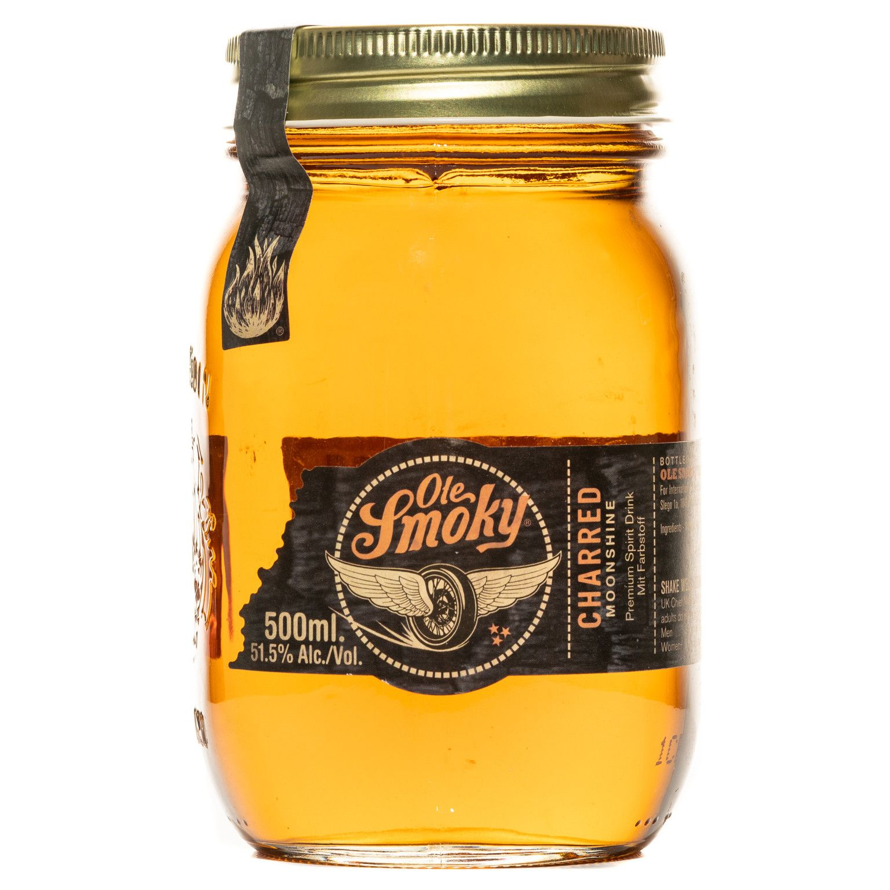

# Ole Smoky-Style Moonshine

*Un-aged corn whiskey: the same wash and distillation as bourbon, bottled straight off the still without a barrel. The Appalachian original, now legally produced in Tennessee by Ole Smoky and Sugarlands.*

**Read first:** [Whisky (the umbrella)](whisky.md), [Bourbon](bourbon.md), [Safety](safety.md)

## Overview

"Moonshine" is a style, not a process. The word refers historically to illicit corn liquor made under cover of darkness ("by the light of the moon") in the Appalachian backwoods of Tennessee, North Carolina, Virginia and Kentucky. The Scotch-Irish settlers who came down the Great Wagon Road in the 1700s brought distilling tradition with them; the high-corn agriculture of the Appalachian South gave them a grain to distil; Prohibition (1920-1933) drove the entire tradition underground.

In the 2010s, **Ole Smoky** (Gatlinburg, TN, opened 2010) and **Sugarlands** (Gatlinburg, TN, opened 2014) led a commercial revival. Both produce legally-licensed corn whiskey, sold in clear mason-jar bottles, marketed as "moonshine", even though it's now legal. The traditional dialect convention is to call any clear, un-aged, high-corn American whiskey "moonshine"; barrelled bourbon is what you make if you have the patience to wait.

The recipe below produces what Ole Smoky's "White Lightnin'" bottling tastes like, a clean, sweet, corn-forward un-aged whiskey at 50% ABV.

## What makes it moonshine (not bourbon)

The federal definition of bourbon requires aging in new charred oak. Moonshine skips the barrel entirely:

| | Bourbon | Moonshine |
|---|---|---|
| Mash bill | ≥51% corn | Often 80-100% corn |
| Distilled to | ≤80% ABV | Same |
| Storage proof | ≤62.5% ABV before barrel | N/A (not barrelled) |
| Aging | Required, new charred oak | None |
| Colour | Amber (from oak) | Clear ("white lightning") |
| Bottling proof | ≥40% ABV | Typically 40-60% ABV |
| Federal designation | "Bourbon" | "Corn whiskey" or "Distilled spirits specialty" |

Federally, what you're making is "corn whiskey" (defined by 27 CFR § 5.143 as a whiskey of at least 80% corn distilled to ≤80% ABV). The "moonshine" label is marketing, though after Ole Smoky's success, it is widely understood and accepted.

## Recipe (5-gallon wash, high-corn mash bill)

### Ingredients
- 6 kg cracked corn (yellow dent corn; the higher the corn percentage, the more characteristic moonshine flavour)
- 500 g crushed malted barley (just enough for enzymatic conversion)
- 18 litres water
- 25 g distiller's yeast
- 1 tsp yeast nutrient

The mash bill is approximately 92% corn / 8% malted barley. This is more corn-forward than bourbon (which typically maxes out at 80% corn before becoming "corn whiskey" legally).

### Method

**Mash:**
1. Heat 12 litres of water to 75 °C.
2. Add the cracked corn slowly, stirring continuously. The mash will thicken; keep stirring to prevent scorching.
3. Hold at 75 °C for 30 minutes (longer than bourbon, the higher corn content needs more time to gelatinise).
4. Cool to 67 °C with 4 litres cool water.
5. Add the malted barley. Stir.
6. Hold at 65 °C for 90 minutes. Iodine test for conversion.
7. Cool to 26 °C.

**Ferment:**
1. Add yeast and nutrient. Cover with airlock.
2. Ferment 5-7 days at 25-30 °C.
3. Expected wash ABV: 8-10%.

**Distil:**

Single distillation. Apply the standard cuts:

1. Strain wash. Charge still to 80%.
2. Heat slowly. Discard foreshots (250 ml for a 5-gallon batch).
3. Discard heads (250 ml).
4. **Collect hearts** at 70-80% ABV. The hearts are 1-1.5 litres of clean, sweet, corn-forward spirit.
5. Cut when parrot reads below 50%.

**Cut to bottling strength:**

Unlike bourbon, no barrel cut required (no barrel). The hearts come off at about 75% ABV; cut directly to the desired bottling strength:

- **Traditional moonshine strength: 50% ABV (100 proof).** This is "White Lightnin'" territory.
- **Stronger: 60-70% ABV.** "Mountain dew" or "white whiskey" at higher proofs.
- **Lower: 40-45% ABV.** Closer to drinkable cocktail strength.

Cut with distilled or RO water; rest 1 week before bottling.

**Bottle:**

Clear mason jars are traditional and visually correct. A 750-ml mason jar with a screw lid is the standard family-scale presentation. Label with proof and date.

No aging step. Moonshine is meant to be drunk young; the bright corn character is what makes it.

## What it tastes like

A well-made un-aged corn whiskey at 50% ABV:

- **Nose:** sweet corn, faint vanilla (from the corn itself, not from oak), a clean ethanol warmth
- **Palate:** soft sweetness up front (more than you expect from a clear spirit), the corn character recognisable, no oak, no tannin
- **Finish:** a clean warm fade with a tiny hint of grain bread

A bad moonshine: harsh, solvent-edged (foreshots not cut properly), or oily (tails not cut early enough). Both fixable in the next batch by sharpening the cuts.

## Variations

- **Higher corn percentage:** 100% corn moonshine is possible with added exogenous enzymes (alpha-amylase and glucoamylase). The flavour is even sweeter and cornier; the technical difficulty is higher.
- **Sour mash moonshine:** add 1-2 litres of the previous batch's spent grain (sourmash) to the new mash. Improves consistency between batches and adds a faintly sour, fermented note.
- **Toasted-corn moonshine:** toast the corn lightly in a dry pan or oven (180 °C for 10 minutes) before mashing. Adds a faint caramel undernote.
- **High-proof White Lightnin':** cut to 60-65% ABV instead of 50%. The Tennessee traditional strength; more aggressive but more characteristic.

## Why moonshine has a place in the canon

Moonshine matters because it is the clearest example of what American whisky tastes like before the barrel changes everything. A taste of un-aged corn whiskey side by side with a 6-year bourbon shows you exactly what 6 years in new charred oak contributes, and conversely, what the spirit itself contributes before the barrel.

For a family operation, making moonshine is also the fastest way to test the still and the wash recipe. No 6-month aging wait; you can taste the result the same day. Once you can make clean moonshine, bourbon is just the same spirit with patience added.

## Notes

- **Storage:** Moonshine in a sealed glass jar is stable indefinitely. The clear "white" colour stays clear because there is no contact with wood.
- **Tradition:** The mason jar is part of the cultural package. Use them. Bottling moonshine in a wine bottle is technically fine but visually wrong.
- **The flavoured varieties** ([flavoured moonshine](flavoured-moonshine.md)) all start with this base spirit. Get clean moonshine working first; then move to the Apple Pie, Peach and Blackberry versions.

## See also
- [Bourbon](bourbon.md): moonshine + new charred oak + 2-4 years = bourbon
- [Tennessee whiskey](tennessee-whiskey.md): moonshine + Lincoln County Process + barrel
- [Flavoured moonshine](flavoured-moonshine.md): Apple Pie, Peach, Blackberry, Strawberry, Cherry varieties and Hunch Punch
