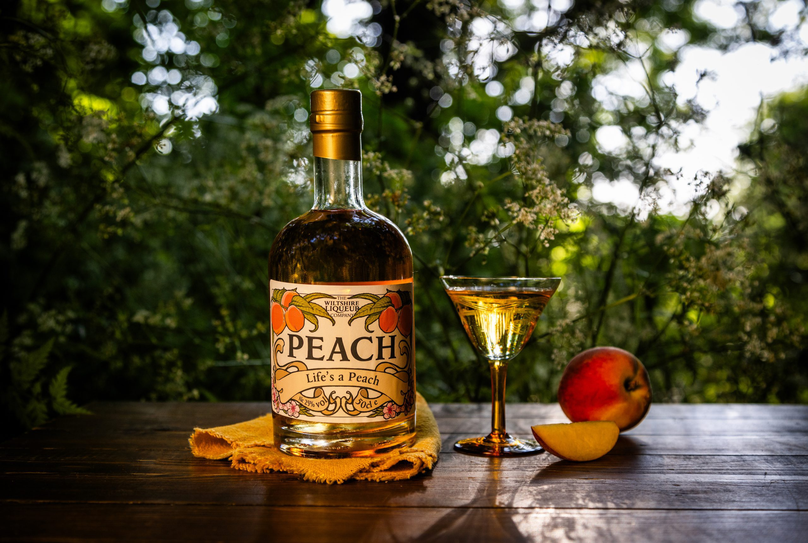

# Peach Brandy

*The Southern fruit brandy: ripe peaches fermented and distilled into a clear, fragrant spirit. Pre-Prohibition Tennessee, the Carolinas and Georgia ran serious peach-brandy industries; the modern craft revival is bringing it back.*

**Read first:** [Whisky (the umbrella)](whisky.md), [Safety](safety.md) (especially the methanol section)

## Overview

Peach brandy is a fruit brandy: spirit distilled from fermented peaches rather than fermented grain. Before Prohibition, the American South had a thriving peach brandy industry centred on the orchard regions of South Carolina, Georgia, and Tennessee. The Civil War, then Prohibition, then post-Prohibition's bourbon-dominated marketing flattened most of it. Laird's (the New Jersey applejack folks) still make a peach brandy as does a handful of craft distilleries in Georgia and South Carolina; outside that, peach brandy is mostly a family-tradition spirit.

The technique is closer to applejack than to whisky:
1. Mash and ferment ripe peaches into a "peach wash" (about 6-8% ABV)
2. Distil once on a pot still, applying the cuts technique
3. Optionally age in oak

The result is a clear, intensely peach-perfumed spirit at around 50-60% ABV. Drunk neat after a meal, used in cocktails, or, at lower proof, taken straight in a cordial style.

**Methanol warning specifically for peach brandy:**

Fruit washes, including peach, produce 5-10x more methanol than grain washes due to the high pectin in fruit. Apply the AGGRESSIVE foreshots cut: **100 ml per gallon of wash**, not the 50 ml used for grain. For a 5-gallon peach wash, discard the first 500 ml. See the [safety page](safety.md) for the full methanol section.

## Ingredients (5-gallon wash)

The yield is the variable. Expect about 1 litre of finished spirit from 5 gallons of peach wash, depending on the sugar content of the peaches and the cuts.

- **6-7 kg ripe peaches** (about 30-40 medium peaches; stones removed)
- 2 kg cane sugar (peaches are sweet but not sweet enough; the added sugar drives ABV to fermentation-friendly levels)
- 15 litres water
- 25 g distiller's yeast (Lalvin 71B or any fruit wine yeast, bread yeast works in a pinch but gives lower-quality results)
- 5 g yeast nutrient (DAP)
- 1 tsp pectic enzyme (optional but recommended, breaks down pectin, which both increases yield and reduces methanol)

## Method

### Stage 1 - Prepare the peaches
1. **Pit the peaches.** Cut around the stone, twist, discard the stones. Keep some skins on (they hold colour and a small amount of flavour), but tear them to release juice.
   
   **A note on stones**: peach stones contain trace amounts of amygdalin, which breaks down to cyanide. Distillers historically removed stones to avoid this, but a few traditions (some Slavic plum brandies, the Italian "nocino" tradition) deliberately include some stones for a faint marzipan note. For peach brandy, REMOVE all stones, the amount of amygdalin is small but unnecessary, and the cuts technique already strips most flavour compounds.

2. **Roughly chop or pulp** the peaches. A potato masher or a quick run through a food processor works. You want a chunky pulp, not a smooth purée.

### Stage 2 - Make the wash
1. Heat 5 litres of water to 50 °C in a large stockpot. Stir in the sugar until dissolved.
2. Add the chopped peaches and the pectic enzyme. Stir.
3. Top up to 15 litres total with cool water.
4. Cool the mixture to 24 °C.
5. Add the yeast and yeast nutrient. Stir gently.
6. Transfer to a fermentation vessel. Cover with an airlock.

### Stage 3 - Ferment
1. Ferment 7-12 days at 18-22 °C (peach yeast works best at slightly cooler temperatures than grain yeast).
2. Bubbles should be vigorous in the first 3 days, slowing toward the end of week one.
3. Stir the wash every 2 days for the first 4 days, the peach pulp will float on top; pushing it back down helps fermentation.
4. Fermentation is complete when bubbling stops and a specific gravity reading is stable around 0.990-1.000.
5. Expected wash ABV: 6-8%.

### Stage 4 - Strain
1. Strain the wash through cheesecloth or a wide-mesh strainer into the still boiler. The strained peach pulp can be composted.
2. The pulp retains some alcohol, squeezing it firmly recovers a litre or so of additional wash. Worth doing.
3. Total wash should be about 13 litres at this point.

### Stage 5 - Distil
This is a single distillation. Apply the cuts technique from [safety.md](safety.md), with the FRUIT-WASH foreshots cut (100 ml per gallon):

1. **Charge the still.** Pour the strained wash into the boiler. Fill to 80% capacity.
2. **Heat slowly.** The wash will start vaporising around 78 °C.
3. **Discard foreshots**: 500 ml for a 5-gallon wash. DO NOT TASTE.
4. **Discard heads**: another 100-200 ml. Smell test: heads will smell of acetone and harsh peach-ester; hearts will smell of clean peach.
5. **Collect hearts**: typically 70-80% ABV at the parrot early in the run, dropping toward 60-65% mid-run. The hearts are 1-1.5 litres of brilliant clear spirit. The smell when fresh is unmistakable, fresh peach, with a clean spirit warmth behind it.
6. **Stop when parrot reads below 50% ABV.** Late tails picks up oily, vegetal notes that don't belong in peach brandy.

### Stage 6 - Cut and either bottle or barrel

**For un-aged peach brandy (clear, immediate):**
- Cut the hearts to 45-50% ABV with distilled water (peach is bright; lower than 45% loses character, higher than 55% is harsh).
- Let rest 1 week before bottling. The water-spirit marriage takes time.
- Bottle in clean glass.

**For aged peach brandy (amber, traditional Southern style):**
- Cut to 55-60% ABV before barrelling (lower than whisky's 62.5% rule, peach is delicate and over-extracts oak fast).
- Age in a 5-gallon American oak barrel ([see aging-small-barrels](aging-small-barrels.md)). Char #2 or #3, peach doesn't need the aggressive #4 alligator char that bourbon does.
- Age 3-6 months in a small barrel. Taste at month 2; bottle when balanced (the oak should support the peach, not dominate it).
- Cut to 40-45% ABV when bottling.

## What it tastes like

A well-made peach brandy:

- **Nose** (un-aged): intensely peach. Stone fruit, faint almond, a clean alcohol warmth.
- **Nose** (aged): peach plus vanilla, soft oak, a hint of caramel.
- **Palate** (un-aged): sweet up front from concentrated peach sugar, a clean alcohol middle, a long peach-stone finish.
- **Palate** (aged): more rounded, the oak adding structure; peach is still the headline but the spirit feels more "finished."

A bad peach brandy: harsh (foreshots not cut properly), or vegetal-bitter (tails came across), or thin and flavourless (under-fermented wash). All fixable on the next batch.

## Variations

- **Peach pie brandy**: add 2 cinnamon sticks, 4 cloves and a vanilla pod to the still during distillation (in a muslin bag in the boiler). Pie-spice notes come through in the hearts.
- **Peach-and-honey brandy**: replace half the sugar with honey in the wash. Slower fermentation but a richer finish.
- **Brandy de orelhão** (Madeiran style): age the brandy with peach stones (raw, NOT broken) for a faint marzipan undernote. Use whole stones only; broken stones release more amygdalin.
- **Lower-proof cordial**: cut to 30% ABV instead of 40-45%, add a small amount of sugar syrup (1-2 tbsp per 750 ml). A pre-dinner sipper.

## Cocktails

- **Peach Smash**: 50 ml peach brandy, 15 ml lemon juice, 1 tsp sugar, mint leaves muddled, soda water topped up.
- **Brandy Manhattan**: 60 ml peach brandy, 20 ml sweet vermouth, 2 dashes Angostura, cherry.
- **Peach Old Fashioned**: 50 ml peach brandy, sugar cube, 2 dashes peach bitters (or Angostura), orange peel.
- **Bellini variant**: 50 ml peach brandy, 100 ml prosecco. Stronger than a regular Bellini but cleanly peach-forward.

## Storage

- Un-aged peach brandy: indefinite in glass.
- Aged peach brandy: continues to develop slowly in glass for a year or two, then plateaus.
- Refrigeration unnecessary; cool dark cupboard is fine.

## See also
- [Applejack](applejack.md): the apple counterpart, similar technique
- [Whisky (the umbrella)](whisky.md): the base distillation process
- [Aging in small barrels](aging-small-barrels.md): for the aged version
