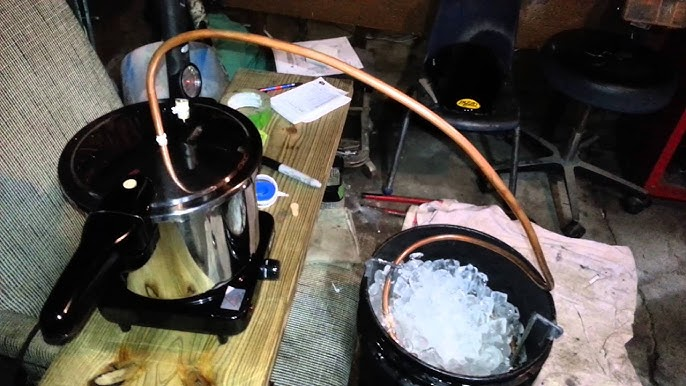

# Safety

*The most important page in this course. Distilling is fundamentally heating a flammable liquid and concentrating it; every accident a home distiller can have comes down to either fire, explosion or methanol contamination. All three are preventable.*

**Read before:** Lighting a heat source under a still for the first time

**Read again:** Every time you bring a new person into the still room

## Overview

Three things can hurt you when you distil. Knowing which, and how each happens, is the whole of safety.

1. **Methanol poisoning** - the foreshots, the first liquid that comes off a still run, contain a concentration of methanol that can cause blindness and death. The cuts technique below tells you exactly what to discard.
2. **Fire** - ethanol vapour is highly flammable. A leak from a poorly sealed joint, near an open flame, is the most common cause of home-still fires.
3. **Explosion** - if the still pressurises (a blocked vapour path, a stuck valve), it can fail catastrophically. Proper venting and an unobstructed vapour route are non-negotiable.

This page covers all three in order, plus the supporting safety practices (ventilation, sanitation, fermentation safety, hydrometer use, ABV math).

## 1. The cuts: foreshots, heads, hearts, tails

This is the single most important technique on the entire course. Get it wrong and people get hurt; get it right and the rest of distillation is broadly forgiving.

When you distil a fermented wash, the vapour that boils off does NOT come over evenly. Different compounds have different boiling points, and they come off in a predictable order:

| Stage | Boils at | Contains | Action |
|---|---|---|---|
| **Foreshots** | about 56 °C / 133 °F | Methanol, acetone, methyl acetate | **DISCARD ALL** |
| **Heads** | about 78 °C / 172 °F | Lighter ethanol, some acetone and aldehydes | Discard or save for redistilling |
| **Hearts** | about 78-82 °C / 172-180 °F | Clean ethanol | **KEEP** - this is your spirit |
| **Tails** | about 82-95 °C / 180-203 °F | Heavier alcohols (fusel oils), water | Discard or save for redistilling |

**The foreshots cut is non-negotiable.** A 5-gallon wash will produce roughly 50-100 ml of foreshots. Throw it away. Do not taste it, do not save it, do not put it back into the next batch. Methanol is metabolised by the body into formic acid, which destroys the optic nerve and can cause death at quantities as small as 30 ml. This is not a hypothetical risk.

**Practical rule:** discard the first 50 ml per gallon of wash distilled, no matter what the parrot hydrometer says or how clean it looks. A 5-gallon wash = throw away the first 250 ml. A 10-gallon wash = throw away the first 500 ml. Be generous; the cost of throwing away too much is small, the cost of keeping too little is permanent.

**How to identify the cuts in practice:**

- **Foreshots smell wrong.** Solvent-sharp, like nail polish remover or a paint can. The smell is the first warning. If it smells like that, it goes in the discard bottle.
- **Heads smell hot and grassy.** Less aggressive than foreshots but still noticeably "off". The transition from heads to hearts is the most subtle cut; the safe approach is to err on the side of discarding more heads, especially on early runs.
- **Hearts smell like clean spirit.** Sweet, neutral, with a mild ethanol warmth and no solvent edge. This is what you keep.
- **Tails smell wet and oily.** As the run progresses, the ABV drops and the spirit picks up heavier compounds. When the parrot hydrometer reads below 40% ABV (80 proof), you are firmly in tails territory.

**Mark your collection jars.** A common practice: 250 ml jars, numbered, in order. The first jar is foreshots (discard). The next few are heads (discard or save for redistilling). The middle 60-70% of your run is hearts. The last few are tails (discard or save).

**Smell, taste with caution, and write down what you find.** Distilling is a skill that improves with practice; recording the smell and ABV at each jar across the run builds your judgment. A glass with a small drop diluted in water is the safe way to taste.

## 2. Fire safety

Ethanol vapour ignites at concentrations as low as 3.3% in air. A still that leaks vapour near an open flame is a fire waiting to happen.

**Non-negotiable practices:**

- **No open flame within 3 metres (10 feet) of the still.** This includes pilot lights on adjacent heaters, candles, cigarettes, gas hot-water heaters in the same room.
- **The still is OUTDOORS or in a dedicated well-ventilated workshop** with cross-ventilation that pulls air across the still and out. A garage door open at one end and a fan at the other is the minimum.
- **All joints sealed before each run.** PTFE tape or flour-and-water paste on threaded joints. A drop of leaking vapour is invisible; the only sign is a faint smell or a sudden flash.
- **A 5kg dry-powder or CO2 fire extinguisher within reach** at all times. A bucket of water is not sufficient - alcohol fires burn on top of water.
- **Never leave a running still unattended.** Not for five minutes, not for a phone call. The whole run takes 4-6 hours; that is the time commitment.
- **Cool the still before opening it.** Boiling-hot copper or stainless on bare skin is a hospital trip.
- **No alcohol-soaked rags near the still.** No sponges, no spillage left to evaporate. Wipe and dispose.

**If a fire starts:**
1. Cut the heat source first (turn off the propane, kill the breaker).
2. Use the extinguisher only if the fire is contained. A fire involving the still itself, especially if the still is pressurised, is a call-911-and-evacuate situation.
3. Do not move a burning still. Do not pour water on it.

## 3. Explosion: pressure safety

A still operates at slightly above atmospheric pressure. If the vapour path becomes blocked - a kinked condenser line, a stuck valve, a frozen output - pressure builds and the weakest part of the still fails.

**Practices:**

- **One unblocked vapour path at all times.** From the still pot, through the column (if any), through the condenser, into the parrot. No valves on the vapour path that could be accidentally closed.
- **A blow-off / safety vent** at the highest point in the system. Some commercial pot-still kits have these built in; if yours doesn't, add one. The vent is a short open tube that releases pressure if the main vapour path blocks. Some operations use a pressure-relief valve set at low PSI.
- **Inspect every joint before every run.** A loose joint is also a leak; a tight joint is also a potential blockage if a gasket extrudes inward.
- **Visual flow.** A parrot with a sight glass lets you watch the spirit coming off. If it stops while heat is still on, something is blocked. Cut heat immediately and let everything cool before investigating.

## 4. Sanitation and fermentation safety

The wash (your fermented mash before distilling) is also where things can go wrong, though less dramatically than the still itself.

- **Wild yeast and bacteria can spoil a wash.** A spoiled wash tastes vinegar-sharp or rotten and should not be distilled - the off compounds carry over into your spirit. If the wash smells wrong, dump it and start again.
- **Hydrogen sulphide ("rotten egg") in a wash** indicates stressed yeast - usually a temperature issue or a lack of nutrients. Add yeast nutrient at the start of fermentation; control temperature.
- **Glass carboys can explode** during active fermentation if the airlock blocks. Use food-grade plastic fermenters (HDPE or polypropylene) for primary fermentation. Reserve glass for secondary, when CO2 production has dropped.
- **Sanitise everything.** A no-rinse sanitiser like Star San is the brewer's standard. Bottles, fermenters, hydrometers, anything that touches the wash.

## 5. ABV math and the hydrometer

A spirit hydrometer measures the alcohol content of your distillate. You will use it constantly.

**How it works:** The hydrometer is a glass float weighted to sink to a particular depth in pure water. The more alcohol in the liquid, the less dense it is, so the hydrometer floats higher. The scale on the side reads % ABV directly.

**Practical rules:**

- **Always read at 20 °C (68 °F).** The reading is temperature-dependent; a warm sample reads artificially high. Either let the sample cool, or use a correction chart.
- **Read at eye level, where the surface meets the scale.** The meniscus curves; the standard convention is the bottom of the meniscus.
- **The parrot keeps the hydrometer floating continuously** during the run. Read it every 5-10 minutes; the ABV will start very high (75-90%), gradually drop through the heart of the run, and tail off into the tails.
- **A separate "proofing" hydrometer** is used for diluting finished spirit. A new whiskey comes off the still at about 70% ABV; to bottle at 40% (the standard for most American whiskies) you add water until the proofing hydrometer reads 40.

**ABV math:** Ethanol is 0.789 g/ml, water is 1.000 g/ml. If you cut a 70% ABV spirit to 40% ABV, you add (70/40 - 1) = 0.75 parts water by volume. A 500 ml jar of 70% ABV spirit needs 375 ml of water to bring it to 40%.

## 6. Methanol: the longer story

Methanol (wood alcohol) is the killer. Some background helps you make the foreshots cut confidently.

Methanol is naturally produced during fermentation, in small amounts. It boils at 64.7 °C, which is lower than ethanol's 78.4 °C. So when you heat a fermented wash, methanol comes off FIRST, before the ethanol. This is why the foreshots - the first liquid coming over - concentrates methanol disproportionately.

**Fruit washes have more methanol than grain washes.** Apple, plum, grape and other fruit-based washes naturally contain higher pectin levels; pectin breaks down during fermentation to produce methanol. An apple-brandy wash can have 5-10 times the methanol of a grain wash. For applejack and fruit brandies, the foreshots cut should be MORE aggressive: 100 ml per gallon of wash, minimum.

**Methanol is colourless, odourless to taste, and has the same alcoholic effect on the body as ethanol** - which is the trap. You cannot tell from a glass of spirit whether it contains methanol or not. You can only tell by knowing where in the run it was collected and trusting your cuts.

**Real-world toxic dose:** 10 ml can cause permanent blindness; 30 ml can be fatal. A 5-gallon wash that produces 100 ml of foreshots may contain 10-15 ml of methanol. If you accidentally drank the foreshots jar, that is the toxic dose.

**The rule, plainly:** Throw away the first 50 ml per gallon of wash. Always. No exceptions for "this batch seemed cleaner" or "the parrot already reads above 80%". Volume is the cue, not appearance.

## 7. A pre-run checklist

Use this on the morning of every distillation. Print it; tape it to the still room wall.

- [ ] Workshop ventilated (door open, fan running)
- [ ] Fire extinguisher in reach
- [ ] No open flames within 3 m
- [ ] All still joints sealed and inspected
- [ ] Blow-off vent clear
- [ ] Condenser cooling water flowing
- [ ] Thermometer probe functional
- [ ] Parrot hydrometer in place and reading clean water at 0%
- [ ] Foreshots discard bottle ready and labelled
- [ ] Numbered collection jars ready
- [ ] Phone charged, within reach
- [ ] Someone else in the building knows you are running

## 8. When something goes wrong

- **Smell of solvent in the still room when you didn't expect it:** A vapour leak. Cut heat, cool the still, find and seal.
- **Spirit coming off slowly or not at all while heat is on:** Possible blockage. Cut heat IMMEDIATELY and let pressure dissipate.
- **A jar that smells strongly of nail polish remover halfway through the run:** Unusual. May indicate contamination of the wash. Stop, evaluate, possibly discard the entire run.
- **Burning smell from the still itself, not the heat source:** Wash is scorched (you boiled the bottom dry, or the heat is too high). Cut heat, let cool, clean the still thoroughly. Distillate up to that point may be acceptable but tastes burnt; later cuts will be unusable.
- **You feel dizzy or nauseous in the still room:** Ventilation insufficient. Get outside immediately. Alcohol vapour at high concentration is intoxicating before it is dangerous, but the trend goes only one way.

## Storage

The course is not a one-time read. Most experienced distillers re-read their safety notes at the start of every season. The cost of being wrong is too high to rely on memory alone.
