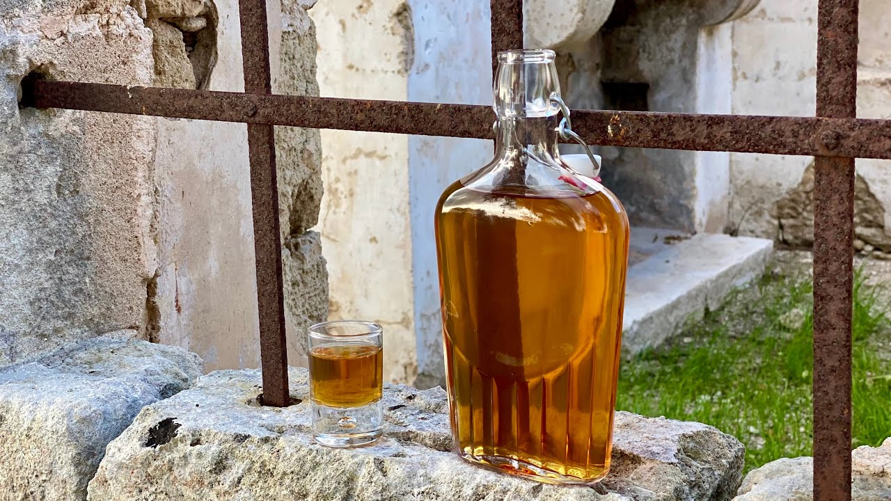

# Tennessee Whiskey

*Bourbon plus one extra step: the Lincoln County Process. The new spirit is dripped through sugar-maple charcoal before barrelling, which strips harsh compounds and adds a soft, sweet, characteristically Tennessee mellowness.*

**Read first:** [Whisky (the umbrella)](whisky.md), [Bourbon](bourbon.md)

## Overview

Tennessee whiskey is, by federal law, a kind of bourbon. The mash bill (≥51% corn), the distillation strength (≤80% ABV), the barrel (new charred American oak), the no-additives rule, all bourbon requirements apply to Tennessee whiskey too.

What makes it specifically "Tennessee whiskey" is **Tennessee state law (T.C.A. § 57-2-106), passed in 2013**, which mandates:

1. Manufactured in Tennessee
2. Meets all federal bourbon requirements
3. Filtered through maple charcoal **prior to aging** (the Lincoln County Process)

The Lincoln County Process, named after Lincoln County, Tennessee, where the technique originated in the 1820s - is the structural difference. After distillation but before barrelling, the new-make spirit is dripped slowly through a 3-metre column of charred sugar maple charcoal. This takes 3-5 days and softens the spirit significantly.

Two Tennessee distilleries make whiskey at industrial scale: **Jack Daniel's** (Lynchburg) and **George Dickel** (Tullahoma). Both use the Lincoln County Process; they apply it at different points (Jack Daniel's before barrelling per the state law; George Dickel chills the spirit before charcoal filtering, an older technique called "Tennessee mellowing"). For a family operation, follow Jack Daniel's practice, it matches the state law and is simpler.

## What the charcoal does

Maple charcoal is highly porous (a single gram has the surface area of a tennis court). When new-make spirit drips through it:

- **Heavier alcohols (fusel oils) adsorb to the charcoal**: they bind to the porous surface and stay there. The result is a cleaner spirit with less harsh-warmth.
- **Sulphur compounds adsorb similarly**: improving the aroma.
- **Some lighter aromatic compounds also adsorb**: meaning Tennessee whiskey, post-Lincoln County, has a less assertive grain character than straight bourbon. Some prefer this; others prefer the punchier bourbon original.
- **The maple lends a faint sweetness** to the spirit, not strongly, but noticeably.

The net effect: a softer, sweeter, more drinkable whiskey straight out of the barrel.

## Recipe (5-gallon wash, Jack Daniel's mash bill approximated)

### Mash bill
- 80% corn / 12% malted barley / 8% rye

### Ingredients
- 5600 g cracked corn
- 850 g crushed malted barley
- 550 g cracked rye
- 18 litres water
- 25 g distiller's yeast

### Method (mash, ferment, distil)

The mash, ferment and distil stages are identical to [bourbon](bourbon.md): high-corn mash bill, 90-minute conversion, 5-7 day fermentation, single pot-still distillation with foreshots/heads/hearts/tails cuts.

The hearts come off the still at about 70-75% ABV.

### The Lincoln County Process

This is the step that turns the whiskey into Tennessee whiskey.

#### Materials
- 5-10 kg of charred sugar maple (or American maple) chunks, food-grade (sourced from a specialist supplier; some commercial Tennessee distilleries make their own by burning maple ricks in their courtyard once a year)
- A clean tall column or barrel (a 30-litre food-grade plastic drum with the bottom drilled for slow drip works fine for family scale)
- A clean collection vessel below

#### Method
1. **Build the charcoal column.** Fill the column with maple charcoal to a depth of at least 2 metres. The longer the column, the more contact time, the cleaner the result. Jack Daniel's uses a 3-metre column.
2. **Pre-wet the column.** Pour 1 litre of distilled water through to settle the charcoal and remove any loose dust. Discard this water.
3. **Drip the new-make spirit through the column.** Slowly, a trickle, not a stream. Aim for the spirit to take 3-5 days to pass through. Adjust the drip valve at the bottom.
4. **Collect at the bottom** in a clean vessel. The spirit should emerge slightly less amber (the charcoal removes some colour compounds) and noticeably smoother on the nose.
5. **Cut to 62.5% ABV** for barrelling (same as bourbon).

The charcoal is single-use; once it has filtered a batch, the pores are saturated. Spent charcoal can be added to compost or burned.

### Age

In new charred American oak. 6-12 months in a 5-gallon barrel for a family-scale Tennessee whiskey.

### Bottle

Cut to 40-45% ABV. Bottle. Rest 1 week before drinking.

## What Tennessee whiskey tastes like (compared to bourbon)

A side-by-side tasting of the same whiskey, half put through the Lincoln County Process and half not, shows the difference clearly:

**Without charcoal mellowing (straight bourbon):**
- More aggressive grain character
- Sharper alcohol burn
- More pepper and oak grip
- A "longer" finish

**With charcoal mellowing (Tennessee whiskey):**
- Softer entry
- Sweeter mid-palate (the maple sugar effect)
- Less burn, more roundness
- A shorter, more dessert-like finish

Neither is better; they are different styles for different occasions.

## Variations

- **George Dickel-style chill-filtering:** chill the spirit to near-freezing before dripping through the charcoal. Slower drip, more aggressive filtering. Produces an even softer whiskey.
- **Hickory charcoal substitute:** if maple is unavailable, hickory charcoal works (and gives a slightly smokier note). Not technically Tennessee whiskey by the state law, but the same idea.
- **Lincoln County maple peats:** a small handful of charred maple wood chips added to the barrel during aging gives an extra layer of Tennessee character. A modern craft variation.

## Common mistakes

- **Skipping the charcoal step and calling it Tennessee whiskey.** Without the Lincoln County Process, you have made bourbon. Both are good; only the latter is legally Tennessee whiskey.
- **Using briquettes or BBQ charcoal.** These have binders, ash and lighter fluid. Food-grade hardwood charcoal only.
- **Letting the spirit pool above the charcoal.** The point is slow drip-through contact. If a litre of spirit sits on top of the charcoal for an hour without dripping, the column is clogged; investigate and unclog.
- **Using the spirit straight from charcoal without aging.** The charcoal removes some volatile notes; barrel aging adds back depth and complexity. Both are necessary.

## Notes
- **Jack Daniel's mash bill is roughly 80% corn / 12% barley / 8% rye.** George Dickel's is slightly different (80/8/12). Both are publicly disclosed.
- **The 2013 state law** was passed to defend Tennessee whiskey as a distinct designation. Before then, several non-Tennessee distillers used "Tennessee whiskey" loosely. The law fixed the definition.
- **"Sour mash"** is a fermentation technique used by both Jack Daniel's and George Dickel, where some of the previous batch's spent mash is added to the new mash to ensure consistent acidity and yeast performance. It is NOT a federal or state requirement of Tennessee whiskey, just a tradition. Adopt if you want a more consistent house style across batches.

## Cocktails

Anything that works with bourbon works with Tennessee whiskey, often more softly because of the charcoal mellowing:

- **[Old Fashioned](../../drinks/cocktails/old-fashioned.md):** rounder than the bourbon version, the Lincoln County Process taking the rougher edges off.
- **[Manhattan](../../drinks/cocktails/manhattan.md):** sweeter and gentler than with rye.
- **[Whisky Sour](../../drinks/cocktails/whisky-sour.md):** the Tennessee whiskey's softer character is a good match for the citric sharpness.
- **Lynchburg Lemonade:** the unofficial Jack Daniel's cocktail. 50 ml Tennessee whiskey, 50 ml triple sec, 50 ml lemon juice, topped with lemonade and a slice of lemon. Served in a tall glass over ice.

## See also
- [Bourbon](bourbon.md): the base whiskey before the Lincoln County step
- [Whisky (the umbrella)](whisky.md)
- [Ole Smoky moonshine](ole-smoky-moonshine.md): what Tennessee whiskey would be if you skipped the barrel
