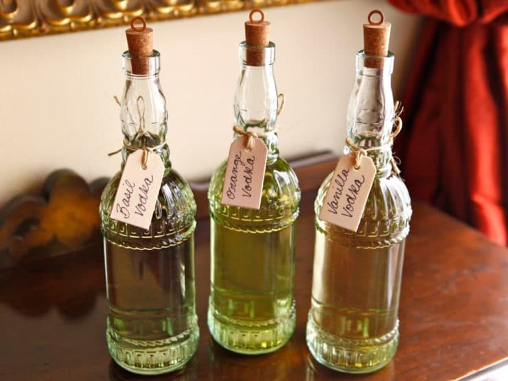

# Vodka

*Neutral spirit, repeatedly distilled and filtered until almost nothing remains but ethanol and water. The clean-canvas base for cocktails and infusions.*

**Read first:** [Whisky (the umbrella)](whisky.md), [Safety](safety.md)

## Overview

Vodka, by U.S. federal regulation (27 CFR § 5.143), is **"neutral spirits so distilled, or so treated after distillation with charcoal or other materials, as to be without distinctive character, aroma, taste, or color."**

In plain language: distil something to high proof, filter it through activated charcoal to remove any remaining flavour, dilute to bottling strength. The "neutral spirit" part has a specific threshold, distilled to at least 95% ABV (190 proof). That high proof is what strips out the grain, fruit, potato or whatever started the wash; once distilled to 95%, vodka from wheat tastes nearly identical to vodka from potato.

On a pot still you cannot reliably reach 95% ABV in a single run. Vodka requires either:

1. **Multiple distillation runs** (3-5 typical) on a pot still, with each run starting from the hearts of the previous, OR
2. **A reflux column** added to the pot still, which creates internal redistillation by allowing the heavier vapours to condense and fall back

For a family operation, the multiple-pot-still-runs approach is the simplest. Reflux columns work but add equipment complexity and reduce the still's flexibility for whisky.

## What goes in

Vodka can be made from anything fermentable. Common bases:

| Base | Character (before high-proof distillation) | Yield |
|---|---|---|
| **Grain (corn, wheat, rye)** | Cleanest neutral; the US/Russian standard | Highest |
| **Potato** | Slightly oilier, fuller-bodied | Medium |
| **Beet sugar / molasses** | Cheap, fast; slightly sweet finish | Highest |
| **Grape (wine)** | Distinctive but fades with multiple distillations | Lowest |

For a Tennessee family operation, a grain-based vodka makes sense, you're already set up for corn and barley fermentation. The wash recipe below is essentially a "lighter, sugar-only" version of the [whisky](whisky.md) wash, designed for clean spirit rather than flavour retention.

## Recipe (5-gallon wash)

### Ingredients (sugar-and-grain wash for clean vodka base)
- 4 kg cane sugar
- 1 kg cracked corn (for character; pure sugar gives a flat result)
- 500 g crushed malted barley (for enzymes and a hint of character)
- 18 litres water
- 25 g distiller's yeast (high-attenuation type; SafSpirit C-70 or similar)
- 2 g yeast nutrient (DAP, diammonium phosphate)

### Method

**Mash:**
1. Heat 5 litres of water to 75 °C. Dissolve the sugar completely. Stir.
2. Add the cracked corn and malted barley to the sugar-water. Hold at 67 °C for 90 minutes (the malt converts what corn starch you have).
3. Top up to 18 litres total with cool water. Cool to 26 °C.

**Ferment:**
1. Add yeast and nutrient. Cover.
2. Ferment 5-7 days at 25-30 °C. The wash will ferment vigorously, sugar-led washes are fast.
3. Expected wash ABV: 12-14% (higher than whisky because of the added sugar).

**Strip run (first distillation):**
1. Charge the still with the whole wash. The wash is meant to be stripped of alcohol fast in this run, you are not making finished spirit yet.
2. Heat aggressively. Collect everything above about 30% ABV into one large vessel. Discard the first 50 ml per gallon as foreshots, but otherwise be less precise, this run produces a "low wines" of mixed quality, around 40-50% ABV.

**Spirit runs (second through fifth distillation):**
1. Dilute the low wines with clean water back to about 25% ABV (this gives the still enough water to vapourise cleanly).
2. Distil more carefully. Take aggressive foreshots, heads and tails cuts.
3. Save only the hearts, the cleanest middle of the run, ideally above 90% ABV.
4. Repeat. Each successive run further concentrates ethanol and removes residual flavour compounds.
5. By the 3rd or 4th run, the hearts should be 94-96% ABV, neutral spirit territory.

**Charcoal filtering:**
1. Pour the high-proof spirit through a column of activated coconut charcoal (NOT the maple charcoal used for Tennessee whiskey, that has flavour; vodka wants flavourless removal).
2. A 50 cm column of granulated activated charcoal is enough for a few litres.
3. Filter once or twice. More than twice doesn't help.

**Dilute and bottle:**
1. Dilute the high-proof spirit with distilled water to 40% ABV (80 proof): the American vodka standard.
2. Let rest 1 week. The taste integrates.
3. Bottle. No aging.

## What "good vodka" tastes like

The aim is "nothing distinctive." A perfect vodka has:

- **No nose**: no smell beyond a faint clean ethanol warmth
- **No flavour on the palate**: a slight grain or wheat softness on the finish is acceptable; anything more is a flaw
- **No burn**: high-proof vodka burns; properly cut and rested vodka has warmth but no harsh sting
- **A clean, dry finish**: no oiliness, no lingering grain or fruit character

If you taste anything, the vodka needs another distillation or filtering pass.

## Filtered vodka variations

Many premium vodkas have additional filtering processes:

- **Silver / charcoal filtering** (standard): activated charcoal removes most remaining flavour
- **Crystal filtering** (Russian style): the spirit dripped through quartz crystals
- **Birch ash filtering** (Belvedere style): birch-ash chunks for a subtle softness
- **Snow / ice filtering** (Iceberg): freeze to near-freezing temperature, filter through suspended ice; some heavier compounds precipitate

These are largely marketing differences; charcoal is the workhorse.

## Common mistakes

- **Stopping after one or two distillations.** Vodka requires multiple runs. A pot-still vodka after one distillation will be 75-80% ABV with significant grain flavour, that's white whisky, not vodka.
- **Using flavoured charcoal for filtering.** Use coconut activated charcoal or aquarium-grade activated charcoal. Maple, hickory or BBQ charcoals all add flavour.
- **Cutting too quickly with non-filtered tap water.** The chlorine and minerals in tap water muddy the vodka. Use distilled or RO water.
- **Bottling at too high a proof.** Above 50% ABV the vodka feels harsh; below 35% it feels watery. 40% (80 proof) is the international convention.

## Infusing vodka (the family-friendly application)

Vodka's blank-canvas nature makes it the perfect base for infusions. Throw something flavourful into a bottle of finished vodka, wait a few days, strain. The result is a flavoured vodka, many premium "flavoured vodkas" are made this way.

Family-scale infusion timeline:

| Ingredient | Time | Notes |
|---|---|---|
| Citrus zest (orange, lemon, grapefruit) | 2-3 days | Strong fast; don't over-steep |
| Vanilla bean | 2-4 weeks | Split lengthways; the slowest infusion |
| Fresh herbs (basil, mint, rosemary) | 1-2 days | Bruise the leaves first |
| Berries (strawberry, blackberry) | 1 week | Mash slightly before adding |
| Chillies (jalapeño) | 1-2 days | Watch the heat; pull early if it overpowers |
| Coffee beans | 24 hours | Use coarsely cracked beans |

Use about 50-100 g of ingredient per 750 ml of vodka. Steep at room temperature, in a sealed glass jar, shaking daily. Strain through cheesecloth and a fine sieve.

## Cocktails

Vodka's clean canvas makes it the most-used spirit in the modern cocktail bar:

- **[Bloody Mary](../../drinks/cocktails/bloody-mary.md):** the brunch classic. Vodka, tomato juice, lemon, horseradish, hot sauce, celery stalk.
- **[Martini](../../drinks/cocktails/martini.md) (vodka):** the modern vodka martini. Vodka, dry vermouth, olive or lemon twist. Cold as it is possible to serve.
- **[Cosmopolitan](../../drinks/cocktails/cosmopolitan.md):** vodka, triple sec, cranberry, lime. The 1990s favourite.
- **[Espresso Martini](../../drinks/cocktails/espresso-martini.md):** vodka, espresso, coffee liqueur, sugar syrup. The dinner-party closer.
- **[Black Russian](../../drinks/cocktails/black-russian.md) / [White Russian](../../drinks/cocktails/white-russian.md):** vodka and Kahlua, with cream for the white version.
- **[Long Island Iced Tea](../../drinks/cocktails/long-island-iced-tea.md):** vodka alongside gin, rum, tequila, triple sec, lemon and cola. Tastes nothing of vodka but couldn't exist without it.
- **[Sex on the Beach](../../drinks/cocktails/sex-on-the-beach.md):** vodka, peach schnapps, cranberry, orange juice.

## See also
- [Grain alcohol](grain-alcohol.md): the higher-proof cousin (95%+ ABV) used as a base for tinctures and infusions
- [Flavoured moonshine](flavoured-moonshine.md): the rougher-edged version of flavoured vodka
- [Ole Smoky moonshine](ole-smoky-moonshine.md): what an un-aged grain spirit tastes like before the multiple-distillation step
