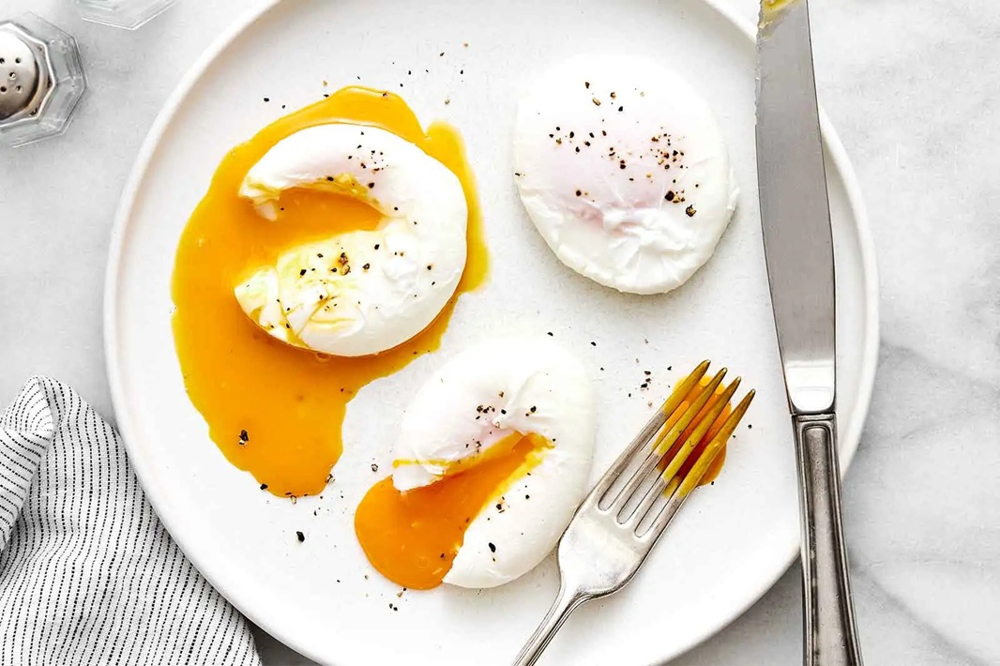

---
allergens:
  - eggs
tags:
  - vegetarian
  - dairy-free
  - gluten-free
  - eggs
mentions:
  - tutorials/eggs/custards
  - tutorials/eggs/scrambled-omelette
  - tutorials/pizza/sauce
---

# Boiled and Poached Eggs

*Two of the simplest things you can do with an egg, and two that home cooks rarely get quite right. The boil is mostly a question of timing. The poach is mostly a question of nerve. We'll cover both, plus the small tricks (vinegar in the water, ice bath afterwards) that make the difference.*

## Overview
Boiled and poached eggs sit at opposite extremes of the simple-egg spectrum, but they share one principle: heat-controlled coagulation. Both rely on hitting a specific protein-set temperature in the egg's interior and stopping at exactly the right moment.

For boiled, the egg cooks inside the shell. Timing is everything; the shell shields you from seeing what's happening inside.

For poached, the egg cooks without the shell. The white sets around the yolk if you handle the water gently; the yolk stays liquid.

Both are easy once you have a clock and a thermometer. Both are infuriating until you do.

## Boiled Eggs

### The Method (Cold-Water Start)

1. Place eggs in a small saucepan. Cover with cold water by 2 cm.
2. Bring to a rolling boil over high heat.
3. The moment the water boils, start a timer.
4. Reduce heat to a gentle simmer (vigorous boil cracks shells).
5. Time as below.
6. Drain. Plunge into iced water for 1 minute to stop the cook and tighten the shell membrane (makes peeling easier).

Cold-water start gives consistent results: the egg heats with the water, so the cook time is independent of egg size and starting temperature.

### Timing Chart (from the boil)

| Time   | Result                                                |
|--------|-------------------------------------------------------|
| 4 min  | White just set, yolk fully liquid (the dippy egg)     |
| 6 min  | White firm, yolk soft and jammy in the middle         |
| 7 min  | White firm, yolk thick but slightly creamy at centre  |
| 8 min  | Yolk fully set, slightly creamy                       |
| 10 min | Hard-boiled, yolk crumbly                             |
| 12 min | Hard-boiled, yolk dry and chalky (overcooked)         |

Times are for room-temperature medium (50 g) eggs. Add 30 seconds for cold-from-fridge; add 30 seconds for large eggs.

### The Method (Boiling-Water Start)

The hot-water start is faster (skip the heating phase) but trickier; the eggs go straight into already-boiling water, which gives you more consistent results once you know your timing, but cracks more shells.

1. Bring a pan of water to a rolling boil.
2. Lower eggs in with a slotted spoon, gently.
3. Start the timer immediately.
4. Time below.

Timing chart (boiling-water start):

| Time   | Result                  |
|--------|--------------------------|
| 6 min  | Soft (jammy yolk)       |
| 7 min  | Medium                  |
| 8 min  | Medium-hard             |
| 9 min  | Hard                    |
| 10 min | Hard, drier             |

### Peeling

Old eggs (1-2 weeks) peel easier than fresh ones. The shell membrane loosens with age.

After the ice bath, tap the egg gently on a hard surface all over to crack the shell. Roll under your palm to crackle. Peel under running cold water; the water gets under the membrane and lifts the shell.

### Soft Boil (Dippy Egg)

The British/Continental breakfast standard. 4-5 minutes from boiling. White just set, yolk fully liquid. Serve in an egg cup; tap the top off; dip toast soldiers.

### Jammy Egg (Onsen, Ramen Egg)

6-7 minutes from boil, then ice bath. The Japanese ramen egg (ajitsuke tamago) takes this further: peel, then marinate in soy sauce, mirin and dashi for several hours. The yolk stays jammy and creamy through the marination.

### Hard Boil

10 minutes max. Past 12 minutes the white turns rubbery and the yolk develops a grey-green ring around its perimeter (iron-sulfur reaction). Both are signs of overcooking.

## Poached Eggs

### The Method

1. Bring a wide saucepan or deep frying pan of water to a slow simmer (small bubbles breaking the surface, not a rolling boil).
2. Add 1 tablespoon white wine vinegar (helps the white coagulate fast).
3. Crack each egg into a separate ramekin (gives you control over delivery; reduces the chance of breaking a yolk).
4. Stir the water gently with a slotted spoon to create a soft whirlpool.
5. Lower the ramekin to the surface; tip the egg in gently. The whirlpool wraps the white around the yolk.
6. Cook 2 minutes 30 seconds for runny yolk; 3 minutes for firm white still with runny centre; 4 minutes for fully cooked.
7. Lift out with the slotted spoon. Touch the egg lightly with a finger; the white should bounce back firm, the yolk should give like a water balloon.
8. Drain on a folded paper towel for 5 seconds.

### Critical Rules for Poaching

1. **Water at a slow simmer.** Not a boil; not still. Hard boiling tears the white apart; still water doesn't set the surface fast enough.
2. **Vinegar matters.** 1-2 tablespoons per litre of water. It speeds white-set. Don't use balsamic (too sweet, will tint the egg).
3. **One egg at a time** until you're confident. Two at a time once you have rhythm.
4. **Crack into a ramekin first.** Lets you check for shell fragments and gives a smoother tip-in.
5. **Use the freshest eggs you can find.** Older eggs have runny whites that scatter into wisps in the water.

### Batch Poaching

For brunch service: poach the eggs ahead, immediately plunge into ice water to stop cooking. Hold in cold water in the fridge up to 2 days. To serve, reheat by lowering into simmering water for 30 seconds.

### Sous-Vide Eggs

The modern technique: drop whole eggs (in shell) into a 64 C water bath for 45 minutes. Crack onto a plate; the white is just set, the yolk is custardy. The "onsen" egg, served over rice or as a topping for ramen. Consistent every time; requires sous-vide gear.

## Common Mistakes

### Boiled

**The shell cracked during cooking.**
Water boiled too vigorously, or eggs went straight from cold fridge into hot water. Bring eggs to room temperature first; simmer not boil.

**The yolk is grey-green at the edge.**
Overcooked. The iron in the yolk reacts with sulfur in the white. Pull at 10 minutes max; cool immediately.

**The egg is hard to peel.**
Too fresh. Eggs at least 1 week old peel much easier. Or: skip peeling entirely; just slice the boiled egg with the shell still on and scoop out.

**The egg cracked from cold-to-hot shock.**
Take eggs out of the fridge 20 minutes before cooking; or use the cold-water-start method.

### Poached

**The white scattered in wisps.**
Eggs were too old, or water was too hot. Buy fresh; use a gentle simmer.

**The yolk broke.**
Cracked the egg too hard; or tipped from too high. Crack into a ramekin and lower to the water surface before tipping.

**Multiple eggs stuck together.**
Added too close in time. Wait 30 seconds between additions; they fly apart less.

**The egg is undercooked.**
Less than 2 min 30 sec in simmering water gives a raw runny white. Wait the full time.

**The water turned cloudy.**
Vinegar too aggressive; older eggs with thinner whites. Both fine; the egg will still be good. Replace the water if you're doing many in a row.

## Where Next
- [Scrambled and Omelette](scrambled-omelette.md): the next preparation up the temperature ladder.
- [Custards](custards.md): more delicate egg-coagulation control.
- [Eggs Course landing](eggs.md): back to the main course.
