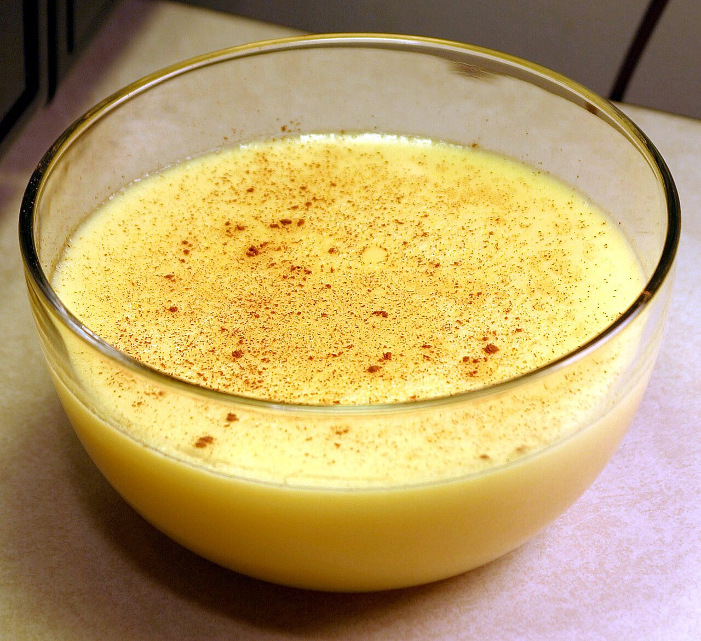

# Custards

*Custard sounds intimidating until you realise it's mostly yolks, dairy, sugar and a steady hand. The same gentle technique gives you a pourable creme anglaise, a thick creme patissiere, a set creme caramel, a torched-top creme brulee, and the base of any custard-style ice cream. Once your hand knows the moment to pull the pan off the heat, you're set.*

## Overview
Custards are eggs cooked in dairy with sugar, slowly, until the yolks thicken the mixture but stop short of scrambling. The cooking happens between 75 and 82 C; above 82 C the yolks scramble and you have sweet scrambled eggs in milk (technically curdled custard).

The technique sits on knife-edge temperature control:
- Too cool: never thickens.
- Too hot: scrambles.
- Just right: thickens to coat-the-back-of-a-spoon consistency, then stops.

There are two broad families: pourable custards (creme anglaise; not set, served warm or chilled as a sauce or used as an ice-cream base) and set custards (creme caramel, creme brulee, baked custards; cooked in a bain-marie until they set firm).

## The Universal Method (Pourable Custard / Creme Anglaise)

For 500 ml.

### Ingredients
- 400 ml whole milk (or 300 ml milk + 100 ml double cream for richer)
- 1 vanilla pod (split, seeds scraped) or 1 teaspoon vanilla extract
- 6 egg yolks
- 80 g caster sugar
- Pinch fine sea salt

### Method

1. **Infuse the milk.** Pour the milk and any cream into a saucepan with the vanilla pod and seeds. Heat gently until just below boiling (surface shimmers, small bubbles at the edge). Off heat, let infuse 10 minutes.
2. **Whisk the yolks.** In a heatproof bowl, whisk yolks, sugar and salt until pale and slightly thickened, 1-2 minutes.
3. **Temper.** Pour the warm milk into the yolks in a thin stream, whisking constantly. This is "tempering": warming the yolks gradually rather than shocking them with all the hot milk at once.
4. **Cook.** Return the tempered mixture to the saucepan. Cook over low heat, stirring constantly with a wooden spoon. Use a heatproof thermometer if you have one.
5. **The moment to pull.** When the custard reaches 82-83 C, OR when it coats the back of a spoon (drag a finger across the spoon; the track should remain clean), OR when you see the first wisp of steam coming off the surface, pull off the heat immediately.
6. **Strain.** Pour through a fine sieve into a clean cold bowl. The sieve catches any small scrambled bits and removes the vanilla pod.
7. **Cool.** For ice cream base: ice bath the bowl. For sauce: cool to room temperature, refrigerate.

### The Visual Cue

The most reliable test for the home cook (without a thermometer) is the "coat the back of a spoon" test. Lift the wooden spoon out of the custard. Drag a finger across the back of the spoon. If the custard parts and stays parted (leaves a clear strip with no overlap), the custard is done. If it closes back over, cook 30 seconds more and test again.

## Variations

### Creme Patissiere (Pastry Cream)

A thicker custard set with cornflour (or flour). The classic filling for choux, tarts, mille-feuille.

For 500 ml:
- 500 ml whole milk
- 1 vanilla pod
- 6 egg yolks
- 100 g caster sugar
- 30 g cornflour

Method: infuse milk as above. Whisk yolks + sugar + cornflour in a bowl until pale. Temper with hot milk, then return everything to the pan. Cook over medium heat, whisking constantly. The cornflour brings the custard to a much higher temperature (it will boil at 100 C) without scrambling, because the starch in the cornflour stabilises the egg proteins.

Bring to a boil, cook 2 minutes more (this fully cooks the starch). Off heat, beat in 30 g cold butter for shine. Pour into a flat dish, press cling film directly to the surface, chill.

See [Creme Patissiere recipe](../../baking/cremes/creme-patissiere.md).

### Creme Caramel

A set custard inverted onto a plate to reveal a caramel sauce.

For 4 individual ramekins:
- 200 g caster sugar (for the caramel)
- 500 ml whole milk
- 4 eggs (whole, not just yolks)
- 100 g caster sugar
- 1 teaspoon vanilla extract

Method:
1. Make a dry caramel: melt 200 g sugar in a heavy pan, no water, swirl until amber. Pour into the bottoms of 4 ramekins.
2. Warm the milk with vanilla.
3. Beat eggs and sugar lightly (don't froth). Pour warm milk over while whisking gently.
4. Strain into the ramekins on top of the caramel.
5. Place ramekins in a roasting tin. Pour hot water around them to come halfway up the sides (bain-marie).
6. Bake at 150 C for 35-40 minutes. The custard should be set at the edge with a slight wobble in the centre.
7. Cool, refrigerate overnight (the caramel softens and becomes pourable).
8. To serve: run a knife around the inside of the ramekin; invert onto a plate. The caramel pools around the custard.

### Creme Brulee

Same family, different texture: richer (more yolks, more cream), set with whole yolks (not whole eggs), and finished with a torched-sugar lid.

For 4 ramekins:
- 500 ml double cream
- 1 vanilla pod
- 5 egg yolks
- 50 g caster sugar
- (4 tablespoons demerara sugar for the lid)

Method: as creme caramel but cream-only (no milk), yolks-only (no whole eggs), bake at 140 C for 30 minutes until the centres still wobble. Chill at least 4 hours. Just before serving, sprinkle a thin even layer of demerara sugar across the surface and torch with a chef's blowtorch until amber and crackling.

### Ice Cream Base (Vanilla)

Creme anglaise is the master recipe for custard-based ice cream. Cool the anglaise completely, then churn in an ice-cream maker until frozen and aerated.

Variations: add 200 g cooled melted chocolate to the cooled anglaise; add 2 tablespoons strong coffee; reduce the sugar by 20 g and add 1 tablespoon vanilla paste for vanilla bean.

## Common Mistakes

**The custard scrambled.**
Too hot. The yolks went above 82 C. There is partial recovery: blend the curdled custard in a high-speed blender; sometimes this breaks up the lumps and you can recover a usable (if less silky) custard. Best to start over.

**The custard never thickened.**
Pulled too early. Return to low heat; cook another minute. Or: the yolks were broken too aggressively (over-whisked into foam) and lost their thickening power. Use fresh yolks; whisk lightly.

**The custard tastes eggy.**
Under-cooked, so the eggs haven't blended with the dairy fully. Or you used cheap UHT cream/milk that doesn't infuse well. Use fresh whole milk and cream.

**Creme patissiere is gluey.**
Too much cornflour, or didn't cook long enough after the boil. Cook 2 full minutes after the first boil; the cornflour needs heat to neutralise its raw taste.

**Creme caramel cracked on the surface.**
Bain-marie water was too hot, or oven too hot. The egg proteins seized. Water in the bain-marie should be warm (not boiling) when poured around the ramekins; oven at 150 C.

**Creme brulee is rubbery.**
Over-baked. The centre should wobble like jelly when you pull it from the oven; it sets further as it cools.

**Torched lid is cloudy or burnt.**
Cloudy: sugar layer too thick (sprinkle thinner). Burnt: torched too long in one spot (move the flame constantly).

## Where Next
- [Meringues](meringues.md): the egg-white side of the patisserie.
- [Souffles](souffles.md): custard-base + meringue = souffle.
- [Eggs Course landing](eggs.md): back to the main course.
- [Creme Anglaise recipe](../../baking/cremes/creme-anglaise.md): traditional recipe.
- [Creme Patissiere recipe](../../baking/cremes/creme-patissiere.md): traditional recipe.
- [Stocks-Sauces / Hollandaise](../stocks-sauces/hollandaise.md): the savoury cousin of custard, same yolk-coagulation principle.

## Storage
- Most egg dishes are best served immediately; soufflés and omelettes do not hold well
- Hard-boiled eggs keep 1 week refrigerated, in or out of the shell
- Custards and creams keep 2 days refrigerated; cover the surface with cling film to prevent a skin forming
- Never freeze fresh egg dishes: the texture breaks down on thaw
