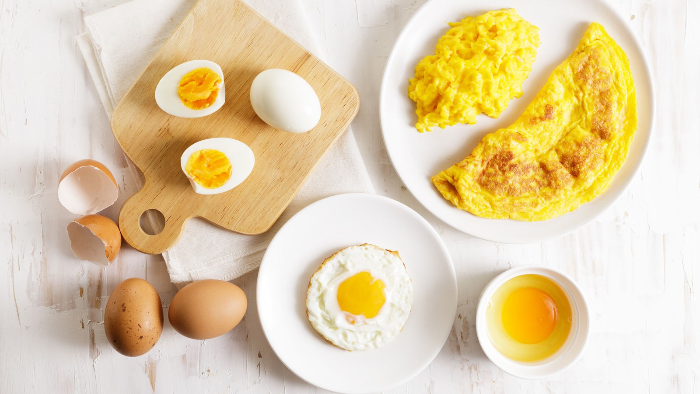

# Eggs Course

*Eggs are probably the most generous ingredient in your kitchen. The same little shell turns into a soft-boil for breakfast, a hollandaise for asparagus, a meringue for pavlova, a custard for ice cream. Once you get a feel for how heat changes them, a surprising amount of cooking opens up.*

## Overview
Eggs are deceptive. They look simple (boil, fry, scramble) and they are simple, in the sense that the ingredient list never grows past one. But each preparation depends on temperature control with no margin: a hard-boiled egg taken 30 seconds too long is rubbery; a scramble held 30 seconds too long is dry; a custard taken 5 degrees too hot is scrambled; a souffle pulled 30 seconds too early collapses.

Once you understand how proteins coagulate at specific temperatures and how air can be folded into yolks (for emulsions) or whites (for meringues and souffles), eggs become a structural reference. The yolks of hollandaise, the whites of meringue, the whole eggs of custard and the scramble all sit on the same temperature ladder.

## Course Outline

### The Five Preparations

- [Boiled and Poached](boiled-poached.md): soft-boil, hard-boil, the poach. Where the egg meets water, hot or hotter.
- [Scrambled and Omelette](scrambled-omelette.md): scrambled (American, French, classical), omelette (rolled, folded, frittata-style).
- [Custards](custards.md): creme anglaise, creme caramel, creme brulee, baked custards, ice cream base. Yolks + dairy + sugar + low heat.
- [Meringues](meringues.md): whites + sugar + air. French, Italian, Swiss. Three methods for different uses.
- [Souffles](souffles.md): the puffed-and-collapsing showstopper. Sweet, savoury, the technique that combines a thick base with whipped whites.

## The Temperature Ladder

This single table explains most of the course. Egg proteins coagulate at specific temperatures, and the moment they coagulate is the moment a preparation succeeds or fails.

| Temperature | What happens                          | Preparations                           |
|-------------|----------------------------------------|----------------------------------------|
| 62 C        | Yolk thickens (no white yet set)       | Onsen tamago, soft custard, sabayon    |
| 65 C        | White starts to set; yolk runny        | 6-minute soft-boil                     |
| 70 C        | White fully set; yolk thick but creamy | 7-8-minute medium-boil                 |
| 75 C        | Yolk fully set, slightly crumbly       | 9-10-minute boil                       |
| 82 C+       | Custard scrambles                       | (failure mode for cooked custard)      |

The temperature on the food matters, not the cooking-medium temperature. A boiled egg in 100 C water reaches 75 C in the centre at 8 minutes for a medium egg; a custard in a 65 C bain-marie thickens without scrambling regardless of pan temperature.

## Egg Quality

Three things matter for the techniques here:

1. **Freshness.** Fresh eggs hold their shape (the white is firm; the yolk stands tall). Older eggs spread (white runs; yolk flattens). Fresh eggs are best for poaching and frying; older eggs (1-2 weeks) are easier to peel after boiling because the shell membrane has loosened.

2. **Size.** Recipes assume "medium" eggs (about 50 g). Large eggs run 60 g, extra-large 70 g. For most everyday cooking, size doesn't matter much. For patisserie (souffles, ice cream base, meringues), use a kitchen scale: weight per egg matters more than count.

3. **Room temperature vs cold.** Cold eggs from the fridge poach harder (the cold drops the water temperature; the cooking is uneven). Cold yolks emulsify slowly (lecithin works better at room temp). Most recipes assume room-temperature eggs. Take them out 30 minutes before using.

## Where to Start

- New to eggs: [Boiled and Poached](boiled-poached.md). Foundational technique, immediately useful.
- Want to impress at brunch: [Scrambled and Omelette](scrambled-omelette.md). The French omelette is a precision move that earns respect from anyone who knows.
- Want dessert: [Custards](custards.md). Foundation of ice cream, creme brulee, creme caramel, panna cotta-adjacent set creams.
- Want patisserie: [Meringues](meringues.md). Three methods (French, Italian, Swiss) cover macarons, pavlova, Italian meringue buttercream, mousses.
- Want a showstopper: [Souffles](souffles.md). Hardest to nail; biggest payoff when you do.

## Where Next
- [Stocks and Sauces / Hollandaise](../stocks-sauces/hollandaise.md): an egg-yolk emulsion. The cooked-yolk technique from the eggs course transfers directly.
- [Bread course / Enriched Doughs](../bread/enriched-doughs.md): brioche, challah, hot cross buns. Eggs in dough.
- [Pastry course / Choux](../pastry/choux.md): eggs are what makes choux puff.
