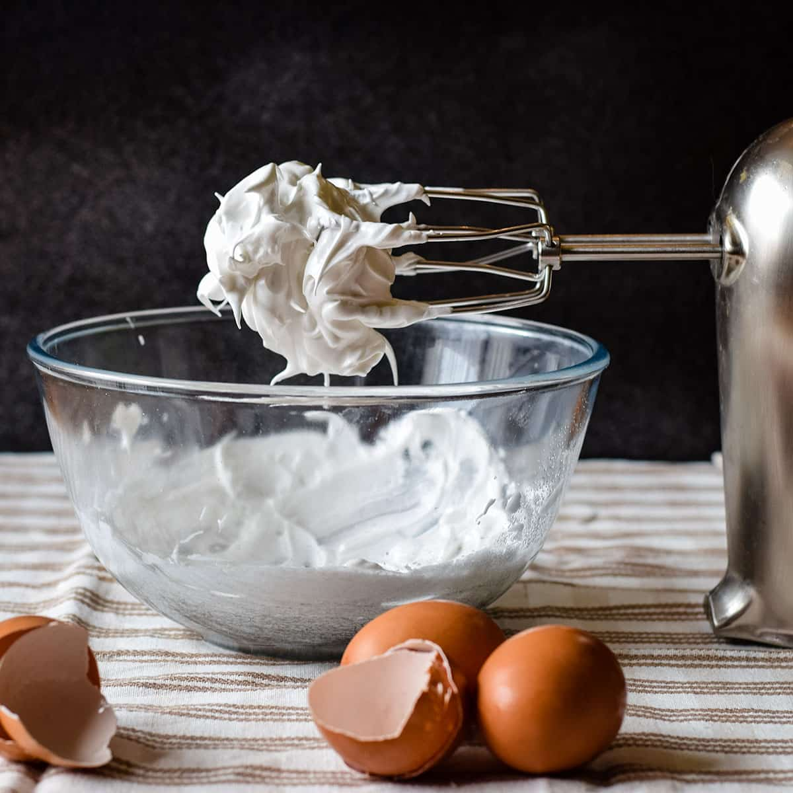

# Meringues

*Egg whites, sugar and air, in three slightly different orders. The French method is the simplest, the Italian the most stable, the Swiss the smoothest. Each gives a different texture, and once you've made all three you'll know which to reach for. Macarons, pavlova, buttercream and mousse all start with one of them.*

## Overview
Meringues are mostly air. Egg whites foam when whisked because the proteins unfold and form a network around tiny air bubbles. Adding sugar stabilises the foam: the sugar lattice holds the bubbles in place even when heated. The ratio of sugar to whites determines how stable the meringue is and what you can do with it.

Three classical methods exist. Each is named for its origin and produces a meringue with different properties:

- **French meringue:** uncooked, light, slightly fragile. Made by whisking sugar into cold whites. Best for: simple piped meringues (kisses, pavlova base), folded into souffle bases.
- **Italian meringue:** very stable, very glossy. Made by pouring hot sugar syrup into whisked whites. Best for: buttercream, mousse, marshmallow, dessert toppings that won't bake further.
- **Swiss meringue:** dense, smooth, very stable. Made by warming whites with sugar over a bain-marie then whisking off the heat. Best for: macarons, Italian meringue buttercream (some recipes substitute Swiss).

## The Universal Ratio

The classical ratio is 2:1 sugar to egg whites by weight. So 100 g whites (about 3 medium whites) takes 200 g sugar.

Lower sugar ratios (1.5:1, 1:1) give lighter, softer meringues that need to be baked and eaten the same day. Higher ratios (2:1, 2.5:1) give the crisp dry meringues that keep for weeks.

## French Meringue (Cold-Method)

The simplest. For 4 medium pavlovas or about 20 small kisses.

### Ingredients
- 4 medium egg whites (about 120 g)
- 240 g caster sugar
- Pinch of cream of tartar (or 1/2 teaspoon white wine vinegar; helps stabilise)
- 1 teaspoon vanilla extract (optional)

### Method

1. **Whites at room temperature.** Cold whites don't whip well. Take them out 30 minutes before.
2. **Spotlessly clean bowl.** Any yolk or grease prevents foaming. Wipe the bowl and whisk with vinegar or lemon juice first if in doubt.
3. **Start whisking.** Beat the whites in a stand mixer (or by hand) on medium speed until they reach soft peaks (the foam droops slightly when the whisk is lifted; the peak doesn't hold itself up).
4. **Add cream of tartar.** Pinch in.
5. **Add the sugar gradually.** One tablespoon at a time, beating on medium-high. Wait 15-20 seconds between additions for the sugar to dissolve into the foam.
6. **Reach stiff peaks with shine.** After all the sugar is in (5-7 minutes total whisking), the meringue should be glossy, hold a stiff peak (the peak stays upright when the whisk is lifted), and feel smooth when rubbed between thumb and finger (no sugar grit). If it feels grainy, keep whisking.
7. **Add vanilla.** Beat in for 10 seconds.

### Baking

For pavlova / large meringues:
1. Heat oven to 100 C (90 fan).
2. Pipe or dollop onto a parchment-lined baking sheet.
3. Bake 1.5-2 hours for medium pavlova, 3 hours for crisp through.
4. Turn the oven off, leave the meringue inside until cool (the slow cooldown prevents cracking).

The pavlova should be crisp on the outside, soft and marshmallowy at the centre. The crisp meringue kiss should be dry through.

## Italian Meringue (Hot-Syrup Method)

The most stable. Used for buttercream, mousses, baked alaska, marshmallow.

### Ingredients
- 4 egg whites (120 g)
- 240 g caster sugar
- 60 ml water

### Method

1. **Make a sugar syrup.** Combine the sugar and water in a small saucepan. Stir until the sugar dissolves. Stop stirring. Bring to a boil. Cook until the syrup reaches 118 C (the "soft ball" stage; use a thermometer).
2. **Whisk the whites.** While the syrup cooks, beat the whites in a stand mixer to medium-stiff peaks.
3. **Pour the syrup.** Once the syrup reaches 118 C, take off the heat. With the mixer running at medium-high, pour the hot syrup down the side of the bowl in a steady thin stream. Don't pour onto the whisk (the syrup will splash up and harden on the bowl walls); pour onto the meringue between the whisk and the bowl wall.
4. **Continue whisking.** Until the bowl feels cool to the touch (about 5-7 minutes). The meringue should be very glossy, very stiff, and warm rather than hot.

Italian meringue holds its shape indefinitely at room temperature. Pipe it; torch it; fold it into buttercream.

## Swiss Meringue (Warm-Method)

Dense, smooth, stable. The standard for macarons.

### Ingredients
- 4 egg whites (120 g)
- 240 g caster sugar

### Method

1. **Heat together.** Combine whites and sugar in a heatproof bowl over a saucepan of simmering water (bain-marie; bowl shouldn't touch the water).
2. **Whisk by hand or with a whisk attachment as you warm.** The mixture should reach 65 C (the sugar will be fully dissolved; rub between fingers for grit check).
3. **Off heat, whisk hard.** Transfer to a stand mixer if you have one. Whisk on medium-high for 7-10 minutes until cool and the meringue is stiff, very smooth, very glossy.

Swiss meringue is denser than French, smoother than Italian. Use for piped pavlovas that need to hold a sharp shape, for macarons (where the smoothness gives the glossy shells), or as a base for swiss-meringue buttercream.

## Common Mistakes

**The meringue won't whip.**
Trace of yolk in the whites, or a greasy bowl. Even a drop of yolk prevents foaming. Use eggshell to fish out yolk fragments; rewash the bowl.

**The meringue is grainy.**
Sugar didn't dissolve. For French: whisk longer until smooth. For Italian: syrup didn't reach soft-ball stage. For Swiss: didn't heat warm enough.

**The meringue weeps liquid (a "syrup layer" at the base).**
Over-whisked, or the cold-vs-room-temperature handling was wrong. Use fresh whites; whisk to stiff but not bone-dry peaks.

**The meringue cracks during baking.**
Oven too hot. Drop temperature; leave the oven cracked open at the end for slow cool down.

**The meringue is brown.**
Oven too hot. Should bake at 100 C; if it's tinting at all (besides the very faintest cream), it's overheated.

**The meringue is sticky after baking.**
Humid room. Wait for a dry day, or use a low oven (with door cracked) for longer.

**Italian meringue collapsed.**
Syrup cooled too much before pouring; or whites overshot to dry peaks. Pour syrup quickly; stop the whites at medium-stiff.

**Swiss meringue is curdled.**
Eggs scrambled. The bowl got too hot on the bain-marie. Keep below 65 C.

## Storage

- **Baked meringues:** crisp and dry. Airtight container, room temperature, 2 weeks.
- **Unbaked Italian or Swiss meringue:** use the day made. Doesn't hold well in storage.
- **Pavlova:** crisp outside, soft inside. Best within a day of baking; the soft centre weeps over time.

## Where Next
- [Custards](custards.md): the yolk-side cousin.
- [Souffles](souffles.md): meringue + custard = souffle.
- [Eggs Course landing](eggs.md): back to the main course.
- [Meringue Francais recipe](../../baking/meringue/meringue-francais.md): traditional French meringue.
- [Meringue Italienne recipe](../../baking/meringue/meringue-italienne.md): traditional Italian meringue.
- [Meringue Suisse recipe](../../baking/meringue/meringue-suisse.md): traditional Swiss meringue.
