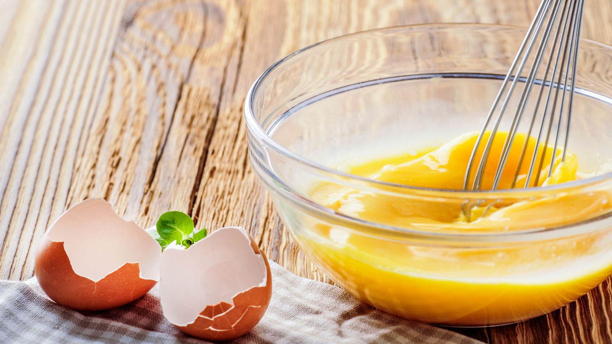

# Scrambled and Omelette

*The same ingredients, hugely different techniques. American scramble: large soft curds, almost-set, butter-rich. French scramble: small curds, almost custardy, the patisserie of breakfast. Omelette: a thin egg sheet rolled or folded around a filling. Three styles, one principle: low heat and active stirring (or no stirring) control the result.*

## Overview
Scrambled eggs are an exercise in controlled coagulation. The proteins want to bind into rubbery curds; gentle heat and steady agitation keep them soft and creamy. Once you understand that low-and-slow gives custard, medium gives soft curds, and high gives rubber, you can produce any style on demand.

Three styles cover most of what's worth knowing:
- **American scramble:** medium heat, large curds, butter, salt, ready in 90 seconds.
- **French scramble:** very low heat, tiny curds, butter, cream, ready in 5 minutes.
- **Omelette:** thin sheet folded over a filling. Two main styles: the French rolled and the American/Spanish flat.

## The Universal Setup

For any of the three:
- 2-3 eggs per portion (medium eggs)
- 1 tablespoon of butter or oil
- Pinch of salt
- A non-stick pan or a well-seasoned cast-iron / carbon-steel pan, 20-22 cm

Beat the eggs lightly with a fork until uniformly blended, no thick yolk patches, but not whipped to froth. About 15 seconds.

Salt the eggs in the bowl before cooking. Some cooks insist salt before makes them watery (it doesn't, in any time short of a few minutes); some insist salt after for fluffier eggs. The difference is negligible. Pick a side.

## American Scramble

The default style; large soft curds; ready in 90 seconds. Best for breakfast piled on toast.

### Method
1. Heat the pan over medium heat for 30 seconds.
2. Melt the butter. Don't let it brown.
3. Beat the eggs lightly. Add a pinch of salt.
4. Pour the eggs into the pan. Wait 5 seconds for the bottom to start setting.
5. With a heat-resistant spatula, pull the cooked edges into the middle. The uncooked egg flows to fill the gap.
6. Continue every 5-10 seconds. Don't stir constantly; let curds form.
7. Remove from the heat when the eggs are still slightly wet and shiny. The residual heat in the pan will finish them; if you wait until they look fully cooked in the pan, they will be overcooked on the plate.
8. Total time: 60-90 seconds.

### Variations
- **Cheese scramble:** add 30 g grated cheese (gruyere, sharp cheddar) just before the eggs are done; fold through; serve.
- **Herb scramble:** stir in 1 tablespoon chopped chives, parsley or chervil at the end.

## French Scramble (Œufs Brouilles)

The patisserie of breakfast. Very small curds, almost custardy, ready in 5 minutes. Pair with a glass of champagne; the technique is intentionally slow and deliberate.

### Method
1. Beat the eggs lightly in a small bowl. Add a pinch of salt and 1 tablespoon double cream.
2. Heat the pan over LOW heat. Add 20 g of butter. Let it melt slowly.
3. Pour in the eggs.
4. Stir slowly and constantly with a heat-resistant spatula or wooden spoon. Move slowly across the bottom and around the sides; the goal is to keep all the egg moving but not whip it.
5. After about 4-5 minutes, small curds start forming. Continue stirring.
6. When the eggs look like a loose custard with tiny curds throughout (no large lumps), pull off the heat.
7. Off heat, stir in 1 teaspoon cold butter and 1 tablespoon cream. The cold ingredients shock-stop the cooking and add silkiness.
8. Salt to taste. Serve on toast or with smoked salmon.

### Critical Rule for French Scramble

Low heat. Anything above the lowest comfortable simmer ruins the texture. If the eggs look like they are setting in larger lumps, the heat is too high. Move the pan off the burner for 10 seconds at a time to slow the cook.

## Omelette: The French Style (Roulee)

A 30-second cook, pale yellow, no browning, folded into a cigar shape. Restaurant technique; impressive to anyone who knows.

### Method
1. Beat 3 eggs with salt. Don't add anything else (water, milk, etc.; the French omelette is pure egg).
2. Heat a non-stick pan over medium-high heat. Add 1 tablespoon butter.
3. When the butter is foaming but not browning, pour in the eggs.
4. Immediately start stirring with the back of a fork (held lightly), making small circles. Simultaneously shake the pan back and forth on the burner.
5. After 15 seconds, the eggs are mostly set but still slightly liquid on top.
6. Stop stirring. Use the back of the fork to smooth the top.
7. With the fork, lift the far edge of the egg sheet and fold it about a third of the way over itself.
8. Tip the pan toward you, sliding the omelette to the front edge.
9. Tap the handle of the pan to roll the omelette into a 3-fold cigar shape; the seam ends underneath when you tip it onto the plate.
10. The exterior should be pale yellow, no browning, and the interior should be just-barely-set, almost wet at the very centre (called "baveuse" — slobbery — by the French, who consider it the correct texture).

### Variations
- **Cheese omelette:** sprinkle 30 g grated gruyere across the eggs before the first fold.
- **Herb omelette (fines herbes):** add 1 tablespoon mixed chopped chives, chervil, parsley, tarragon to the beaten eggs.

## Omelette: The American / Spanish Flat Style

For fillings that need cooking through (mushrooms, peppers, onions, meats). Or for thicker eggs that hold a portion.

### Method (American Diner)
1. Cook fillings in the pan first: sweat onions, brown mushrooms, etc. Lift out and set aside.
2. Heat the pan, add butter, pour in 3-4 beaten eggs.
3. Let cook 30 seconds without stirring. Pull edges in once or twice.
4. When the bottom is set but the top is still slightly wet, scatter the cooked fillings + cheese over half the omelette.
5. Fold the empty half over the filled half. Cook 30 more seconds.
6. Slide onto the plate.

### Method (Spanish Tortilla)
A thicker disc with potato and onion folded in. Cook the potato and onion in olive oil first (a poach in oil at 80 C for 20 minutes). Drain. Mix with 6 beaten eggs. Return to a wider pan; cook over very low heat 5-7 minutes until the bottom is set. Flip onto a plate, then slide back into the pan to cook the second side. Serve at room temperature.

## Common Mistakes

**Scrambled eggs are rubbery and tough.**
Heat too high, or cooked too long. The protein over-tightened. Drop heat; pull off pan while still slightly wet.

**Scrambled eggs are weeping liquid.**
Pulled too early (still raw). Or over-salted (salt draws moisture out). Cook 30 seconds more; salt less.

**French scramble is large curds, not silky.**
Heat too high, or under-stirred. Low and continuous.

**Omelette is browned.**
Pan too hot, or you waited too long before folding. Hot pan but pour in quickly; fold within 30-40 seconds.

**Omelette stuck to the pan.**
Non-stick coating worn, or insufficient butter. Use more butter; don't use this pan for omelettes if scratched.

**Omelette is dry in the middle.**
Cooked too long after stirring stopped. Aim for baveuse; pull early.

**The fillings spilled out of the omelette when folded.**
Too much filling, or pan too small. Use less; cook a thicker filling separately and serve alongside.

## Where Next
- [Boiled and Poached](boiled-poached.md): the simpler-water preparations.
- [Custards](custards.md): the same eggs, even gentler heat, very different result.
- [Souffles](souffles.md): scrambled eggs taken to the absurd.
- [Eggs Course landing](eggs.md): back to the main course.
