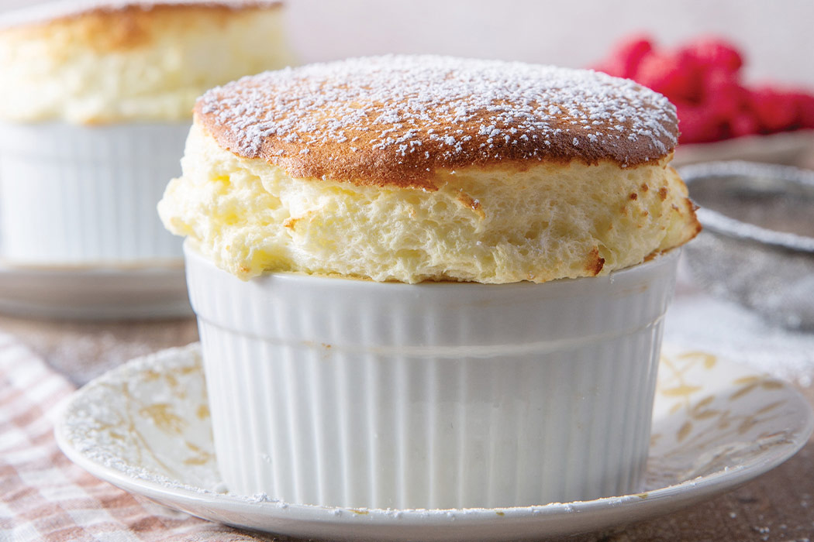

# Souffles

*Souffles have a reputation for collapsing on the way to the table, and that reputation is mostly earned. But there's a real method behind them: a thick flavoured base, whipped egg whites folded in, a hot oven, and a dash to the table the second they're out. Sweet, savoury, dramatic. Worth attempting at least once.*

## Overview
A souffle has two parts:
1. **A flavoured base.** Either a thick bechamel (savoury souffles) or a thick custard or fruit puree (sweet souffles). Heavy with flavour, but on its own collapsed and dense.
2. **A meringue.** Whipped egg whites with no sugar (savoury) or a touch of sugar (sweet). Light, foamy, full of air.

The two are folded together. The whites carry air; the base carries flavour. In the oven, the air expands as it heats; the base sets around the air pockets; the souffle rises to twice its raw height. The moment it comes out of the oven, the air starts to cool and contract; the souffle collapses within 90 seconds.

The whole drama is in the timing: you have to serve the souffle the moment it comes out of the oven. Otherwise it falls before the diner sees it.

## The Cheese Souffle (Souffle au Fromage)

The classical reference savoury souffle.

### Ingredients (Serves 4, in individual ramekins)
- 30 g unsalted butter (for buttering ramekins) + extra for the base
- 30 g grated parmigiano-reggiano (for dusting ramekins)
- 30 g unsalted butter
- 30 g plain flour
- 300 ml whole milk
- 150 g grated gruyere
- 4 egg yolks
- 5 egg whites
- Pinch fine sea salt
- 1 small pinch cayenne pepper
- 1 grating nutmeg

### Method

**Step 1 - Prepare the ramekins.**
1. Butter 4 ramekins generously, going UP the sides only (don't butter the rim or top edge; the souffle needs grip there to climb).
2. Dust with grated parmigiano. Tap off excess.
3. Refrigerate.

The buttered-and-dusted lining gives the souffle traction to rise. Skip this step and the souffle either won't rise or will rise lopsided.

**Step 2 - Make a thick bechamel.**
1. Melt 30 g butter in a saucepan over medium heat. Whisk in 30 g flour. Cook 2 minutes (a blond roux).
2. Slowly whisk in 300 ml warm milk. Cook over medium heat, whisking, until very thick (about 5 minutes). This is a thicker bechamel than usual; thick enough that the whisk leaves a deep track.
3. Off heat, beat in the grated gruyere until melted.
4. One at a time, beat in the 4 yolks.
5. Add salt, cayenne, nutmeg.
6. The base should taste highly seasoned (the meringue dilutes it).

**Step 3 - Whip the whites.**
1. In a spotlessly clean bowl, whisk 5 egg whites with a pinch of cream of tartar (or a small splash of vinegar) to medium-stiff peaks. They should hold a peak but the tip droops slightly.

**Step 4 - Fold.**
1. Stir 1 large tablespoon of the meringue into the base, whisking vigorously. This "loosens" the base so it can accept the rest of the whites.
2. Add the rest of the whites all at once. Fold with a spatula, using a "cut down, lift up, rotate the bowl" motion. About 6-8 strokes. Stop when no large patches of white remain but small streaks are acceptable. Over-folding deflates the air.

**Step 5 - Fill and bake.**
1. Spoon the mixture into the chilled buttered ramekins, filling almost to the top.
2. Run your thumb around the inside rim of each ramekin (between the souffle mix and the ramekin wall, about 1 cm deep). This creates a moat that helps the souffle rise straight up.
3. Place ramekins on a baking sheet. Bake at 200 C (180 fan) for 12-15 minutes.

**Step 6 - The drama.**
1. Open the oven door. The souffle should be risen to about double the ramekin height, with a deep golden top. The interior should still wobble when the dish is moved.
2. Serve immediately. Diners should be at the table when you take them out.

### The Sweet Souffle (Chocolate)

Same method, different base.

Base: 100 g dark chocolate melted with 1 tablespoon unsalted butter. Beat in 4 egg yolks one at a time. Add 1 tablespoon caster sugar.

Meringue: 5 egg whites + 50 g caster sugar (added gradually as the whites whip, classical French meringue).

Fold and bake as above. Serve with a small jug of warm pouring cream alongside; the diner spoons it into the souffle just before eating.

## Critical Rules

1. **Buttered AND dusted ramekins.** Skipping either means uneven rise.
2. **Highly seasoned base.** The meringue dilutes flavour. What tastes too strong in the base will taste right in the finished souffle.
3. **Stiff but not dry whites.** Over-whipped whites tear during folding; under-whipped lack air capacity.
4. **One stir, then fold.** First tablespoon of meringue stirred in; the rest folded gently. Two-stage folding preserves more air.
5. **Hot oven, no opening.** Souffles need a hot quick blast. Opening the door drops temperature and the souffle deflates.
6. **Serve immediately.** Souffles fall within 90 seconds of leaving the oven. No exceptions.

## Common Mistakes

**The souffle didn't rise.**
Whites under-whipped, or over-folded into the base (deflated). Or oven too cool. Check oven thermometer; whisk to medium-stiff peaks; fold gently.

**The souffle rose lopsidedly.**
Uneven ramekin coating, or uneven fill. Coat thoroughly; spoon evenly; smooth the top.

**The souffle rose then fell during baking.**
Oven door opened too early. Don't peek before 10 minutes.

**The souffle is dense.**
Over-folded. Stop folding when small streaks of white still remain; they finish blending in the oven.

**The souffle is wet in the centre.**
Under-baked. The interior should still wobble but the surface should be set and golden. Add 2 minutes; check again.

**The souffle is rubbery at the base.**
Base was too thick (over-cooked bechamel); or under-folded (whites not incorporated). Either makes the bottom layer set without air.

**The souffle fell before serving.**
Got distracted on the way to the table. Souffles fall fast. Open the oven, take them out, walk straight to the diners. The whole journey should be 30 seconds.

## Other Souffles

**Spinach souffle:** cooked-and-squeezed spinach folded into a cheese-bechamel base. Add 200 g squeezed wilted spinach to the cheese souffle base.

**Smoked haddock souffle:** poached haddock flaked into the bechamel. Use the poaching milk as the bechamel milk for double flavour.

**Lemon souffle:** zest of 2 lemons + 2 tablespoons lemon juice folded into a custard base with 1 tablespoon caster sugar.

**Grand Marnier souffle:** 3 tablespoons Grand Marnier added to a sweet custard base. The orange liquor flavour intensifies during the bake.

**Roquefort souffle:** swap gruyere for 150 g crumbled Roquefort in the cheese souffle. Sharper, bolder.

## Where Next
- [Custards](custards.md): the cooked-yolk base technique.
- [Meringues](meringues.md): the whipped-white technique.
- [Stocks-Sauces / Bechamel](../stocks-sauces/bechamel.md): the savoury base under cheese souffle.
- [Eggs Course landing](eggs.md): back to the main course.

## Storage
- Most egg dishes are best served immediately; soufflés and omelettes do not hold well
- Hard-boiled eggs keep 1 week refrigerated, in or out of the shell
- Custards and creams keep 2 days refrigerated; cover the surface with cling film to prevent a skin forming
- Never freeze fresh egg dishes: the texture breaks down on thaw
