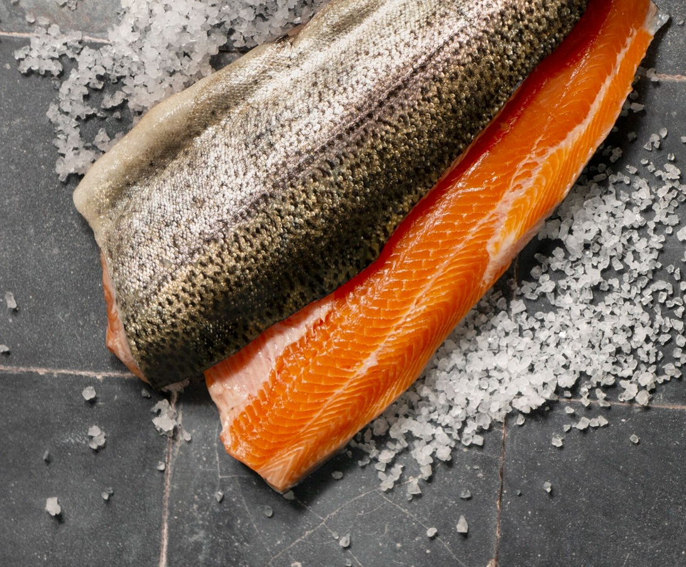

# Curing Fish

*Raw preparations where salt or acid "cooks" the fish without heat. Gravlax (salt and sugar cure, 24-48 hours; produces dense silky raw fish), ceviche (citrus juice marinade, 20 minutes; produces opaque "cooked-feeling" fish), tartare (raw, chopped, dressed). Once you know the technique, smoked salmon and supermarket sashimi become unnecessary.*

## Overview
Cured and raw fish preparations rely on two transformations:
1. **Salt curing** denatures the proteins like heat does, but slower and without coagulating the moisture out. Texture firms up; flavour intensifies; the fish becomes safe to eat without further cooking (within reason; see below).
2. **Acid curing** (citrus juice, vinegar) does the same thing in 15-30 minutes. Looks "cooked" (opaque), but is technically still raw; the acid has folded the proteins.

Plus the no-cure option: simply raw fish, chopped or sliced, dressed at the last moment. Tartare, carpaccio, sashimi.

This page covers the three classical home applications: gravlax (salt cure), ceviche (acid cure), tartare (raw).

## Safety First

Raw fish carries some risk: parasites, bacteria. Two protections:

1. **Quality.** Buy from a fishmonger you trust, ideally one who labels "sashimi-grade" or "for raw consumption". Or buy frozen-at-sea fish; commercial freezing kills parasites.
2. **Freezing.** If you have any doubt, freeze the fish at -20 C for 72 hours before curing. This kills any worms and dramatically reduces parasite risk. UK food safety law actually requires this for raw fish in commercial settings.

The risk is real but low for healthy adults using good-quality fish. Pregnant women, immunocompromised people, the very young and very old should avoid raw fish.

## Gravlax (Salt Cure)

The Scandinavian classic. Salmon cured with salt, sugar, dill, sometimes vodka or aquavit. Takes 24-48 hours; produces a dense, silky, intensely-flavoured raw fish that slices paper-thin. The home-made equivalent of smoked salmon, without the smoke.

### Ingredients
- 500 g fresh salmon fillet, skin on, pin-bones removed
- 75 g coarse sea salt (Maldon flakes or kosher salt)
- 75 g caster sugar
- 1 tablespoon black peppercorns (crushed)
- 1 large bunch fresh dill (rough chopped, stems included)
- 30 ml vodka or aquavit (optional)
- Zest of 1 lemon (optional)

### Method

1. **Make the cure.** Mix salt, sugar, peppercorns and lemon zest in a bowl.
2. **Apply.** Lay half the dill on a sheet of cling film large enough to wrap the fillet twice.
3. Place the salmon skin-side down on the dill.
4. Sprinkle the cure evenly all over the flesh side.
5. Pour over the vodka (if using).
6. Cover with the remaining dill.
7. Wrap tightly in cling film, then in foil for a second layer.
8. **Cure.** Place in a shallow dish (the cure releases liquid; you want to catch it). Place a weight on top: a chopping board, with two tins on top, gives even pressure.
9. Refrigerate 24-48 hours, flipping the parcel every 12 hours.

After 24 hours: cured but soft, sashimi-textured.
After 36 hours: firmer, denser, more flavour-saturated.
After 48 hours: very firm, intensely cured, fully "cooked" feeling.

24-36 hours is the home-baker sweet spot.

10. **Finish.** Unwrap. Rinse the salmon briefly under cold water to remove excess cure. Pat dry.
11. **Slice.** With a very sharp long thin knife, slice diagonally across the fillet at a shallow angle, away from the skin. Each slice should be paper-thin and translucent.

Serve on rye bread with cream cheese, capers, dill, mustard-dill sauce. Lasts 1 week in the fridge wrapped tightly.

### Variations
- **Beetroot gravlax:** grated raw beetroot in the cure. Goes bright pink at the edge.
- **Citrus gravlax:** lime + orange zest, plus a tablespoon of orange juice.
- **Spiced gravlax:** add 1 teaspoon crushed coriander seeds and 1 teaspoon fennel seeds to the cure.
- **Whisky gravlax:** swap vodka for a peaty Islay whisky. Smoke-by-proxy.

## Ceviche (Acid Cure)

The Latin American classic. Raw fish cubed and marinated in citrus juice for 15-30 minutes, until opaque. Sharp, bright, refreshing. The Peruvian standard; close cousins across Mexico, Ecuador, Chile and Polynesia.

### Ingredients (Serves 4 as starter)
- 400 g very fresh white fish (sea bass, snapper, halibut, sole; not oily)
- Juice of 4-6 limes (about 120 ml)
- 1 small red onion, very finely sliced
- 1 mild red chilli, deseeded and finely chopped (or 1/2 hot chilli)
- 1 large bunch fresh coriander, leaves chopped
- 1 teaspoon salt
- Pinch of sugar

### Method

1. **Cut the fish.** Cube the fish into 1-1.5 cm pieces. Pat dry on kitchen paper.
2. **Soak the onion.** Place sliced onion in a small bowl. Cover with cold water + 1 teaspoon vinegar. Leave 10 minutes; drain. (This step removes the onion's harshness.)
3. **Build.** Place fish in a non-reactive bowl (glass, stainless steel; never aluminium). Add the salt and a pinch of sugar.
4. Pour over the lime juice. The fish should be barely submerged.
5. Stir to coat.
6. **Cure.** Refrigerate 15-30 minutes. The fish turns from translucent to opaque white. 15 minutes for a rare ceviche, 30 minutes for a more "cooked" finish.
7. **Finish.** Drain off most of the lime juice (it gets sharper over time and overwhelms). Add the drained onion, chopped chilli, chopped coriander.
8. **Adjust.** Taste; add more salt, more chilli, more lime as needed.

Serve immediately, with sweet potato slices, plantain chips, or saltine crackers.

The leftover lime juice (called leche de tigre, "tiger's milk") is a delicacy in Peru; served as a shot, said to cure hangovers.

### Variations
- **Mexican ceviche:** add diced tomato, avocado, mango.
- **Ecuadorian ceviche:** add tomato juice for a soup-like consistency; serve with corn nuts (cancha) on top.
- **Peruvian ceviche:** the canonical version above, with aji amarillo paste added for heat and yellow colour.
- **Hawaiian poke:** raw tuna with soy sauce, sesame, scallion, avocado, sometimes lime. Technically not a ceviche (no acid cure long enough to denature proteins), but very close cousin.

## Tartare (Raw)

The simplest preparation. Top-quality raw fish, finely chopped, dressed minimally.

### Tuna Tartare (Classical)
- 200 g sashimi-grade tuna
- 1 teaspoon soy sauce
- 1 teaspoon toasted sesame oil
- 1 tablespoon finely chopped chives
- 1 small shallot, finely chopped
- Black pepper

Cut tuna into 5 mm dice. Dress just before serving with the other ingredients. Serve on toasted bread or as a starter portion on a chilled plate.

### Salmon Tartare with Capers
- 200 g sushi-grade salmon
- 1 tablespoon capers (rinsed, chopped)
- 1 tablespoon finely chopped dill
- 1 tablespoon olive oil
- 1 squeeze lemon
- Black pepper

Cube the salmon. Combine. Serve immediately, dolloped on crispbread or alongside warm new potatoes.

### Sea Bass Carpaccio (Italian, Sliced Thin Not Cubed)

Lay sashimi-thin slices of sea bass on a chilled plate. Drizzle with olive oil, lemon, sea salt, black pepper, capers. The Italian beach-restaurant standard.

## Common Mistakes

### Gravlax

**The salmon is too salty.**
Cured too long, or too much cure. Rinse longer under water; or shorten the cure to 24 hours next time.

**The salmon is still raw-feeling after 36 hours.**
Cure quantity too low, or no weight applied. Add more cure (50% more), apply firm pressure (a brick on top, not a paperback book).

**The salmon released a lot of liquid; the cure looks wet.**
Normal. The salt draws moisture out. Drain the liquid each time you flip.

### Ceviche

**Fish is rubbery.**
Cured too long. The acid over-firms the proteins. 30 minutes is the maximum; less if the fish is delicate.

**Fish is mushy.**
Used old fish, or cubed too small. Very small cubes over-cure quickly. Use 1.5-2 cm pieces.

**Ceviche is overly sour.**
Drain the lime juice before serving. Don't keep the ceviche in the marinade longer than the cure time.

**Tartare warmed up before serving.**
The fish was at room temperature too long. Chill the plate; serve cold; assemble immediately before eating.

## Storage

- **Gravlax:** 1 week in the fridge wrapped tightly. Slice as needed.
- **Ceviche:** best eaten within an hour of finishing. The fish keeps cooking in residual lime juice; over time it goes mushy.
- **Tartare:** make-to-order. Don't store dressed tartare for more than 30 minutes; the fish breaks down.

## Where Next
- [Pan-Frying](pan-frying.md): the cooked alternative.
- [En Papillote](en-papillote.md): gentle steaming.
- [Whole Fish](whole-fish.md): you'll need a fillet to cure; the whole-fish course shows how to get one.
- [Fish Course landing](fish.md): back to the main course.
