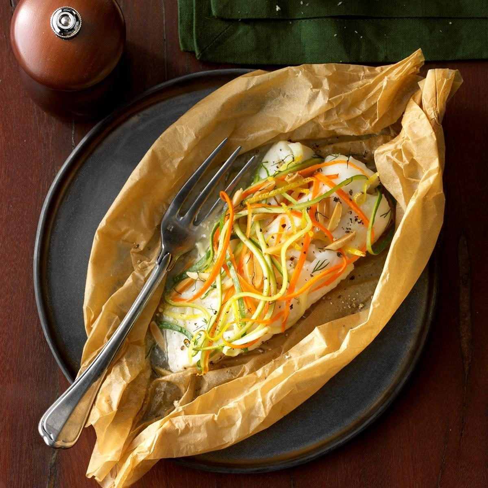

# En Papillote

*Fish, veg, herbs and a splash of wine, wrapped in a parchment parcel and baked. The parcel steams the contents in their own juices and is just about impossible to mess up. Best of all, you get to open it at the table with a cloud of fragrant steam, which is much more dramatic than it has any right to be.*

## Overview
En papillote ("in paper") is a French technique with Italian, North African and East Asian variants. Fish or seafood is placed on a sheet of parchment with vegetables, herbs, a flavoured liquid (wine, citrus juice, stock), and sealed inside the paper. The package goes into a hot oven. Steam from the fish and liquid cooks everything together; the paper traps the aromas.

The technique forgives almost everything. The closed package means low and even heat. Over-cooking by 2 minutes turns the fish slightly firmer but rarely dry. The hardest part is folding the paper properly.

Best for: lean white fish (cod, sea bass, hake, plaice, halibut), salmon, prawns, scallops, cleaned squid. Best paired with: thinly-sliced vegetables that cook in the same time as the fish (10-12 minutes).

## The Universal Recipe

For 2 portions:

### Ingredients
- 2 fish fillets, skin-on or skinless (150-200 g each)
- 2 sheets of baking parchment, 30 x 40 cm each
- Aromatic vegetables (one or two of: thin-sliced fennel, courgette ribbons, julienned carrot, halved cherry tomatoes, shallots, leek thinly sliced)
- Fresh herbs (dill, parsley, basil, tarragon, lemon thyme; pick one or two)
- 4 tablespoons white wine (or dry sherry, or vegetable stock)
- 30 g cold butter (or 2 tablespoons olive oil)
- 1 lemon (zest and slices)
- Salt and pepper

### Method

**Step 1 - Heat the oven.**
180 C (160 fan). Place a baking sheet on the middle rack.

**Step 2 - Set up the parchment.**
1. Fold each sheet in half. Open back up.
2. Lay the parchment on the counter. The fold line is your hinge.

**Step 3 - Layer the package.**
1. On one half of the parchment (not on the fold), lay:
   - A handful of sliced vegetables (small bed for the fish to sit on).
   - The fish fillet on top.
   - 2-3 strips of lemon zest.
   - 1 thin slice of lemon on top of the fish.
   - 1 sprig of fresh herb.
   - 15 g butter (cubed) or 1 tablespoon olive oil.
   - 2 tablespoons white wine drizzled over.
   - Pinch of salt, grind of pepper.

**Step 4 - Seal the parcel.**
1. Fold the other half of the parchment over the top, like closing a book.
2. Starting at one corner of the fold, make a series of small triangular folds along the cut edges, each fold overlapping the previous. Work all the way around the open edge.
3. Press each fold tightly. The final fold should sit flat. The parcel should look like a half-moon with a crimped edge.

If sealing in paper baffles you (it baffles everyone the first time), use a small parchment paper bag (sold at kitchen shops) or seal with butter-side-up squares of foil. The result is the same; the look is slightly less elegant.

**Step 5 - Bake.**
1. Place the parcels on the hot baking sheet.
2. Bake at 180 C for 10-15 minutes, depending on fillet thickness.

Timing guide (fillets 2 cm thick):
- 10 minutes for thin fillets (plaice, sole).
- 12 minutes for medium (sea bass, cod).
- 14-15 minutes for thick (salmon, halibut).

The parcel will puff dramatically as steam builds inside.

**Step 6 - The drama.**
1. Carry the parcels to the table on the plates.
2. Open at the table with a small knife or scissors. The steam billows up fragrant.
3. Serve from the open paper, or tip onto the plate.

## Three Worked Examples

### Sea Bass, Fennel, Tomato (Italian-Style)
Sliced fennel bulb (very thin), halved cherry tomatoes, chopped flat-leaf parsley, basil leaves, olive oil, white wine, lemon zest. Sea bass fillet on top. 12 minutes.

### Salmon, Asparagus, Tarragon (French-Style)
Trimmed asparagus tips, 1 small shallot finely sliced, fresh tarragon leaves, white wine, butter, lemon. Salmon fillet on top. 14 minutes.

### Cod, Leek, Saffron (Spanish-Style)
Thin leek, halved cherry tomatoes, fresh thyme, pinch saffron, white wine, olive oil, a splash of sherry. Cod loin on top. 12 minutes.

### Prawns, Coconut, Lime, Coriander (Thai-Style)
Halved cherry tomatoes, very thin shallot, 1 tablespoon coconut milk, lime juice, lime zest, 1 small red chilli (sliced), coriander leaves, fish sauce. Peeled prawns on top. 8-10 minutes.

## What Goes With En Papillote

The fish-and-veg parcel is a complete dish. Open over a plate so the juices run; serve with a starch alongside (rice, crushed potatoes, crusty bread for soaking the juices).

## Common Mistakes

**The parcel didn't puff.**
Seal was loose; steam escaped. Crimp the edges tighter. A well-sealed parcel should puff to twice its raw thickness.

**Fish is overcooked.**
Too thick a fillet for the bake time, or oven too hot. Drop temperature to 170 C; aim for 12 minutes max for medium-thick fillets.

**Vegetables are raw.**
Sliced too thick. Cut vegetables as thin as possible (julienne for carrots, ribbons for courgette, very thin slices for fennel and leek).

**Fish is dry.**
Not enough liquid in the parcel. The wine, butter and vegetable juices should provide enough steam. Add 1 more tablespoon of wine next time.

**The parcel leaked during baking.**
Folds weren't tight enough. Practise on a small parcel first. The seam should be triangular and overlap each previous fold.

**Bottom is wet, top is dry.**
Too much liquid pooled below. The bed of vegetables should absorb most of the liquid; if it's too little vegetable, the fish sits in a puddle.

## Foil vs Parchment

Parchment is the classical choice. It traps steam and the puffed parcel is dramatic at the table. The slight char on the paper adds a faint smoky note.

Foil works practically but is less elegant. The foil reflects heat differently; the fish takes 2-3 more minutes to cook. The opening drama is less; foil unwraps rather than puffing open.

For most home cooks: parchment for guests, foil for a quick weeknight.

## Where Next
- [Pan-Frying](pan-frying.md): the everyday alternative.
- [Curing](curing.md): no-cook preparations.
- [Whole Fish](whole-fish.md): scaling and prepping a whole fish for an en papillote.
- [Fish Course landing](fish.md): back to the main course.
