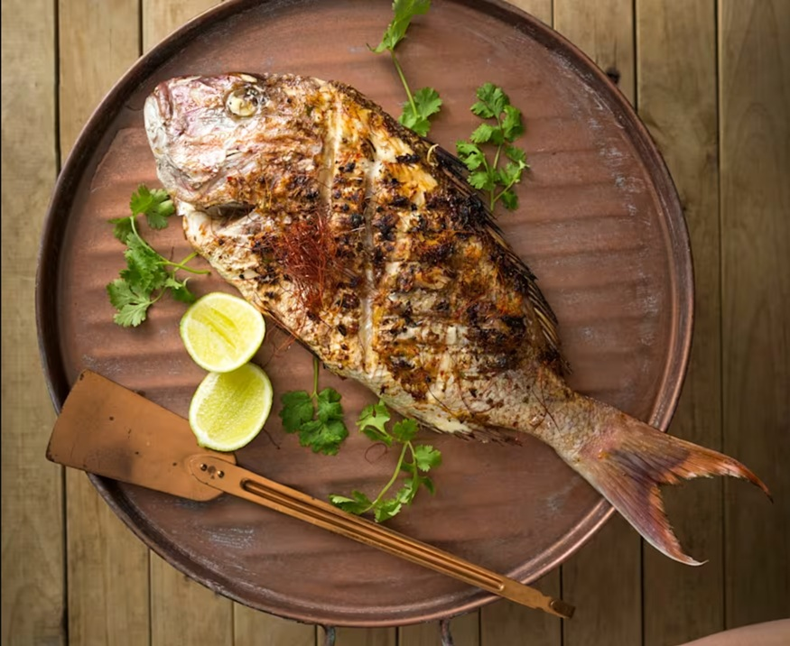

---
allergens:
  - fish
tags:
  - dairy-free
  - gluten-free
  - fish
---

# Fish Course

*Fish is the most delicate thing on your stove and the easiest to overshoot. Half a minute too long and a flaky tender fillet turns dry and chalky. The good news is that the techniques worth knowing are few: pan-fry for crisp skin, en papillote for gentle steam, cure for raw preparations, and learn enough about whole fish to buy from a fishmonger with confidence. Cover those four and most of fish cookery is yours.*

## Overview
Fish has half the connective tissue of meat. The proteins coagulate and the moisture evaporates at lower temperatures and faster than meat. Most home cooks treat fish like a smaller piece of chicken: cook it 8-10 minutes, season heavily, slap a sauce on it. The result is dry, dense, often grey.

The correct approach: cook fish briefly, use the residual heat in the fish itself, and let the texture (not the appearance) tell you when it's done.

The standard test: press the centre of the fish with a finger. If it gives like firm jelly and springs back, it's cooked. If it feels like a sponge that gives easily under pressure, it's under. If it feels like dense rubber, it's over.

## Course Outline

- [Pan-Frying](pan-frying.md): the everyday technique. Crispy skin, moist flesh, ready in 5 minutes. Most home cooks skin-up; correct technique is skin-down first.
- [En Papillote](en-papillote.md): parchment-paper steaming. Fish + vegetables + herbs + a splash of wine, sealed in paper, baked. Gentle, fragrant, almost impossible to over-cook.
- [Curing](curing.md): salting fish for a few hours (gravlax) or "cooking" with acid (ceviche). Raw preparations that turn the protein opaque without heat.
- [Whole Fish](whole-fish.md): scaling, gutting, filleting, roasting whole. The skills that let you buy from a fishmonger rather than the supermarket and save 30-50%.

## The Critical Principle: Don't Over-Cook

Fish goes from raw to cooked at 55-65 C, depending on species. Past 70 C the proteins shrink hard and squeeze out moisture; the fish turns chalky and dry.

This is dramatically lower than meat. A medium-rare steak is 55 C; a medium-rare fish is 50-52 C. Most fish should be pulled at 55-60 C internal.

How to test without a thermometer:
- **Skin-side fish.** Press a thumb against the thickest part. Firm-jelly bounce = done. Spongy = under. Solid no-give = over.
- **Steaks.** Insert a knife into the centre and check the colour. Bright translucent pink = under. Just-opaque with a hint of glossy in the middle = done. Bone-white throughout = over.
- **Filets.** Lift one edge with a fork; the fish should flake easily when twisted but not fall apart.

## Buying Fresh Fish

Three rules:
1. **Smell first.** Fresh fish smells of the sea, not of fish. If it smells "fishy" it's past prime.
2. **Eyes second.** Whole fish should have clear bright eyes. Sunken cloudy eyes mean old fish.
3. **Texture third.** Press the flesh; it should spring back firm. Soft mushy flesh is old.

A fishmonger is worth seeking out. Supermarkets often sell fish that has been in the chain for several days; a proper fishmonger turns stock daily and can advise on what's freshest that morning.

Sustainable buying: look for the MSC (Marine Stewardship Council) certified label, or check the Good Fish Guide (good-fish.org) for current sustainability ratings. Avoid bluefin tuna, North Sea cod (depending on stock year), and farmed Atlantic salmon from intensive operations.

## Where to Start
- New to fish: [Pan-Frying](pan-frying.md). Buy a fillet of sea bass or salmon, follow the technique, eat it 5 minutes later.
- Want to impress: [En Papillote](en-papillote.md). Looks dramatic, tastes elegant, almost impossible to mess up.
- Want raw: [Curing](curing.md). Make gravlax once and you'll never buy smoked salmon again.
- Want the real skill: [Whole Fish](whole-fish.md). Filleting your own fish is the cooking equivalent of changing your own car's oil; cheaper, more fun, you learn something.

## Where Next
- [Stocks-Sauces / Stocks](../stocks-sauces/stocks.md): fish stock from the bones makes the next dish twice as good.
- [Knife Skills course](../knife-skills/knife-skills.md): filleting needs a flexible fish knife; the basic-cuts course covers the techniques.
- [Stir-Fry course](../stir-fry/stir-fry.md): adding prawns or scallops at the right phase needs the ingredient-order timing covered there.
