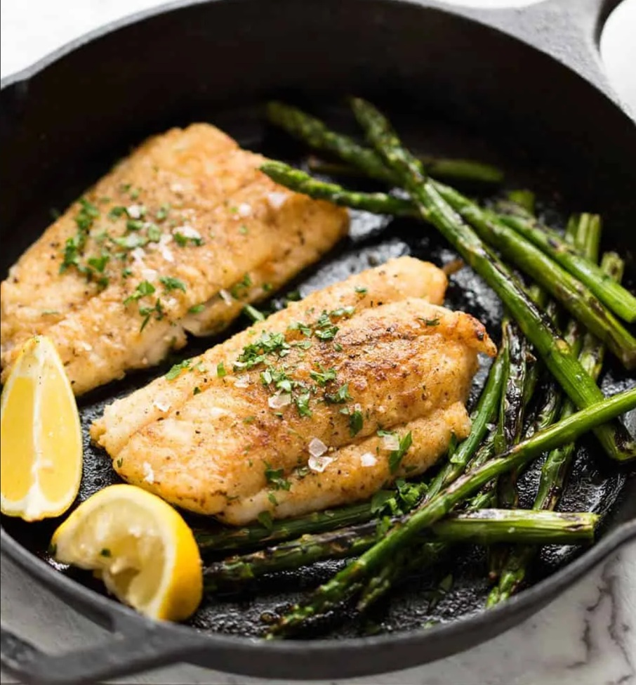

# Pan-Frying Fish

*Pan-fried fish is five minutes' work for one of the better dinners you can make. Skin-down into a hot pan, a press for the first half-minute, then leave it alone. The two things that go wrong at home are usually a cold pan and a wet skin. Fix those and the rest is dinner.*

## Overview
Pan-frying is the workhorse technique for filleted fish. Done well, you get a sheet of crackling crisp skin, golden brown, with moist flaky flesh underneath that takes a sauce or salsa beautifully. Done badly, you get rubbery soggy skin (or skin stuck to the pan), and overcooked dry flesh.

Three things matter:
1. **Dry skin.** Wet skin steams; dry skin sears.
2. **Hot pan.** Aim for a pan that sizzles audibly when the fish touches it.
3. **Press the fillet flat.** Skin curls when it hits the heat; uneven contact gives uneven cooking.

## Best Fish for Pan-Frying

Skin-on fillets of:
- **Sea bass** - the standard. Thin skin crisps to glass-shard crackle.
- **Salmon** - fatty, forgiving, beautiful golden skin.
- **Cod / hake** - meaty white fish. Skin slightly less dramatic but excellent.
- **Mackerel** - oily; skin crisps to pavement-tile crunch.
- **Bream** - similar to bass.
- **Snapper, gurnard, John Dory** - restaurant fish, all suit pan-frying.

Skinless fillets work but you miss the best part of the dish. Sole, plaice, monkfish are usually cooked skinless.

Avoid: very thick steaks (cook through too slowly; bake or sous-vide instead), oily tuna and bluefin (better cooked rare on grill).

## The Method

For 2 portions (250-300 g each):

### Ingredients
- 2 fillets skin-on white or oily fish (250-300 g each), bones removed
- 1 tablespoon vegetable oil (high smoke point; not olive)
- 30 g butter (added later)
- 1 lemon (for finish)
- Salt and white pepper

### Method

**Step 1 - Dry the skin.**
1. Lay the fillets skin-side up on a board lined with kitchen paper.
2. Press a fresh sheet of kitchen paper firmly against the skin. Pat dry hard.
3. Repeat with a new sheet until the paper comes away dry. The skin should look matte, not shiny.

Dry skin is the single most important step. Wet skin steams, sticks to the pan, never crisps. 30 seconds of patting is worth 5 minutes of cooking.

**Step 2 - Season just before cooking.**
1. Season the skin side generously with fine sea salt and white pepper.
2. Don't season the flesh side yet (the salt draws moisture, defeating the dry-skin work).

**Step 3 - Heat the pan.**
1. Heat a heavy-based non-stick or cast-iron pan over medium-high heat for 2 minutes.
2. Add the vegetable oil. Swirl. The oil should shimmer but not smoke.

A non-stick pan is more forgiving for the home cook; a cast-iron or carbon-steel pan gives a slightly better crisp but is less forgiving of mistakes.

**Step 4 - Skin-side down.**
1. Lay the fillets carefully into the pan, skin-side down, AWAY from you (so any splash goes away).
2. Press the fillets flat for the first 30 seconds with a fish slice or another small pan. The skin curls under heat; pressing keeps it flat against the metal.
3. Don't touch them otherwise. Let the skin crisp.

**Step 5 - The first 4 minutes.**
1. Cook over medium-high heat for 3-4 minutes. The skin develops a deep golden brown.
2. The fish should be visibly cooking from the bottom up; you can see the flesh turn from translucent to opaque about 70-80% of the way up the fillet.

How to check the skin: lift one corner with a fish slice. The skin should be deep golden brown and look crisp. Not? Cook another 30 seconds.

**Step 6 - Flip and finish.**
1. Once the flesh is opaque about 80% of the way up, slip the fish slice underneath and flip carefully.
2. Add the butter to the pan. As it melts and foams, tilt the pan and spoon the foaming butter over the flesh (this is "basting"; classical technique).
3. Cook the flesh-side for 30-60 seconds.
4. Test: press the centre with a finger. Firm-jelly bounce = done.

**Step 7 - Rest and serve.**
1. Lift onto a warm plate.
2. Squeeze lemon over the top.
3. The crisp skin should crunch under the fork. Serve immediately.

## Common Variations

### Pan-Fried Salmon
Skin needs more attention because salmon skin is thicker. Press flat for 60 seconds. Cook skin-down for 5-6 minutes; flip for 60-90 seconds. The flesh should still look slightly translucent in the very centre when you cut into it; salmon over-cooks rapidly.

### Pan-Fried Mackerel
Score the skin with a sharp knife in three diagonal lines per fillet to stop curling. Cook skin-down 4 minutes, flesh-side 90 seconds. Mackerel is rich; pair with sharp accompaniments (gooseberry, rhubarb, mustard).

### Pan-Fried Cod with Brown Butter
Standard cod fillets. Once flipped, add 30 g butter and 8 sage leaves. The butter goes nutty (beurre noisette) as the sage crisps. Drizzle over the fish to serve.

### Pan-Fried Sole (Meuniere)
Skinless dover sole (or plaice). Dust both sides with seasoned flour. Cook in foaming butter 2 minutes per side. Finish with brown butter, capers, parsley, and lemon. The classic.

## Common Mistakes

**Skin stuck to the pan.**
Skin wasn't dry enough, or pan wasn't hot enough. Patience: don't try to lift the fish until the skin has had its full sear time. It will release itself when ready.

**Skin is soft and rubbery, not crisp.**
Skin wasn't dry; or cook time too short; or basted with butter too early (butter sloshes onto the skin and softens it). Dry the skin; cook skin-down 4 full minutes before flipping.

**Flesh is dry and chalky.**
Over-cooked. Pull earlier next time. The fish should still be slightly translucent at the very centre when it comes off the heat; it carries over to fully done.

**Flesh is raw at the centre.**
Under-cooked. Lower the heat; cook a bit longer skin-down. Or finish in a 180 C oven for 3 minutes if the fillet is very thick.

**Pan smoked heavily.**
Too hot. Drop heat or move pan off burner momentarily.

**Fish broke when flipping.**
Slip the fish slice fully underneath. If the skin is properly crisp, the fillet should hold together as a single piece.

## What Goes With Pan-Fried Fish

- **Lemon and parsley.** The simplest.
- **Brown butter (beurre noisette).** Nutty, classical.
- **Salsa verde.** Capers, anchovy, parsley, garlic, olive oil. A bright counterpoint.
- **Romesco.** Roasted peppers, almonds, garlic, paprika. Spanish-style.
- **Sauce vierge.** Olive oil, tomato, basil, lemon. Mediterranean light.
- **Hollandaise.** Classical with salmon or cod.

## Where Next
- [En Papillote](en-papillote.md): the gentle alternative.
- [Curing](curing.md): raw preparations.
- [Whole Fish](whole-fish.md): bone-in, scaled, gutted.
- [Stocks-Sauces / Hollandaise](../stocks-sauces/hollandaise.md): the classical fish sauce.
- [Fish Course landing](fish.md): back to the main course.

## Storage
- Cooked fish is best eaten the day it's cooked: the texture firms and the flavour declines on reheat
- Refrigerate leftovers 1-2 days at most in an airtight container
- Reheat gently in a low oven (140°C, covered) or eat cold in a salad
- Do not freeze cooked fish: it goes mealy on thaw
