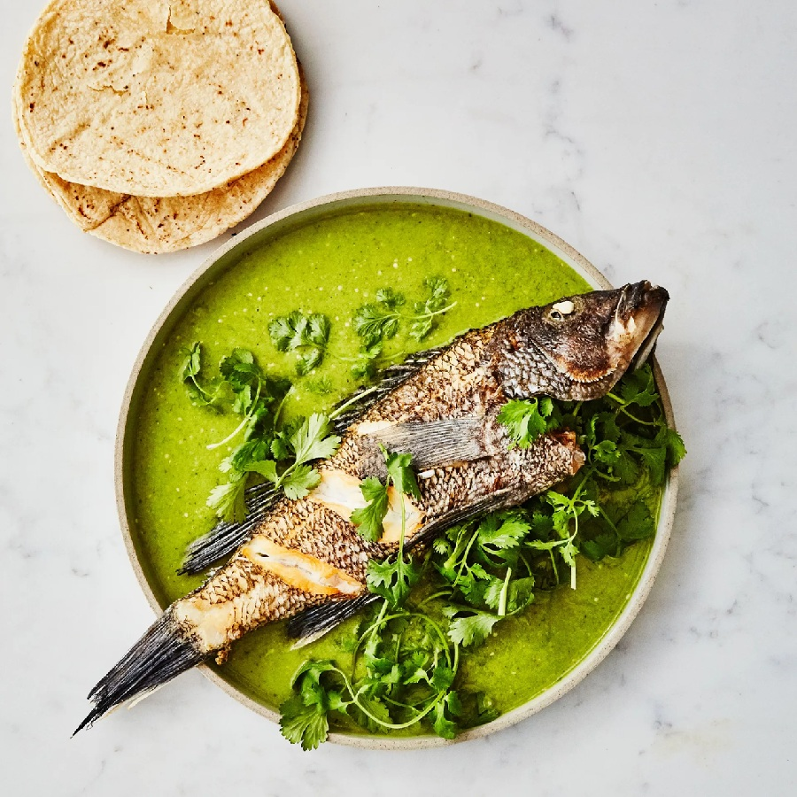

---
allergens:
  - fish
tags:
  - dairy-free
  - gluten-free
  - fish
---

# Whole Fish

*Knowing what to do with a whole fish lets you buy from a proper fishmonger instead of staring at the supermarket fillets. You get the bones for stock, the heads for fumet, the cheeks for the cook, and a fish that stays moister than any filleted portion. A whole sea bass on a tray with lemon and thyme is one of the easier weeknight wins going.*

## Overview
A whole fish is dramatically better value than a filleted one. The fishmonger charges by the whole-fish weight; you get the fillets, the head, the bones, the cheeks. The "fillet yield" is about 50% - half the fish is meat - but the rest is the foundation for fish stock, the cook's reward (cheeks, eaten standing up at the counter), and the head for sauce or display.

A whole fish also stays moister when cooked. The skin, bones and skeleton act as natural insulation against drying out. A whole roasted sea bass is harder to over-cook than a fillet.

This page covers four skills:
1. **Scaling.** Removing the scales.
2. **Gutting.** Opening the belly, removing the innards.
3. **Filleting.** Two clean fillets and a skeleton.
4. **Roasting whole.** The simplest cook, the most dramatic presentation.

Most fishmongers will scale and gut for free if you ask. Filleting is more skill and they usually charge for it. Doing all four yourself takes 5-10 minutes once you have the moves; it's faster than queueing for the fishmonger to do it.

## What You Need

- A sharp knife. Specifically: a fish knife (long, thin, flexible, 18-20 cm blade) for filleting. A chef's knife works for scaling and gutting.
- Fish tweezers or fine pliers (for pin bones).
- A scaling tool (optional). A blunt knife or a fish scaler works; both push the scales backward off the skin.
- A large chopping board.
- Kitchen paper.

## 1. Scaling

Most fish (sea bass, bream, sole, mullet) need scaling before cooking. If you can see scales, scale them. Fish like mackerel and salmon are sometimes scaled, sometimes not.

### Method
1. Wash the fish under cold water; pat dry.
2. Lay on a chopping board. Hold the tail.
3. Run the back of a knife (or a fish scaler) from tail to head, against the direction of the scales. The scales lift off and fly everywhere; do this over a sink or with a tea towel ready to catch them.
4. Continue until both sides are smooth. The skin should feel slick, not bumpy.
5. Rinse under cold water; pat dry.

### Tips
- Do this outside or over a sink. Scales fly everywhere.
- Hold the fish by the tail with a piece of kitchen paper for grip.
- A scaling tool with raised teeth removes scales much faster than a knife. Worth £5-10.

## 2. Gutting

Most fishmongers gut for free; ask. If you need to do it yourself, it's about 60 seconds per fish.

### Method
1. Lay the fish on its side on a chopping board.
2. Insert the tip of a sharp knife into the vent (the small hole on the underside, near the tail).
3. Push the knife shallowly forward along the belly, away from you, toward the head. Stop just below the gills.
4. The belly is now open. Reach in with your fingers; pull out the innards in one motion (they come out cleanly once cut free).
5. Cut the dark red strip along the spine (this is the "bloodline"; remove it for a cleaner taste).
6. Rinse thoroughly under cold water. Pat dry inside and out.

Done.

### Tips
- Cut shallowly. A deep cut nicks the innards and makes the cavity messier than it needs to be.
- For larger fish, also remove the gills (the red feathery structures inside the head). They turn stock bitter. Use scissors or pliers.

## 3. Filleting

The skill that takes practice. The first three or four fish you fillet will yield ragged messy fillets; by the fifth you'll have clean ones. The technique:

### Method (For a Round Fish: Sea Bass, Trout, Mackerel)

1. Lay the gutted fish flat on a chopping board, head pointing left (if you're right-handed; reverse if left-handed).
2. **First cut.** Behind the gills, cut down through the flesh to the bone, then turn the knife to point toward the tail.
3. **Slide along the spine.** Keep the blade flat against the bone. Use long strokes from head to tail, lifting the fillet as you go.
4. **Around the rib cage.** When you hit the rib bones, glide the knife over them (don't cut through). The flesh lifts cleanly off the bones; you can see the spine through the gap.
5. **Off the tail.** At the tail, slice down and through the fillet to release it.
6. **Flip the fish.** Repeat on the other side.

### Method (For a Flat Fish: Sole, Plaice, Halibut)

1. Lay flat. The flat fish has dark skin up.
2. Cut along the centerline from head to tail. Then around the head (a curved cut following the gill line).
3. With the knife held flat to the spine, slide it from centerline outward, between the flesh and bones. The "top" fillet (the side facing up) comes off in one piece.
4. Flip the fish. Repeat for the second top-side fillet.
5. Flat fish yield 4 fillets per fish (2 from each side, divided by the spine).

### Pin Bones

After filleting, most fish have a row of fine pin bones running down the centre of the fillet (about 1/3 of the way in from the side). Run your finger along; you'll feel them. Pull each out with fish tweezers (grip and pull straight back, not up). Takes 60 seconds per fillet.

## 4. Roasting Whole

The simplest cook and the most dramatic presentation. The fish is left in one piece and roasted with aromatics in the cavity.

### Standard Recipe (Sea Bass for 2)

1 whole sea bass (about 800 g - 1 kg)
- 1 lemon (sliced)
- 4 sprigs fresh thyme or oregano
- 4 garlic cloves (smashed)
- 2 tablespoons olive oil
- Salt and pepper
- 100 ml white wine
- 1 handful cherry tomatoes (optional)

### Method

1. Heat the oven to 200 C (180 fan).
2. Scale and gut the fish (or have the fishmonger do it).
3. Pat the fish dry. Score the skin diagonally on both sides, 3-4 cuts each side, about 0.5 cm deep (these help heat penetrate and the seasoning to flavour the flesh).
4. Rub the fish all over with olive oil. Season generously with salt and pepper inside and out, including in the scored cuts.
5. Stuff the cavity with lemon slices, herbs and crushed garlic.
6. Place on a sheet of baking paper on a roasting tray. Add the cherry tomatoes around. Pour the white wine into the tray.
7. Roast 20-25 minutes for a 800 g - 1 kg fish. The skin should be crisp and golden; the flesh inside should be opaque and flake easily from the bone.

To test doneness: insert a knife behind the gills, into the thickest part. The flesh should come away from the bone easily and be opaque all the way through.

### Carving and Serving

1. Bring the fish to the table on its tray for the visual.
2. To serve: lift the fillet from the top side along the spine with a fish slice (it slides off the bones in one piece). Cut into portions.
3. Once one side is served, lift the spine away. The bottom fillet is now exposed and easy to serve.
4. Serve with the tray juices, plus the soft roasted garlic and tomatoes.

## Other Whole-Fish Techniques

### Steamed Whole (Chinese-Style)

A whole bream or sea bass laid on a steamer above boiling water with ginger, scallion, soy sauce, sesame oil. 10-12 minutes. The classical Cantonese way; produces extraordinarily delicate fish.

### Grilled / BBQ Whole

Scored skin, oiled, seasoned. Grilled over hot coals 7-10 minutes per side. Smoky, charred skin, succulent inside. The Mediterranean beach-restaurant standard.

### Baked in Salt Crust

Whole fish encased in a paste of egg-white-and-coarse-salt, baked. The crust seals in moisture; when cracked open at the table, the fish is perfectly cooked. Theatrical.

### Whole Stuffed and Tied

A larger fish (mackerel, sea bream, sea bass) stuffed with breadcrumbs-and-herbs or fennel-and-citrus, tied with string, roasted. Sunday-supper portion fish.

## Using the Rest

A 1 kg whole sea bass yields:
- 2 fillets (350 g total)
- 1 head + 1 backbone + 1 collar + tail (350 g)
- Innards (discard)

### Fish stock from the bones
Rinse the bones thoroughly (remove gills if not already). Place in a stockpot with cold water, white wine, sliced leek, parsley stalks, bay leaf, peppercorns. Simmer 30-40 minutes. Strain. The result is 1-1.5 litres of clean fumet; the base of fish veloute, bouillabaisse, soup.

### Cheeks
Behind the gills, on each side of the head, are two small pieces of flesh called cheeks. Cooked alongside the fillets, they're the best bit. Pull out with a fork; eat hot.

### Crispy collar
The collar (the curve of flesh below the gill on each side) crisps beautifully when roasted alongside. Sushi restaurants sell this as "salmon collar"; the home cook simply eats it standing up at the counter while the fillets cool.

## Common Mistakes

**Skin tears during scaling.**
Scaling too aggressively. Push the scales off lightly; don't gouge.

**Fillets are ragged.**
Knife not sharp enough, or technique unsteady. Sharpen the knife; practise on cheap mackerel before tackling a £20 sea bass.

**Pin bones missed.**
Run your finger down the fillet after filleting; feel for them. Pull each out with tweezers.

**Roasted fish is dry.**
Over-baked, or fish too small for the time. A 1 kg fish needs 20-25 minutes; a 500 g fish needs 12-15 minutes. Smaller fish dry out faster.

**Skin didn't crisp on the roast.**
Didn't score, or didn't oil generously enough. Score the skin and oil thoroughly. For maximum crisp, finish under a grill for 1-2 minutes at the end.

**The cavity stuffing fell out.**
Not tied. Tie the cavity closed with kitchen string, or skewer with toothpicks.

## Where Next
- [Pan-Frying](pan-frying.md): for the fillets you've just produced.
- [En Papillote](en-papillote.md): another gentle cook.
- [Curing](curing.md): the raw and salt-cured options.
- [Stocks-Sauces / Stocks](../stocks-sauces/stocks.md): turn the bones and head into fumet.
- [Fish Course landing](fish.md): back to the main course.
