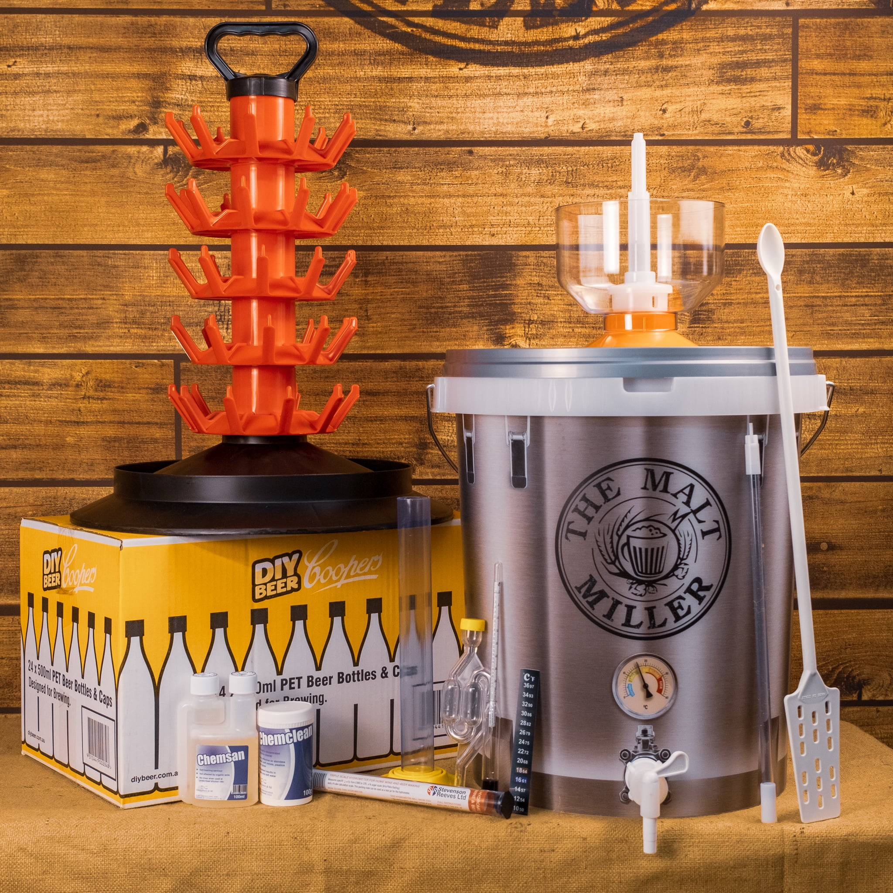

# Home Brewing Equipment and Hygiene

*Everything you need for a 20-litre batch of strong ale, what's optional, and the sanitisation routine that prevents off-flavours and infected batches.*

## Overview
Home brewing needs more gear than winemaking because beer brewing involves a hot boil (where wine just ferments cold) and bottling under pressure with carbonation (where wine bottles still). The two extra cost centres are a large boil kettle (you need a vessel that holds at least 25 litres and can sit on a stove) and a fermenter with a tap for easy bottling. Apart from those, the gear overlaps significantly with winemaking, same airlocks, same sanitisation chemistry, same hydrometer, same bottling principles.

A starter kit for making 20-litre batches comes in around **£80-£120 from scratch**. Charity shop scrounging and Facebook Marketplace can bring it under £60.

## The starter kit

### Brewing
- **1 × large stainless steel stockpot (25-30 litres)**: the boil kettle. Crucial. £40-£80 new; second-hand £15-£25. Aluminium also works but stainless is more durable.
- **1 × long-handled stainless or plastic stirring paddle**: for stirring during boil and mash. £8.
- **1 × kitchen thermometer (probe style, reading up to 110°C)**: for confirming wort temperature pre-boil and pre-pitch. £6.
- **1 × large fine-mesh muslin or hop bag**: holds the hop additions during the boil so spent hops are easy to remove. £4.

### Cooling
- **1 × wort chiller (copper coil, 12-15 metres long)** OR a clean kitchen sink filled with ice, to cool 20 litres of boiling wort to fermentation temperature (20°C) within 30 minutes. Copper chiller £35; ice-bath method free but slower.

### Fermentation
- **1 × food-grade fermenter bucket with lid and tap (25-30 litre capacity)**: wide-mouth, easy access, has a tap at the bottom for racking and bottling. £15-£25. Game-changer convenience over a tap-less bucket.
- **1 × airlock + grommet/bung**: same as winemaking. £2.
- **1 × hydrometer + trial jar**: same as winemaking. £6-£10.
- **1 × thermometer strip (adhesive, sticks to the side of the fermenter)**: lets you see fermentation temperature at a glance. £4.

### Bottling
- **40 × 500ml beer bottles** OR **30 × 750ml bottles**: re-used commercial bottles (Grolsch swing-tops are excellent), or pressure-rated home brewing bottles. Free if you save commercials.
- **1 × bottling wand / bottle filler**: a rigid plastic stick with a spring-loaded valve that fills bottles cleanly. £6.
- **40 × bottle caps + a capper**: for crown-cap bottles. Caps £3 for 100; bench capper £20.
- **Priming sugar**: about 4 g per litre of beer for natural carbonation. Bulk dextrose £2 per kilo.

### Hygiene
- **Sodium metabisulphite (campden tablets) OR Star San**: same as winemaking. £5 lasts ages.

**Total: £80-£120 starting from scratch**, less with second-hand acquisitions.

## What you don't need (yet)

- **A second fermenter for secondary**: for most strong ales, conditioning in the primary fermenter for an extra week works fine. A secondary becomes useful for long-aging beers (10+%, year-long conditioning).
- **A grain mill**: only relevant for all-grain brewing. Pre-crushed malts from any brewing shop arrive ready to use.
- **A kegging system**: bottling works perfectly well. Kegs become attractive only once you brew weekly and want the convenience.
- **A wort aerator pump**: vigorous stirring at the end of the cooling phase aerates well enough.
- **A refractometer**: a luxury upgrade over a hydrometer. A hydrometer does the same job for far less money.

## The hygiene routine

The same rule from winemaking applies, with one addition for beer: **everything that touches the wort or beer AFTER the boil must be sanitised**. Pre-boil gear (the kettle, the stirrer, the muslin) doesn't need sanitising because the boil kills everything. Post-boil gear (the fermenter, the airlock, the chiller, the hydrometer, the spoon, the bottling wand, every bottle, every cap) absolutely does.

### How to sanitise

Same chemistry as winemaking, see the [Winemaking Equipment page](../winemaking/equipment.md) for the detailed procedures.

Quick reference:
- **Star San at 1.5 ml per litre of cold water**: spray, 30 seconds contact, no rinse, ready to use.
- **Campden tablet solution (1 tablet per 500 ml water)**: spray or rinse, 5 minutes contact, brief tap rinse before use.

### The bottling sanitisation pass

Before bottling, you'll need to sanitise 40+ bottles. The efficient way:
1. Fill a large bucket with Star San solution.
1. Dunk each bottle for 30 seconds, drain upside down on a clean tray.
1. Cap the bottles immediately after filling, sanitised caps in a sanitised bowl ready to grab.

## The infection signs

If you do everything right, this never matters. But know what to look for:
- **Pellicle**: a thin white or grey film on the surface of the fermenting beer. This is wild yeast or bacteria. Some pellicles indicate a Brett or sour culture (intentional in some beer styles); unintentional ones are infections.
- **Off smells**: vinegar (acetic acid), nail polish (esters), rotten egg (sulphur), wet cardboard (oxidation), or generally "off" smells that don't match the expected beer aroma.
- **Excessive foam at bottling**: indicates continued fermentation; bottles will be over-carbonated (bottle bombs).
- **Cloudy beer that won't clear** even after 4 weeks: yeast in suspension or pectin haze; usually harmless but indicates the yeast didn't flocculate well.

Treatment: minor pellicles can be skimmed off without ruining the batch; serious infections usually mean tipping the batch and starting over with stricter sanitation.

## Water quality

Tap water in most of the UK is fine for brewing. Two warnings:
- **Chlorine and chloramine** in tap water can produce off-flavours (medicinal, plaster-like). Fill the kettle the night before brew day and leave it sit covered loosely; chlorine off-gases naturally. Or use a 25 mg crushed campden tablet to neutralise chloramine.
- **Hard water** with high mineral content is fine for most ales (English-style beers were designed around hard water). Soft water shines for lager and pilsner.

For a beginner, just use cold tap water that's been sat overnight. Don't worry about water chemistry until you've made 5+ batches.

## Where to buy

- **Online specialists**: The Malt Miller, Brewstore, Hopt, Get Er Brewed.
- **Local home brew shops**: most UK cities have one; staff are usually happy to chat through a starter kit.
- **Amazon / The Range / Wilko**: basic kits cheaper than specialist; ingredients usually inferior quality.
- **Charity shops and Facebook Marketplace**: second-hand bottles, fermenters, kettles. Always sanitise hard first time.

## Next step

When your kit is clean and ready, head to [Strong English Ale](strong-ale.md) for the recipe.
