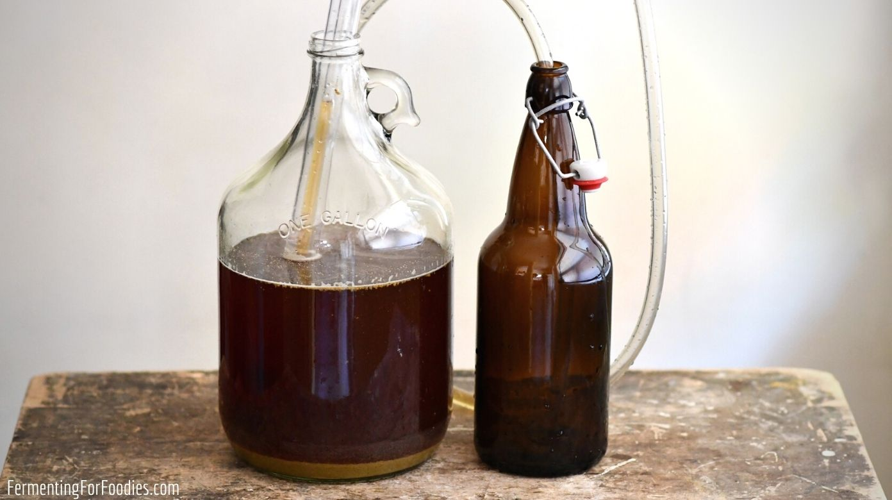

# Home Brewing Course

*Home brewing strong beer is the perfect crossover hobby for someone who likes both cooking and chemistry. The mash is a long warm soup, the boil is a hop-scented kitchen reduction, the fermentation is yeast at work, the bottling is a careful pour. Three weeks from kettle to first pint.*

## Overview
Beer is four ingredients (water, malted barley, hops, yeast) and a sequence of temperatures applied to them. The first phase, the **mash**, soaks crushed malted barley in warm water (around 66-68°C) where natural enzymes in the barley break starch into sugar. The second phase, the **boil**, takes the sugary liquid (called "wort") and boils it hard with hops, which adds bitterness and aroma. The third phase, **fermentation**, is yeast eating the sugar and producing alcohol and CO2 just like in winemaking. The fourth phase, **conditioning**, lets the beer mature and carbonates it in the bottle.

This course teaches you to make **strong English-style ale (7-8% ABV)** using the **extract method**: the beginner's path that skips the mash by using pre-prepared malt extract. Once you've made a few good extract batches, full all-grain brewing is a natural progression that uses the same fermentation, hop and bottling techniques you learn here.

UK home brewing is legal for personal use up to any quantity without a licence. Sale requires HMRC permits.

## Course Outline

### 1. Foundations
- [Equipment and Hygiene](equipment.md): the gear you need for a 20-litre batch, how to sanitise, the differences from winemaking equipment.
- [Mash, Hops and Fermentation](mash-and-hops.md): the science, what malt extract is, what hops do at each addition time, fermentation temperature, why conditioning matters, carbonation maths.

### 2. Practical Recipes
- [Strong English Ale (Extract Method)](strong-ale.md): the full recipe, a 7-8% ABV strong English ale made with malt extract, crystal malt steeping grains, English hops (Fuggles + East Kent Goldings), and English ale yeast. Beginner-friendly, properly tasty, the introduction to brewing.

## How long until you have beer?

| Stage | Time |
|---|---|
| Brew day (the day you boil + ferment) | 4 hours active |
| Primary fermentation (active bubbling) | 7 to 10 days |
| Secondary / conditioning (in fermenter) | 7 to 14 days |
| Bottling | 2 hours |
| Bottle conditioning (carbonation builds) | 14 to 21 days at room temp |
| Aging in cool storage | 2 to 6 weeks improves it |

So from brew day to drinkable beer: about 5-6 weeks. From brew day to genuinely good beer: 8-10 weeks. From brew day to peak: 3-6 months for a strong ale.

## What you need to know going in
- **Strong beer takes longer than weak beer.** Higher ABV means more alcohol in the bottle, which mellows from harsh to smooth over weeks. A 4% session ale is good at 3 weeks; a 7-8% strong ale wants 8 weeks minimum.
- **Hygiene is everything (again).** Same rule as winemaking: every vessel, tube, spoon and bottle that touches the post-boil beer must be sanitised. Pre-boil contamination is killed by the boil; post-boil contamination ruins the batch.
- **The boil sets the bitterness; the late hops set the aroma.** Beer's character is built by when you add the hops, not how much you add overall. The 60-minute hop addition gives bitterness; the 15-minute addition gives flavour; the 5-minute or end-of-boil addition gives aroma. Dry hopping (adding hops to the fermenter cold) gives the most aroma of all.
- **Patience.** Like wine, beer doesn't tell you when it's done. Resist the urge to taste at every stage; the off-flavours in young beer disappear with conditioning.

## Equipment summary

A home brewing starter kit for 20-litre batches costs about £80-£120 from scratch. Detailed list on the [Equipment](equipment.md) page.

## Legal note (UK)
Home brewing for personal use is legal in the UK at any quantity, without a licence. Sale requires HMRC permits and Brewer's Duty payment. Gifting bottles to friends is the common practice and falls into the legal grey area but is widely accepted.

## Beyond extract brewing

Once you've successfully made 2-3 batches with extract, the natural progression is **all-grain brewing**. Instead of using malt extract syrup, you crush whole malted barley grains and "mash" them yourself in 25-30 litres of hot water, extracting sugars in your own kitchen. All-grain gives you fuller control over the malt character of the beer and lower ingredient costs, but adds about 2 hours of brew-day work and needs an additional vessel (a mash tun). This course covers extract brewing only; all-grain is a worthwhile next step but isn't necessary to make excellent beer.
