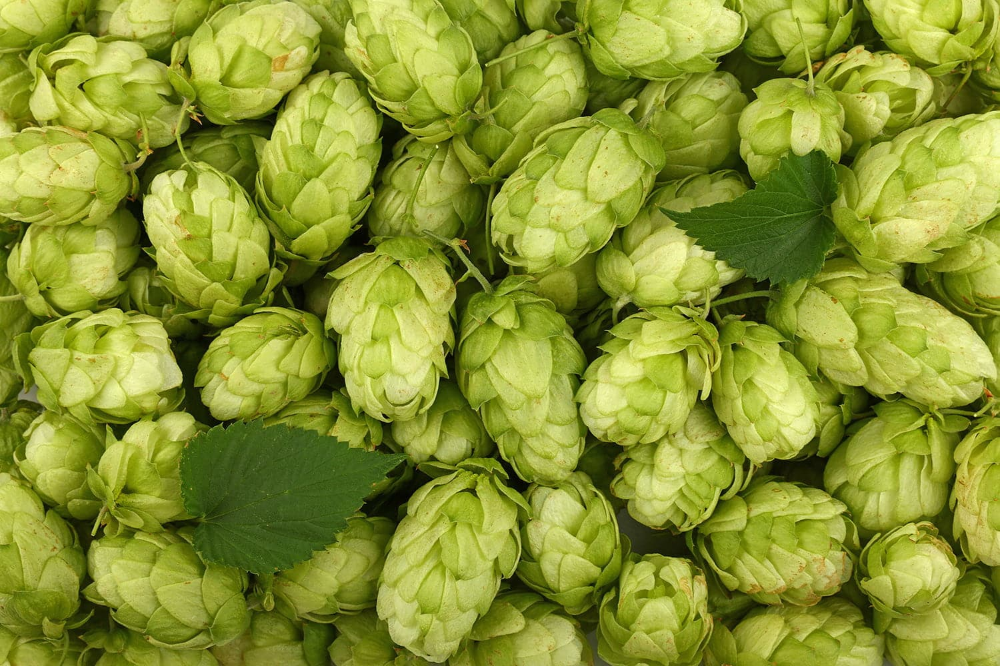

# Mash, Hops and Fermentation

*The science of brewing — what malt extract actually is, what hops do at different addition times, how fermentation temperature shapes flavour, why conditioning matters, the maths of carbonation. Just enough theory to troubleshoot a batch that isn't going where you expected.*

## Overview
The four phases of brewing — mash, boil, fermentation, conditioning — each work on a specific set of compounds and produce specific outcomes. Understanding what each phase does (and what each ingredient contributes) lets you predict the end result before you brew, troubleshoot when things drift, and design your own recipes once you've got the basics down.

This page covers the chemistry behind the [Strong Ale](strong-ale.md) recipe and explains how to adapt it.

## Malt and the mash

### What's in malt
Barley grain, when malted (germinated then kiln-dried), contains:
- **Starches** — long chains of glucose. The barley plant stored these to fuel its growth; we'll convert them into fermentable sugars during the mash.
- **Enzymes** — particularly alpha-amylase and beta-amylase. These break starches into sugars. Active at specific temperatures (62-72°C).
- **Proteins** — give body and head retention to the finished beer.
- **Husks** — fibrous outer layer; doesn't contribute flavour but acts as a natural filter bed.

### What the mash does

In all-grain brewing, you soak crushed malted barley in 65-70°C water for an hour. The enzymes in the barley dissolve into the water and break the starches into sugars. The temperature you choose determines the sugar profile:
- **Lower mash (62-66°C)** favours beta-amylase, which produces more maltose (highly fermentable). Result: drier, lower-body beer with higher ABV.
- **Higher mash (68-72°C)** favours alpha-amylase, which produces more dextrins (less fermentable). Result: fuller-bodied, sweeter beer with lower ABV.

The typical English ale mash is 66°C — produces a slightly fuller beer with maltose dominant.

### What malt extract is

Malt extract is what a commercial brewery produces by doing the mash for you and then concentrating the resulting wort by evaporating most of the water. It comes in two forms:
- **Liquid Malt Extract (LME)** — sticky dark syrup, about 80% sugars. Pre-dissolved.
- **Dry Malt Extract (DME)** — powder, about 95% sugars. Lighter and easier to weigh.

When you brew with extract, you skip the mash entirely. The recipe in this course uses 3.5 kg of DME total, which has had its mashing done for you by Muntons or Brewferm. The extract is a known sugar source; you just dissolve it in water and proceed to the boil.

DME is generally cleaner-tasting and easier to store than LME. Both produce excellent beer.

### Steeping grains

Even with extract brewing, you can add character via a small amount of steeping grains. Crystal malt (a kilned malt with crystallised sugars inside the husk), chocolate malt, roasted barley, and similar coloured malts can be steeped in 70°C water for 20 minutes to extract their flavour and colour without needing a proper mash. The 300 g of crystal malt in the recipe adds caramel-toffee notes that pure extract beers lack.

## Hops

### What hops contribute

Hops are the dried flowers of the Humulus lupulus vine. They contribute three things to beer:
- **Bitterness** — from alpha acids that isomerise during the boil. The longer hops boil, the more bitterness extracted.
- **Flavour** — aromatic oils that survive a short boil but vaporise with extended boiling.
- **Aroma** — volatile compounds that boil off rapidly. Aroma is highest from hops added late in the boil or after the boil entirely.

### The four hop addition points

A typical beer recipe has hops added at multiple points during the boil:

| Timing | Effect | Why |
|---|---|---|
| **60 mins (start of boil)** | Bitterness | Full hour of boiling extracts maximum alpha acids |
| **15 mins (mid-boil)** | Flavour | Some bitterness, some flavour, some aroma |
| **5 mins (late-boil)** | Aroma | Aromatic oils preserved; little bitterness |
| **Whirlpool / flameout** | Aroma | Hops added when heat is off; pure aroma |
| **Dry hop (post-fermentation)** | Massive aroma | Hops added cold to the fermenter for 3-7 days |

The Strong Ale recipe uses Fuggles at 60 minutes for bittering, East Kent Goldings at 15 minutes for flavour, and East Kent Goldings at 5 minutes for aroma. This is the classic English ale hop schedule.

### Bitterness units (IBUs)

Bitterness in beer is measured in International Bitterness Units (IBUs). A light lager has 10-15 IBUs; an English bitter has 25-35 IBUs; an IPA has 50-70 IBUs; a triple IPA can exceed 100 IBUs. The recipe for the Strong Ale targets about 35-40 IBUs — balanced English-style bitter, not aggressively hoppy.

The maths is: (alpha acid % × hop weight in grams × % utilisation) ÷ wort volume in litres. You don't need to do this by hand; free online calculators like Brewer's Friend or the BJCP calculators do it for you.

## Fermentation

### What yeast does in beer

The same Saccharomyces cerevisiae that makes wine also makes beer (different strains, same species). It eats the sugars from the malt and produces:
- **Ethanol** — what you came for.
- **CO2** — bubbles off during fermentation; will be re-introduced via priming sugar at bottling.
- **Esters** — fruity flavour compounds. More at warmer fermentation temperatures.
- **Phenols** — clove-pepper flavour compounds, distinctive in Belgian and German wheat beers.
- **Diacetyl** — buttery off-flavour. Cleaned up by the yeast during the conditioning phase.
- **Sulphur compounds** — most strong in young beer, dissipate with conditioning.

### Why temperature matters

Ale yeast (the kind in this recipe) is happy at 18-22°C and produces a clean, slightly fruity beer. Above 25°C it produces more esters (banana, bubblegum flavours) and higher alcohols (warming, solvent flavours). Below 16°C it goes dormant.

Lager yeast (Saccharomyces pastorianus) is a different beast: ferments at 8-12°C and produces a much cleaner profile with no fruit esters. Lager brewing needs a temperature-controlled fridge for the cold ferment, which is why beginners usually start with ales.

### Why conditioning matters

After primary fermentation is technically "done" (no more sugar to eat, airlock stopped), the yeast is still alive and working. During the conditioning phase, the yeast:
- **Cleans up diacetyl** — the buttery off-flavour disappears.
- **Reabsorbs sulphur compounds** — the rotten-egg notes vanish.
- **Reabsorbs acetaldehyde** — the green-apple off-flavour goes.
- **Settles out** — yeast flocculates (drops to the bottom) and the beer clears.

This is why a strong beer needs longer conditioning than a weak one — more alcohol means more aggressive young-beer off-flavours that need extra time to mellow.

## Bottle conditioning and carbonation

The bottle conditioning phase serves two purposes:
- **Carbonation** — residual yeast in the beer eats the priming sugar you added at bottling and produces CO2; trapped in the bottle, this dissolves into the beer.
- **Maturation** — same cleanup processes as conditioning continue.

### How much priming sugar

The formula for natural carbonation:
- **Standard English ale** (typical 2.0-2.4 volumes of CO2): 4-5 g priming sugar per litre of beer.
- **American pale ale / IPA** (2.4-2.8 volumes): 5-7 g per litre.
- **Belgian-style / Saison** (2.8-3.5 volumes): 7-9 g per litre. Use pressure-rated bottles.

For the Strong Ale recipe at 20 litres, 100-120 g of priming sugar gives the right English carbonation level.

### Bottle bomb prevention

Two ways your bottles can over-carbonate:
- **Incomplete fermentation at bottling**: residual sugar in the beer ferments in the bottle on top of the priming sugar, producing excess CO2 and risking ruptured bottles.
- **Wrong priming sugar quantity**: too much priming sugar = same risk.

The safety check: take 3 hydrometer readings 3 days apart at the end of primary. If the SG hasn't moved, fermentation is complete and bottling is safe.

## Troubleshooting common problems

### "My fermentation never started"
- Yeast too old, or pitched into wort that was too hot. Re-pitch with fresh yeast.
- Wort cooled too cold (below 12°C). Move to a warmer spot.

### "My fermentation stopped after 2 days"
- Probably just slowed; high-gravity strong ales often have brief vigorous starts then long slow tails. Patient.
- If hydrometer reading hasn't dropped, see "stuck fermentation" below.

### "My fermentation is stuck"
- Too cold (below 18°C). Move warmer.
- Yeast hit alcohol tolerance. Switch to a higher-tolerance yeast (Champagne yeast or US-05).
- Wort too high in unfermentable sugars. Add a bit more yeast nutrient and aerate.

### "My beer tastes solvent / banana / bubblegum"
- Fermented too warm (above 22°C). Esters dominant.
- Often mellows with extended conditioning; sometimes does not.

### "My beer tastes buttery"
- Diacetyl. Yeast didn't finish cleaning up.
- Solution: warm the beer back to 18-20°C for an additional week before bottling.

### "My beer is over-carbonated / bottles foaming everywhere"
- Too much priming sugar OR bottled before fermentation complete.
- Refrigerate the lot immediately to halt further CO2 production.

### "My beer is flat / under-carbonated"
- Too little priming sugar, OR conditioning was too cold, OR caps were leaky.
- Solution: open each bottle, add 1 g of priming sugar, recap, condition another 2 weeks.

### "My beer tastes vinegar / sour"
- Bacterial infection (acetobacter). Cannot be saved.
- Sanitise hard and start over.

## Next steps
- Back to the recipe: [Strong English Ale](strong-ale.md).
- Review your kit: [Equipment and Hygiene](equipment.md).
- All-grain brewing (when you're ready): not in this course but the natural progression once you've made 3-5 extract batches.
