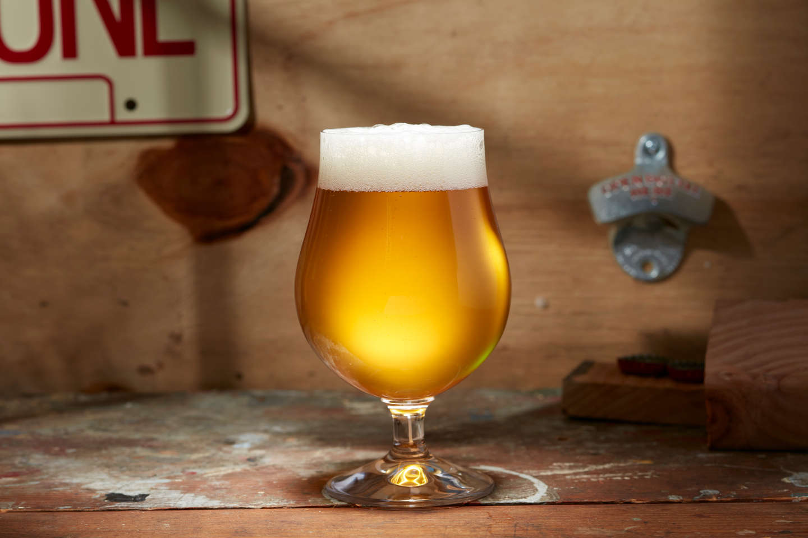

# Strong English Ale (Extract Method)

*A 7-8% ABV strong English ale: deep amber, malt-led with caramel and toffee notes from crystal malt, balanced bitterness from Fuggles and East Kent Goldings hops, fermented with English ale yeast. The beginner's strong beer — full of flavour, forgiving to brew, drinkable from week 6 onward and properly delicious from month 3.*

**Makes:** 20 litres (about 40 × 500ml bottles)

**Active time:** 4 hours on brew day, 2 hours on bottling day

**Total time:** 8 weeks from brew to first comfortable drink

## Overview
Extract brewing skips the mash. Instead of crushing barley grains and steeping them yourself, you buy malt extract — a concentrated dark syrup or dry powder that's the result of a commercial brewery already having done the mashing for you. Your job is to dissolve the extract in water, add hops at scheduled points during a 60-minute boil, cool the resulting wort, pitch yeast, ferment, bottle. The result is genuinely good beer; many commercial breweries use extract for some of their range.

This recipe uses dry malt extract (DME) for cleaner flavour and ease of weighing, with a small amount of steeped crystal malt for caramel-toffee character. English hops (Fuggles for bittering, East Kent Goldings for late additions) and an English ale yeast (S-04 or Nottingham) give the proper old-school English strong-ale profile.

## Ingredients

### Malts
- 3 kg dry malt extract (DME), pale variety — Muntons or Brewferm brands, £18-£25
- 500 g dry malt extract, dark or amber variety — for colour and depth, £4
- 300 g crystal malt, 60 L grade (pre-crushed) — the steeping grain for caramel character, £3-£4

### Hops
- 40 g Fuggles hop pellets — for 60-minute (bittering) addition. £3-£4
- 30 g East Kent Goldings hop pellets — for 15-minute and 5-minute (flavour and aroma) additions, £3-£4

### Yeast
- 1 sachet Fermentis Safale S-04 (dry English ale yeast, 11.5g) — £3
  - Alternative: Lallemand Nottingham Ale Yeast (dry) — also works perfectly.

### Other
- 25 litres cold water (filtered or tap left overnight to off-gas chlorine)
- 5 g priming sugar per litre of finished beer (about 120 g total) — for natural carbonation in the bottle, £2 per kilo

## Equipment
- See the [Equipment](equipment.md) page. You'll need: a 25-30 litre stockpot, a 25-litre fermenter with tap, an airlock, a thermometer, a hydrometer + trial jar, a wort chiller or ice bath, 40 sanitised 500ml bottles + caps + capper, a bottling wand.

## Method

### Stage 1 - Steep the crystal malt (Day 1 / Brew Day, ~15 mins)
1. Put 4 litres of cold water in the stockpot.
1. Tie the crystal malt in a fine-mesh muslin bag (the steeping grains stay contained).
1. Warm the water to 70°C, then drop the muslin bag in.
1. Hold the water at 68-72°C for 20 minutes, lifting and stirring the bag occasionally.
1. Remove the muslin bag, drain into the pot, discard the spent grains.
1. The water is now lightly amber and smells faintly of caramel.

### Stage 2 - Add the malt extract (Day 1, ~10 mins)
1. Add 16 litres more cold water to the pot (you now have ~20 litres total).
1. Bring to a gentle simmer.
1. Off the heat (so the extract doesn't scorch on the bottom), gradually whisk in all the dry malt extract — both the 3 kg pale and the 500 g dark/amber. Stir continuously to prevent clumping.
1. Once fully dissolved, return to medium heat and bring to a rolling boil. This is now your "wort" — the unfermented beer base.

### Stage 3 - 60-minute boil with hops (Day 1, ~70 mins)
1. Once the wort reaches a rolling boil, start the 60-minute timer. Add the Fuggles hops immediately (this is the "60-minute addition" for bittering).
1. Keep the boil rolling but not so hard that it foams over. A gentle but visible rolling boil is right.
1. At 60 minutes minus 15 (so at the 45-minute mark on the timer), add 15 g of the East Kent Goldings hops.
1. At 60 minutes minus 5 (so at the 55-minute mark), add the remaining 15 g of East Kent Goldings.
1. At 60 minutes exactly, turn off the heat. Boil is complete.

### Stage 4 - Cool the wort (Day 1, ~30 mins)
1. Cool the wort rapidly to 20-22°C. Options:
   - **Wort chiller**: place coil in the pot, run cold water through. 30 minutes typical.
   - **Ice bath**: place the pot in a sink filled with ice and cold water; stir occasionally. 45 minutes typical.
   - **Drift method (not recommended)**: let it cool naturally overnight; risks contamination.
1. Confirm temperature is 20-22°C with the thermometer before proceeding.

### Stage 5 - Transfer to fermenter and aerate (Day 1, ~10 mins)
1. Sanitise the fermenter, airlock, hydrometer, trial jar and any siphons.
1. Pour the cooled wort into the fermenter through a sanitised fine-mesh sieve to catch the spent hop debris. Pour from height to introduce air — yeast needs oxygen for the start of fermentation.
1. Top up with cold sanitised water if you're short of 20 litres total in the fermenter.

### Stage 6 - Take a starting hydrometer reading
1. Use the sanitised trial jar and hydrometer to measure starting SG.
1. For a 7-8% ABV strong ale, the SG should be 1.070 to 1.080.
1. Write down the reading.

### Stage 7 - Pitch the yeast (Day 1)
1. Sprinkle the entire yeast sachet directly over the surface of the wort.
1. Stir gently for 30 seconds to disperse the yeast.
1. Seal the fermenter, fit the airlock with a drop of water.
1. Place the fermenter somewhere at steady 18-20°C — slightly cooler than your house. A cellar, garage corner, or unheated room.

### Stage 8 - Primary fermentation (Days 2 to 10)
1. Within 24-48 hours you'll see active fermentation — airlock bubbling rapidly, possibly foam (krausen) on top of the beer in the fermenter.
1. Maintain 18-20°C. Higher temperatures produce fruity / solvent off-flavours.
1. After 4-5 days, the krausen falls back into the beer and the airlock slows to a few bubbles per minute. Don't open the fermenter to peek; trust the bubbles.

### Stage 9 - Confirm fermentation done (Day 10-14)
1. Take a hydrometer reading on day 10 by drawing a sample with a sanitised siphon or pipette.
1. Wait 3 days and take another reading. If the SG hasn't changed, fermentation is complete.
1. Target final SG: 1.014 to 1.020 for a strong ale.
1. Use the formula: (Starting SG - Final SG) × 131 = ABV%. From 1.075 to 1.018 gives 7.5% ABV.

### Stage 10 - Condition (Days 14 to 21)
1. Leave the beer in the fermenter for another 7 days at 18-20°C. This is the "conditioning" phase: the yeast cleans up off-flavours and the beer matures.
1. Don't disturb. Don't open. Don't taste-test daily.

### Stage 11 - Prime and bottle (Day 21)
1. On bottling day, sanitise everything: 40 bottles, 40 caps, the bottling wand, a small saucepan, a spoon, the capper.
1. Make the priming solution: in a small saucepan, dissolve the priming sugar (4 g per litre × 20 litres = 80 g; bump to 100-120 g for a strong ale that needs more bottle conditioning) in 200 ml of just-boiled water. Cool to room temperature.
1. Add the priming solution to the bottom of a second sanitised fermenter (or your sanitised brewing bucket).
1. Open the tap on the primary fermenter and let the beer flow gently into the bottling vessel, leaving the yeast sediment behind in the primary.
1. Stir the priming sugar gently through the beer with a sanitised spoon.
1. Attach the bottling wand to the tap of the bottling vessel.
1. Fill each bottle by pressing the wand against the bottom of the bottle; release the spring valve when nearly full so the beer reaches up to about 2 cm below the cap rim.
1. Cap each bottle immediately with a sanitised cap and the capper.

### Stage 12 - Bottle condition (Days 21 to 42)
1. Store bottled beer at 18-22°C for 14-21 days. The residual yeast eats the priming sugar in the bottle, producing CO2 that carbonates the beer.
1. Don't refrigerate during this phase — cold halts the carbonation.

### Stage 13 - Cool and drink (Day 42+)
1. After 3 weeks of bottle conditioning, refrigerate one bottle for 4 hours and crack it open. The beer should pour with a thick foamy head, taste deeply malty with caramel undertones from the crystal malt, have a clear hop bitterness, and finish with a warm 7-8% alcohol presence.
1. At 6 weeks the beer is good. At 3 months it's properly excellent — the alcohol has mellowed, the malt has integrated, the hops have softened.

## Notes
- **Don't pitch yeast hot.** Pitching yeast into wort that's above 25°C can produce harsh off-flavours and stress the yeast. Always cool to 20-22°C before pitching.
- **Aerate at pitching.** Yeast needs oxygen at the start of fermentation but NOT later (oxygen at racking or bottling causes staling). Splash the wort hard when transferring to the fermenter; never aerate after fermentation begins.
- **Strong beer takes longer.** Don't be tempted to bottle at week 10 because the airlock has stopped; condition for the full 21 days minimum.
- **Bottle conditioning needs warmth.** A 18-22°C bottle storage temperature is right; cold storage doesn't carbonate.

## Variations
- **Imperial stout (8-10% ABV)**: replace the pale DME with 3 kg dark DME; replace crystal malt with 200 g chocolate malt + 100 g black malt; use Magnum hops (bittering) and East Kent Goldings (aroma); use US-05 or English yeast.
- **Barleywine (10-12% ABV)**: increase pale DME to 4 kg; add 500 g crystal malt; double the bittering hops; use White Labs WLP099 high-gravity yeast. Condition 6 months minimum.
- **Belgian dubbel (7-8% ABV)**: replace 500 g of DME with 500 g of dark candy sugar; use Belgian abbey yeast (Wyeast 1762 or WLP530). Brings spice + dark fruit notes.
- **American strong IPA (7-8% ABV)**: replace English hops with Cascade + Centennial + Citra; dry hop 50 g for 5 days before bottling.

## Storage
- Bottled strong ale keeps 1-2 years easily; flavour improves through month 6 then plateaus.
- Store horizontally in a cool dark place (12-15°C ideal).
- Don't freeze; the carbonation breaks.

## Next steps
- Read [Mash, Hops and Fermentation](mash-and-hops.md) for the science behind every step you just did.
- Try an all-grain version of the same recipe once you've made 2-3 successful extract batches.
- Read the [Equipment](equipment.md) page if you skipped it — sanitisation is the difference between this recipe and a vinegar bath.
