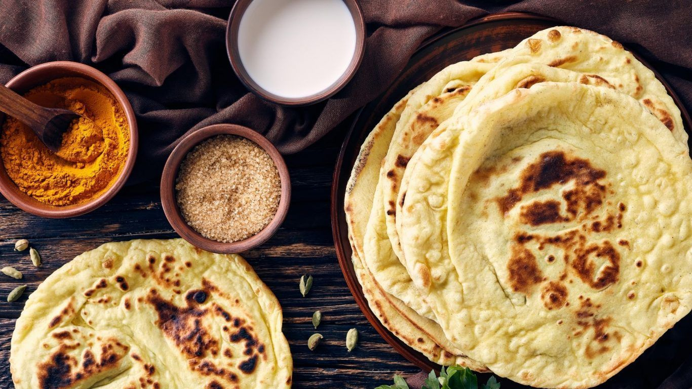

# The Indian Bread Map

*India has more bread varieties than France. Each region claims its own; each technique (griddle vs tandoor vs deep-fry) yields a different family. This page is the map: how to think about the breads, which technique each one uses, and what to learn first.*

## Overview

Indian breads split into four families based on cooking technique:

1. **Griddle-baked unleavened (tawa breads)** — rolled thin, cooked on a dry hot tawa (flat griddle), often puffed over an open flame. Roti, chapati, paratha, kulcha (a leavened variant), tandoori roti.
2. **Tandoor-baked leavened (or partially leavened)** — slapped against the inside of a clay tandoor oven at 480°C. Naan, kulcha, sheermal. Tandoor at home is hard; an oven on its hottest setting + a baking stone is the workable substitute.
3. **Deep-fried** — rolled flat, deep-fried in hot oil until puffed. Puri, bhatura, kachori (the savoury-stuffed variant).
4. **Steamed / pan-cooked rice-flour breads (regional)** — appam (Kerala fermented coconut-rice pancake), akki roti (Karnataka rice-flour griddle), idiyappam (string hoppers), pesarattu (Andhra mung-bean pancake).

This course covers families 1, 2, and 3 — the wheat-flour breads. The rice-flour and millet breads are regional and covered in their cuisine-specific pages.

## The five must-know breads

If you want to cook five Indian breads well, learn these:

1. **Roti / chapati** — the everyday daily bread of North India. Whole-wheat dough, rolled thin, cooked on a tawa, puffed over a flame.
2. **Paratha** — the layered bread. Same dough as roti but rolled with ghee/oil to create flaky layers. Often stuffed.
3. **Naan** — the leavened tandoor bread. Yogurt-and-yeast (or baking-powder) dough, slapped onto the inside of a tandoor at 480°C. The "restaurant" bread.
4. **Puri** — the deep-fried puffed bread. Whole-wheat dough rolled small, deep-fried until balloons puff up.
5. **Bhatura** — yogurt-leavened, deep-fried; the canonical pairing for chole.

This course has a page for each of these (and their close cousins).

## What "the right bread" looks like

| Bread | Texture | Diameter | Cooking |
|---|---|---|---|
| Roti / chapati | Soft, foldable, with brown spots | 18-20 cm | Tawa, 30-60 sec per side |
| Paratha | Crisp on outside, soft inside, visible layers | 18-20 cm | Tawa with ghee, 90 sec per side |
| Naan | Chewy, blistered, puffed unevenly | 20-25 cm (teardrop) | Tandoor at 480°C, 60 sec |
| Tandoori roti | Like roti but charred on tandoor; thicker | 18-20 cm | Tandoor at 480°C, 60 sec |
| Puri | Round, puffed into a ball, slightly crisp | 8-10 cm | Deep-fry, 60-90 sec |
| Bhatura | Large oval, puffed, slightly chewy | 18-25 cm | Deep-fry, 90 sec |
| Kulcha | Soft, slightly puffy, sometimes stuffed | 18 cm | Tandoor or tawa with ghee |
| Sheermal | Sweet, saffron-tinted, slightly chewy | 18 cm | Tandoor or oven |
| Akki roti | Crumbly, slightly crisp | 12 cm | Tawa with oil |
| Appam | Bowl-shaped, lacy edges, soft centre | 15 cm | Special appam pan |

## The three core flours

- **Atta** (whole wheat flour, finely ground) — the canonical roti / chapati / paratha flour. Indian whole wheat is more finely ground than UK wholemeal; it makes a soft dough. Look for "atta" labelled flour (Ashoka, Pillsbury Chakki Atta, Aashirvaad — Indian brands available in UK supermarkets).
- **Maida** (refined white flour) — used for naan, kulcha, bhatura, sheermal. Equivalent to UK plain flour, but Indian maida is slightly finer-ground. Plain flour works as a substitute.
- **Atta + maida blend** — many recipes use 50/50 for parathas and some breads.

Other regional flours: rice flour (akki roti, appam), besan (chickpea — used for batters not breads typically), ragi (millet, finger millet — South Indian regional breads).

## The kit

- **Tawa** (flat heavy iron or non-stick griddle) — for roti, chapati, paratha. Substitute: a heavy cast-iron frying pan with a flat base. About £25 for a good Indian tawa.
- **A rolling pin** — Indian-style is thinner and longer than European; a regular rolling pin works.
- **A flat board (chakla) and rolling pin (belan)** — the canonical Indian setup is a slightly raised circular board + a thin long rolling pin. £15 for a set.
- **Tongs** — for handling the bread over a gas flame to puff.
- **A heavy deep pan or wok (kadhai)** — for deep-frying puris.
- **A baking stone + an upturned heavy baking sheet** — for the home-oven naan technique. The stone preheats at 250°C; the bread is slapped onto the stone.

## How to use the course

Pages are ordered easy-to-hard:

1. **[roti-and-chapati.md](roti-and-chapati.md)** — the everyday. Master this first. Once you can puff a roti, the other breads follow.
2. **[paratha.md](paratha.md)** — layered with ghee, plain and stuffed.
3. **[naan-and-kulcha.md](naan-and-kulcha.md)** — leavened tandoor breads (the home-oven approach).
4. **[puri-and-bhatura.md](puri-and-bhatura.md)** — the deep-fried.
5. **[tandoor-and-griddle.md](tandoor-and-griddle.md)** — the techniques: home tandoor substitutes, the griddle puff, deep-fry temperatures.

## Why this is its own course

The [BIR course](../bir-curry/home.md) covers restaurant-style curries, including breads as accompaniments. The [Indian home cooking](../indian-home-cooking/home.md) course covers home-style cooking with rice-and-roti as one page among seven.

This course goes deeper: every major Indian bread, its dough technique, its regional variations, and the specific tricks for getting each right at home. A focused 7-day cooking project: make one bread per day; eat them with whatever curry / dal / vegetable dish you fancy. By day 7, your kitchen is bread-fluent.
