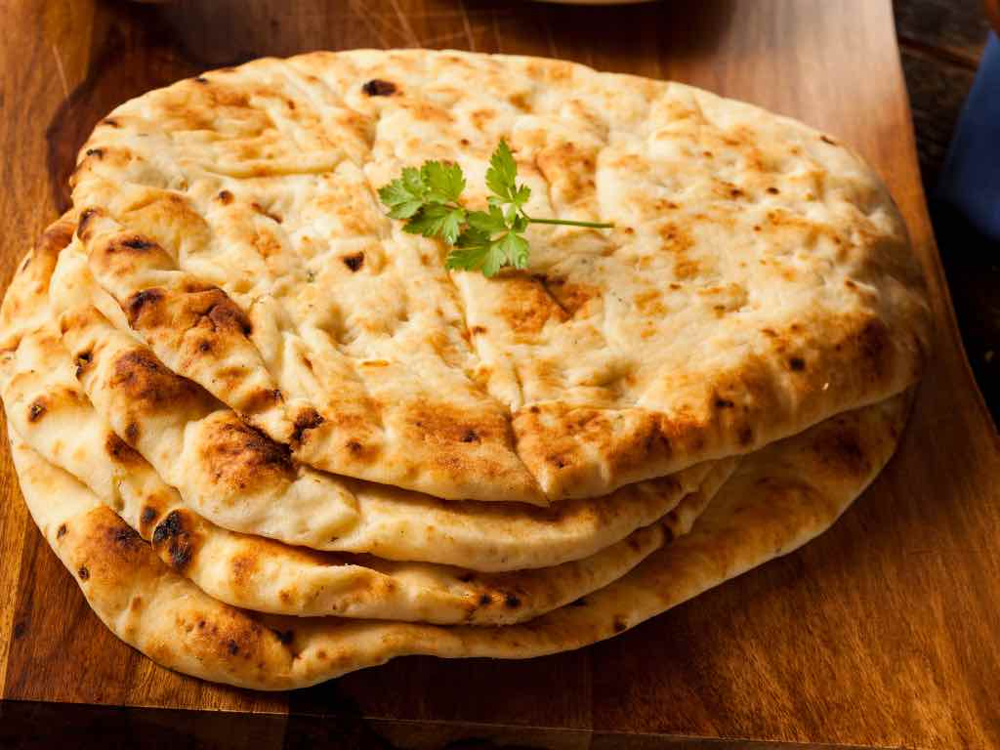

# Naan and Kulcha

*Naan is the famous restaurant bread — the teardrop-shaped, charred, leavened tandoor bread that comes with the curry. Kulcha is its less-famous Punjabi cousin: slightly smaller, sometimes stuffed, often paired with chole. Both are made the same way; both are tandoor-baked in restaurants and slightly-modified-but-still-good at home.*

## Overview

Naan and kulcha are leavened breads — made with maida (refined flour) + yogurt + a touch of leavening (yeast OR baking powder + baking soda) + sometimes egg. The dough is softer than roti dough; the bread has chew and structure that unleavened roti can't match.

The defining technique: high-heat baking on a tandoor wall at 480-500°C. The bread is slapped onto the inside of the hot clay; it sticks; it cooks in 60-90 seconds; the bartender pries it off with a hook. Result: chewy, blistered, slightly charred, irregularly puffed.

At home, the substitute: a baking stone preheated in a 250°C oven, or a heavy cast-iron pan flipped upside-down on the cooktop as an improvised tandoor surface. Neither hits the real tandoor's heat profile, but both produce decent naan.

This page covers both naan and kulcha — they share the same base dough.

## Dough (makes 8 naans)

### Ingredients
- 400 g maida (refined white flour; UK plain flour works)
- 150 ml warm water
- 100 ml plain yogurt (whole milk, full-fat)
- 1 teaspoon caster sugar
- 1 teaspoon salt
- 1 teaspoon instant yeast (or 1 teaspoon baking powder + ½ teaspoon baking soda for the no-yeast version)
- 2 tablespoons vegetable oil
- 1 large egg (optional; adds richness and yellow colour)

### Method
1. In a bowl, combine the flour + sugar + salt + yeast (or the baking powder/soda).
2. In a jug, whisk the water + yogurt + oil + egg (if using).
3. Pour the wet into the dry; mix with a fork at first, then your hands.
4. Knead for 6-8 minutes until the dough is smooth, elastic, slightly tacky, and bounces back when poked.
5. Cover with cling film; rest at room temperature for 1.5-2 hours (yeast version) or 30 minutes (baking-powder version). The dough should roughly double for yeast naan.

## Method 1: Home oven naan (with baking stone)

The closest home-kitchen approximation of a tandoor.

1. Preheat oven to 250°C / 480°F (or as hot as your oven goes) with a baking stone or upturned heavy baking sheet on the middle rack. Allow 30 minutes for the stone to fully heat.
2. Divide the dough into 8 equal balls (about 75 g each).
3. On a floured surface, roll each ball into a teardrop or oval shape, 20-25 cm long, about 3-4 mm thick.
4. Lift the rolled naan onto a floured peel or a piece of parchment.
5. Slide onto the hot baking stone.
6. Bake 2-3 minutes. The naan will puff dramatically; spots of char will appear; the edges crisp.
7. Lift off the stone with a peel or spatula.
8. Brush immediately with melted ghee or butter.

### Notes
- The stone must be HOT. If it's not pre-heated long enough, the naan won't puff or char.
- A pizza-grade stone is best. A heavy cast-iron skillet works as a substitute.
- The oven's grill / broiler on top, switched on for the last 30 seconds, helps with the char.

## Method 2: Stovetop naan (the easier method)

For home cooks without a baking stone:

1. Heat a heavy cast-iron skillet or pan over medium-high heat until very hot.
2. Roll a naan as above.
3. Wet one side of the naan with water (use your hands or a brush).
4. Place the naan wet-side-down in the pan.
5. Cook 60-90 seconds. The wet side sticks to the pan; the upper side begins to bubble.
6. Now invert the pan over an open gas flame (carefully — the naan is still attached to the pan by the wet side). The upper side will cook quickly from the direct flame.
7. After 30-45 seconds of flame-cooking, flip the pan over; the naan releases. Brush with ghee.

This stovetop technique simulates the tandoor's two-sided cooking: the wet-down-side cooks in contact with the pan (like the tandoor wall); the up-side cooks from the open flame (like the open top of the tandoor).

## Method 3: Tawa naan (the simplest)

For the simplest version:

1. Heat the tawa over medium-high heat.
2. Roll the naan as above.
3. Place on the dry tawa; cook 60 seconds.
4. Flip; cook another 60 seconds.
5. Lift the naan with tongs; hold over an open flame for 30 seconds, turning, to char and finish cooking.
6. Brush with ghee.

This is the "good enough" home method. Not as authentic as the baking-stone version but works in any kitchen.

## Variations

### Garlic naan
Brush the freshly-baked naan with melted butter mixed with chopped garlic + chopped fresh coriander.

### Cheese naan (modern Indian-restaurant variant)
Roll the naan; place 30 g of grated cheese (mozzarella or paneer-mozz mix) in the centre; fold the edges over to seal; roll out gently again. Bake as normal.

### Peshawari naan (Pakistani / Northwest)
Slightly sweet. Dough is enriched with raisins, coconut, almond, and a touch of sugar. The bread is folded around the sweet filling and baked.

### Keema naan
Naan stuffed with spiced minced meat (lamb or beef). The filling is added during the shaping step.

### Onion naan
Topped with finely chopped raw onion and chopped coriander before baking. The onion crisps slightly.

### Butter naan
Brushed generously with butter after baking. The default UK Indian restaurant naan.

### Tandoori roti vs naan
Both are tandoor-baked. The difference: tandoori roti is unleavened (atta dough) and chewier; naan is leavened (maida + yogurt) and puffier. Some restaurants serve "tandoori roti" as a slightly chewier, less-puffy version of naan.

## Kulcha

Kulcha is the Punjabi cousin of naan. Same dough; slightly different ratio (less yogurt, more flour); often stuffed. The famous version is amritsari kulcha — a chole-bhature-style street food from Amritsar in Punjab.

### Plain kulcha
Same dough as naan but with slightly less yogurt. Rolled into rounds (not teardrop); cooked the same way; slightly chewier and less puffy.

### Aloo kulcha (potato-stuffed)
Same dough; stuffed with mashed seasoned potato (similar to aloo paratha filling); cooked on tawa or in tandoor. The Amritsari version.

### Bharwan kulcha (vegetable-stuffed)
Stuffed with grated paneer, onion, potato, or cauliflower.

### Method for stuffed kulcha
1. Make the dough as for naan.
2. Make the stuffing (potato or paneer with spices).
3. Divide dough; flatten each piece; place a portion of stuffing in the centre.
4. Seal the dough around the stuffing.
5. Roll out gently to 15-18 cm.
6. Cook on tawa with ghee, or in oven with baking stone, as for naan.

## Common mistakes

- **Dough not rested long enough**: tough, dense naan.
- **Tawa / stone not hot enough**: doesn't puff; bottom soggy.
- **Rolling too thick**: heavy, slow to cook through.
- **Rolling too thin**: dry, brittle.
- **Skipping the wet-side trick (in stovetop method)**: the naan doesn't stick; doesn't get the right contact.
- **Not brushing with ghee**: dry, sad-looking naan.

## A naan session

For a weekend Indian dinner:

1. **2 hours before**: make the dough; rest.
2. **45 minutes before**: preheat oven (with baking stone) to 250°C.
3. **15 minutes before**: divide and roll the 8 naans.
4. **At service**: bake one naan at a time as guests sit down. Each takes 2-3 minutes. Brush with ghee. Stack covered with a tea towel.

For a weekday Indian dinner: use the tawa method instead. 30-40 minutes total from start to finish.

## What good naan looks like

- **Teardrop or oval**: 20-25 cm long, 12-15 cm wide.
- **Puffed irregularly**: some big bubbles, some small.
- **Char spots**: 5-10 dark brown spots from contact with the hot surface or flame.
- **Soft and chewy interior**: tear it open; you should see a slightly damp, layered interior.
- **Slightly sweet**: the sugar in the dough + the milk/yogurt comes through.
- **Glossy from the ghee finish**: not greasy, just slightly shiny.

## Pairing

- **Naan with butter chicken** — the canonical UK Indian restaurant pairing.
- **Naan with dal makhani** — the Punjabi household pairing.
- **Naan with tandoori chicken or tikka** — the BBQ-style Punjabi pairing.
- **Kulcha with chole** — the Punjabi street-food pairing.
- **Naan with paneer butter masala** — the vegetarian classic.

## After the naan

With naan in your repertoire, you've covered the "leavened" Indian bread family. The next page covers the "deep-fried" family — puri and bhatura.
