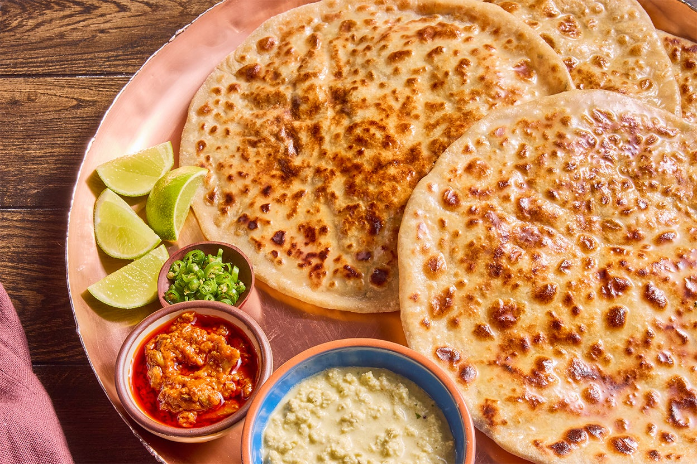

# Paratha

*The paratha is a roti with ambition. Same dough, but laminated with ghee through repeated rolls-and-folds, then cooked on a tawa with more ghee. The result is a flaky, layered bread that's the traditional Indian breakfast. The stuffed variants, aloo paratha, gobi paratha, paneer paratha, are full meals in themselves.*

## Overview

A paratha is built from the same dough as a roti but uses a lamination technique (rolling, brushing with ghee, folding, re-rolling) to create flaky layers. The dough sees ghee at every stage; the cooked paratha sees ghee in the pan. The bread is heavier, richer, and significantly more substantial than a roti.

Two main families:

1. **Plain (layered) parathas**: the dough is laminated and rolled into rounds or triangles. The flaky layers are the point. Lachha paratha (multi-layer) and triangle paratha are the traditional forms.
2. **Stuffed parathas**: a small portion of spiced filling (potato / cauliflower / paneer / radish / lentil) is sealed inside the dough before rolling. The result is a bread that's also the protein.

## Dough

The same as roti dough, atta + water + salt + a touch of oil. But for paratha, the dough is sometimes enriched with a tablespoon of yogurt or a tablespoon of milk for tenderness:

### Ingredients (makes 6 parathas)
- 300 g atta
- 200 ml warm water
- 1 teaspoon salt
- 1 tablespoon vegetable oil + extra for kneading
- 1 tablespoon yogurt or milk (optional but recommended)

### Method
Knead and rest the same way as roti dough. The paratha dough is slightly more enriched and should feel a touch softer than roti dough.

## Plain laminated paratha (lachha paratha)

This is the "many-layered" paratha. The technique is the same as French puff pastry but simpler.

### Method

1. Divide the dough into 6 balls (50 g each).
2. Take one ball; roll it into a thin circle about 20 cm diameter (same as roti).
3. Brush the circle with 1 teaspoon of melted ghee.
4. Dust lightly with atta.
5. Now fold:
   - **For square paratha:** fold into thirds (like a letter); then fold into thirds again. You get a small square.
   - **For triangular paratha:** fold in half (semi-circle), brush with ghee, fold in half again (quarter), brush with ghee.
   - **For spiral lachha paratha:** make small accordion pleats across the dough; then coil the pleated strip into a spiral; press down lightly.
6. Roll the folded dough back out to 15-18 cm diameter (the lamination is now hidden inside).
7. Cook on a hot tawa with 1 tablespoon ghee, 60 seconds per side, until both sides are golden-brown.
8. The cooked paratha should show visible layers when torn. Each layer should be distinct.

### Notes
- The ghee brushing is the lamination. More layers = more ghee per layer (but more ghee = richer paratha).
- The 4-layer paratha (one fold + one fold) is the easiest. The 8-layer (two folds + two folds) is traditional. The 16+-layer is bartender-level work.
- The tawa-cook with ghee is non-negotiable for paratha (vs the dry tawa for roti).

## Stuffed parathas

The big family. The most common stuffed parathas in Indian homes:

### Aloo paratha (potato stuffing)
Mashed boiled potato + ginger + green chilli + chopped coriander + cumin powder + amchur (dried mango powder; gives the sour note) + salt.

### Gobi paratha (cauliflower stuffing)
Grated cauliflower + ginger + green chilli + coriander + cumin + chilli powder + salt. The grated cauliflower should be squeezed dry (or it makes the dough wet).

### Mooli paratha (radish stuffing)
Grated mooli (white daikon radish) + ginger + green chilli + coriander + cumin + salt. The grated radish is squeezed dry first.

### Paneer paratha (cottage cheese stuffing)
Crumbled paneer + ginger + green chilli + coriander + cumin + salt. Lighter than aloo.

### Dal paratha (lentil stuffing)
Cooked thick dal (mashed) + ginger + green chilli + coriander + cumin + salt.

### Method (the stuffed technique)

1. Divide the dough into 6 balls (slightly larger than roti - 60-70 g each).
2. Roll a ball into a 12 cm circle.
3. Place 1 heaped tablespoon of filling in the centre.
4. Bring the edges of the dough up and over the filling. Pinch closed at the top to seal completely.
5. Dust with atta.
6. Roll out gently to about 18-20 cm diameter. Don't press too hard, the filling can break through.
7. If a tear appears, dust with atta and gently press closed.
8. Cook on a hot tawa with 1 tablespoon ghee, 60 seconds per side, then a final 30 seconds with extra ghee to crisp.

### Serving the stuffed paratha

- A dollop of plain yogurt + a spoonful of pickle (mango or lime) + a glass of buttermilk (lassi).
- Or with a thin dal alongside.
- Or just on its own.

A stuffed paratha is breakfast, lunch, or a complete light dinner. It carries the protein and the carbohydrate in one.

## Variations

### Mughlai paratha
- A heavier paratha with a stuffing of minced meat + eggs + spices, then folded and pan-fried. A Bengali / Mughlai street food (West Bengal, Bihar).

### Lachha paratha (Punjabi)
- The multi-layered spiral paratha. 12-20 visible layers. Crisp outside, soft inside. Restaurant-level paratha.

### Malabar paratha (South India / Kerala)
- A Kerala-specific paratha made with maida (refined flour) + egg + ghee. Pulled like Singapore roti prata; layered like phyllo. Texture is silky and chewy.

### Tandoori paratha
- Same dough, but cooked in a tandoor at 480°C. Slightly drier; smokier; crisper edges.

## Common mistakes

- **Filling too wet**: the stuffed paratha tears easily. Squeeze grated vegetables (mooli, gobi) dry; mashed potatoes shouldn't be runny.
- **Filling not seasoned enough**: stuffed parathas need bold seasoning because the dough is bland. Generous chopped chilli + ginger + salt.
- **Rolling too aggressively**: the filling breaks through. Use light pressure; rotate often.
- **Tawa too hot**: the paratha burns before the layers cook through. Medium heat.
- **Not enough ghee**: dry, rubbery paratha. The ghee is the bread's identity.

## A paratha session

A weekend breakfast for 4:
- Make dough; rest 30 minutes.
- Make 8 stuffed parathas (aloo or paneer).
- Serve with yogurt, pickle, and chai.
- Total time: 60-75 minutes.

A weekday breakfast for 2:
- Use store-bought atta dough or make ahead the night before.
- 4 parathas in 20 minutes.
- Yogurt + pickle + chai.

## After parathas

Once paratha is solid, the next-step breads:
- **Naan and kulcha**: leavened breads, tandoor-baked (or home-oven baked).
- **Puri and bhatura**: deep-fried.
- **Sheermal**: sweet saffron-milk paratha-like bread.

The paratha is the bridge from everyday roti to the more elaborate breads.
