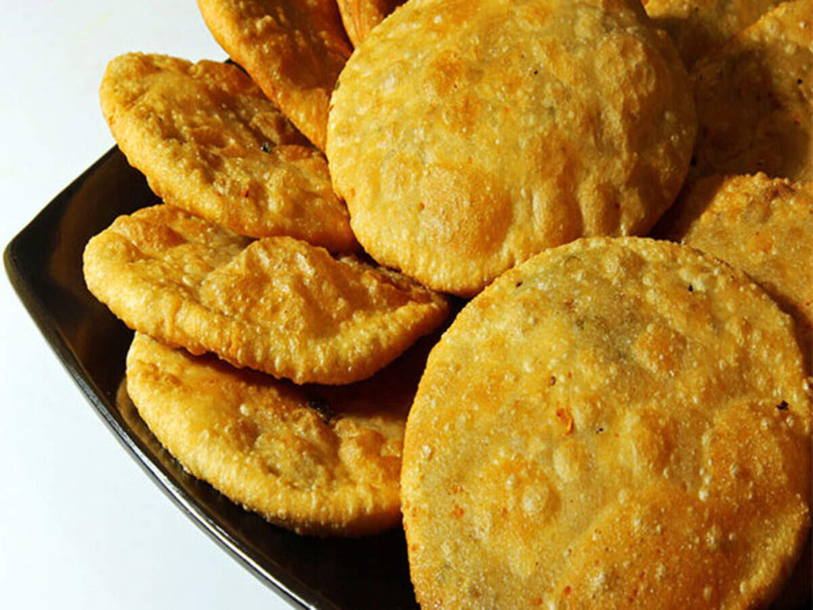

# Puri and Bhatura

*Puri is the small puffed sphere - the size of a tennis ball - that puffs dramatically in hot oil. Bhatura is the larger oval cousin - the traditional pairing for chole. Both are deep-fried; both are festive; both are easy to make at home with a wok and oil.*

## Overview

Puri and bhatura belong to the deep-fried Indian bread family. The technique is the same: roll a dough flat (relatively thin), slip into hot oil, watch it puff dramatically into a balloon shape, drain, eat warm.

The differences:
- **Puri** - uses whole-wheat atta dough (similar to roti). Small (8-10 cm). Eaten at breakfast, on festivals, with chole + halwa (the "halwa-puri" Punjabi breakfast).
- **Bhatura** - uses maida (refined flour) + yogurt + leavening (yeast or baking powder). Large (18-25 cm oval). Eaten almost exclusively with chole.

This page covers both, with technique notes that apply to the wider deep-fried Indian bread family.

## Puri

### Dough (makes 12 puris)
- 250 g atta (whole-wheat Indian flour)
- 150 ml warm water
- ½ teaspoon salt
- 1 tablespoon semolina (sooji; optional but gives a slightly crispier puri)
- 1 tablespoon vegetable oil

### Method (dough)
1. Combine flour, semolina, salt in a bowl.
2. Add the oil; rub in lightly.
3. Add water gradually; knead to a stiff dough (stiffer than roti dough - about 4-5% drier).
4. Cover; rest 15-30 minutes.

The dough for puri is firmer than roti dough because too-soft dough absorbs more oil. A firm dough fries clean.

### Rolling

1. Divide the dough into 12 small balls (about 30 g each).
2. Roll each ball briefly to smooth.
3. Dip in oil (a small amount on a saucer - about a teaspoon per side). This prevents sticking and helps the dough roll without much added atta.
4. Roll each ball into a small circle about 10 cm diameter, 2 mm thick.

The puri must be uniform thickness. Any thin spot will tear during frying; any thick spot won't puff.

### Frying

1. Heat 4-5 cm of oil in a heavy wok or kadhai. The right temperature: 180-185°C. Test by dropping a small piece of dough - it should rise to the surface within 2 seconds and bubble actively.
2. Slip one puri into the hot oil.
3. Almost immediately, gently press the puri with a slotted spoon. The pressure makes it puff into a sphere within 2-3 seconds.
4. Flip the puffed puri with the slotted spoon. Cook 10 seconds on the other side.
5. Lift out with the slotted spoon; drain on kitchen paper.
6. Repeat with the next puri (don't fry more than one or two at a time).

The whole frying time per puri is 30-45 seconds. The puff is the visible sign that the puri is done correctly.

### Why puris don't puff (and how to fix)

- **Dough too soft / wet**: the puri spreads in the oil; doesn't puff. Use stiffer dough.
- **Rolled too thick**: the centre is too heavy; no puff. Roll thinner.
- **Rolled too thin**: tears; no puff. Roll a hair thicker.
- **Oil too cool**: the puri sinks and absorbs oil; no puff. 180°C minimum.
- **Oil too hot**: the puri burns before it can puff. 195°C maximum.
- **Pressing not at the right moment**: press AFTER the puri rises to the surface and starts bubbling. Pressing too early doesn't help.

## Bhatura

### Dough (makes 8 bhaturas)
- 400 g maida (UK plain flour)
- 4 tablespoons semolina (sooji)
- 150 ml warm water (start with less; add as needed)
- 200 g plain yogurt (full-fat)
- 1 teaspoon caster sugar
- 1 teaspoon salt
- 1 teaspoon baking powder + ½ teaspoon baking soda (OR 1 teaspoon instant yeast for yeast-leavened bhatura)
- 2 tablespoons vegetable oil

### Method (dough)
1. Combine flour, semolina, sugar, salt, baking powder/soda (or yeast) in a bowl.
2. Add yogurt and oil; mix.
3. Add water gradually; knead to a soft pliable dough (slightly softer than roti dough).
4. Knead 6-8 minutes.
5. Cover; rest at room temperature for 1.5-2 hours (the leavening activates).

### Rolling

1. Divide the dough into 8 balls (75-80 g each).
2. Roll briefly in your hand to smooth.
3. Dip in oil on both sides.
4. Roll into an oval shape (not round!) - about 20-25 cm long, 12-15 cm wide, 3-4 mm thick.

The oval shape is traditional. Round bhaturas exist but the oval is what you'd find in Delhi street stalls.

### Frying

1. Heat oil to 180°C in a heavy wok / kadhai.
2. Slip one bhatura into the oil.
3. Gently press with a slotted spoon - the bhatura will puff dramatically into a balloon shape within 5-10 seconds (the yogurt + leavening creates the puff).
4. Flip; cook the other side 30 seconds.
5. Lift out; drain on kitchen paper.

A well-fried bhatura is golden brown, fully inflated, with a slightly crispy outer layer and a chewy, slightly tangy interior (from the yogurt).

### Common bhatura mistakes
- **Dough not rested long enough**: bhatura doesn't puff well; dense interior.
- **Dough too soft**: spreads in oil; doesn't hold shape.
- **Oil too cool**: oil-soaked bhatura; no puff.
- **Rolled too thick**: doesn't puff; chewy in a bad way.
- **Flipping too late**: the bhatura over-puffs and the inflation collapses dramatically.

## Other deep-fried Indian breads

### Kachori
Stuffed and deep-fried bread. The stuffing is moong dal or urad dal cooked with spices, then sealed inside a small puri-style dough. Fried until puffed and crisp. Eaten as a breakfast (Banaras-style) or a tea-time snack with chutney.

### Kachori with khasta filling
A variant with a finer, less-spiced lentil filling. Khasta kachori. Eaten with potato curry (aloo sabzi).

### Bedai / Bedmi puri
A specific Uttar Pradesh / Mathura specialty. Puri made with a urad dal stuffing. Crisp, savory; served with aloo ki sabzi and rabri (a sweet milk dessert).

### Litti
Bihar / Eastern India regional bread. Wheat-flour balls stuffed with sattu (roasted chickpea flour + spices); baked or shallow-fried until golden; served with chokha (mashed spiced vegetable) and ghee.

### Bhakarwadi (Maharashtrian)
Tiny spiced fried snacks - atta + sesame + spices + jaggery + tamarind, rolled and deep-fried. A snack, not a bread per se, but in the same family.

### Mathri
Salty wheat-flour biscuit-like fried bread. Eaten as a snack with pickle or chutney.

## Halwa-Puri and Chole-Bhature

These are the two traditional pairings:

### Halwa-Puri (Punjabi breakfast)
- Puri (the deep-fried unleavened wheat bread).
- Sooji halwa (semolina + ghee + sugar + cardamom + raisins) - a thick sweet semolina pudding.
- Chickpea curry (chole) on the side.
- A cup of strong chai.

The breakfast of weekend Punjabi homes; sold from street carts in Punjab and Delhi.

### Chole-Bhature (Punjabi street food)
- Chole (Punjabi-style chickpea curry, deeply spiced).
- Bhatura (the large yogurt-leavened deep-fried bread).
- Sliced raw onion + green chilli + lime wedge on the side.
- A cup of strong chai.

The most-iconic Punjabi street food, sold from carts and small restaurants from Delhi to Amritsar.

## Frying tips

- **Use vegetable / sunflower oil**: high smoke point. Don't use olive oil for deep-frying Indian breads.
- **Don't fill the wok more than half**: oil splatters when the bread is added.
- **Drain on kitchen paper**: not on a wire rack (the steam continues to puff/deflate the bread on the rack).
- **Keep oil temperature steady**: every batch slightly cools the oil; reheat between batches.
- **Don't crowd**: 1-2 puris (or 1 bhatura) per batch. Crowding drops the oil temperature.
- **Reuse the oil**: after frying, strain through cheesecloth into a clean jar; refrigerate. Good for 2-3 more frying sessions.

## A puri-bhatura session

For halwa-puri breakfast for 4:
- Make puri dough; rest 30 min.
- Make halwa.
- Make chole.
- Roll and fry 12-16 puris just before serving.
- 90 minutes total time.

For chole-bhature lunch for 4:
- Make bhatura dough; rest 2 hours.
- Make chole (45 min).
- Roll and fry 4-8 bhaturas just before serving.
- 3 hours total time (mostly hands-off resting).

Both are weekend or special-occasion food in modern Indian homes - too time-consuming for weekday cooking. Worth it for the result.

## After deep-fried breads

The next page covers the technique pages: tandoor substitutes for home; griddle puff technique; deep-fry temperature control.
