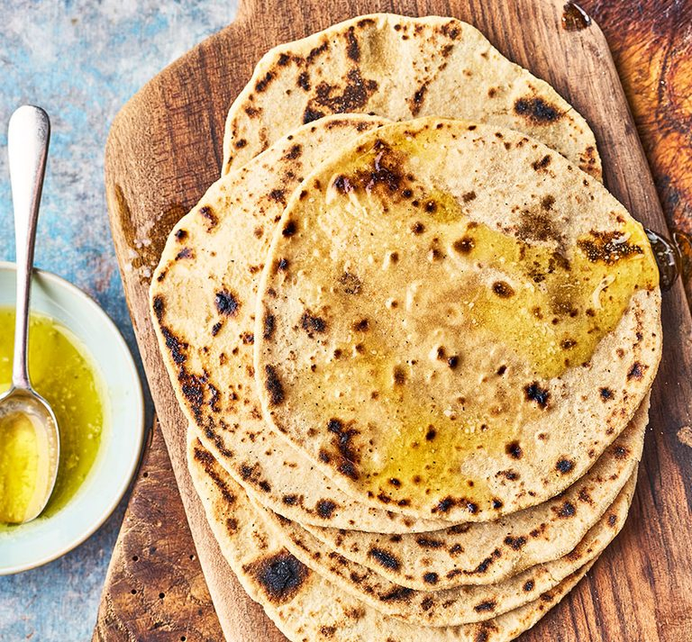

# Roti and Chapati

*The daily bread of North India. Whole-wheat flour, water, salt. Rolled thin, dry-toasted on a tawa, then puffed over an open flame. Once you can puff a roti reliably, the other Indian breads are smaller variations.*

## Overview

Roti and chapati are often used interchangeably — they describe the same daily flatbread. Some regions / families use "roti" for the everyday bread; some use "chapati"; some use both. The bread is:

- Made from atta (Indian whole-wheat flour) + water + salt + optionally a touch of oil.
- Rolled thin (about 3 mm).
- Cooked on a dry hot tawa for 30 seconds per side.
- Puffed by holding it directly over an open gas flame (or on a hot electric ring).
- Served warm, often smeared with a touch of ghee.

The bread is unleavened — no yeast, no baking powder. The puff comes from steam trapped between the two cooked surfaces. A well-puffed roti is the sign of correct dough hydration + hot enough tawa + skilled handling.

## Dough (makes 8 rotis)

### Ingredients
- 250 g atta (whole-wheat Indian flour)
- 150-170 ml warm water
- ½ teaspoon salt
- 1 teaspoon vegetable oil OR melted ghee (optional; gives slightly softer roti)

### Method
1. Sift the atta into a bowl. Add the salt.
2. Add the oil (if using); rub in lightly with fingertips.
3. Add the water gradually, mixing with a fork at first, then with your hands. Hold back the last 20-30 ml; you may not need all of it.
4. Knead for 8-10 minutes until the dough is smooth, elastic, slightly tacky, and bounces back when poked.
5. The dough should be SOFT — much softer than European bread dough. If too dry, add a teaspoon of water; if too wet, a teaspoon of flour.
6. Cover with a damp cloth or cling film. Rest at room temperature for 30 minutes.

The rest is essential. The gluten relaxes; the dough becomes pliable enough to roll thin without springing back.

## Rolling

After the rest:
1. Divide the dough into 8 equal balls (about 50 g each).
2. Roll each ball briefly to smooth (about 5 seconds in your hand).
3. Dip the ball into a small dish of dry atta on both sides.
4. Place on a lightly floured surface or wooden board.
5. Roll outward from the centre, rotating the dough a quarter-turn between strokes to maintain a round shape.
6. Roll thin: about 3 mm thick, 18-20 cm diameter.

The Indian technique: don't push down too hard on the rolling pin. Use light passes; rotate the dough often; let the dough do most of the work.

A well-rolled roti is:
- Round (not oval; rotation while rolling is key).
- Even in thickness (no thin spots).
- Thin (you should almost be able to see your hand through it when held to light).
- Not torn or holey.

## Cooking on the tawa

1. Heat the tawa over medium-high heat. To test: drop a tiny pinch of flour onto the surface. It should sizzle and brown within 5 seconds. If it instantly chars, the tawa is too hot. If nothing happens, too cool.
2. Lift the rolled roti onto the tawa with both hands (or use a dough scraper).
3. Cook 30 seconds on the first side. Small bubbles will form on the surface.
4. Flip with tongs.
5. Cook 30-45 seconds on the second side. More bubbles form; the surface starts to dry; small brown specks appear.
6. The second side should now have a few golden-brown spots on it.

## The puff (the magic moment)

This is where roti becomes roti.

1. With tongs, lift the cooking roti and hold it directly over an open gas flame (medium-high). Or place it directly on a hot electric ring set to high.
2. Within 5-10 seconds, the steam trapped between the two cooked surfaces will inflate the roti into a balloon. The roti will puff up like a pillow.
3. Hold it over the flame for 3-5 more seconds (browning the bottom slightly).
4. Flip; brown the other side over the flame for 3-5 more seconds.
5. Remove. The puffed roti deflates as it cools — that's normal.

If the roti doesn't puff:
- The tawa-cook side might have been too cooked (the surface dried before the inside could steam).
- The dough was too dry or too wet.
- The flame wasn't hot enough.
- The roti has a small hole (steam escaped).

Practice. By the 4th or 5th roti, the puff should happen reliably.

## After cooking

- Smear with a touch of melted ghee (the traditional Indian finish).
- Stack on a plate, covered with a clean tea towel or a tortilla warmer to keep warm and pliable.
- Eat warm.

## Serving

- Tear off pieces; use as a "scoop" for curries, dals, and vegetables.
- Wrap around grilled meat for a quick kati roll.
- Serve flat alongside a thali plate.

## Variations

### Tandoori roti
The same roti but cooked in a tandoor (clay oven at 480°C). The bread is slapped onto the side of the tandoor and cooks in 60-90 seconds with a slightly different texture — slightly crispy edges, smoky char marks. At home: preheat oven to 250°C with a baking stone; slap the rolled roti onto the stone; cook 90-120 seconds.

### Phulka roti
A north Indian variant — slightly thinner than the everyday roti, cooked till more crisp at the edges. Same dough.

### Akki roti (Karnataka)
A South Indian regional bread made with rice flour instead of wheat. Different technique entirely — the dough is patted out by hand on the back of a banana leaf or a sheet of baking paper, then transferred to a tawa with oil. Crumbly, slightly crisp.

### Bajra roti (Rajasthani)
Made with bajra (pearl millet) flour. Thicker than regular roti; gluten-free; eaten with a lump of ghee, jaggery, or with garlic-chilli chutney. Winter Rajasthani breakfast.

### Jowar roti
Made with jowar (sorghum) flour. Similar to bajra; gluten-free; rolled thin and cooked on a tawa. Maharashtrian staple.

### Makke ki roti
Made with maize flour. Winter Punjabi breakfast pairing with sarson da saag (mustard greens).

## Common mistakes

- **Tawa not hot enough**: bread doesn't develop the spots and doesn't puff.
- **Too thick rolling**: bread becomes chewy and doesn't puff.
- **Too dry dough**: bread tears when rolling; doesn't puff.
- **Too wet dough**: bread sticks to the tawa; comes out gummy.
- **Skipping the rest**: dough is too elastic to roll thin.
- **Rolling on a floured board with too much flour**: bread gets dusty; tawa gets sooty.

## A roti session

1. 30 minutes before dinner: make the dough; rest it.
2. 10 minutes before dinner: divide into balls.
3. Start the tawa heating; serve the rest of the meal.
4. Roll and cook each roti immediately before eating it. Hot-from-the-tawa is the ideal.

A practiced Indian cook makes 8 rotis in about 12-15 minutes (rolling and cooking in parallel). For a first attempt, allow 25-30 minutes.

## After the basics

Once roti is solid, the other Indian breads follow:
- Same dough but layered with ghee → paratha.
- Same dough but stuffed with potato or paneer or cauliflower → stuffed paratha.
- Same dough but deep-fried instead of tawa-cooked → puri.
- Different dough (maida + yogurt + leavening) → naan or bhatura.

The roti is the foundation. Get it right and the rest is variations.
