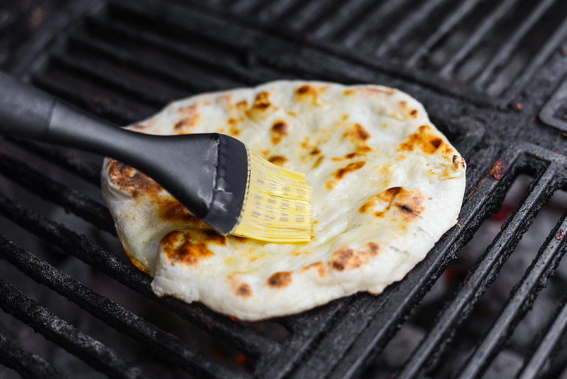

# Tandoor and Griddle Techniques

*A tandoor at home is hard. A tawa is easy. This page covers how to substitute the tandoor with home-kitchen kit; how to get the traditional griddle-puff on a roti; how to control deep-fry oil temperature for the right puri; and the small technical tricks that make Indian breads consistently good.*

## Overview

Indian breads use three main cooking surfaces:

1. **Tawa** (flat griddle): for roti, chapati, paratha, akki roti.
2. **Tandoor** (clay oven, 480°C): for naan, kulcha, tandoori roti.
3. **Deep oil** (180°C): for puri, bhatura, kachori.

Plus accessories: the open gas flame (for puffing roti); the baking stone (for home oven naan); the wok / kadhai (for deep-frying).

Each technique has nuance worth covering.

## The tawa

### Choosing a tawa

- **Cast iron tawa**: heavy, slow to heat, holds temperature well. Best for parathas and breads with ghee. £25-40 for a good Indian brand (Hawkins, Hindware).
- **Anodised steel / aluminium tawa**: heats faster, lighter. Better for everyday roti production. £15-25.
- **Non-stick tawa**: easier to clean but doesn't get hot enough; rotis don't puff well. AVOID for serious bread work; OK for parathas.
- **Iron flat-base saucepan**: works as a tawa substitute if you don't want to buy one.

### Seasoning a cast iron tawa

A new cast iron tawa needs seasoning before first use:
1. Wash and dry the tawa.
2. Coat with a thin layer of oil (rapeseed or sunflower).
3. Heat in the oven (250°C) for 1 hour.
4. Cool. Repeat 2-3 times.

A well-seasoned cast iron tawa is naturally non-stick after this process and develops a deep black patina over time.

### Heat management

- **Cold start**: place tawa on burner; medium-high heat; wait 5-7 minutes until the tawa is fully heated.
- **Test**: drop a tiny pinch of atta. Should sizzle and brown in 3-5 seconds. If it doesn't sizzle, tawa is cold. If it burns instantly, tawa is too hot.
- **Steady state**: once at temperature, the tawa stays hot. Reduce burner to medium for steady cooking.
- **Between rotis**: the tawa stays hot. Don't lower the heat between rotis (otherwise the next one cooks unevenly).

### Cleaning the tawa

- After cooking, scrape off any burnt bits with a flat spatula while still hot.
- Wipe with a clean cloth or kitchen paper (don't wash with soap if cast iron, strips the seasoning).
- For non-stick or steel, wash normally.
- Re-season cast iron occasionally if the surface looks dry.

## The home tandoor substitute

A real tandoor is a clay-walled cylindrical oven that heats to 480-500°C using burning coals or wood. The wall stays at that temperature for hours; bread slapped against the wall cooks in 60-90 seconds.

At home, three approximations:

### 1. Baking stone in a hot oven (best for naan)
- Preheat oven to 250°C / 482°F with a baking stone (or upturned heavy baking sheet) on the middle rack.
- Allow 30 minutes for the stone to fully heat.
- Slide rolled bread onto the stone with a peel.
- Bake 2-3 minutes until puffed and slightly charred.
- Optional: switch the grill / broiler on for the last 30 seconds for top char.

### 2. Cast iron skillet flipped upside-down on the cooktop
- Heat a heavy cast iron skillet upside-down over a gas flame on high heat.
- The flat bottom of the skillet becomes the cooking surface.
- Slap the rolled bread onto the hot bottom.
- The bread sticks initially; cook 60-90 seconds.
- Use a peel or fingers to release.
- Higher heat than oven; closer to tandoor temperature.

### 3. Pizza oven (if you have one)
- A wood-fired pizza oven runs at 350-450°C, very close to tandoor temperature.
- The bread cooks in 90-120 seconds on the stone floor.

For most home kitchens, option 1 (baking stone in oven) is the best balance of access + result.

## The griddle puff (the roti magic)

The puff is the visible sign of a well-made roti. Technique:

### The chemistry
The roti has two cooked surfaces (after 30 sec on each side on the tawa). The dough between the surfaces is still raw and has moisture. When directly heated (over an open flame or on a very hot ring), the moisture turns to steam; the steam is trapped between the two cooked surfaces; the steam expands; the roti puffs into a balloon.

### How to puff

**Gas flame:**
- Lift the roti off the tawa with tongs.
- Hold directly over the open gas flame (not the side flame, the centre).
- The roti will start to puff within 3-5 seconds. Watch it inflate.
- Hold for 5-8 seconds total; the bottom should char slightly.
- Flip; another 3-5 seconds on the other side.

**Electric ring:**
- Heat the electric coil to maximum.
- Lift the roti off the tawa.
- Place directly on the hot coil for 5-8 seconds. The coil is the heat source.
- Flip; another 5-8 seconds.

**Induction (no flame):**
- Induction can't puff roti directly. The substitute: leave the roti on the tawa for an extra 15-20 seconds and press with a clean cloth or spatula. Some puff happens; it's not as dramatic.

### When the puff doesn't happen

- **Tawa side was over-cooked**: the inner moisture cooked away before the flame puff. Tawa-cook each side only 30-45 seconds.
- **Roti has a small hole**: steam escapes. Roll more carefully.
- **Roti is too thick**: too much dough for the steam to inflate. Roll thinner.
- **Roti is too thin**: not enough dough to hold its shape; tears. Roll thicker.
- **Flame too low**: Indian gas flames are typically high. Use the highest setting.
- **Roti not fresh**: a refrigerated dough doesn't puff well. Use the dough within 2-3 hours of mixing.

## Deep-fry temperature control

For puri, bhatura, kachori, the oil temperature is everything. The right range: 175-190°C.

### Testing oil temperature

- **Thermometer**: most accurate. A digital probe thermometer reads 180°C directly.
- **Dough drop test**: drop a small piece of dough into the oil. At 180°C, the dough rises to the surface within 2 seconds and bubbles actively. Lower temperature: the dough sinks and bubbles slowly. Higher temperature: the dough rises immediately and the bubbles are violent.
- **Watching the oil**: oil starts to ripple (shimmer) at about 160°C; starts smoking lightly at about 200°C. The shimmer-but-no-smoke zone is roughly 180°C.

### Maintaining temperature

- **Don't overload**: each puri / bhatura lowers the oil temperature briefly. Adding 4 at once drops it 20-30°C and creates oily, undercooked bread.
- **Reheat between batches**: wait 15-30 seconds for the oil to return to temperature before adding the next bread.
- **Adjust heat**: if the oil cools too much between batches, raise the burner. If it gets too hot (bread burning), lower.

### Oil choice

- **Sunflower oil**: neutral, high smoke point (about 225°C). Default for Indian deep-frying.
- **Rapeseed / canola oil**: same characteristics.
- **Ghee**: flavoursome but expensive for deep-frying. Used in mithai (Indian sweets) deep-frying.
- **Mustard oil**: distinctly pungent. Used in Bengali deep-frying.
- **Sesame oil**: too strong-flavoured for general use; sometimes used for specific regional dishes.

### Re-using oil

After frying, the oil contains tiny bits of cooked dough and some browned flavour. To reuse:
1. Let the oil cool to room temperature.
2. Strain through a fine sieve or cheesecloth into a clean jar.
3. Refrigerate or store at room temperature.
4. Use for 2-3 more frying sessions before the oil becomes too dark and tired.

## The "doubling" technique for puris

A technique to make puris ultra-puffy:

1. Roll a puri to your normal size.
2. Roll a second puri the same size.
3. Stack one on top of the other.
4. Roll once more (now a thicker double-layered puri).
5. Fry. The double-layered structure puffs more dramatically and stays inflated longer.

This works for serving, the doubled puri stays puffy at the table while a single puri tends to deflate within 30 seconds of leaving the oil.

## Stone vs tawa: which to choose

For naan-style breads:
- **Stone / hot oven**: best texture, more authentic char.
- **Tawa + flame**: easier, less equipment, OK result.

For roti / chapati:
- **Tawa + flame**: the traditional Indian household setup. Stone is overkill.

For puri / bhatura:
- **Deep-fry only**: no shortcut. Air-frying or oven-baking destroys the texture.

## A whole bread-cooking session

For a 4-person Indian dinner with 3 different breads:

1. **30 minutes before**: make atta dough (for roti and parathas).
2. **2 hours before**: make naan dough (with yeast); let rise.
3. **Pre-heat oven** to 250°C with baking stone 30 minutes before cooking.
4. **Heat tawa** for roti/paratha.
5. **As guests arrive**: cook 6-8 rotis on the tawa, brushing with ghee.
6. **At main course**: bake 4 naans in the oven on the baking stone.
7. **Serve all warm**.

For dessert: fry 6-8 puris in hot oil; serve with sweetened condensed milk.

## After mastering the techniques

The breads themselves are now the foundation. With:
- A reliable roti puff
- A good paratha lamination
- A naan that puffs in the oven
- A puri that puffs in oil

You can compose any Indian meal:
- Breakfast: parathas with yogurt + pickle.
- Lunch: rotis with sabzi + dal + raita.
- Dinner: naan with butter chicken + saag paneer.
- Sunday brunch: chole bhature.
- Festival: puri with halwa + chole.

Bread is the everyday Indian carbohydrate, and the technique is in the cook's hands. Once those hands know the moves, the Indian kitchen opens up.
