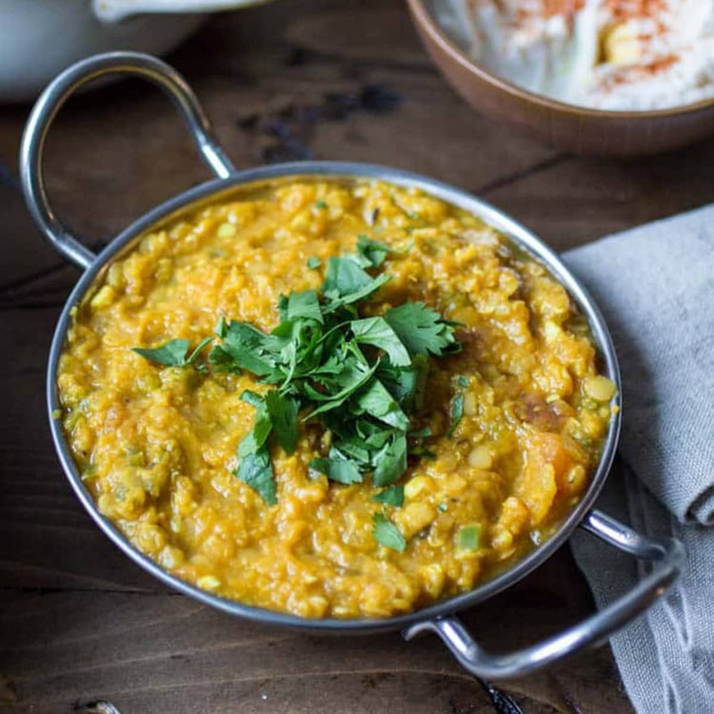

# Dal

*Dal isn't just a curry - it's the protein heart of Indian eating. Almost every meal has at least one dal on the plate. There are at least 20 named dal varieties, but six cover 95% of home cooking. Once you know how to handle each, you can build a meal around any.*

## Overview

Dal is the Hindi word for both the pulse (the dried legume) AND the cooked dish. The same word for the raw ingredient and the finished dish - that tells you how central it is to Indian cooking. India is the world's largest producer and consumer of pulses; a typical Indian household eats dal at least once a day.

The six common dals (and their traditional preparations):

1. **Toor dal (arhar dal)** - split pigeon pea. The most common across most of India. Pale yellow when cooked.
2. **Moong dal** - split mung bean. Yellow; mild; quick-cooking.
3. **Masoor dal** - red lentil. Brown when whole; pink when split; tan when cooked. Very fast.
4. **Chana dal** - split Bengal gram. Pale yellow; nutty; longer cook.
5. **Urad dal** - split black gram. Black-skinned when whole; pale yellow when skinned-and-split. Long cook.
6. **Rajma** - kidney beans. Whole; cook 6-8 hours or 1 hour in pressure cooker.

This page walks through each, the cooking method, and a traditional preparation.

## Common pressure-cooker technique

Most Indian households use a pressure cooker for dal. It cuts the cooking time from hours to 20-25 minutes. The basic technique:

1. **Wash and soak** the dal in water for 30 minutes (longer for harder dals like chana and rajma). Drain.
2. **Combine in the pressure cooker** the soaked dal + 3-4 times its volume of water + 1 teaspoon turmeric + 1 teaspoon salt + 1 chopped tomato (optional but recommended).
3. **Pressure cook** - see times per dal below.
4. **Release pressure naturally** for 10 minutes; then release any remaining pressure.
5. **Stir** with the back of a spoon to mash some of the dal lightly (gives the right texture).
6. **Tarka** (see the [tarka page](tarka.md)) on top.

| Dal | Soak | Pressure cook |
|---|---|---|
| Toor dal | 30 min | 3-4 whistles (15-20 min) |
| Moong dal | 15 min | 3 whistles (10-15 min) |
| Masoor dal (split red) | 10 min | 2-3 whistles (8-12 min) |
| Chana dal | 60 min | 6-8 whistles (25-30 min) |
| Urad dal (black) | 8 hours | 8-10 whistles (35-45 min) |
| Rajma | 8 hours | 8-10 whistles (40-50 min) |

A "whistle" is the pressure release; whistle-counting is the traditional Indian pressure-cooker timer.

## Traditional preparation: tarka dal (toor)

This is the household standard. Every Indian family has a version.

### Ingredients
- 200 g toor dal (soaked 30 min, drained)
- 800 ml water
- 1 teaspoon turmeric
- 1 teaspoon salt
- 1 chopped tomato
- 1 small piece of ginger (smashed)
- 1 green chilli (split lengthways)
- A handful of chopped fresh coriander (for garnish)

### Tarka
- 3 tablespoons ghee
- 1 teaspoon cumin seeds
- ½ teaspoon mustard seeds
- 2 dried red chillies (broken)
- A pinch of asafoetida
- 4 garlic cloves (sliced)
- ½ teaspoon Kashmiri chilli powder
- A few curry leaves (optional but excellent)

### Method
1. Pressure cook the dal with water + turmeric + salt + tomato + ginger + green chilli (3-4 whistles).
2. Release pressure; open; mash the dal lightly.
3. Make the tarka: heat ghee in a small pan. Add mustard seeds; pop. Add cumin; sizzle. Add dried chillies and asafoetida; 5 sec. Add garlic; cook 30 sec until just golden. Off heat; add chilli powder.
4. Pour the tarka over the dal. Sizzle. Stir.
5. Garnish with chopped coriander. Serve with hot rice and a flatbread.

## Other key dal preparations

### Dal makhani (Punjabi black dal)

A slow-cooked Punjabi dish; the dal of the dhabas (roadside Punjabi restaurants). Made with whole urad + rajma + chana dal + tomato + butter + cream.

The technique: pre-soak the three dals overnight; pressure cook 8-10 whistles until soft; then SLOWLY simmer for several hours with butter and cream gradually added. Tarka of cumin + tomato + chillies finishes it.

### Dal tadka (the Punjabi tarka dal)

The Punjabi name for the same dish as above, but North-Indian style. Toor or arhar dal pressure-cooked; finished with a tarka of cumin + dried chilli + tomato + onion (heavier on onion than the South Indian version) + cream + butter.

### Sambar (the South Indian dal-and-vegetable stew)

The defining South Indian dish. Toor dal + mixed vegetables (carrots, beans, eggplant, drumstick, okra - whatever's in season) + tamarind water + sambar powder. The tarka uses sesame oil + mustard + curry leaves + dried red chillies + asafoetida.

### Rasam (South Indian thin spicy soup)

A thinner, soupier dal-related dish. Toor dal water + tomato + tamarind + rasam powder + tarka. Drunk like a soup before the main meal, or poured over rice.

### Chana masala (whole chickpeas)

Technically not a dal - uses whole chickpeas (kabuli chana) - but cooked similarly. Pressure-cook the soaked chickpeas; finish with a thick tomato-onion-ginger-garlic masala + amchur (dried mango) + a tarka of cumin + chilli.

### Khichdi (rice + dal one-pot)

A combined rice-and-dal dish, the "comfort food" of India. Rice + moong dal + ghee + turmeric + salt + a tarka of cumin + ginger. Slow-cooked to porridge consistency. The Indian sick-day food; what mothers make for ill children.

## A note on consistency

Indian dal isn't one consistency. A typical North Indian dal is thick - almost like a stew. A South Indian sambar is thinner - like a thick soup. A rasam is thinner still - almost a broth. The right consistency depends on the dish and the region.

When the cooked dal is too thin, simmer uncovered to reduce. When it's too thick, add hot water.

## What dal goes with what

- **Toor / tarka dal** → rice, roti, paratha. Any meal.
- **Moong dal** → rice. Light; often for ill-health or kichdi.
- **Masoor dal** → rice. Quick weeknight dish.
- **Chana dal** → rice, roti, vegetable dish. Often part of a thali.
- **Dal makhani** → naan, rice, butter-chicken meal.
- **Sambar** → idli, dosa, vada, rice.
- **Khichdi** → eaten alone, sometimes with pickle and yogurt.

The next page covers rice and roti - the carbohydrate companions to all of these.
