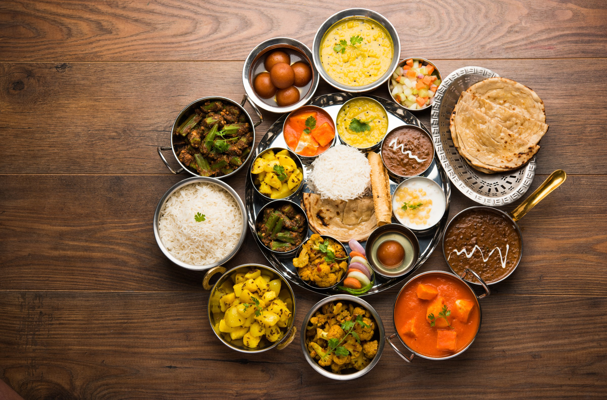

# What Home Cooking Actually Is

*A home-cooked Indian meal isn't a restaurant curry. The flavour is built in the pan from whole spices, the protein and aromatics are cooked into a single integrated dish, and the rice / roti / dal that surround it are equally important. Once you understand how the system works, you can compose a meal without a recipe.*

## Overview

The most common confusion about Indian cooking, particularly in the West, is treating it like restaurant Indian, order a curry, get a separate bowl of rice, possibly a naan, possibly a side. That's the British-Indian-Restaurant (BIR) format, and it's its own technique (covered in the [BIR course](../bir-curry/home.md)).

Home Indian cooking is different. The food is built around a **thali** (a plated meal) or a **plate-of-food** structure where a single main dish (a sabzi, a dal, a meat curry, or even just rice) sits surrounded by 3-5 smaller items that complete the meal: rice + dal + a vegetable + a yogurt + a pickle + a roti. The composition matters. The cook isn't making "a curry"; they're making a *meal* where each piece pulls its weight.

This course covers the technique that underpins all of that:

1. **The masala system**: how whole vs ground spices, blooming, and the regional masala blends work.
2. **Tarka**: the tempering technique where ghee + spices + curry leaves are dropped over a finished dish or as the base.
3. **Dal**: the lentil dishes that are the protein heart of most Indian meals. Multiple varieties; multiple preparation styles.
4. **Rice and roti**: basmati cooking, the chapati / roti technique, paratha, naan, and how to choose.
5. **Regional traditions**: Punjabi (the most-exported, dairy-and-cream-heavy) vs Bengali (mustard-and-fish-driven) vs South Indian (rice-and-tamarind) vs Gujarati (sweet-and-pickled) vs Kashmiri (fennel-and-aniseed-driven). Each region has a distinct compositional logic.

## What this course is NOT

This is not a course in restaurant-style Indian dishes (chicken tikka masala, vindaloo, korma in the BIR style). For those, use the [BIR course](../bir-curry/home.md). The two coexist; home Indian is the foundation, restaurant Indian is a particular evolution for the British-Indian restaurant scene since the 1970s.

## What you need

A basic Indian home kitchen has:

- **A heavy-bottomed pan** (cast iron or anodised steel): Indian cooks use a *kadhai* (Indian deep wok) but a heavy frying pan works.
- **A tawa** (flat griddle) for chapatis and parathas, a heavy cast-iron griddle or even a flat-based heavy pan substitutes.
- **A pressure cooker**: for dal. The Indian household pressure cooker is the single most-used piece of kitchen kit in India. The Hawkins or Prestige aluminium ones are traditional. A modern electric Instant Pot serves the same function.
- **A mortar and pestle** or small spice grinder, for fresh-ground masalas.
- **Whole spices**: coriander seed, cumin seed, mustard seed, fenugreek, fennel, cardamom (green + black), cloves, cinnamon, peppercorns, dried red chillies, curry leaves, asafoetida, turmeric.
- **Ghee** (clarified butter) and mustard / sunflower oil. Indian frying is overwhelmingly in ghee or in oil, not in butter.

## How to use the course

1. Read all six pages once, in order.
2. Pick one dish from the regional-traditions page and cook it.
3. Then cook a dal from the dal page.
4. Then cook a rice and a roti to go with each.
5. Build a thali (a plate with rice + dal + a vegetable + a chutney). Eat it as one meal.

The whole exercise takes about three weeks of cooking. By the end, you can compose a meal without a recipe, read three ingredients, know what dal/rice/roti/chutney completes them.
