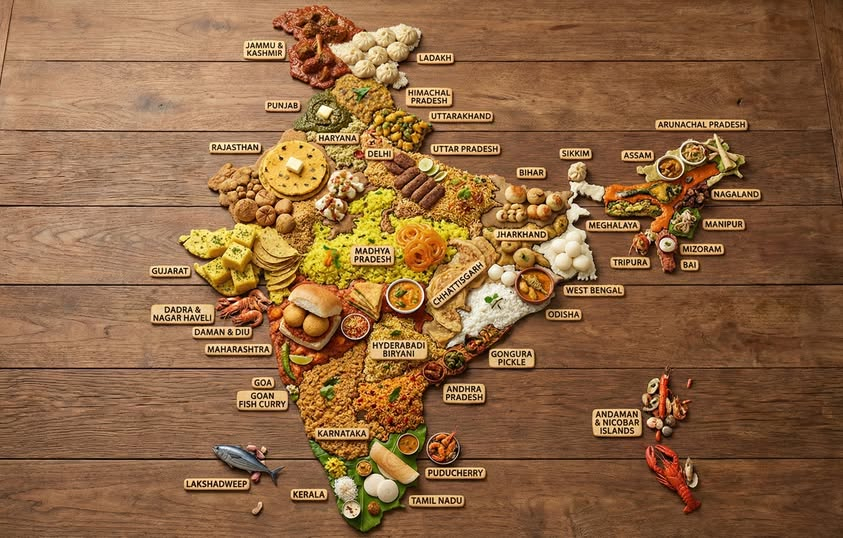

# Regional Traditions

*"Indian food" is a wildly misleading single label. The food of Punjab, the food of Tamil Nadu, the food of Bengal, the food of Goa, they share spices but differ in everything else: the fat, the staple grain, the meat tradition, the flavour balance. This page walks through the six main regional traditions so you can identify and execute each.*

## Overview

India is roughly the size of Europe and has comparable culinary diversity. The country splits into broad regional traditions, each with its own compositional logic. The six biggest:

1. **Punjabi** (North): dairy-heavy, wheat-based, robust meat-and-cream curries.
2. **Bengali** (East): mustard-and-fish-driven, with the famous panch phoron 5-spice.
3. **South Indian** (Tamil + Kerala + Karnataka + Andhra): rice + tamarind + coconut + curry leaves + lots of vegetarian.
4. **Gujarati** (West): vegetarian, sweet-and-spicy balance, dairy-heavy.
5. **Maharashtrian** (Mumbai region): spicier, peanut-and-coconut-influenced, sea-influenced on the coast.
6. **Goan** (Konkan coast): coconut + vinegar + fish + Portuguese fusion.

Each is treated below with the defining ingredients, the traditional dishes, and the pantry. Get the regional signature right and the dish is right; mix the regions (a Goan vinegar-fish-curry with Punjabi cream) and you've made something that doesn't exist.

## 1. Punjabi (North)

**Geography:** Punjab + Haryana + UP + Delhi.

**Pantry:**
- Wheat flour (atta).
- Ghee, butter, cream.
- Tomato + onion + ginger + garlic (the traditional North Indian base).
- Whole + ground spices: cumin, coriander, garam masala, cardamom (green + black), bay leaves, chillies.
- Yogurt (for marinades + raitas).

**Defining dishes:**
- **Butter chicken** (murgh makhani): chicken in tomato-cream-butter sauce. The most-exported Indian dish.
- **Dal makhani**: slow-cooked black urad + rajma in butter and cream.
- **Chana masala**: chickpeas in tomato-onion masala.
- **Tandoori chicken**: yogurt-marinated, tandoor-baked.
- **Paneer butter masala**: paneer cubes in butter-tomato sauce.
- **Aloo gobi**: potato and cauliflower stir-fry.
- **Sarson da saag** with **makki di roti**: mustard greens with cornmeal flatbread (winter staple).

**Compositional logic:** dairy-rich curries paired with naan or paratha (wheat-based bread). Cream + butter + yogurt run through the cuisine. The meat curries are bold, spice-forward, integrated. The vegetarian dishes are equally substantial.

**The signature:** if a dish uses tomato + onion + ginger-garlic + garam masala + a finishing touch of cream and butter, it's Punjabi.

## 2. Bengali (East)

**Geography:** West Bengal + Bangladesh + parts of Bihar and Odisha.

**Pantry:**
- Rice (the staple; eaten more than wheat).
- Mustard oil (the traditional Bengali fat, pungent, sharp).
- Panch phoron (the 5-spice: cumin, mustard, fenugreek, nigella, fennel).
- Fish (Bengali is the fish-eating Indian cuisine, hilsa, rohu, catla, prawns, mackerel).
- Posto (poppy seed paste).
- Mustard paste (kasundi).

**Defining dishes:**
- **Macher jhol**: Bengali fish curry (any fish, mustard or panch-phoron base).
- **Shorshe ilish**: hilsa in mustard sauce. The dish of Bengal.
- **Chingri malai curry**: prawns in coconut milk + green chilli (Bangladeshi version).
- **Aloo posto**: potatoes in poppy-seed paste.
- **Begun bhaja**: fried aubergine slices.
- **Mishti doi**: sweet yogurt, the Bengali dessert obsession.

**Compositional logic:** rice + dal + a fish/prawn dish + a vegetable + sometimes a sweet. The fat is mustard oil, not ghee (the smell is sharp and distinctive). Spices are gentler than Punjabi; the focus is on freshness and fish.

**The signature:** if a dish uses mustard oil + panch phoron + fish (or aubergine), it's Bengali.

## 3. South Indian (Tamil + Kerala + Karnataka + Andhra + Telangana)

**Geography:** the southern peninsula.

**Pantry:**
- Rice (the staple).
- Sambar dal (toor dal).
- Coconut (oil + grated flesh + milk).
- Tamarind (the souring agent).
- Mustard seeds (the traditional opening spice).
- Curry leaves.
- Asafoetida.
- Dried red chillies + fresh green chillies.
- Sambar powder + rasam powder.

**Defining dishes:**
- **Sambar** with idli or dosa.
- **Rasam**: thin spicy tamarind-pepper soup.
- **Avial** (Kerala): mixed vegetable in coconut-yogurt sauce.
- **Bisi bele bath** (Karnataka): rice + dal + vegetables + sambar powder, all in one pot.
- **Karaikudi chicken Chettinad** (Tamil): peppery, dry-spiced chicken.
- **Erissery** (Kerala): yellow vegetable curry with coconut.
- **Pongal** (Tamil): rice + moong dal one-pot.
- **Andhra fish curry** (Gongura mamsam): fiercely chilli-heavy.

**Compositional logic:** rice is the base; sambar or rasam goes over the rice; multiple small vegetable side dishes (poriyal, kootu, aviyal); coconut chutney or tomato chutney; a yogurt or buttermilk to cool everything down. The thali is multi-bowl, often vegetarian.

**The signature:** if a dish opens with mustard seeds popping in coconut oil + curry leaves + dried chillies, it's South Indian.

## 4. Gujarati (West)

**Geography:** Gujarat + nearby Madhya Pradesh.

**Pantry:**
- Bajra (millet) + jowar (sorghum) + atta.
- Ghee + sesame oil.
- Jaggery + sugar (sweet is a feature, not a bug).
- Spices: turmeric + chilli powder + coriander + cumin + asafoetida.
- Lots of legumes: chana, moong, urad, masoor, val.

**Defining dishes:**
- **Dhokla**: steamed chickpea-flour cake. The Gujarati signature snack.
- **Khandvi**: chickpea-flour-and-buttermilk rolls.
- **Undhiyu**: mixed-vegetable winter dish with surti (broad bean), purple yam, banana, baby aubergine.
- **Theplas**: fenugreek + spice flatbreads.
- **Khaman**: fluffy steamed gram-flour squares.
- **Gujarati dal / kadhi**: both gently sweet, distinct from Punjabi versions.
- **Patra**: colocasia leaves rolled and spiced.

**Compositional logic:** vegetarian (predominantly), sweet-spicy-sour balance, dairy-rich (yogurt, ghee). The Gujarati thali is FAMOUSLY elaborate: 10-15 small bowls of different items. Sweet notes (jaggery + sugar) in the curries are characteristic.

**The signature:** if a dish has a touch of sweetness (jaggery or sugar) + asafoetida + tomato + chickpea flour base, it's Gujarati.

## 5. Maharashtrian (Mumbai region)

**Geography:** Maharashtra. Two distinct sub-cuisines: coastal (Konkan) and interior (Deccan).

**Pantry:**
- Rice + jowar + bajra.
- Peanut + sesame.
- Coconut (coastal) + jaggery + tamarind.
- Goda masala (the regional Maharashtrian masala blend).
- Kokum (a sour fruit used as a tamarind alternative).

**Defining dishes:**
- **Misal pav**: spiced sprouts in curry, with bread. The Pune signature.
- **Vada pav**: potato fritter in bread (the Mumbai street food).
- **Pav bhaji**: vegetable mash with butter on a bun (Mumbai again).
- **Puran poli**: sweet jaggery-and-chickpea flatbread.
- **Shrikhand**: sweetened thickened yogurt with cardamom + saffron.
- **Modak**: sweet steamed dumplings (for Ganesh festival).
- **Konkani fish curry**: coconut + kokum + chilli.

**Compositional logic:** distinct urban (Mumbai street food: vada pav, pav bhaji, dabba style) and rural-traditional (Marathi household) split. The cuisine bridges the chilli-heavy interior with the coconut-coast.

**The signature:** street food meets vegetarian-thali; peanut + jaggery in many dishes; the dabba (lunch tin) tradition.

## 6. Goan (Konkan coast)

**Geography:** Goa + parts of Karnataka and Maharashtra's coast.

**Pantry:**
- Rice (the staple).
- Coconut (oil + flesh + milk).
- Vinegar (the Portuguese legacy, coconut vinegar, palm vinegar, toddy vinegar).
- Pork (the Portuguese-Christian legacy).
- Fish + prawns (the coastal abundance).
- Tamarind.
- Goan red chillies (Kashmiri-style, mild but deep red).

**Defining dishes:**
- **Sorpotel**: Portuguese-derived pork stew with offal, vinegar, and spice.
- **Goan fish curry (xitt khoddi)**: coconut + tamarind + chilli, eaten with rice every day.
- **Vindaloo (Goan, not BIR)**: pork + vinegar + chilli; sour and intense.
- **Cafreal**: Goan green-chilli-and-coriander chicken (Portuguese-African legacy).
- **Bebinca**: multi-layered baked coconut dessert.
- **Goan ros omelette**: egg in spicy coconut-tomato gravy.

**Compositional logic:** the Goan thali centres on rice + fish curry + a vegetable + sometimes pork (Portuguese-Christian Goan) + chutney. Vinegar is the defining ingredient that distinguishes Goan from the rest of India's cuisine.

**The signature:** if a dish uses coconut + vinegar + chilli + pork, it's Goan. The Portuguese influence shows in the vinegar use and the pork eating (rare in most Hindu India).

## Beyond the six: other regions

- **Kashmiri**: saffron, fennel, dried ginger, less heat, more cardamom and aniseed. The wazwan banquet tradition.
- **Rajasthani**: desert cuisine, less vegetable-dependent, gram flour and chickpea heavy. Dal bati churma is the signature.
- **Hyderabadi**: Mughlai-influenced, rice-and-meat heavy. Biryani capital.
- **Sindhi**: refugee cuisine from partition; sai bhaji, dal pakwan.
- **North-eastern (Naga, Manipuri, Mizo)**: much less curry-based; ferments and smoked meat; rice-and-pickle eating.

## How to use this knowledge

Pick a region. Spend 2-3 cooking sessions making 3-4 of its traditional dishes. Notice the pantry, the ghee vs the mustard oil; the dried chillies vs the curry leaves; the tomato vs the tamarind. Once you can identify the regional signature in a dish, you can cook intentionally rather than from a single recipe.

The Indian cooking journey starts here, on these six regions. Master one before moving to the next.
