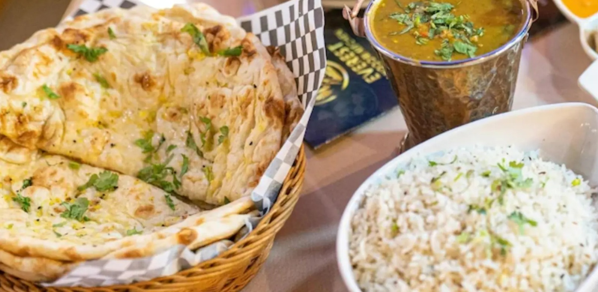

# Rice and Roti

*The Indian meal is built around carbohydrate. Rice for the South; roti for the North; both for everywhere in between. Get the technique right and they're the foundation; get them wrong and the whole meal suffers.*

## Overview

Indian carbohydrate splits roughly along the Vindhya mountain range that divides north from south: **rice-eating south** (Tamil Nadu, Kerala, Karnataka, Andhra, Telangana, Goa, much of Maharashtra) and **wheat-eating north** (Punjab, Haryana, UP, Bihar, Rajasthan, Gujarat). Cross-the-line cuisines (Bengal, Odisha) eat both equally.

This page covers:

1. **Basmati rice** - the traditional Indian long-grain. Cooking technique.
2. **The chapati / roti** - the everyday flatbread.
3. **The paratha** - the layered, ghee-rich flatbread.
4. **Naan** - the leavened tandoor flatbread (more restaurant than home).
5. **Other rices and flatbreads** - when to use what.

## Basmati rice

Basmati is a specific cultivar from the Punjab / Pakistan / North India region. The grain is long, fragrant, and stays separate when cooked (vs sticky short-grain). Three brands worth knowing: Tilda, Daawat, Kohinoor. Each has a "premium" line (aged 1-2 years; better aroma) and a regular line.

### Soaked basmati (the traditional Indian technique)

1. **Rinse** the rice in cold water 3-4 times until the water runs clear (removes excess surface starch).
2. **Soak** in cold water for 30 minutes (the traditional Indian technique). This pre-hydrates the grain.
3. **Drain.**
4. **Cook** in plenty of water (1:1.5 rice:water): 200 g rice + 300 ml water + ½ teaspoon salt + ½ teaspoon oil.
5. **Bring to a boil**; reduce heat to LOW.
6. **Cover tightly**; cook 10 minutes.
7. **Off heat**; let stand covered 10 more minutes (residual cooking).
8. **Fluff** with a fork (don't stir - breaks the grains).

The result: each grain separate, long, fragrant, slightly al dente. The pre-soak is the difference between average and very good basmati.

### Quick basmati (no soak)

If you don't soak:
- Rinse 3 times.
- Use 1:2 rice:water (200 g + 400 ml).
- Bring to boil; reduce to LOW; cover; 15 minutes.
- Rest 10 minutes off heat; fluff.

Acceptable but the grain is slightly less long and the aroma less pronounced.

### Jeera rice (cumin rice)

A flavoured basmati. Same technique but heat 2 tablespoons of ghee in the pan first, sizzle 1 teaspoon cumin seeds, then add the soaked drained rice; stir to coat; add the water and proceed.

The result is fragrant cumin-flavoured rice. Excellent with any dal or curry.

### Pulao (the Indian pilaf)

Made by sweating onion + whole spices in ghee, adding rice, adding stock or water, and cooking covered. The whole spices (cumin, cardamom, cloves, cinnamon, bay) infuse the rice during the cook. Vegetables, meat, or paneer added as variants.

### Biryani

The big-deal cousin of pulao. Half-cooked rice layered with separately-cooked marinated meat, then sealed and slow-cooked (dum). Multiple regional variants (Hyderabadi, Lucknowi, Sindhi, Kolkata, Calcutta-Memoni). A weekend project - not the daily meal.

## The chapati / roti

The daily flatbread of North India. Whole wheat flour, water, salt. No leavener. Rolled thin; cooked on a hot dry tawa (cast iron griddle); puffed over an open flame.

### Dough
- 250 g atta (whole wheat flour; Indian-style, fine-ground)
- 150-160 ml water (start with less; add as needed)
- ½ teaspoon salt
- 1 teaspoon oil

### Method
1. Combine flour and salt in a bowl.
2. Add oil; rub in.
3. Add water gradually; knead 8-10 minutes until smooth, elastic, slightly soft.
4. Rest covered 30 minutes.
5. Divide into 8-10 small balls (35-40 g each).
6. Roll each into a 18-20 cm round (4-5 mm thick).
7. Heat tawa over medium-high heat.
8. Cook the chapati 30 seconds on the first side (small bubbles appear).
9. Flip; cook 30 seconds on the second side (more bubbles; the chapati starts to puff slightly).
10. **The puff**: lift the chapati with tongs and place it directly over an open gas flame (or a hot electric ring set high). It should puff into a ball within 5-10 seconds - this is the magic moment.
11. Smear with a touch of ghee while warm. Stack on a plate; cover with a tea towel.

The puff comes from steam trapped between the two cooked surfaces. A well-puffed chapati is sign of dough that was properly hydrated and a tawa that was hot enough. The "round" puff (full sphere) is the visible mark of a well-made chapati.

## Paratha

Same dough as chapati but layered with ghee and rolled multiple times to create flaky layers. The technique:

1. Roll the dough ball into a 15 cm round.
2. Brush generously with melted ghee.
3. Fold into a triangle (or roll into a tube and coil).
4. Re-roll to original size.
5. Cook on a hot tawa with a small amount of ghee - about 1 minute per side.
6. The paratha has visible layers and a slight buttery crisp from the ghee.

Variants:
- **Aloo paratha** - stuffed with spiced mashed potato.
- **Gobi paratha** - stuffed with grated cauliflower + spices.
- **Mooli paratha** - stuffed with grated mooli (white radish).
- **Paneer paratha** - stuffed with crumbled paneer + spices.

## Naan

The tandoor-baked bread, more associated with restaurant Indian than home cooking. Made with white flour + yogurt + yeast + salt, kneaded, proofed, then slapped against the inside of a clay tandoor at 480°C. The high heat puffs the bread; the slight char from the tandoor wall is part of the character.

At home, an oven preheated to 250°C with a stone or upturned baking sheet works but never quite reproduces the tandoor effect. Naan is typically restaurant fare in India.

### Variants
- **Plain naan** - the traditional.
- **Garlic naan** - chopped garlic + butter brushed on after baking.
- **Peshawari naan** - sweet, with raisins, coconut, almonds.
- **Keema naan** - stuffed with minced meat.
- **Cheese naan** - stuffed with cheese.

## Other rices and breads

### Rices
- **Sona masoori** - short-grain, used in South Indian everyday cooking (idli, dosa, daily meals). Cheaper than basmati; more sticky; less fragrant.
- **Ponni rice** - Tamil short-grain. Sticky, used in many South Indian dishes.
- **Brown basmati** - the wholegrain variant. Longer cook (40 minutes); nuttier.

### Breads
- **Bhakri** - Maharashtrian/Gujarati millet flatbread, thicker than chapati, slightly chewy.
- **Thepla** - Gujarati flatbread with fenugreek leaves + masala.
- **Akki roti** - Karnataka rice-flour flatbread.
- **Appam** - Kerala fermented rice-and-coconut pancake (bowl-shaped, the Sri Lankan-Kerala continuum).
- **Puri** - small deep-fried puffed bread (the deep-fried cousin of the chapati).
- **Bhatura** - Punjabi yogurt-leavened bread, deep-fried; paired with chole.

## How to pair rice/roti with the rest of the meal

| Dish | Goes with |
|---|---|
| Dal tadka | rice + roti (whichever you prefer) |
| Dal makhani | naan + jeera rice |
| Sambar | rice (the traditional) + dosa + idli |
| Chicken curry (North Indian) | naan or rice |
| Fish curry (Bengali) | white rice (always) |
| Sabzi (vegetable dish) | roti or paratha |
| Biryani | itself + raita |
| Khichdi | itself + pickle + yogurt |
| Chana masala | bhatura (traditional) or naan |

## Common mistakes

- **Skipping the soak on basmati.** The grains stay shorter and less fragrant.
- **Rolling the chapati too thick.** Thicker = doesn't puff; chewier; less elegant. 4-5 mm is the target.
- **Tawa too cold.** Chapati spreads and doesn't puff. The tawa should be hot enough that water droplets sizzle and disappear.
- **Naan in a domestic oven.** The bread is OK but not great. The proper version needs a tandoor.

## A simple worked example: a complete North Indian thali

Imagine a plate with:

- A small mound of **basmati rice** (½ cup cooked).
- A **dal tadka** in a small bowl (toor dal, finished with the cumin-ghee tarka).
- A **sabzi** (a stir-fried vegetable like aloo gobi or bhindi masala).
- A **chapati** (folded into thirds, on the side).
- A small spoon of **achaar** (mango pickle).
- A small bowl of **raita** (cucumber yogurt) or **dahi** (plain yogurt).
- A small spoon of **chutney** (mint-coriander or tomato).

This is the traditional North Indian home meal. The dal goes with the rice; the chapati gets torn into pieces to scoop up the sabzi; the achaar adds a sour-spicy hit; the raita cools everything down.

That's home Indian cooking. The next page covers how regional traditions change this structure.
