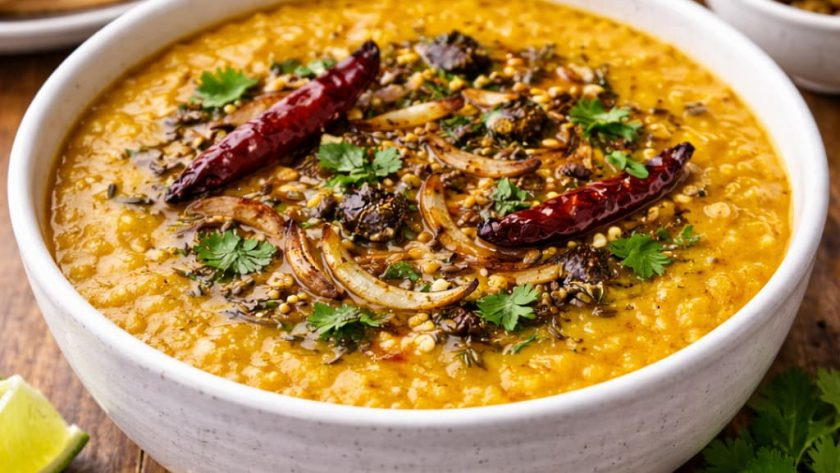

# Tarka (Tempering)

*Tarka is the technique that finishes a dal or a sabzi by pouring a sizzling spoonful of spiced ghee over the top just before serving. It's the difference between a flat boiled-lentils dish and one that punches you in the face with aroma. Every Indian cook does this; very few non-Indian cooks know about it.*

## Overview

Tarka (also called *baghar*, *chaunk*, *tadka*, *vaghar*, or *phodni* depending on region) is the practice of heating ghee or oil in a small dedicated pan, blooming whole spices in it, and then pouring the hot spiced fat over a finished dish. The dish hisses and steams; the aroma is released into the room.

Tarka is used:

1. **At the end of a dal** to add the aromatic punch.
2. **At the start of a tarka dal** (where the tempering is built into the dish as the cooking medium).
3. **Over a vegetable dish** to finish it.
4. **As a sauce-base** for a simple kichdi or a quick stir-fried green.

The technique is the same in all cases: heat fat → bloom whole spices → pour over the dish.

## The basic tarka

The classic North Indian tarka uses:

- 2-3 tablespoons of ghee (or mustard oil for Bengali, sesame oil for South Indian, sunflower oil for everyday)
- 1 teaspoon cumin seeds
- 1 teaspoon mustard seeds (South Indian) OR 1 teaspoon nigella seeds (Bengali)
- 1-2 dried red chillies (broken open)
- 1 pinch asafoetida (hing)
- 8-10 curry leaves (South Indian, Goan, Sri Lankan)
- 1 thinly sliced green chilli (or jalapeño)
- 1 chopped onion or 4 sliced garlic cloves
- ½ teaspoon turmeric (added at the end so it doesn't burn)

### Method

1. Heat the ghee or oil in a small frying pan over medium heat until it's smoking lightly.
2. Add the mustard seeds FIRST. They will pop within 10 seconds. Wait until they stop popping (about 15 seconds total).
3. Add the cumin seeds. Cook 10-15 seconds until they sizzle and brown lightly.
4. Add the dried chillies and asafoetida. Cook 10 seconds.
5. Add the curry leaves. They will sizzle and crisp in 5 seconds.
6. Add the sliced green chilli and garlic (or onion). Cook 30 seconds until softening.
7. Take the pan off the heat. Add the turmeric (the residual heat is enough to cook it).
8. Immediately pour the hot tarka over the finished dish.

The dal/dish should be in a serving bowl. The hot fat hits the cold (or warm) dal and sizzles dramatically. Stir once. Serve.

## When the tarka is the base

Some dishes are built with the tarka first, then the dal/protein/vegetable added to it:

1. Heat ghee in the cooking pan (not a small one - the main pan).
2. Bloom the whole spices as above.
3. Add the dal or vegetable directly to the spiced ghee.
4. Add water/stock and simmer.
5. Finish with a second short tarka at the end (optional, for richness).

This "front-loaded tarka" gives a deeper integration. The dish that finishes with a second tarka gets two layers of aromatic punch.

## Regional tarka variations

The tarka changes with the region:

### North India (Punjab, Haryana, UP, Bihar)
- Ghee + cumin + dried red chilli + ginger + garlic. Sometimes asafoetida.
- Used on dals, sabzis, chicken curries.

### South India (Tamil, Kerala, Karnataka, Andhra)
- Coconut oil or sesame oil + mustard seeds (the traditional opener) + curry leaves + dried red chillies + green chillies + asafoetida + sometimes urad dal seeds for crunch.
- Used on sambars, rasams, dals, coconut chutneys.

### Bengal (West Bengal, Bangladesh)
- Mustard oil + panch phoron (the 5-spice - cumin, mustard, fenugreek, nigella, fennel) + dried chillies + bay leaves + sometimes green cardamom.
- Used on dals, fish curries, vegetable dishes.

### Gujarat
- Ghee + mustard seeds + cumin + curry leaves + asafoetida + a touch of sugar (Gujarati cooking famously balances sweet and savory).
- Used on dals, kadhi (the Gujarati yogurt-based stew), shaaks (vegetables).

### Maharashtra
- Sesame oil + mustard seeds + cumin + asafoetida + curry leaves + sometimes peanuts + chopped green chillies.
- Used on amti (the Maharashtrian dal), zunka, vegetable dishes.

### Goa
- Coconut oil + dried red chillies + curry leaves + onion + garlic + sometimes vinegar (the Portuguese influence).
- Used on fish curries, prawn dishes, the famous Goan pork sorpotel.

## The mustard-seed pop

The audible signal that mustard seeds are blooming properly is the pop. Heat the oil/ghee until shimmering, drop in a teaspoon of mustard seeds, and listen. Within 5-10 seconds you'll hear the first pop. Cover the pan loosely (an upturned strainer works) if you don't want them jumping out.

The pop is the moment the mustard oil compound is being released. Wait until the popping is more than half-finished (about 15 seconds) before adding the next ingredient - too early and the mustard flavour is muted.

If the mustard seeds are silent in the hot oil, the oil wasn't hot enough. If they burn (turn black and smell acrid), the oil was too hot. The right temperature is shimmering, not smoking.

## What NOT to do

- **Don't add ground spices to the tarka pan early.** Ground spices (turmeric, chilli powder) burn fast in raw hot oil. They go in last, off the heat (or just before pouring over the dish).
- **Don't skip the tarka on a dal.** Without the tarka, a dal is plain boiled lentils. The tarka is what makes it taste of India.
- **Don't reuse leftover tarka oil.** It loses its punch after 10 minutes. Make a fresh tarka per dish.
- **Don't fear the volume of fat.** A "lot of ghee" in a tarka (3 tablespoons for a single dish) is traditional. Indian dals are not low-fat dishes; the fat carries the flavour.

## A worked example: simple dal with tarka

This is the basic Indian household dal-tarka - eaten 3-4 times a week in millions of homes.

1. **The dal:** 200 g toor dal + 800 ml water + 1 teaspoon turmeric + 1 teaspoon salt. Pressure cook 4 whistles (or 25 minutes on stovetop until soft).
2. **Mash lightly** with the back of a spoon to break the dal up slightly.
3. **The tarka:** 3 tablespoons ghee in a small pan. Add 1 teaspoon cumin seeds; sizzle 10 seconds. Add 2 dried chillies; cook 5 seconds. Add 4 sliced garlic cloves; cook 30 seconds until just turning golden. Add 1 chopped tomato; cook 1 minute. Off heat; add ¼ teaspoon turmeric.
4. **Pour** the tarka over the dal. Sizzle. Stir once. Garnish with chopped fresh coriander.
5. **Serve** with hot rice and a flatbread.

This is the foundation. Every dal in this course is a variant.
