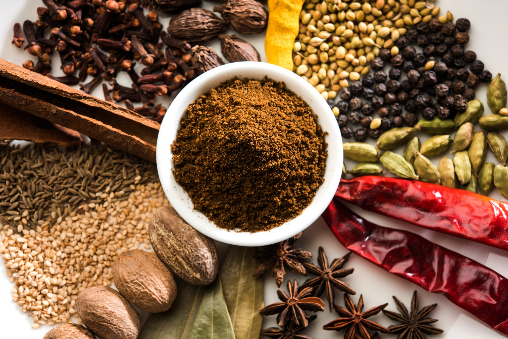

# The Masala System

*Masala is the Hindi word for "spices", but it means more than that. It's the system: which spices, what cut, when added, how cooked. Get the masala right and the dish is right; get it wrong and the dish is forever slightly off.*

## Overview

Indian cooking uses spices in three forms:

1. **Whole spices** (cumin seed, coriander seed, mustard seed, cardamom pods, cloves, cinnamon stick): added to hot fat early in cooking; they "bloom", release their aromatic oils into the fat.
2. **Ground spices** (ground cumin, ground coriander, garam masala, turmeric, chilli powder): added later, after the aromatics have softened, so they don't burn.
3. **Fresh aromatics** (ginger, garlic, fresh chillies, curry leaves, fresh coriander): added at specific moments depending on the dish.

The system is precise: in most South Indian curries, mustard seeds go in first (they need to pop in hot oil to release their flavour); curry leaves and chillies go next (the leaves crisp and release aroma); onion goes later (it needs to soften slowly). The order matters because each ingredient's flavour develops differently in heat.

This page covers the system. The next page covers tarka (the dedicated tempering technique).

## Whole spices and blooming

Whole spices have to be heated in oil/ghee to release their aromatic compounds. This is "blooming". A tablespoon of cumin seeds dropped into hot ghee releases an intensely warm, nutty, smoky aroma in 20-30 seconds. A tablespoon of pre-ground cumin powder in the same hot ghee just burns.

The rule: whole spices go in first (after the oil is hot but before adding anything else). They release their oils into the fat, which then carries the flavour into everything else added later.

Common Indian whole spices and their roles:

- **Cumin (jeera)**: earthy, warming, foundational. In most North Indian dishes.
- **Coriander seed (dhania)**: citrusy, floral. Used either whole or ground; the difference is real.
- **Mustard seed (rai)**: the South Indian opener; pops in hot oil; releases sharp warmth.
- **Fenugreek seed (methi)**: slightly bitter, savory. Used carefully; over-toasting goes acrid.
- **Fennel seed (saunf)**: sweet, aniseed-y. North Indian (Punjabi, Kashmiri); Bengali.
- **Cardamom green (elaichi)**: sweet, floral. Cracked open at the start of curries.
- **Cardamom black (kali elaichi)**: smoky, deeper. North Indian / Mughlai.
- **Cloves (laung)**: warming, slightly numbing. Used sparingly.
- **Cinnamon stick (dalchini)**: sweet, warming. North Indian curries.
- **Black peppercorn (kali mirch)**: sharp, biting. Used whole in slow stews.
- **Dried red chilli (sukha mirch)**: heat + smoke; usually broken open and added with mustard seeds at the start.
- **Asafoetida (hing)**: pungent, almost garlicky. A pinch at the start of a tarka.
- **Curry leaves (kadhi patta)**: citrus-herbal, aromatic. Sizzled briefly in hot oil; traditional in South Indian.

## Ground spices and when to add

Ground spices are powdered. They cook fast and burn fast. Add them only after the aromatics (onions, ginger, garlic) have softened, never to raw hot oil alone.

The rule: ground spices go in AFTER onions and ginger-garlic, and before the protein/vegetable.

Common Indian ground spices:

- **Ground cumin (jeera powder)**: warming. Either pre-ground or freshly ground from toasted seeds.
- **Ground coriander (dhania powder)**: citrus-warming. Often combined with cumin in equal parts as "jeera-dhania".
- **Turmeric (haldi)**: colour + earthy bitter. Always added early so the raw bitterness cooks out.
- **Red chilli powder (lal mirch)**: heat. Kashmiri chilli powder for deep colour without heat; standard for heat.
- **Garam masala**: a blend (see below); added LATE in cooking or right before serving.
- **Amchur** (dried mango powder): sour without lemon. Common in Punjabi dishes.

## Garam masala

The most-famous Indian spice blend. Literally "warm masala", the spices that warm the body. There are dozens of regional and household variants, but a traditional North Indian garam masala contains:

- Coriander seed
- Cumin seed
- Black cardamom
- Green cardamom
- Cinnamon
- Cloves
- Black peppercorns
- Bay leaves

Toasted whole in a dry pan, then ground to a fine powder. The blend is added LATE in cooking, usually in the last 5 minutes, because its delicate aromatics burn off if exposed to long heat.

A home cook should make garam masala from scratch once and notice the difference vs the supermarket version. The supermarket version is fine; the home-made is markedly better.

## Panch phoron (the Bengali five-spice)

Bengali cooking uses a distinctive 5-spice mix called panch phoron:

- Cumin seed
- Black mustard seed
- Fenugreek seed
- Nigella seed
- Fennel seed

In equal parts. Used whole, never ground. The mix is sizzled in mustard oil at the start of a Bengali dish (such as fish curries, niramish/vegetarian dishes, dals). Once you know panch phoron, you know Bengali cooking.

## Sambar powder (the South Indian)

Sambar powder is the masala for the traditional South Indian dal-and-vegetable stew "sambar". It contains:

- Coriander seed
- Cumin seed
- Fenugreek seed
- Toor dal (a touch, ground in for body)
- Curry leaves
- Dried red chillies
- Asafoetida

Ground together. Used in sambars, rasams, and South Indian curries.

## Curry leaves

Worth a paragraph. Curry leaves (Murraya koenigii, NOT the same as curry plant Helichrysum italicum) are a fresh-leaf herb essential to South Indian, Sri Lankan, and Goan cooking. They smell of citrus, lemongrass, and slight aniseed. They're used in two ways:

1. **Tarka**: sizzled briefly in hot oil/ghee to release the aroma into the fat.
2. **Fresh**: added near the end of cooking, in a curry where their fresh aromatic note is wanted.

A bunch of curry leaves freezes well; pull off a handful when needed. Dried curry leaves are pale and lifeless; always use fresh or frozen.

## A worked example: building a simple Indian onion masala

This is the foundation. Most North Indian dishes start with this.

1. Heat 3 tablespoons of ghee (or sunflower oil) in a heavy pan.
2. Add 1 teaspoon of cumin seeds (whole spices first).
3. After 30 seconds, when the cumin is golden, add 1 large finely diced onion.
4. Cook 10-15 minutes, the onion should be SOFT and DEEP GOLDEN (almost caramelised). Don't rush this.
5. Add 1 tablespoon of ginger-garlic paste; cook 1 minute.
6. Add 2 chopped tomatoes; cook 5 minutes until they break down into a sauce.
7. Add the ground spices: 1 teaspoon turmeric, 1 teaspoon coriander powder, 1 teaspoon cumin powder, 1 teaspoon chilli powder (or to taste).
8. Add 2 tablespoons of water to prevent the spices burning; cook 2-3 minutes until the masala is glossy and the oil starts to separate from the spice paste.

This is the traditional North Indian "onion masala" base. Add chicken, lamb, paneer, vegetables, or chickpeas, and it becomes a curry. Add ground meat, it's keema. Add yogurt + cream, it's a tikka masala / butter chicken style. Add ghee + cream + tomato → makhani. The variation comes from the protein and the finishing touches, but the base is the same.

The next page covers tarka, the related but distinct technique of finishing a dish (especially a dal) with a sizzling spice-and-fat shower.
