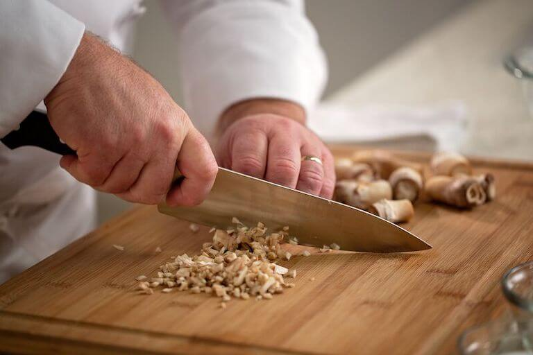

# Basic Cuts

*The cuts that cover 90% of home cooking. Slice, dice, chop, mince, and the techniques specific to onion, garlic, herbs, and round vegetables. Get these clean and uniform and most recipes become 30-50% faster to prep.*

## Overview
Five cuts cover almost everything you'll do in a home kitchen:

1. **Slice.** Long thin pieces. Used for vegetables that go into stir-fries, salads, gratins.
2. **Dice.** Cubes of uniform size. Used for mirepoix, salsa, hash.
3. **Chop.** Rough pieces, not uniform. Used for braises and stews where appearance doesn't matter.
4. **Mince.** Very fine pieces. Used for aromatics: garlic, ginger, shallots.
5. **Specialised cuts for awkward foods.** Onion (concentric layers), garlic (paste vs slice vs mince), herbs (chiffonade vs chop), round vegetables (stabilise first).

This page covers all five.

## The Setup

Before any cut:
1. **Sharp knife.** See [Knife Care](knife-care.md).
2. **Solid board.** A damp paper towel under the board stops it sliding.
3. **Pinch grip on the knife.** See the knife-skills landing.
4. **Claw grip on the food.** Knuckles forward, fingertips back, thumb tucked.
5. **Flat side down.** Almost every cut starts by cutting the food in half so a flat side rests on the board. This stabilises everything.

## The Rocking Motion

The chef's-knife technique. The tip of the blade stays in contact with the board; the handle rocks down and forward; the blade chops through the food.

1. Hold the knife at the pinch grip.
2. Place the tip on the board, ahead of the food. The blade is angled down toward the food.
3. Push down and forward through the food. The tip stays planted; the handle rocks.
4. Lift the blade between cuts. Move forward; repeat.

The rocking is fast (you can hit 3-4 cuts per second once practised) and safe (the tip never lifts off the board, so the blade never wanders).

## 1. Slice

For onions, peppers, cucumbers, leeks: any food cut into long thin pieces.

### Method
1. Cut the food in half lengthways.
2. Place flat-side down.
3. Slice across (perpendicular to the food's length) at the desired thickness, using the rocking motion.

For very thin slices (cucumber, cabbage for slaw): keep the off-hand in claw grip; advance the food a millimetre at a time toward the blade with each cut.

For onions specifically: see "The Onion" section below.

## 2. Dice

For uniform cubes. The most-used cut in classical French cooking.

### Method (for carrots / potatoes / firm vegetables)
1. Cut the vegetable into batons (long thin sticks) of the size you want for the cube. So for 5 mm dice, cut into 5 mm thick batons.
2. Line up the batons together.
3. Slice across them at 5 mm intervals. Each slice produces uniform 5 mm cubes.

### Sizes
- **Large dice** (2 cm): for stews, slow braises.
- **Medium dice** (1 cm): for casseroles, hashes.
- **Small dice** (5 mm): for salsa, garnish, soups.
- **Brunoise** (3 mm): a precision cut. See [Precision Cuts](precision-cuts.md).

## 3. Chop

The everyday cut for braises, where appearance doesn't matter as long as the pieces are roughly the same size.

### Method
1. Start with the food halved or quartered (whatever stabilises it).
2. Use the rocking motion, making cuts at the rough size you want.
3. Don't worry about uniformity; you're not making dice.

Chopped pieces cook at slightly different rates (the small pieces soften faster than the big ones), which is fine for slow-cooked dishes where everything ends up tender.

## 4. Mince

Very fine pieces, close to a paste.

### Method (for garlic / ginger / chilli)
1. Slice the aromatic thinly.
2. Stack the slices and slice again, perpendicular, making tiny strips.
3. Rotate 90 degrees and slice across the strips, very thin.
4. Continue with a rocking motion until the desired fineness.

You can also use the flat side of the knife to crush garlic into a paste (especially when adding salt; the salt helps break down the cells). Press hard with the heel of your hand on the blade flat. The garlic spreads into a smooth paste in 5-10 seconds.

## 5. Specific Foods

### The Onion

The classic. Three cuts produce a clean dice.

1. Cut the onion in half through the root (the hairy end). DON'T cut off the root yet; it holds the layers together.
2. Peel the papery skin off each half.
3. Place one half flat-side down. The root is at the back; the cut top is at the front.
4. **First cut** (horizontal, parallel to the board): slice into the onion from the front, stopping just before the root. Make 2-3 such cuts at the desired thickness, all parallel.
5. **Second cut** (vertical, perpendicular to the first): slice from front to back, parallel to the root. Make several such cuts at the desired interval.
6. **Third cut** (across, perpendicular to the second): slice straight down, perpendicular to the first two. Now the onion falls apart in uniform cubes.
7. Discard the root.

This method gives uniform onion cubes, because the natural concentric layers of the onion get cut three ways.

For sliced onion (in rings, or for a stir-fry):
1. Halve through the root.
2. Slice from front to back, parallel to the root, at the desired thickness.

For very thin onion (for salad, pickling): slice as above, then soak the slices in iced water for 10 minutes to mellow the harshness.

### Garlic

Three preparations:

**Crushed (most common).** Place a clove on the board. Lay the flat of the knife on top. Bang once with the heel of your hand. The skin pops off; the clove is bruised.

**Sliced.** After crushing-and-peeling, lay on the side. Slice across at 1 mm intervals.

**Minced.** After sliced, rotate 90 degrees and slice again, very fine.

**Paste.** Mince, then add a pinch of salt. Use the flat of the knife to crush the salty mince against the board; smear it back and forth. The salt breaks down the cells; the garlic becomes a smooth paste in 10 seconds.

### Ginger

1. Peel with a teaspoon (the spoon edge scrapes off the papery skin without removing flesh).
2. Slice into thin discs, cutting against the fibrous grain.
3. Stack the discs; slice into matchsticks.
4. Rotate 90 degrees; slice across for fine mince.

### Herbs

**Soft herbs (parsley, basil, coriander, mint, dill).** Bunch the leaves together. Hold tightly with the claw grip. Slice across them with a rocking motion. Don't over-chop; soft herbs bruise and oxidise.

For basil specifically, see [Precision Cuts / Chiffonade](precision-cuts.md). The classical technique is to roll the leaves and slice across, producing fine ribbons.

**Hard herbs (rosemary, thyme, sage, bay).** Strip the leaves from the stems first (run your fingers down the stem against the direction of growth). Then chop normally.

### Round Vegetables (Potatoes, Apples, Carrots)

The danger: they roll on the board.

The fix: cut a thin slice off one side first, creating a flat surface. Place that flat side on the board. Now stable.

For a potato to dice: cut off a slice from one end so it stands upright. Then cut into thick slabs, then batons, then dice. Each cut goes from a stable position.

For a carrot: cut off the top first (the flat end). Lay on the cut side. Slice into batons. Dice as needed.

### Tomatoes

The skin is tougher than the flesh; the seeds are wet; the inside is fragile.

**Method:** use a serrated knife (a tomato knife specifically, or a small serrated bread knife). The serrations pierce the skin cleanly without crushing the flesh.

For concassé (peeled, deseeded, diced): score a small X in the bottom skin. Plunge into boiling water for 15 seconds. Lift into cold water. The skin peels off easily. Cut in quarters; remove seeds. Dice.

### Citrus (Segments)

The "supremes" technique.

1. Slice off both ends, exposing the flesh.
2. Stand on a flat end. Use the knife to slice down the curved sides, removing the peel and pith.
3. Hold the peeled citrus in your hand over a bowl. Slice between the membranes to release each segment cleanly.
4. Squeeze the remaining pith and membrane to capture all juice.

## Common Mistakes

**The pieces are uneven.**
Knife dull, or grip wrong. Sharpen the knife; use the pinch grip; check the claw.

**The food slides around on the board.**
Board not stable (put a damp paper towel under), or food not stabilised (cut a flat side first).

**The fingers are at risk.**
Claw grip not deep enough. Make a tight claw; fingertips back, knuckles forward.

**The cuts take too long.**
Practise the rocking motion. The tip stays planted; the handle rocks. Slow with control first, speed comes.

**Onion makes you cry.**
Sharp knife (less crushing = less aerosolised compound), chill the onion before cutting (cold air doesn't carry the irritants as effectively), or work with the extractor fan on.

**Garlic sticks to the knife.**
Smear a tiny drop of oil on the blade before mincing. The garlic releases more easily.

## Where Next
- [Knife Care](knife-care.md): keep the knife sharp.
- [Precision Cuts](precision-cuts.md): the classical French presentation cuts.
- [Knife Skills Course landing](knife-skills.md): back to the main course.
