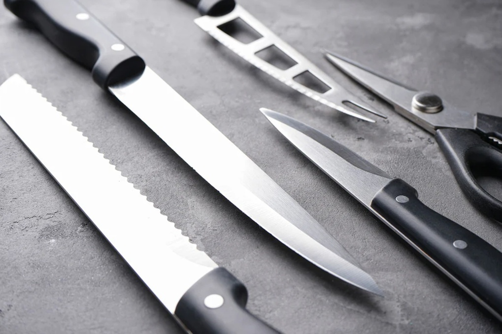

# Knife Care

*A sharp knife is safer than a dull one. The dull knife slips off a tomato or a finger; the sharp one cuts where you point it. Sharpening is a job for once or twice a year; honing takes ten seconds before each use. Do both and your everyday knife outperforms an expensive one that nobody's maintained.*

## Overview
Almost every cook has a drawer of dull knives and assumes that's normal. It isn't. Knives lose their edge through use, and that edge needs to be maintained. Two operations:

1. **Honing** (also called steeling): realigning the existing edge. Every 1-3 days of use. Takes 10 seconds.
2. **Sharpening:** removing metal to create a new edge. Every 6-12 months. Takes 5-15 minutes per knife.

Most home cooks never do either. The knife is bought new and sharp, and then dulls over months and years until everything feels like a slow-motion chore. Restoring it to factory sharp takes one sharpening session.

## Honing

The daily ritual. A knife's edge is microscopically angled metal. With use, the edge bends very slightly off-axis (without losing material). Honing pushes the edge back into alignment.

### What you need
A **honing steel** (also called a "sharpening steel", though that's misleading; it doesn't sharpen). The classical chef's tool: a metal rod, 25-30 cm long, sometimes ribbed, sometimes smooth, with a handle.

A **ceramic rod** works similarly; some people prefer ceramic for finer edges.

### Method

The two classical techniques:

**Vertical hone (safer for home cooks):**
1. Stand the steel on a chopping board, tip pointing up, handle held vertically.
2. Hold the knife at a 15-20 degree angle to the steel.
3. Slide the blade down the steel from heel to tip, in a single sweeping motion. The blade should touch the steel at the chosen angle the whole way.
4. Alternate sides. 5 strokes per side.

**Held-in-air (the classical):**
1. Hold the steel in your non-dominant hand, tip out and slightly down.
2. Hold the knife in the dominant hand at 15-20 degrees.
3. Sweep the blade down the steel, heel to tip.
4. Alternate sides.

The vertical method is safer; the held-in-air method is faster.

### When to hone
Before each use. Or at least before each cooking session. Takes 10 seconds. If the knife seems to be slipping or crushing food (especially tomatoes), it's overdue.

## Sharpening

The deep maintenance. Honing doesn't restore lost metal; sharpening removes a thin layer of metal to expose a fresh edge. Done 1-2 times per year for a home cook; weekly for a professional.

### Three sharpening methods

**Whetstone (best, slowest, most skill).**
A stone of a specified grit (rougher = coarser; finer = smoother). Two-grit stones (1000/6000) work for almost everyone. Soak the stone in water for 10 minutes. Hold the knife at 15-20 degrees. Slide back and forth on the stone, with steady pressure. 30-50 strokes per side per grit. Total time: 10-15 minutes.

Best result. Hardest to learn; takes 5-10 practice sessions before you're consistent. Worth doing once you're cooking seriously.

**Pull-through sharpener (mediocre, fast, no skill).**
A handheld tool with grooved guides at the right angle. Pull the knife through 5-10 times.

Result: serviceable. Removes more metal than necessary; the knife will need replacing sooner. Best for beginners and people who'll never learn the whetstone.

**Electric sharpener (fast, expensive, removes a lot of metal).**
A countertop appliance with motorised wheels. Knife passes through; comes out sharp.

Result: factory-sharp. Removes a lot of metal. Loud. Some are excellent (Chef's Choice); some are awful (cheap supermarket brands).

**Professional service.**
Many local knife shops and butchers offer sharpening for £5-10 per knife. Excellent value if you only want this done a couple of times a year. Outsource it; live well.

### How to tell when a knife needs sharpening

Two tests:
1. **Paper test.** Hold a sheet of paper vertically by one corner. Try to slice down through it with the knife. A sharp knife glides through cleanly. A dull one tears or folds the paper.
2. **Tomato test.** Slice a tomato. A sharp knife glides through skin and into the flesh in one motion. A dull knife crushes the tomato; you have to saw through the skin.

If either test fails after honing, the knife needs sharpening.

## Storage

How you store the knife affects how long it stays sharp.

### Good options
- **Magnetic strip** mounted on the wall. The blade touches only the magnet (which is smooth). Knives don't bump each other.
- **In-drawer organiser** with slots for each knife. Slots keep blades separated.
- **Knife block** (the classic). Acceptable but slightly worse than a magnetic strip; the blades slide in and out, scraping against the wood.
- **Saya / wooden sheaths.** Japanese-style sheaths, one per knife. Blades fully protected.

### Bad options
- **Loose in a drawer.** Knives bang into each other and other utensils. The edge dulls in days.
- **In the dishwasher.** The aggressive water spray, detergent and heat all damage the edge. Hand-wash, dry immediately.

## Day-to-Day Knife Hygiene

After each use:
1. Wipe with a damp cloth to remove food residue.
2. Wash with warm soapy water and a soft sponge. Don't soak.
3. Dry immediately with a tea towel. Standing water (especially in the area where the blade meets the handle) causes rust on carbon-steel blades and degrades wood handles.
4. Return to storage.

If you've cut acid food (lemon, vinegar, tomato): wash immediately. The acid darkens stainless steel and pits high-carbon steel.

For high-carbon (non-stainless) knives: dry immediately and oil the blade lightly with a vegetable oil or specialist knife oil. They rust easily.

## Choosing Between Stainless and High-Carbon

**Stainless steel** (the standard). Holds an edge well; doesn't rust; easy maintenance. The right choice for almost everyone.

**High-carbon steel** (e.g. Japanese carbon-steel knives like Tanaka). Takes a sharper edge; loses it faster; rusts if not cared for. For people who actively enjoy maintenance and use the knife heavily.

**Stainless + carbon hybrid** (Damascus-style, also called "carbon clad in stainless"). Best of both: a carbon-steel core that takes an edge, wrapped in stainless steel that resists rust. Beautiful, expensive, the modern enthusiast's choice.

## A Note on Cutting Boards

The board affects the knife as much as anything else.

**Best for the edge:** wood (especially end-grain wood) and rubber. Both are slightly softer than the knife steel, so the blade sinks in microscopically instead of rebounding off. Edges stay sharp.

**Acceptable:** plastic (polyethylene), bamboo (denser than wood; harder on the edge).

**Bad:** glass, ceramic, marble, granite. These are HARDER than the knife. Each cut dulls the edge slightly. Glass cutting boards are the second-most-common cause of dull knives (after dishwasher use).

## Common Mistakes

**Using the dishwasher.**
Hand-wash, dry, return to storage.

**Never honing.**
A new knife is sharp; after a month it's noticeably duller. Honing weekly keeps it at near-new.

**Storing in a drawer with other tools.**
Knife edges chip when banged against other metal.

**Cutting on glass or stone.**
Use wood or plastic.

**Cutting frozen food.**
The hard ice damages the edge. Defrost first, or use a serrated knife (the serrations handle bumps).

**Forcing a dull knife.**
Push harder, slipping more, hurting yourself. The fix is to sharpen, not push harder.

## Where Next
- [Basic Cuts](basic-cuts.md): now that the knife is sharp, here's how to use it.
- [Precision Cuts](precision-cuts.md): the classical French presentation cuts.
- [Knife Skills Course landing](knife-skills.md): back to the main course.
