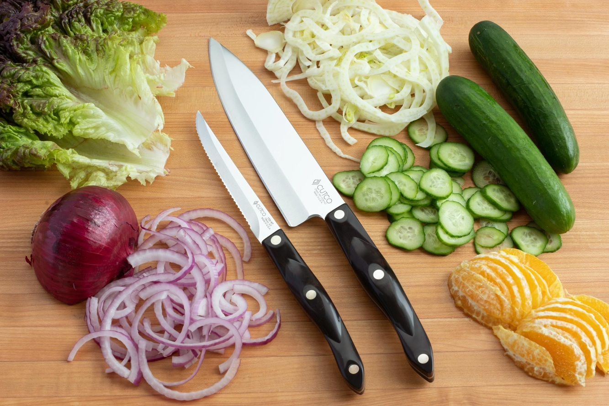

# Knife Skills

*You use a knife more than any other tool in the kitchen, and it's the one most home cooks never quite get the hang of. A sharp knife and three or four basic cuts will save you most of your prep time and make the cooking itself a lot nicer. Worth a little practice.*

## Overview
Knife skills are the dull subject of professional kitchen training, the thing no recipe book bothers to teach, and the single most-leveraged skill in the home kitchen. A cook with good knife skills:

- Preps a mirepoix in 90 seconds. (Beginner: 5-7 minutes.)
- Slices an onion into thin even pieces that all cook at the same rate.
- Dices a carrot to 5 mm pieces that look identical.
- Chops herbs without bruising or oxidising them.
- Cuts themselves rarely (the saying is "more cooks cut themselves with dull knives than sharp ones"; the dull knife slips).

The skills break into three buckets: knowing your knives, knowing the basic cuts, knowing the precision cuts. Most home cooking lives in the basic-cuts bucket; the precision cuts (julienne, brunoise, chiffonade) elevate presentation when you want it.

## Course Outline

- [Knife Care](knife-care.md): choosing knives, sharpening vs honing, storage. The maintenance side without which the cuts don't work.
- [Basic Cuts](basic-cuts.md): the everyday cuts (slice, dice, chop, mince) and the grip that controls them.
- [Precision Cuts](precision-cuts.md): julienne, brunoise, chiffonade, paysanne, batons. The classical French cuts that produce restaurant-quality presentation.

## The Three Knives You Need

You can cook professionally with three knives. Most kitchen-block sets contain six to twelve; most of those are decorative.

### 1. Chef's knife (8-10 inch / 20-25 cm)
The workhorse. 80-90% of cuts. Onions, carrots, herbs, meat, fish (without bones). Get the best one you can; cheap chef's knives wear out quickly.

### 2. Paring knife (3-4 inch / 7-10 cm)
The small precision knife. Peeling, trimming, segmenting citrus, removing strawberry tops, deveining prawns.

### 3. Bread / serrated knife (8-10 inch / 20-25 cm)
For bread, tomatoes, anything with skin tougher than the inside. The serrations saw rather than slice.

Optional fourth: a fish knife (long, thin, flexible) if you fillet whole fish; a boning knife (curved, stiff) if you butcher poultry or meat. Most home cooks don't need either.

Skip: every knife in a block set you don't immediately recognise. They're cheaper versions of the three above plus things like a "ham slicer" or "carving knife" you'll never use.

## What Makes a Good Knife

Forged, not stamped. (Look at the bolster, where the blade meets the handle; a forged knife has a thick bolster moulded as part of the blade.)
High-carbon stainless steel.
A balanced weight; the knife shouldn't feel handle-heavy or blade-heavy.
A comfortable grip; pick it up before buying.

Brand suggestions (any of these is a good starting point):
- **Wusthof Classic** - German style, durable, well-balanced. The professional standard.
- **Henckels Pro S** - German, similar to Wusthof.
- **Global G-2** - Japanese style, lighter, very sharp out of the box.
- **Victorinox Fibrox** - Swiss, cheap (~£30), brilliantly sharp. The best-value workhorse.
- **Tojiro DP** - Japanese, mid-range, popular with home cooks.

A £30 Victorinox is a better knife than a £200 supermarket block set. Spend money on one good chef's knife rather than a "set".

## The Pinch Grip

The single most important thing on this whole page. Almost every home cook holds a knife like a hammer, by the handle. This makes the knife feel heavy, controls the blade badly, and is the leading cause of slipping cuts.

### The grip:
1. Pinch the blade between thumb and bent index finger, where the blade meets the handle (just in front of the bolster).
2. The other three fingers wrap loosely around the handle.
3. The knife is now controlled from the blade itself, not the handle.

It feels weird the first time. After three days of using this grip, it feels natural.

## The Claw Grip (For the Non-Knife Hand)

The hand holding the food should NEVER have fingertips exposed in front of the blade. Use the claw grip:

1. Curl the fingertips inward, so the food is held by the knuckles (the bony bumps), not the fingertips.
2. Thumb tucked back behind the knuckles.
3. The flat side of the blade rests against the knuckles; the blade slides down the knuckles with each cut, never up onto the fingertips.

The claw is the difference between fast safe cutting and a trip to A&E. Practise with a single onion until it's automatic.

## Where to Start

- New to knife work: [Basic Cuts](basic-cuts.md). The dice, slice, chop and mince that cover 90% of recipes.
- Got the basics, want to look professional: [Precision Cuts](precision-cuts.md). Julienne, brunoise, chiffonade, paysanne. The classical French presentation cuts.
- Knives feel dull, even though you have good ones: [Knife Care](knife-care.md). Honing weekly, sharpening twice a year, storage.

## Why It Matters

A meal that looks restaurant-quality usually has restaurant-quality knife work behind it. Uniform dice in a salsa, perfect chiffonade of basil on a margherita, thin even slices of onion on a steak sandwich: none of it tastes different from a rough chop, but it reads as professional.

More practically: uniform cuts cook uniformly. A stir-fry of mixed-size carrot pieces has some pieces raw and some overcooked; uniform pieces are all just done. A diced onion that's all 5 mm pieces sweats evenly; a chopped onion of varied sizes burns on the small pieces while the big ones stay crunchy.

The skill is worth the practice. Every minute spent on knife technique pays back in every meal for the rest of your life.

## Where Next
- [Knife Care](knife-care.md): keep your knives sharp.
- [Basic Cuts](basic-cuts.md): the everyday techniques.
- [Precision Cuts](precision-cuts.md): the show-off cuts.
- [Stir-Fry course / Ingredient Order](../stir-fry/ingredient-order.md): the cooking method that depends most on uniform cuts.
- [Fish course / Whole Fish](../fish/whole-fish.md): filleting is knife work applied to fish.
