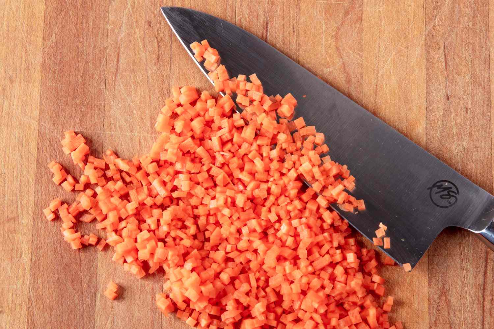

# Precision Cuts

*The classical French cuts that take a plate from "home" to "looks like someone professional did this." Julienne, brunoise, chiffonade, paysanne, batonnet. You don't need them every day, but they're handy to have when you want a starter plate or a garnish to look properly considered.*

## Overview
Classical French cooking codified its knife cuts in the 19th century. Each cut has a specific dimension. Some are pragmatic (the dimensions affect cook time and texture); some are aesthetic (they look like specific things on a plate).

For home cooking, two or three of these matter regularly:

- **Chiffonade.** Fine ribbons of leafy herbs. Used on most pasta and pizza garnishes. Probably the most-used precision cut at home.
- **Julienne.** Matchstick-thin batons. Used in salads, garnish, stir-fry presentation.
- **Brunoise.** 3mm cubes. Used for mirepoix dressing, classical garnish.

The others (paysanne, batonnet, lozenge, tourné) are more decorative; useful for plated starters or when you want to impress.

## The Cut Dimensions

The classical French sizing is precise. Knowing the names lets you read classical recipes.

| Cut | Shape | Dimension |
|---|---|---|
| Brunoise | Cube | 3 mm × 3 mm × 3 mm |
| Small dice | Cube | 6 mm × 6 mm × 6 mm |
| Medium dice | Cube | 1 cm × 1 cm × 1 cm |
| Large dice | Cube | 2 cm × 2 cm × 2 cm |
| Julienne | Stick | 3 mm × 3 mm × 5 cm |
| Allumette (matchstick) | Stick | 3 mm × 3 mm × 4 cm |
| Batonnet | Stick | 6 mm × 6 mm × 6 cm |
| Paysanne | Slice/disc | 1 cm × 1 cm × 3 mm |
| Rondelle | Disc | 5-10 mm thick |

Plus the herb-specific cut:

| Chiffonade | Ribbon | 1-2 mm wide ribbons of leafy herb |

## Chiffonade

The fine herb ribbon. Used for basil, mint, sorrel, sage, large parsley leaves, lettuce.

### Method (for basil)
1. Stack 5-10 leaves on top of each other, biggest on the bottom.
2. Roll them tightly into a cigar shape, rolling from the stem end toward the tip.
3. Slice across the cigar with the rocking motion, very thin.
4. The slices unroll into long thin ribbons.

For very large leaves (basil, mint), this is perfect. For small herbs (small parsley, dill), skip the chiffonade and just chop normally.

The classical use: chiffonade basil over a margherita pizza; chiffonade sorrel over a piece of salmon; chiffonade lettuce as a garnish for a tomato salad.

## Julienne and Allumette

Long thin sticks. Julienne (3 mm × 3 mm × 5 cm) and allumette (slightly shorter, 4 cm) are functionally the same; allumette is the "matchstick" sizing.

### Method
1. Square off the vegetable: cut off all rounded sides so you have a long rectangular block.
2. Cut the block into 3 mm thick slabs (planks).
3. Stack the slabs.
4. Cut the stack into 3 mm wide sticks.

Used for: raw salads (julienned carrot, courgette), stir-fries (julienned bell pepper), garnish (julienned spring onion curls for steamed fish), Vietnamese summer rolls.

### Spring onion curls

Cut spring onion into 5 cm lengths. Slice each length into very thin julienne strips. Drop into iced water; they curl naturally within 10 minutes. Lift out; pat dry. Use as a garnish on Asian dishes (steamed fish, ramen).

## Brunoise

The 3 mm cube. The smallest dice in the classical system.

### Method
1. First produce julienne (above).
2. Line up the julienne sticks.
3. Slice across at 3 mm intervals.

The slices fall apart into perfect tiny cubes. Used for soup garnishes (a brunoise of carrot, leek, celery scattered into a clear consomme), as a stuffing component, or a fine condiment dice.

A trained French chef can produce a brunoise in 90 seconds; a home cook needs 5-10 minutes the first few attempts.

## Paysanne

A flat slice, square or rectangle, 1 cm × 1 cm × 3 mm thick. The name means "peasant" in French; the cut has rustic-looking flat shapes.

### Method
1. Cut the vegetable into 1 cm × 1 cm batons.
2. Slice across the batons at 3 mm intervals.
3. The slices are small flat squares.

Used in soups and stews where you want visible vegetable pieces (paysanne soup is a classical home-style soup with these flat pieces).

## Batonnet

A larger stick, 6 mm × 6 mm × 6 cm. Halfway between julienne and a large baton.

### Method
1. Square off the vegetable.
2. Cut into 6 mm slabs.
3. Cut the slabs into 6 mm sticks.

Used in French fries (the original "batonnet de pomme frite"), as a side vegetable served in batons (carrot batonnet, parsnip batonnet for roast dinners), or as the starting cut for medium dice.

## Rondelle (Coin)

Simply a round cross-section slice. Used on round vegetables: carrots cut on the round, leek cross-sections, courgette discs.

### Method
1. Hold the vegetable steady (claw grip with the off-hand).
2. Slice across at the desired thickness (5-10 mm typical).

The simplest of the precision cuts; almost everyone can do it.

For decorative effect: cut on a 30-45 degree angle, giving oval rondelles. Used for Chinese stir-fries (carrot rondelles cut on the bias).

## Oblique Cut (Roll Cut)

A Chinese technique. Same idea as the angled rondelle but rotated between cuts.

### Method
1. Hold a carrot or root vegetable.
2. Cut diagonally at a 45 degree angle.
3. Roll the vegetable a quarter turn.
4. Cut again at the same angle. Each cut exposes more surface area.
5. Continue rolling and cutting along the length.

Used for braises and slow stir-fries where the increased surface area means faster cooking and more sauce absorption. The pieces are irregular but uniform-sized.

## Tournage (Tourné)

The most ornamental precision cut. A small football-shaped vegetable, 7-sided, 5 cm long. Used in classical French cooking for vegetables that accompany a fine-dining main course.

### Method (the rules)
1. Cut vegetable into 5 cm pieces.
2. Trim into a 7-sided barrel shape, using a small paring knife with curved blade.
3. Each face should be slightly curved; the ends pointed.

Extremely time-consuming and produces a lot of waste. Reserved for restaurant work or showing off at a dinner party. Most home cooks skip this entirely.

## When to Use Each

For everyday cooking:
- **Chiffonade** for any leafy herb garnish.
- **Julienne** for raw salad vegetables.
- **Brunoise** for soup garnishes or refined dressings.

For dinner parties / show-off:
- **Paysanne** for visible vegetable pieces in a soup or stew.
- **Batonnet** for accompanying vegetables.
- **Tourné** for one elegant garnish.

For braises and stews (where presentation doesn't matter):
- **Rough chop**. None of the above. Save the precision for the visible plate.

## Common Mistakes

**Cuts aren't uniform.**
Sharper knife; slower careful cuts. Practise with cheap carrots until consistent.

**Julienne sticks are square in some places, oval in others.**
The starting block wasn't square. Spend the time to trim the vegetable into a proper rectangle first.

**Brunoise pieces stick together.**
Wet vegetable. Pat dry before cutting; rinse after cutting if needed (gently, with a colander).

**Chiffonade is bruised black.**
Knife is dull, or basil leaves were old. Use a sharp knife; use fresh basil; cut just before serving (basil oxidises fast).

**Spring onion curls didn't curl.**
Water wasn't cold enough, or strips were cut too thick. Use iced water; cut strips as thin as you can manage (1 mm or less).

## Where Next
- [Knife Care](knife-care.md): keep the knife sharp for precision work.
- [Basic Cuts](basic-cuts.md): the everyday cuts.
- [Knife Skills Course landing](knife-skills.md): back to the main course.
- [Stir-Fry / Ingredient Order](../stir-fry/ingredient-order.md): where uniform cuts matter for cooking, not just presentation.
